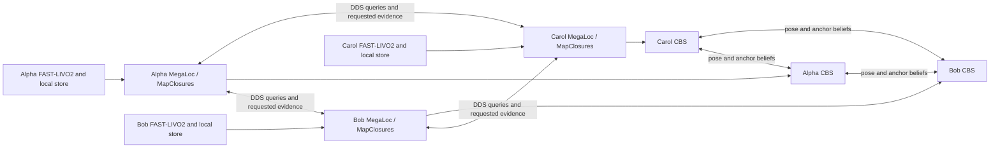

# Distributed MegaLoc + MapClosures + CBS

This is an offline ROS2 DDS pipeline for S3E Square 1, Playground 1,
Laboratory 1 and Campus Road 1. Each robot owns its
FAST-LIVO2 odometry, keyframe store, retrieval index, geometric verifier and CBS
optimizer. The launch process starts/stops processes and collects completed
results. Retrieval, registration, constraint delivery and optimization happen
in robot processes. Ground truth is accessible only to evaluation.



All processes run on this machine for evaluation. Physical multi-machine
deployment and a live sensor-to-descriptor stream have not been tested. Each
robot's odometry is replayed from its existing complete export; no new odometry
run or model inference is needed to evaluate the distributed front/back end.

## Build and run

Both `cbs` and `cbs_ros` use project branch `dev/fast-livo2-s3e-dpgo`.
The native overlay uses ROS Humble and the installed GTSAM 4.3/aria dependencies,
separately from the Python GTSAM 4.2 evaluation environment. Set `CBS_UNDERLAY`
to override the dependency workspace (default recorded in the build script).

From the workspace `src` directory:

```bash
bash FAST-LIVO2-ROS2/scripts/build_dpgo.sh
FAST-LIVO2-ROS2/scripts/s3e_experiment.sh run --stage dpgo dpgo_evaluate \
  --config FAST-LIVO2-ROS2/research/configs/square1-cbs.yaml \
  --input-run .ros2/megaloc-mapclosures/run-b404b29e5e9327f3.json --resume
```

`dpgo` reruns loop detection over DDS and optimizes concurrently. `dpgo_evaluate`
reuses its completed outputs for trajectory metrics, maps and Rerun. Supply the
printed registry as `--input-run` when invoking evaluation separately. With the
CBS configuration, `--stage all` selects odometry, descriptors, distributed
detection/optimization and evaluation. The original single-robot runner and
centralized reference configuration remain usable.

Set `dpgo.mode: frozen` to test CBS against an already saved constraint set.
This diagnostic mode preloads only each robot's own odometry and incident loops;
it does not rerun retrieval. The default `peers` mode publishes odometry
incrementally as local observations become causally available.

## Protocol and contracts

Peers announce only their next timestamp and local index. Every peer derives
the next observation using `(timestamp, robot ID, keyframe ID)` ordering. The
observation owner waits for the three retrieval replies and its selected
payloads before advancing its watermark. Geometry runs in bounded independent
verifier processes. Watermarks order offline replay without a central scheduler.
Peer failure is detected by the bounded run timeout; this version has no peer
restart or reconnection recovery protocol.

Future frames and same-robot frames within 30 seconds remain excluded. The
working settings are unchanged: saved 5-second submaps, 80 m crop, MegaLoc cosine
threshold 0.50, native MapClosures density/HBST/2D RANSAC and GICP acceptance.
There are no parameter sweeps, alternate backends or enlarged spatial maps.
MegaLoc's cached CUDA inference results are reused; retrieval, MapClosures,
GICP and CBS in this evaluation use CPU.

Accepted constraints go directly to both endpoint robots. Reciprocal proposals
are deduplicated by canonical endpoints, with earliest-query priority independent
of verifier completion order. The first endpoint owns the CBS factor; the
other receives the edge for neighbor discovery. The transform maps j into i,
with right SE(3) tangent ordering `[rx,ry,rz,tx,ty,tz]`. Full information/covariance
cross terms and nanosecond timestamps survive the bridge. Filter marginal
covariances are not treated as independent edge noise.

Each robot starts in its own normalized local odometry frame. Native CBS
initializes remote separator copies from between measurements and exchanges
anchor beliefs to recover relative robot frames. Exports use the smallest
known anchor per component. There is no central `align_robots`, batch solver,
round controller, or estimator feedback in this path. All loop workers inherit
Landlock restrictions permitting their own store and explicitly granted code
and libraries, without another robot's store or S3E ground truth.

After all observations and verifications drain, each peer sends a FIFO terminal
message behind its last constraints on every directed link. Each robot then
signals its own CBS input complete and runs 100 additional local iterations at
10 Hz. Final beliefs remain available until all peer exports finish. The whole
launch is bounded to 240 seconds. The stopping budget is reported separately
from measured convergence. Retrieval ordering is deterministic; CBS runs on
independent timers with belief-change suppression, so repeated uncached
optimization runs can differ slightly. Saved artifacts capture each run.

Artifacts include per-robot candidate/rejection records, verification results,
constraints, CDR communication logs, estimates, convergence statistics and
process memory measurements. The stage manifest pins input hashes, Python
snapshot, native source contents/commits, native binaries and GTSAM library.
Incomplete outputs cannot be reused as complete caches. The integration reads existing odometry and descriptor artifacts without modifying them.

The communication report counts the actual CDR messages per directed recipient.
For CBS services it sums client requests sent plus responses received; it does
not double-count server observations. RTPS headers, discovery, retransmission,
local graph input and local visualization/diagnostic topics are excluded.

## Validation

```bash
bash FAST-LIVO2-ROS2/scripts/run_dpgo_ros.sh \
  ctest --test-dir .ros2/dpgo-build/cbs --output-on-failure
bash FAST-LIVO2-ROS2/scripts/run_dpgo_ros.sh \
  ctest --test-dir .ros2/dpgo-build/cbs_ros --output-on-failure
OMP_NUM_THREADS=1 OPENBLAS_NUM_THREADS=1 MKL_NUM_THREADS=1 \
  .ros2/research-venv/bin/python -m pytest FAST-LIVO2-ROS2/research/tests -q
PYTEST_DISABLE_PLUGIN_AUTOLOAD=1 bash FAST-LIVO2-ROS2/scripts/run_dpgo_ros.sh \
  .ros2/research-venv/bin/python -m pytest FAST-LIVO2-ROS2/research/tests/test_cbs_bridge.py -q
S3E_TEST_DDS=1 .ros2/research-venv/bin/python -m pytest \
  FAST-LIVO2-ROS2/research/tests/test_cbs_integration.py -q
```

DDS integration tests use isolated domains 76–78 and check exact 6-DoF synthetic
poses with unknown initial robot frames, an isolated Carol, and an isolated
Alpha with a connected Bob/Carol component. Bridge tests cover noncommuting
transforms, reversed endpoints, information cross terms, own-robot isolation
and ROS serialization of integer timestamps. S3E evaluation uses position GT
with one shared rigid alignment per component and no scale fitting. Placeholder
GT orientations are never used to claim orientation accuracy.

## Laboratory 1 and evo evaluation

`configs/laboratory1-cbs.yaml` uses the same odometry, keyframe, MegaLoc,
MapClosures, registration and CBS settings as Square 1, with its own dataset
and output directory. For a new run:

```bash
FAST-LIVO2-ROS2/scripts/s3e_experiment.sh run --stage all \
  --config FAST-LIVO2-ROS2/research/configs/laboratory1-cbs.yaml --resume
```

Trajectory evaluation uses **evo 1.36.5** for timestamp association, rigid
alignment, translation APE and statistics. Association uses evo's nearest
timestamp matching within 0.05 seconds, without interpolation or timestamp
offset. Each robot is associated separately; corresponding poses are then
pooled for one shared SE(3) alignment per connected component, with scale
fixed to 1. Per-robot APE uses that same transform without an additional fit.
The single-robot trajectory checker uses the same evo implementation.
The position-GT adapter supplies identity quaternions to evo and uses only
the timestamp and XYZ columns; supplied GT orientations are ignored.

Each evaluation saves native evo result ZIPs, matched/aligned TUM files,
pooled KITTI pose files for reproducing the shared fit, engine settings and
unavailable-result reasons in `evo/`. Figure error curves read the saved evo
arrays and statistics. No orientation or relative-pose accuracy is reported
from placeholder GT orientations. Position interpolation remains only in
loop-retrieval proximity labeling, not trajectory evaluation.

The local Laboratory 1 bag lasts 295.318 seconds. Its three `_gt.txt` files
contain start/end motion-capture poses, not time-sampled trajectories. The
[authors' dataset notes](https://huggingface.co/datasets/PengYu-Team/S3E/blob/main/README.md#known-issues)
confirm this intentional limitation. The first-column values 0 and 1 identify
endpoint records and must not be interpreted as sensor timestamps. The saved
evo attempt found no matches; it cannot supply full-trajectory APE from these
endpoint-only inputs. The pipeline still exports maps, trajectories,
graph diagnostics and Rerun, while marking trajectory accuracy and retrieval
proximity metrics unavailable. Disconnected components are displayed separately.

The earlier saved Square 1 report used the former interpolated-position
evaluation. Its archived metrics and figures are unchanged; new evo metrics
use a different association policy and must be labeled accordingly.
The [Square 1 report](RESULTS-CBS.md#cbs-ate-re-evaluated-with-evo) now includes
a separate evo ATE table for the same frozen CBS trajectories, with full-precision
results and input hashes. This re-evaluation did not rerun odometry or CBS.

Official references: [evo metrics and alignment](https://github.com/MichaelGrupp/evo/wiki/Metrics)
and [evo 1.36.5 source](https://github.com/MichaelGrupp/evo/tree/v1.36.5).

## Campus Road 1

`configs/campus-road1-cbs.yaml` retains the same working detection and CBS
settings, changing only the sequence and output directory:

```bash
FAST-LIVO2-ROS2/scripts/s3e_experiment.sh run --stage all \
  --config FAST-LIVO2-ROS2/research/configs/campus-road1-cbs.yaml --resume
```

Campus Road 1 supplies timestamped position GT for all three robots, with
missing intervals. The same evo association and shared rigid alignment above
apply. Ground-truth plots retain gaps greater than two seconds. See the
[Campus Road 1 report](RESULTS-CAMPUS-ROAD1-CBS.md) for run status, results,
coverage and figures. An input registry from another sequence is rejected.

## Playground 1

`configs/playground1-cbs.yaml` retains the working Square 1 detection and CBS
settings. Bob starts 22 seconds into the bag, after its three IMU timestamp
gaps. Alpha and Carol start at the beginning. Offsets are recorded in each
robot's odometry stage identity; sensor timestamps remain unchanged.

To restart only Bob while preserving validated Alpha/Carol artifacts, add
`--odometry-robots Bob --input-run RUN.json` to the command below. Replacing
Bob's odometry invalidates its dependent keyframes/descriptors and graph
results. Frozen exports with a different configured start offset are rejected.

```bash
FAST-LIVO2-ROS2/scripts/s3e_experiment.sh run --stage all \
  --config FAST-LIVO2-ROS2/research/configs/playground1-cbs.yaml --resume
```

The local bag spans 298.088 seconds. All three robots have timestamped
position GT with no gaps exceeding two seconds. Evaluation uses evo's
0.05-second timestamp association and one shared rigid alignment per
connected component, with scale fixed to one. See the
[Playground 1 report](RESULTS-PLAYGROUND1-CBS.md) for results, individual CBS
ATEs, figures and artifact retention. Large generated intermediates are
removed after validation; retained metadata records their hashes.
