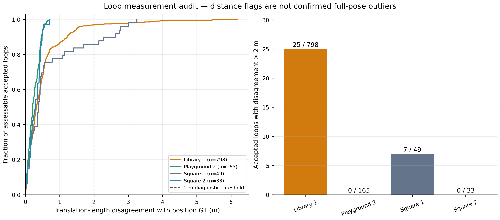

# Loop-closure quality across the S3E experiments

Audited 2026-09-14 using the accepted constraints from the reported
**MegaLoc + MapClosures + CBS** runs. No detector, odometry or optimizer was
rerun, and no frozen constraint was changed.

The audit flags **7 Square 1 loops and 25 Library 1 loops** whose measured
translation length disagrees with the available GT endpoint distance by
more than **2 m**. Square 2 and Playground 2 have **zero such flags** among
their assessable loops. These are **distance-disagreement flags, not
confirmed 6-DoF outliers**. Exact false-closure counts cannot be established
from S3E's placeholder orientations and the retained evidence alone.

Short odometry-cycle checks found **no inconsistency flags among 603
eligible inter-robot loops**. This includes 18 of the 32 distance-flagged
loops; the other 14 lack enough evidence for this local check. Agreement
between nearby loops can coexist with shared registration bias or GT error.

## Counts and coverage

The main diagnostic flags an accepted loop when

`abs(norm(T_i_j.translation) − norm(p_GT_j − p_GT_i)) > 2 m`.

Translation length is invariant to robot frame rotation and to reversing
the constraint endpoints. With noiseless GT at the same body origins, this
is a lower bound on translation-vector disagreement. Here, GNSS uncertainty,
uncorrected antenna lever arms and temporal interpolation also contribute.
The 2 m threshold is an explicit audit choice, not a calibrated statistical
outlier test or a change to the detector's acceptance threshold.

| Experiment | Accepted loops | Distance-assessable | Flags >2 m | Flag rate among assessable | Missing GT for distance check |
|---|---:|---:|---:|---:|---:|
| Square 1 | 50 | 49 | **7** | 14.29% | 1 |
| Square 2 | 37 | 33 | **0** | 0.00% | 4 |
| Library 1 | 1,049 | 798 | **25** | 3.13% | 251 |
| Campus Road 1 | 156 | Not recoverable | Unknown | N/A | Per-loop transforms removed |
| Playground 2 | 165 | 165 | **0** | 0.00% | 0 |
| Laboratory 1 | 6 | 0 | N/A | N/A | 6; no usable trajectory GT |
| Playground 1, excluded | 377 | Not recoverable | Unknown | N/A | Per-loop transforms removed |

The four assessable experiments contain 1,045 GT-checkable accepted loops,
of which 32 exceed 2 m. Another 256 accepted loops in those experiments
lack usable GT for this test. Unchecked loops are not counted as inliers.
Campus Road 1 and Playground 1 retain aggregate proximity statistics only;
their exact measurement-disagreement counts cannot be reconstructed.

GT positions use the **existing loop-proximity audit policy**: linear
interpolation only within brackets no longer than two seconds, with no
extrapolation across missing intervals. This is separate from trajectory
ATE, which remains evaluated entirely by evo with its existing nearest
timestamp association and no interpolation.

The same thresholds apply to all experiments. Sensitivity to the chosen
distance threshold is shown below.

| Experiment | Flags >1 m | Flags >2 m | Flags >5 m | Median disagreement (m) | Maximum (m) |
|---|---:|---:|---:|---:|---:|
| Square 1 | 11 | 7 | 0 | 0.382 | 3.254 |
| Square 2 | 0 | 0 | 0 | 0.295 | 0.695 |
| Library 1 | 107 | 25 | 4 | 0.328 | 6.201 |
| Playground 2 | 0 | 0 | 0 | 0.218 | 0.709 |



[PDF figure](figures/loop-quality/loop_quality.pdf) ·
[Every retained loop](figures/loop-quality/per-loop.csv) ·
[All 32 distance flags](figures/loop-quality/distance-flags.csv).

## Local consistency using sensor odometry

For two inter-robot loops `T_i_j` and `T_k_l`, the check closes the cycle
through raw odometry `T_i_k` and `T_j_l`. Both corresponding endpoint times
must be within **10 seconds**. The maximum translation/rotation closure
error over all four cycle origins is used, so exchanging the loops or
reversing their endpoints does not change the result.

A cycle is inconsistent above **2 m translation or 5° rotation**. A loop
needs at least **three neighbouring loops** for assessment and is flagged
only if a strict majority of those cycles are inconsistent. This checks
local agreement, not independent geometric correctness. It excludes
intra-robot loops and cannot detect a bias shared by nearby loops.

| Experiment | Eligible loops | Inconsistency flags | Tested cycle pairs | Maximum cycle translation (m) | Maximum cycle rotation (°) |
|---|---:|---:|---:|---:|---:|
| Square 1 | 38 | 0 | 108 | 0.258 | 0.481 |
| Square 2 | 3 | 0 | 6 | 0.092 | 0.465 |
| Library 1 | 551 | 0 | 3,539 | 0.264 | 1.366 |
| Playground 2 | 11 | 0 | 24 | 0.294 | 0.650 |
| Laboratory 1 | 0 | N/A | 1 | 0.043 | 0.639 |
| Campus Road 1 / Playground 1 | Unavailable | Unknown | Unavailable | N/A | N/A |

For cleaned runs, endpoint times are available only where a keyframe
appeared as a query in a retained accepted constraint. Those timestamps
were matched to saved raw poses within 10 microseconds. Candidate-only
timestamps were not inferred. This particularly limits Square 2 and
Playground 2 cycle coverage. Square 1 and Laboratory 1 still have their
original keyframe poses and timestamps.

All **1,307 retained accepted transforms** passed rigid-transform checks
and their recorded GICP convergence, RMSE, overlap, inlier-count,
conditioning and observability gates. This verifies recorded acceptance;
it does not independently certify registration accuracy.

## Which branches and pairs are flagged?

Branch counts are mutually exclusive attributions within each fused run.
Entries below are **distance flags / GT-assessable accepted loops**.
These are not separate branch ablations or measured false-positive rates.

| Experiment | MapClosures only | Both branches | MegaLoc only |
|---|---:|---:|---:|
| Square 1 | 2 / 29 | 1 / 11 | 4 / 9 |
| Square 2 | 0 / 21 | 0 / 8 | 0 / 4 |
| Library 1 | 9 / 172 | 9 / 424 | 7 / 202 |
| Playground 2 | 0 / 79 | 0 / 31 | 0 / 55 |

**Square 1:** all seven flags are inter-robot. The earlier report highlighted
Alpha 543 ↔ Carol 492 (2.622 m disagreement) while discussing the eight
accepted pairs whose GT origins were more than 10 m apart. Checking all
49 GT-assessable loops finds six additional >2 m disagreements. Four of the
seven flagged loops have sufficient short-cycle support, and all four pass.

**Library 1:** 20 flags are inter-robot and five are intra-Bob loops.
Fourteen of the 25 have sufficient short-cycle support, and all 14 pass.
The largest discrepancies are:

| Endpoints | Branch | Measured distance (m) | GT distance (m) | Disagreement (m) | Registration RMSE (m) |
|---|---|---:|---:|---:|---:|
| Alpha 310 ↔ Bob 321 | Both | 1.181 | 7.382 | 6.201 | 0.317 |
| Alpha 311 ↔ Bob 320 | Both | 2.520 | 8.141 | 5.621 | 0.336 |
| Alpha 312 ↔ Bob 324 | Both | 1.601 | 7.069 | 5.468 | 0.319 |
| Alpha 311 ↔ Bob 323 | Both | 1.607 | 7.053 | 5.445 | 0.327 |

Alpha 312 ↔ Bob 324 agrees with ten nearby loop/odometry cycles despite
its 5.468 m GT-distance disagreement. This supports treating it as a case
for inspection rather than declaring a proven false closure. The other
three pairs in this table lack sufficient retained endpoint timestamps
for the cycle test. Resolving these cases would require independent
relative-pose evidence or a targeted review of the original sensor data.

**Square 2 and Playground 2:** all assessable translation lengths agree
with GT within 0.71 m. No distance flags were found, but rotation and
translation direction are not verified by this scalar check.

**Laboratory 1:** six geometrically accepted loops exist, but the release
has no usable intermediate trajectory GT and there is too little local
cycle support for this test. The outlier count remains unknown.

## Why “farther than 10 m” is not an outlier count

The retained historical proximity results are:

| Experiment | Accepted pairs beyond 10 m / GT-assessable | Accepted pairs without GT |
|---|---:|---:|
| Square 1 | 8 / 49 | 1 |
| Square 2 | 10 / 33 | 4 |
| Library 1 | 26 / 798 | 251 |
| Campus Road 1 | 0 / 112 | 44 |
| Playground 2 | 58 / 165 | 0 |
| Laboratory 1 | N/A | 6 |
| Playground 1, excluded | 15 / 377 | 0 |

These are origin-distance labels. Local maps can overlap even when their
origins are more than 10 m apart: Playground 2 has 58 such accepted pairs
but zero translation-length disagreements above 1 m. Conversely, all four
Library 1 pairs in the largest-discrepancy table have GT origins within
10 m. Proximity alone would not flag them. The poor Playground 1 trajectory
also cannot be used to infer a specific count of bad loop measurements.

## Reproduction and verification

The compact [input snapshot](figures/loop-quality/inputs.json) preserves
the measurements and available local poses used by this audit, plus hashes
of the original inputs. It can reproduce the analysis without ROS, GPU
inference or the deleted large run directories:

```bash
OMP_NUM_THREADS=1 OPENBLAS_NUM_THREADS=1 \
  .ros2/research-venv/bin/python \
  FAST-LIVO2-ROS2/research/figures/loop-quality/analyze.py
```

The analysis checks endpoint uniqueness, rigid transforms and agreement
with the previous proximity counts. Synthetic checks cover an exact cycle,
an injected 5 m error, exchanging loops and reversing endpoints. Original
input hashes were unchanged after collection. Full-precision
[results](figures/loop-quality/results.json),
[source](figures/loop-quality/analyze.py) and
[artifact hashes](figures/loop-quality/files.json) are retained.
