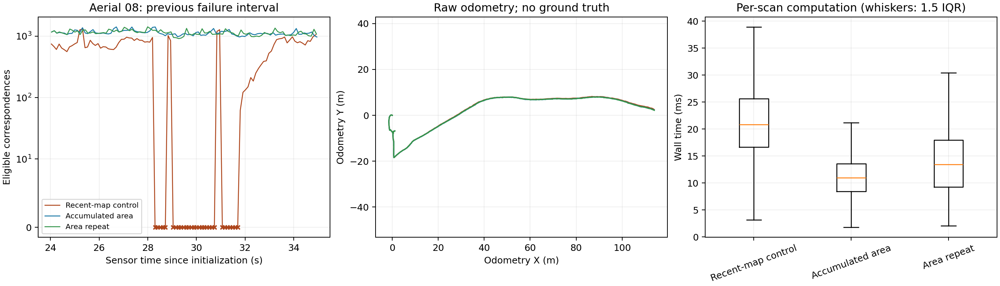
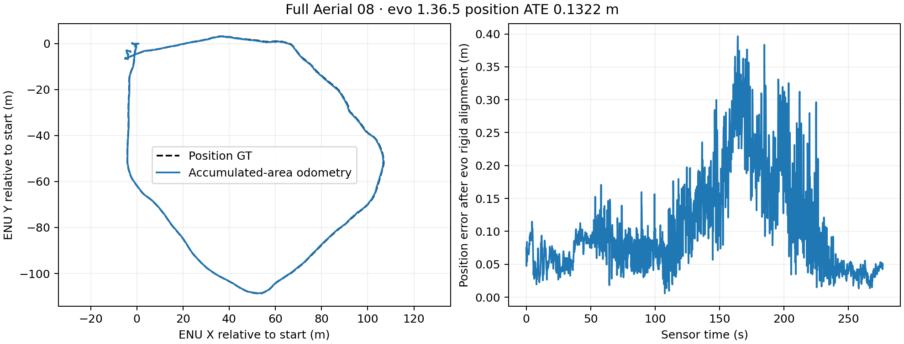

# Accumulated-area EllipseLIO odometry

2026-09-21, local workstation. The opt-in accumulated-area odometry mode passed
two fresh 120-second Aerial 08 replays and one full flight. Both short runs had a **0.128 s maximum successful
LiDAR update gap**, versus **1.904 s** in a fresh recent-map control.
Every processed scan after the initial empty-map scan received a LiDAR correction in both
area runs. The full flight achieved **0.1322 m raw position ATE** and a
**0.128 s maximum update gap**, with no missed corrections after initialization.

## Implemented behavior

`run_trial.py --area-odometry` enables a shared persistent native map for odometry
and MapClosures, replacing recent-map handovers. It sets
`mapping.area_maps.odometry: true`, `mapping.area_maps.enabled: true` and
`mapping.submaps.enabled: false`. The option is disabled by default.

Before each LiDAR update, the propagated drone position and gravity direction
define a fixed **80 m horizontal disk with unbounded height**. The native octree
finds the nearest map point inside that disk and within the existing matching
radius. Geometry from any earlier scan is available, and points outside the disk
remain stored for future visits. Existing correspondence thresholds and eligibility
rules are unchanged. The current scan enters the map only after matching. There
is no successor map, temporal expiry, filter reset or handover.

MapClosures exports the same persistent map's spatial selection at the corrected
pose after insertion. Snapshot publication remains every 20 m or 10 s, independently
of odometry's per-scan area query. See [configuration and semantics](../scripts/recent_submaps/AREA-MAPS.md).

## Controlled short replays

All three captures ran serially at 1×, with the same isolated binary, calibration,
IMU noise, reliable input, four-thread launcher, area-map export and live recording.
The control retained coverage-based recent-map odometry. No ground truth, loop
closures or CBS were used in these comparisons.

| Metric | Recent-map control | Accumulated area | Area repeat |
|---|---:|---:|---:|
| Native poses | 1,121 | 1,119 | 1,119 |
| Maximum successful-update gap | **1.904 s** | **0.128 s** | **0.128 s** |
| Failed corrections after the first scan | 44 | 0 | 0 |
| Failed corrections during 27–33 s | 29/57 | 0/57 | 0/56 |
| Median processing per scan | 20.82 ms | 10.95 ms | 13.45 ms |
| 95th percentile processing | 34.81 ms | 17.88 ms | 24.76 ms |
| Maximum processing | 64.66 ms | 51.64 ms | 55.98 ms |
| Mapper peak RSS | 699.5 MiB | 602.9 MiB | 609.0 MiB |
| Odometry handovers | 42 | 0 | 0 |
| Oldest accepted correspondence | 14.05 s | 92.33 s | 94.15 s |
| Verified area snapshots | 13 | 13 | 13 |

All trajectories are finite and chronological; maximum speeds are
3.60 / 4.16 / 3.93 m/s. Slight scan-boundary differences occur between the
multithreaded replays. Processing is native computation time, including map
insertion and snapshot enqueue; update gaps use sensor timestamps.

The repeated result supports a role for recent-map replacement in the observed
matching loss. It does not isolate the exact correspondence rejection rule:
historical geometry also changes tensor support and map statistics. No threshold
was relaxed and no parameter sweep was performed.

## Full Aerial 08 validation

The entire 278.193-second sensor bag completed at 1×. The native trajectory covers
276.900 seconds after initialization and ends 0.112 seconds before the final bag
timestamp. All 2,618 poses are finite, chronological and associated with position
ground truth. All 2,617 processed scans after the initial empty-map scan received
a LiDAR correction.

| Full-flight metric | Result |
|---|---:|
| Raw position ATE RMSE | **0.1322 m** |
| Median / maximum aligned position error | 0.0844 / 0.3964 m |
| Maximum successful LiDAR update gap | **0.128 s** |
| Maximum pose speed | 5.32 m/s |
| Processing per scan: median / p95 / maximum | 12.26 / 19.60 / 79.87 ms |
| Mapper peak RSS | 1,026.9 MiB |
| Final persistent map | 799,545 native points |
| Oldest accepted correspondence | 276.90 s |
| Verified area snapshots | 29 |
| Odometry handovers | 0 |

ATE is computed entirely by **evo 1.36.5**, using 50 ms nearest-timestamp
association, rigid SE(3) alignment and no scale fitting. GRACO IMU-frame position
ground truth is read only after capture, for evaluation. There is no new full-flight
recent-map control, so this is a measured accuracy result for the new mode, not a
controlled estimate of its accuracy improvement. MapClosures/PCM/CBS were not run
in this odometry comparison.

The [evo evaluation](figures/area-odometry/implementation/full/evaluation.json),
[quality measurements](figures/area-odometry/implementation/full/quality.json),
[raw TUM trajectory](figures/area-odometry/implementation/full/aerial08-raw.tum) and
[live Rerun recording](figures/area-odometry/implementation/full/aerial08/recording/live.rrd)
are retained with the full capture.

## Verification and provenance

The isolated build passed three native CTest executables and 50 Python regression
tests. The native area test now verifies persistent ownership, absence of handovers
and self-matching, old geometry on return visits, unbounded height, a query region
fixed throughout an update, exact area-boundary handling and 128 filtered octree
queries against brute-force nearest-neighbor results. Existing recent-map and
bounded-writer tests passed unchanged.

All 39 short-run area snapshots passed immutable payload, anchor, spatial membership,
identity and historical point-retention audits. All three live Rerun recordings
verified. The source and binary hashes remained unchanged throughout the comparison.
The full flight additionally passed the same checks for all 29 snapshots and its
live recording, with unchanged source/binary hashes. In total, 68 snapshots and
four live recordings verified.

The retained [artifact manifest](figures/area-odometry/implementation/manifest.json)
indexes configurations, frozen sources, logs, trajectories, figures and recordings.
Bulk NPZ geometry remains under `.ros2/area-odometry-20260921` and is hashed in
`external-geometry.json`. Existing experiments are preserved. The full-flight
launcher first used an invalid DDS domain; its recorder failed before sensor replay.
That attempt is retained in `full-dds-domain-failed`; the replay was restarted with
domain 226 and unchanged estimator settings.
A NumPy boolean serialization error in the post-capture quality report was fixed
by converting the value to a native Python type; analysis resumed from the already
validated capture. Its original failure status is retained. No sensor replay or
estimator change was needed for that reporting repair.

The persistent map grows with the observed environment and inherits odometry
drift. These results concern Aerial 08 and do not establish multi-robot connectivity
or accuracy on other sequences.
