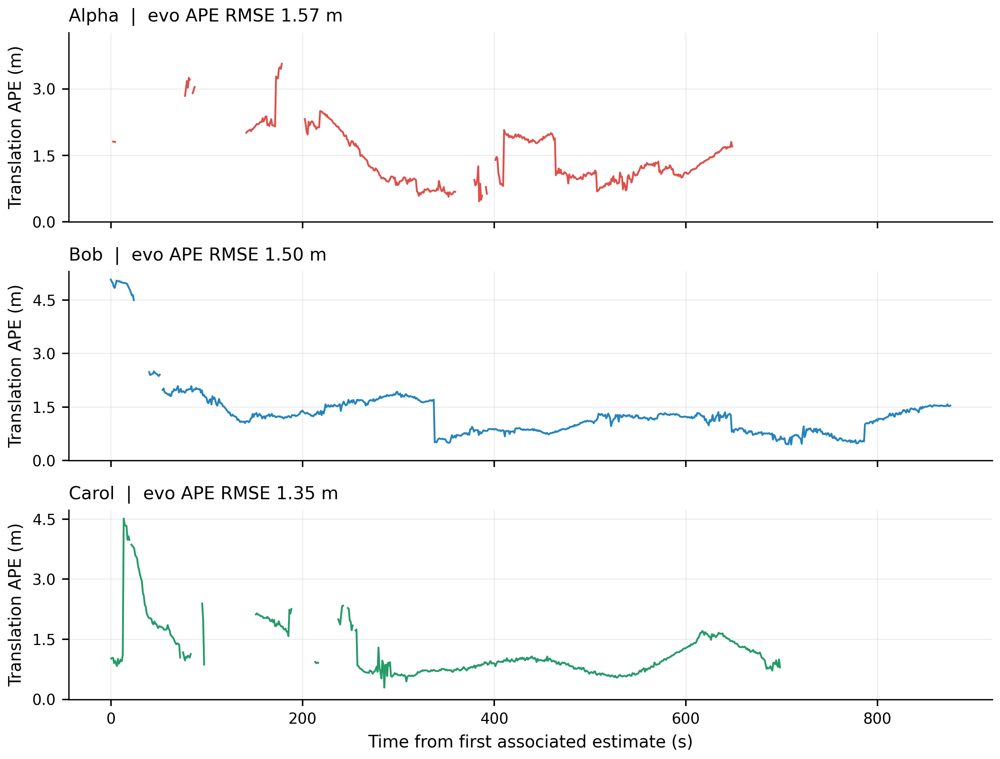
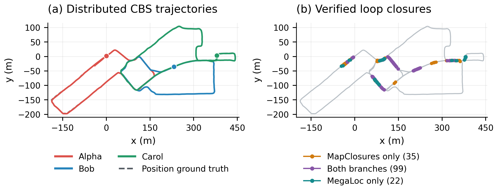
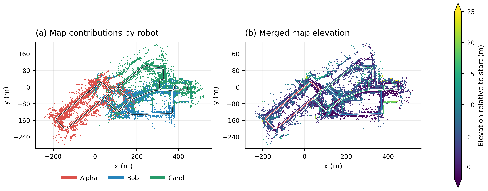
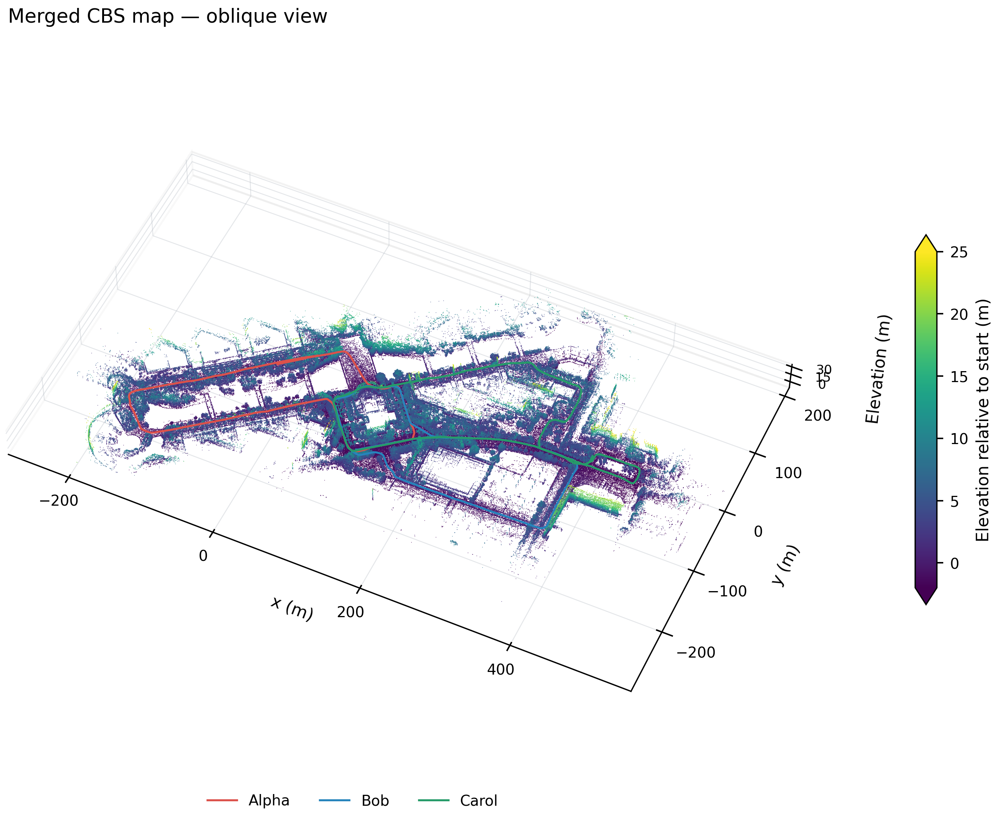
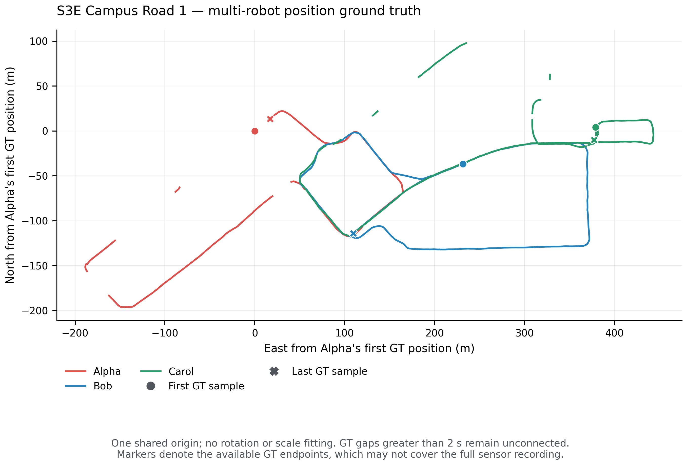

# S3E Campus Road 1: MegaLoc + MapClosures + CBS

Paths under `.ros2/` refer to local artifacts; generated data and Rerun recordings are not published in this repository.

Completed 2026-09-13 on the requested `S3E_Campus_Road_1` sequence.
**All three robots connected**, with **156 accepted loops** and **1.4707 m
overall CBS position ATE RMSE**, evaluated by evo 1.36.5 on 1,905 matched GT
positions. Detection and concurrent CBS took **176.64 seconds**.

The run retained the working Square 1 detection and optimization settings;
only the dataset and output directory changed. FAST-LIVO2 odometry ran
serially at 1× playback. Three robot front ends and three CBS optimizers
communicated through ROS2 Fast DDS on one host. Ground truth was used only
for evaluation. This is offline distributed replay, not a multi-machine test.

[Configuration](configs/campus-road1-cbs.yaml) ·
[Figure gallery](figures/cbs-campus-road1/README.md) ·
Rerun recording, 471.7 MB (local: `.ros2/recordings/campus-road1-cbs.rrd`)

## CBS trajectory accuracy

ATE here is evo's translation-part absolute pose error. All rows below use
**one shared multi-robot SE(3) alignment**, with no scale fitting and no
additional per-robot alignment. Statistics cover available timestamp-matched
GT only; missing GT intervals are excluded.

| Robot | ATE RMSE (m) | Median ATE (m) | Matched GT positions |
|---|---:|---:|---:|
| Alpha | 1.5669 | 1.2228 | 467 |
| Bob | 1.4956 | 1.2292 | 857 |
| Carol | 1.3486 | 0.9504 | 581 |
| **Combined** | **1.4707** | **1.1690** | **1,905** |



*Error arrays and statistics come directly from the native evo results.
Missing GT intervals remain blank. [PDF](figures/cbs-campus-road1/position_error.pdf).*

## Loop detection and connectivity

| Measurement | Result |
|---|---:|
| Keyframes: Alpha / Bob / Carol | 939 / 942 / 1,009 |
| Selected geometric verifications | 595 |
| Accepted unique loops | 156 |
| Inter-robot / intra-robot loops | 116 / 40 |
| MapClosures only / both branches / MegaLoc only | 35 / 99 / 22 |
| Alpha–Bob / Alpha–Carol / Bob–Carol | 69 / 24 / 23 |
| Alpha–Alpha / Bob–Bob / Carol–Carol | 20 / 15 / 5 |
| Connected components | 1 |
| Verification yield | 26.22% |
| Rejected: high registration RMSE / no native pose | 432 / 7 |
| Retrieval Recall@1 / @5 / @20 | 88.12% / 90.20% / 91.23% |
| Queries with a causal GT-proximity positive | 867 |
| Proximity retrieval precision / recall | 22.94% / 50.45% |
| Accepted loops with usable GT within 10 m | 112 / 112 |
| Accepted loops without usable GT | 44 |
| Median / p95 wall detection latency | 0.314 / 0.521 s |
| Summed pair-verification processing time | 98.71 s |
| Verification cache hits | 0 |
| Loop exchange serialized CDR bytes | 396,762,579 |
| CBS request + response serialized CDR bytes | 1,086,704 |
| Original-factor Gaussian cost at CBS poses | 37.625331 |

Branch counts are mutually exclusive attributions within this single run.
MapClosures contributed 134 accepted constraints and MegaLoc 121 when the
99 jointly retrieved constraints are counted in each branch.

The GT audit can identify candidate failures more precisely here than in
Laboratory 1. Of 595 selected verifications, 468 had usable GT for both
endpoints; 445 were within 10 m. Of those 445, 112 were accepted, 331 were
rejected for high registration RMSE, and two lacked a native MapClosures
pose. Position proximity does not by itself establish sufficient visible
overlap or a valid 6-DoF registration. These counts therefore describe
rejected nearby candidates, not an exact ground-truth missed-loop count.

All 2,890 density maps had nonempty ORB descriptors. Median feature counts
were 261 for Alpha, 218.5 for Bob and 261 for Carol. The 100% accepted
proximity precision applies only to the 112 assessable loops; it makes no
claim about the 44 loops falling in GT gaps.

All CBS workers completed their fixed 100-iteration settling budgets. Final
pose changes were below 1.5e-18 and no new beliefs arrived in the last ten
updates. CDR byte counts exclude RTPS, discovery, retransmission and local
graph/diagnostic traffic.

## Corrected trajectories and maps



*Corrected trajectories with position GT, and the 156 accepted constraints
colored by retrieval attribution. The shared alignment is the evo fit used
for ATE; coordinates are relative to Alpha's first GT position.
[PDF](figures/cbs-campus-road1/trajectories_and_loops.pdf).*



*The corrected keyframe maps contain 7,455,777 points in total: 2,429,805 Alpha,
2,203,445 Bob and 2,822,527 Carol. Colors represent contributing robot or
relative elevation, not camera RGB. Display resolution is 0.30 m per pixel;
each pixel shows its highest point. Height colors saturate outside −2 to 25 m
without filtering geometry. [PDF](figures/cbs-campus-road1/map_top_down.pdf).*



*Oblique view with a fixed-seed sample of 650,000 map points, preserving metric
proportions without vertical exaggeration.
[PDF](figures/cbs-campus-road1/map_oblique.pdf).*

## Input and ground truth


The ROS2 bag spans 878.128 seconds. Its metadata lists 7,155 Alpha, 8,781 Bob
and 7,074 Carol LiDAR messages (23,010 total). Per-robot recording lengths
differ; completeness will be checked against each robot's own input count.

| Robot | Released GT positions | GT span | Gaps exceeding 2 s |
|---|---:|---:|---:|
| Alpha | 470 | 649.009 s | 10 |
| Bob | 858 | 877.001 s | 4 |
| Carol | 583 | 698.989 s | 10 |

All supplied position records have finite coordinates, strictly increasing
timestamps, and timestamps within the bag interval. Ground-truth coverage has
gaps and does not extend to every robot's final sensor frame. Orientations are
placeholders and will not be used for accuracy claims.



*Alpha, Bob and Carol position ground truth in a common coordinate frame, after
subtracting Alpha's first GT position. No rotation or scale fitting is applied
to this ground-truth-only plot. Gaps greater than two seconds remain blank;
circles and crosses indicate the first and last available GT samples.
[PDF](figures/cbs-campus-road1/ground_truth_trajectories.pdf) ·
[Input hashes and rendering metadata](figures/cbs-campus-road1/ground_truth.json).*


All 23,010 expected LiDAR scans were received. Completed synchronized exports
were 7,134 Alpha, 8,770 Bob and 7,062 Carol frames, or 22,966 total. All poses
were finite. Maximum consecutive odometry translations were 0.293, 0.231 and
0.283 m respectively.

## Evaluation protocol


Trajectory association, alignment and translation APE are delegated entirely
to evo 1.36.5. Association is within each robot with a maximum timestamp
difference of 0.05 s, no interpolation or time offset. Each connected robot
component receives one shared SE(3) alignment, with scale fixed to one; no
additional per-robot alignment is applied. The GNSS antenna lever arm remains
uncorrected.

Retrieval metrics use causal, 10 m position-proximity labels where GT exists,
with interpolation only across GT gaps of at most two seconds. These are
retrieval labels, not trajectory-error calculations or exact 6-DoF loop labels.
Missing GT will be excluded explicitly from assessed loop counts.


## Runtime and memory

The complete pipeline took **70.0 minutes**, measured from creation of
the run log to its final registry write. This includes odometry, submap
preparation, inference, distributed detection/CBS and evaluation/Rerun export;
report figure rendering and cleanup are additional. The initial 40–50 minute
estimate underestimated submap preparation.

| Stage | Saved stage wall time |
|---|---:|
| Odometry: Alpha / Bob / Carol | 739.0 / 899.4 / 725.1 s |
| Keyframes and submaps: Alpha / Bob / Carol | 517.8 / 542.6 / 649.6 s |
| MegaLoc CUDA descriptors: Alpha / Bob / Carol | 56.4 / 43.8 / 49.6 s |
| MapClosures descriptors: Alpha / Bob / Carol | 29.0 / 23.7 / 33.7 s |
| Distributed detection + CBS | 176.64 s |
| Map reconstruction, evo and Rerun export | 276.95 s |

Carol's submap stage ran concurrently with the main preparation process and
its completed cache was validated and reused. Stage times therefore cannot
be summed into elapsed time. MegaLoc used one RTX 4070 Laptop GPU worker;
peak reserved CUDA memory was 987,758,592 bytes. MapClosures, GICP and CBS used
CPU. The odometry and submap stages dominated total runtime.

| Robot | CBS sampled peak MiB | Front-end sampled peak MiB | Verifier peak MiB |
|---|---:|---:|---:|
| Alpha | 249.0 | 522.9 | 365.0 |
| Bob | 211.6 | 495.5 | 212.5 |
| Carol | 220.2 | 570.7 | 297.4 |

RSS sampling interval was 0.2 seconds; verifier values are process high-water
marks. The peaks occur at different times and are not summed as a measured
simultaneous system peak.

## Validation and retained artifacts

The audit checked 8,670 ranked replies containing 259,457 candidate entries:
zero future-observation or 30-second same-robot exclusion violations. All
156 constraint endpoint pairs were unique. Serialized wire byte counts
matched the reported totals exactly. Re-running evo on the saved pooled
poses reproduced the native component statistics and error arrays.

All five figures have verified PNG and single-page PDF exports (10 files),
with input/output hashes and full-precision numeric results in
[figure metadata](figures/cbs-campus-road1/figures.json). Rerun 0.37.1 verified
the retained recording without decoding errors. The Python suite passed
30 tests; four optional ROS tests were skipped.

The retained Rerun recording is **471.7 MB**
(449.8 MiB). It includes trajectories, maps, loops,
registration views and sampled sensor data. It was moved outside the run
directory and its SHA-256 was checked after the move.

Cleanup completed: **26.08 GiB of experiment files** and the temporary run
logs were removed. The report, figures and 471.7 MB Rerun recording are
retained. Intermediate results can be regenerated from the retained
source/configuration and dataset; those deleted caches are no longer available.

Native project branches: `cbs` `dev/fast-livo2-s3e-dpgo` at
`11d84afe3397870cddecb5b6c07f4ed6866466a4`; `cbs_ros` `dev/fast-livo2-s3e-dpgo` at
`86e3e3511b9c4bb2750628c823b682b5200c34a3`. Code snapshot and stage hashes are preserved
in the figure metadata.

## Reproduce

```bash
FAST-LIVO2-ROS2/scripts/s3e_experiment.sh run --stage all \
  --config FAST-LIVO2-ROS2/research/configs/campus-road1-cbs.yaml --resume
```

The [figure gallery](figures/cbs-campus-road1/README.md) contains rendering
commands and PDF downloads. A fresh run can differ slightly because the
three CBS workers use independent timers and thresholded belief sharing.
