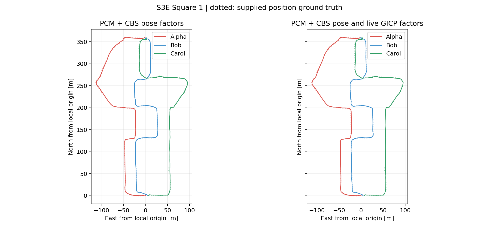
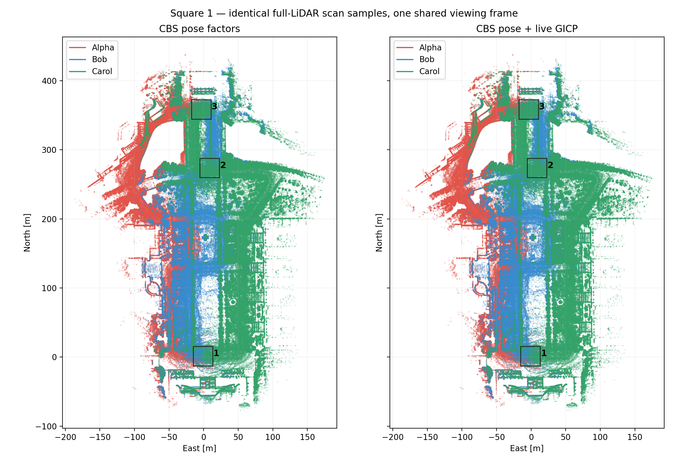
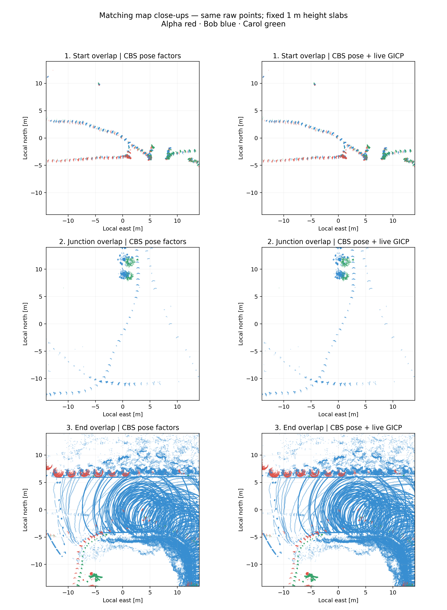

# Square 1: distributed PCM + CBS with live GICP

The three-robot run completed successfully in **24.755 s**. It retains
1,547 odometry and 50 loop pose measurements, adding **50 live gtsam_points
GICP factors** inside the distributed CBS solvers. All initial and final
geometry checks passed. Each robot initializes in its own odometry frame;
there is no centralized alignment or optimization pass.

| evo translation ATE RMSE [m] | Earlier frozen PCM + CBS | PCM + CBS + GICP |
|---|---:|---:|
| Alpha | 1.520297 | 1.514802 |
| Bob | 0.965256 | 0.930067 |
| Carol | 1.133526 | 1.130813 |
| Combined | **1.218072** | **1.204467** |

Both runs use the identical frozen FAST-LIVO2 odometry and MegaLoc + MapClosures
loop set. Distributed PCM retains all 50 loops in each. Evo 1.36.5 associates
1,176 positions within 0.05 s: Alpha 384, Bob 454, Carol 338. All robots form
one connected component. Each solution uses one shared SE(3) alignment, no
per-robot alignment, no scale fitting, and no ground-truth orientations.

The mixed run is 0.0136 m lower in combined ATE, a modest observed difference.
The baseline is the earlier saved frozen run, and CBS uses asynchronous local
updates. Adding GICP also changes iSAM2's relinearization policy. This single
comparison does not isolate the cause or establish a repeatable accuracy gain.
The separately evaluated [centralized mixed graph](RESULTS-MIXED-PGO.md) had
1.198012 m combined ATE; it uses a different initialization and optimizer.



## Map comparison





The overview uses all 1,550 saved keyframe scans, covering 36,006,035 points
after an 80 m range crop. Display sampling uses the same source-frame 0.4 m
voxel centroids and at most 900 points per scan for both solutions. The close-ups
use raw points in three fixed 28 m boxes and 1 m height slabs, selected in the
pose-only map and reused identically for the mixed map. Both columns use one
shared viewing transform. No smoothing or independent map alignment is applied.
Colors identify robots, not point intensity or RGB.

**Visual verdict:** these views do not show clear overall sharpening. The
inter-robot offsets and spread of repeated observations remain visible. The
small trajectory ATE change alone does not establish better map sharpness.
The end-region slab also intersects scan rings from surfaces at different
heights; it should not be interpreted as a wall-thickness measurement.

The [Rerun 0.37.1 recording](figures/cbs-registration-square1/maps.rrd) is
approximately 18 MiB and contains separate 3D views for the two maps. It keeps
the same deterministic overview samples, capped at 250,000 points per robot
per solution. [Map provenance](figures/cbs-registration-square1/map-view.json)
records all 1,550 source hashes and the exact display selection. All original
scan hashes were verified after rendering; temporary cloud payloads were removed.

```bash
PYTHONPATH=FAST-LIVO2-ROS2/research .ros2/research-venv/bin/python \
  -m s3e_pipeline.cbs_registration_maps \
  --output FAST-LIVO2-ROS2/research/figures/cbs-registration-square1
.ros2/rerun-venv/bin/rerun \
  FAST-LIVO2-ROS2/research/figures/cbs-registration-square1/maps.rrd
```

## Execution and communication

| Measurement | Result |
|---|---:|
| Keyframe poses | 1,550 |
| Retained loop poses / added GICP factors | 50 / 50 |
| GICP owners: Alpha / Bob / Carol | 28 / 22 / 0 |
| Unique source submaps | 73 |
| Remote cloud responses | 40 |
| Local owned cloud copies: Alpha / Bob / Carol | 45 / 34 / 0 |
| GICP linearizations per factor | 290–299 |
| Minimum final bidirectional overlap | 0.498689 |
| Native geometry preparation: Alpha / Bob / Carol | 0.722 / 0.549 / <0.001 s |
| Complete distributed stage | 24.755 s |
| Registration exchange | 6,497,385 bytes (6.20 MiB) |
| Distributed PCM exchange | 65,780 bytes |
| CBS belief exchange | 118,306 bytes |
| Frozen front-end completion exchange | 726 bytes |
| Native peak RSS: Alpha / Bob / Carol | 298 / 257 / 141 MiB |

Communication counts are actual serialized CDR messages per directed recipient,
excluding RTPS/discovery/retransmission overhead. Submaps shared by multiple
factors are requested once per peer; some clouds occur at more than one owner.
Carol owns no GICP factor under canonical ownership but supplies geometry and
receives the resulting CBS beliefs. Factor counts are not loop branch attribution.

This is a CPU run with a two-thread TBB budget per native robot; each GICP
factor uses one thread and cloud covariance preparation may use two. No new
odometry, model inference, retrieval, or loop-verification stage ran. Runtime
includes native/Python process startup, PCM, geometry exchange/preparation and
100 local CBS updates per robot; it excludes build, input-cache validation and
evo/report generation. The pose-only historical run took 12.485 s.

Final per-update pose-change norms were approximately `5.8e-13`, `1.7e-5`,
and `2.1e-13` for Alpha, Bob, and Carol. Termination is the configured update
budget, not a mathematical convergence certificate. Final geometry checks use
each factor owner's local separator estimates. Evo evaluates the independently
exported robot trajectories in their CBS-established common frame.

## Implementation and reproduction

The [configuration](configs/square1-cbs-registration.yaml) enables
`dpgo.registration_factors` after the immutable distributed PCM gate. Robot
front ends request only retained endpoint geometry over DDS. The canonical
first endpoint owns its loop pose factor and a separate binary GICP factor.
Native nodes consume local manifests prepared from those exchanges, without
accessing peer stores. Rejected PCM loops cannot reenter through cloud factors.

The native factor uses the unmodified CPU component of
[gtsam_points v1.2.2](https://github.com/koide3/gtsam_points/tree/9d32e7dbecf6015560d84b4901d6b0a6f483ec46),
MIT, commit `9d32e7dbecf6015560d84b4901d6b0a6f483ec46`, with installed GTSAM
4.3a2 and CBS iSAM2. The factor and quality checks share code with the centralized
adapter. The CBS core already supports arbitrary nonlinear factors; integration
changes are in `cbs_ros` and the wrapper. Detailed protocol and solver behavior
are in the sibling package's `docs/registration_factors.md`.

Inputs remain the successful setup's full-LiDAR trailing five-second submaps
in the keyframe IMU frame: 0.5 m voxel centroids, 12,000-point cap, 80 m range,
20 covariance neighbors, 1.5 m correspondences, and the existing overlap and
observability gates. Initial gates and weighting use the verified loop
measurement. The initial source Hessian is capped at one times that loop's
information. Scale stays fixed while correspondences and Gaussian
linearizations refresh. Pose and GICP factors reuse evidence; the weight is
conservative regularization, not an independence claim.

From the workspace `src` directory:

```bash
bash FAST-LIVO2-ROS2/scripts/build_mixed_pgo.sh
S3E_REGISTRATION_FACTORS=ON bash FAST-LIVO2-ROS2/scripts/build_dpgo.sh
FAST-LIVO2-ROS2/scripts/s3e_experiment.sh run --stage dpgo \
  --config FAST-LIVO2-ROS2/research/configs/square1-cbs-registration.yaml \
  --input-run .ros2/megaloc-mapclosures-cbs/run-af384eeda86f7f19.json --resume
```

The first build obtains and validates the pinned upstream dependency. The CBS
option is disabled by default. This mode requires PCM and the sealed graph;
dynamic replacement of registration factors and live sensor operation have
not been tested. Existing G2O exports contain only the pose-factor projection,
since G2O cannot encode the live cloud costs.

Completed registry: `.ros2/square1-cbs-registration/run-d41d2e9f392e0f48.json`.
Stage: `a369b536fa785fbcb47cc3e0c03e8623371b4db28991ea1c766bf28554c47218`.

```bash
PYTHONPATH=FAST-LIVO2-ROS2/research .ros2/research-venv/bin/python \
  -m s3e_pipeline.cbs_registration_report \
  --input-run .ros2/square1-cbs-registration/run-d41d2e9f392e0f48.json \
  --baseline-run .ros2/square1-cbs-pcm-validation/run-27eef5f933795f04.json \
  --output FAST-LIVO2-ROS2/research/figures/cbs-registration-square1
```

The [full-precision report](figures/cbs-registration-square1/report.json),
[factor diagnostics](figures/cbs-registration-square1/mixed/registration.json),
[evo evidence](figures/cbs-registration-square1/mixed/evo/README.md), and
[file hashes](figures/cbs-registration-square1/files.json) retain the compact
numerical evidence, figures and Rerun recording. The completed stage is 3.8 MiB. Temporary binary cloud copies were
removed; original submaps, odometry and descriptors were preserved. A repeat
invocation with unchanged code/configuration reused the completed stage.

Validation: five native CBS/ROS tests passed, including live-factor correction
of a biased pose measurement, belief marginalization, rekey scaling and PCM
exclusion. All seven real three-robot DDS tests passed, covering mixed factors,
unknown alignment, disconnected components and false loops. Fourteen Python
protocol/centralized-factor tests and 40 regression tests passed; one optional
ROS-dependent regression was skipped. Registration traffic totals agree with
wire logs, all 73 source submap hashes remain unchanged, and no temporary cloud
payload remains in the completed run.
