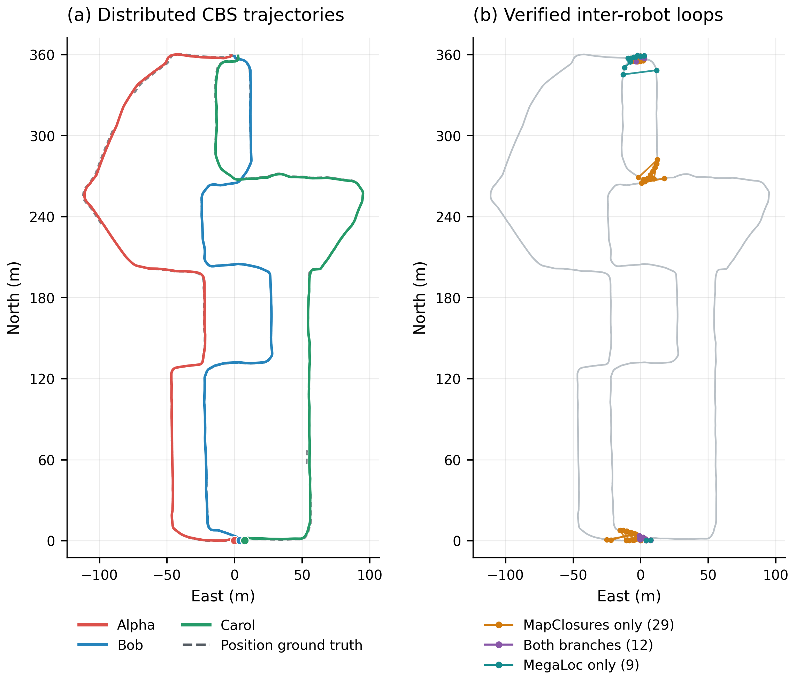
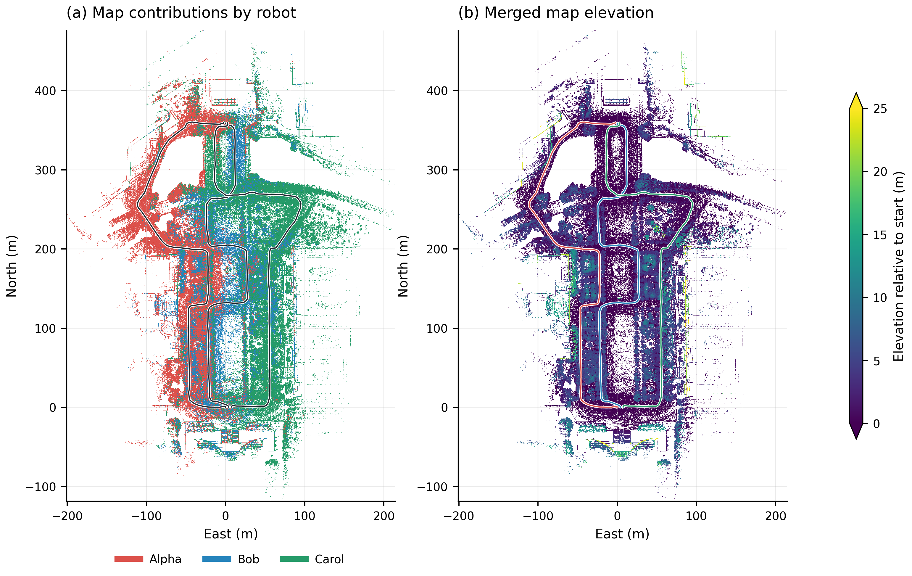
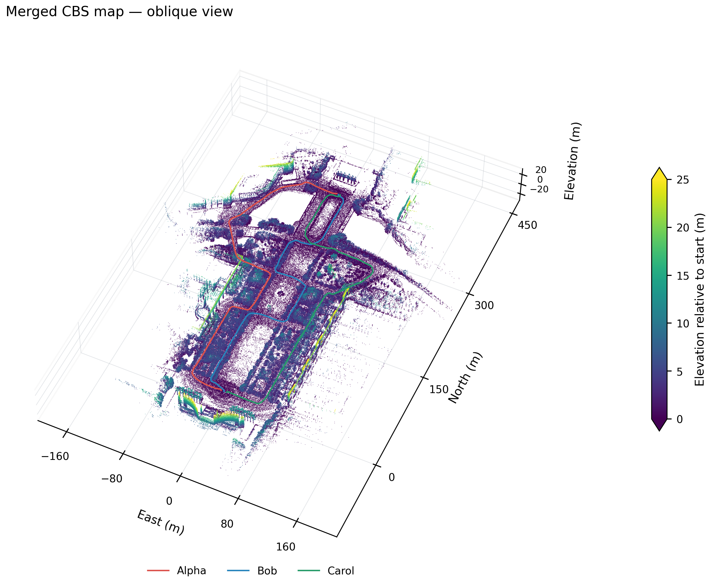
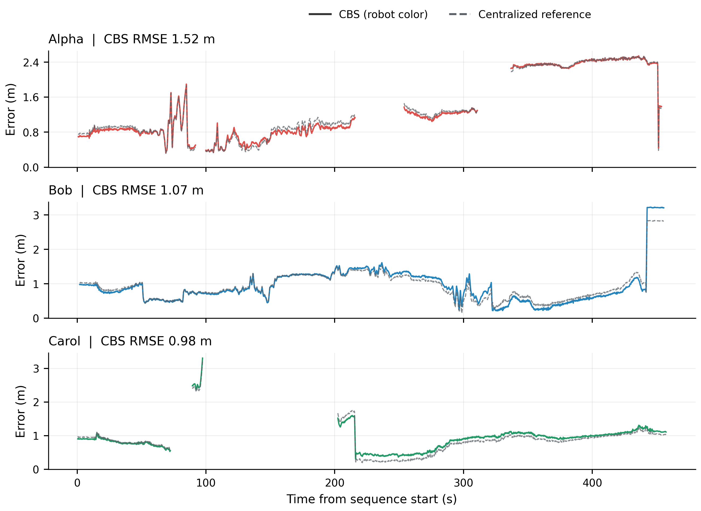

# S3E Square 1: distributed MegaLoc + MapClosures + CBS

Paths under `.ros2/` refer to local artifacts; generated data and Rerun recordings are not published in this repository.

## CBS ATE re-evaluated with evo

The frozen CBS trajectories were re-evaluated on 2026-09-13 with **evo 1.36.5**,
using the same protocol as Campus Road 1: nearest timestamp association within
0.05 s, no GT interpolation, and one shared multi-robot SE(3) alignment with
scale fixed to one. Per-robot results use this shared alignment without an
additional individual fit. Odometry, detection and CBS were not rerun.

| Robot | CBS ATE RMSE (m) | Median ATE (m) | Matched GT positions |
|---|---:|---:|---:|
| Alpha | 1.5182 | 1.0123 | 384 |
| Bob | 1.0740 | 0.8201 | 454 |
| Carol | 0.9827 | 0.9216 | 338 |
| **Combined** | **1.2147** | — | **1,176** |

These are translation-part absolute pose errors. Placeholder GT orientations
are unused, and the GNSS antenna lever arm remains uncorrected. Native evo
statistics and error arrays were reproduced from the pooled associated poses;
all input trajectory and GT hashes remained unchanged.
[Full-precision results and provenance](figures/cbs-square1/evo_ate.json).

## Archived run report

The original trajectory numbers and figures below used interpolated GT and
are retained as the archived evaluation. Use the evo table above when comparing
with the Campus Road 1 results. Detection, connectivity and runtime results
below still describe the same frozen CBS run.

Completed 2026-09-13 on an Intel Core i7-13650HX. Three robot front ends,
three CBS optimizers and bounded per-robot geometric verifiers communicated
through ROS2 Fast DDS on one host. The run reused the completed FAST-LIVO2
odometry and pretrained MegaLoc descriptors for Alpha, Bob and Carol. It did
not repeat odometry or GPU inference.

The distributed path recovered the working setup's exact 50 loop measurements
and connected all three robots. CBS position RMSE was **1.2112 m**,
compared with **1.1954 m** for the frozen centralized reference.
Detection and concurrent DPGO completed in **57.99 seconds**.
Maps, dense trajectories, plots and Rerun export took another
**125.45 seconds**. These times exclude generation of the
reused odometry/keyframe/model artifacts.

| Measurement | Final result |
|---|---:|
| Keyframes | 1,550 (547 Alpha, 481 Bob, 522 Carol) |
| Dense corrected poses | 13,655 |
| GT-associated position samples | 11,698 |
| Geometric verifications | 175 |
| Accepted loops | 50 |
| Verification yield | 28.57% |
| MapClosures only / both / MegaLoc only | 29 / 12 / 9 |
| Alpha–Bob / Alpha–Carol / Bob–Carol | 18 / 10 / 22 |
| Connected robot components | 1 |
| CBS median position error | 0.9057 m |
| Retrieval Recall@1 / @5 / @20 | 78.07% / 86.10% / 88.77% |
| Accepted proximity precision | 83.67% |
| Proximity retrieval precision / recall | 5.93% / 53.31% |
| Median / p95 wall detection latency | 0.247 / 0.344 s |
| Summed geometric verification time | 21.76 s |
| Verification cache hits | 0 |
| Loop exchange CDR bytes | 180,403,686 |
| CBS request + response CDR bytes | 337,936 |
| Original-factor Gaussian cost at CBS poses | 6.923856 |

Proximity metrics use the configured 10 m keyframe-position threshold and causal
availability. They are not ground-truth 6-DoF registration labels. S3E supplies
placeholder orientations; orientation GT was never used. Each connected
multi-robot result uses one shared rigid position alignment, without scale
fitting or per-robot alignment. GNSS antenna lever arms remain uncorrected.

Each robot's final pose change was below 2e-18 and no new beliefs arrived during
its last ten updates. CBS uses independent timers and thresholded belief
sharing. Repeated uncached runs can differ slightly; the reported values are
from the final saved run, not a best-run selection. The fixed 100-iteration
settling budget and local stability are recorded explicitly.

## Report figures

Report figures, PDF downloads, detailed captions and the reproduction command
are available in the [figure gallery](figures/cbs-square1/README.md).

*Corrected trajectories and the 50 verified inter-robot constraints. All robots
share one rigid alignment to position ground truth; gaps in ground truth are
left unconnected. [PDF](figures/cbs-square1/trajectories_and_loops.pdf).*

*The corrected keyframe LiDAR map, colored by contributing robot (left) and
elevation (right). Colors represent identity or elevation from the saved XYZ
points. [PDF](figures/cbs-square1/map_top_down.pdf).*

*Oblique map view with robot trajectories. A fixed sample of 650,000 points is
displayed with no vertical exaggeration. [PDF](figures/cbs-square1/map_oblique.pdf).*

*Position error over time under one shared alignment for each solver, using
11,698 matched samples. Missing ground-truth intervals are blank.
[PDF](figures/cbs-square1/position_error.pdf).*

## Memory measurements

Native and front-end RSS was sampled every 0.2 seconds. Verifier figures are
process high-water marks. Peaks occur at different times and should not be
summed as a measured simultaneous system peak.

| Robot | CBS sampled peak MiB | Front-end peak MiB | Verifier peak MiB |
|---|---:|---:|---:|
| Alpha | 152.7 | 343.4 | 198.6 |
| Bob | 140.0 | 344.6 | 201.4 |
| Carol | 150.4 | 363.7 | 203.1 |

Communication counts serialized CDR bytes per directed recipient, including
encapsulation/alignment. CBS totals include both client requests and responses,
with final statistics synchronized to each final estimate iteration. RTPS,
discovery, retransmission and local graph/diagnostic messages are excluded.

## Verification and saved artifacts

* 7 native CTest cases passed across CBS and cbs_ros.
* Standard Python suite: 24 passed, 4 optional tests skipped. The ROS serialization
  test and all 3 native DDS synthetic cases passed in their respective environments.
* Synthetic tests cover unknown SE(3) gauges, isolated Carol, and isolated Alpha
  with a connected Bob/Carol component. Position/rotation tolerances are 1e-3 m
  and 1e-4 rad.
* 4,650 retrieval replies were audited: zero future-frame or 30-second same-robot
  exclusion violations. These are retrieval replies, not registration attempts.
* All 50 loop endpoints, transform entries and information-matrix entries exactly
  match the successful MegaLoc + MapClosures run (maximum numerical difference 0).
* Both new stages were reused with `--resume`. All 6,339 checked
  odometry, keyframe, descriptor and result file modification times were unchanged.
* Rerun 0.37.1 verified the completed recording without decoding errors.

Branches are local and committed:

* `cbs`: `dev/fast-livo2-s3e-dpgo`, commit `11d84af`.
* `cbs_ros`: `dev/fast-livo2-s3e-dpgo`, commit `86e3e35`.

Run registry (local: `.ros2/megaloc-mapclosures-cbs/run-af384eeda86f7f19.json`) · Numeric report (local: `.ros2/megaloc-mapclosures-cbs/dpgo_evaluate/d1c616a1b82d2b4a24c14360fe505a1aa73e7a5ab712eb469230d91b7d317434/report.json`) ·
Trajectory plot (local: `.ros2/megaloc-mapclosures-cbs/dpgo_evaluate/d1c616a1b82d2b4a24c14360fe505a1aa73e7a5ab712eb469230d91b7d317434/trajectories.png`) · Rerun recording (local: `.ros2/megaloc-mapclosures-cbs/dpgo_evaluate/d1c616a1b82d2b4a24c14360fe505a1aa73e7a5ab712eb469230d91b7d317434/result.rrd`) ·
Constraint and cache audit (local: `.ros2/dpgo-final-audit.json`)

Corrected TUM/JSON trajectories, original/optimized map arrays, factor residuals
and CSV metrics are saved alongside the report. Per-robot candidate replies,
rejections, verification diagnostics, communication logs and CBS statistics
are in the distributed stage (local: `.ros2/megaloc-mapclosures-cbs/dpgo/f93980f9a6c54601df7261cfa32ba22e440bf3099a82db616f594e95967b5cb4`). Rerun contains robot-colored maps
and trajectories, loop links, convergence curves, candidate images, registration
overlays and sampled sensor MCAP decoded with the official ROS2 integration.

This validates offline distributed replay on one machine. Live sensor-to-model
streaming, physical multi-machine deployment and reconnect recovery were not
part of this run. The existing single-robot runner and frozen reference artifacts
remain available. Reproduction commands and protocol details are in [DPGO.md](DPGO.md).
