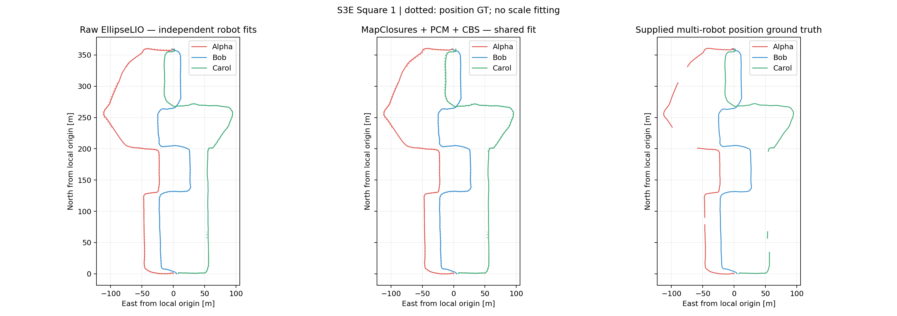
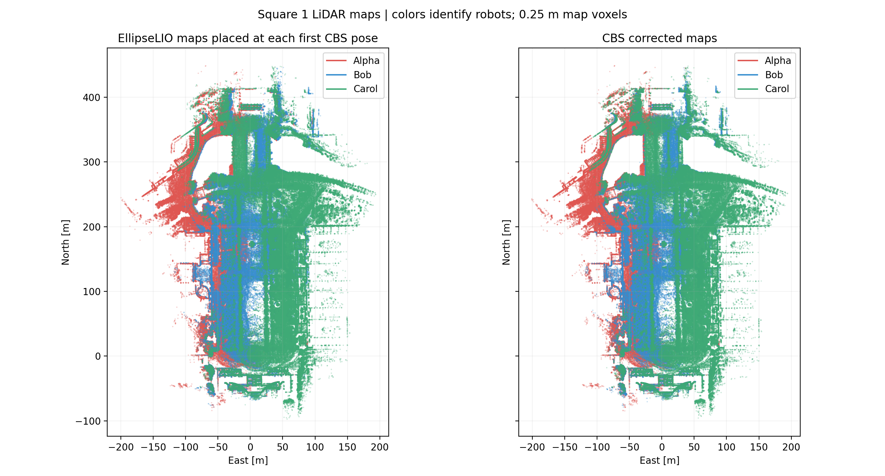

# Square 1: EllipseLIO + LiDAR-only MapClosures + distributed CBS

Completed 2026-09-14. **All three robots connected**, with **1.1907 m combined
position ATE**, **29 inter-robot loops** and **40.35 s for detection plus CBS**.
All loop proposals came from MapClosures. There were no image artifacts,
MegaLoc descriptors, model inference jobs or CUDA dependencies in this run.
Four accepted loops have a position-GT distance inconsistency above 2 m;
the run establishes working integration, not certified loop correctness.

The frontend is [V4RL/UCY EllipseLIO](https://github.com/v4rl-ucy/ellipselio),
pinned to `171acea502f1122e3043a460d2e6e3a30d8f8246` with local export adaptations
on `dev/s3e-mapclosures-cbs`. It is MIT licensed. See the
[paper](https://arxiv.org/abs/2605.21150), [integration details](ELLIPSELIO.md),
and [exact experiment configuration](configs/square1-ellipselio-mapclosures-cbs.yaml).

## Trajectories

All values are translation ATE RMSE in metres, evaluated entirely with
**evo 1.36.5**. Nearest timestamp matching uses a 0.05 s tolerance, no time
offset, no interpolation and no scale fitting. Raw odometry gets an independent
SE(3) fit per robot; CBS gets **one shared fit across all three robots**.
Subtracting these columns does not measure optimization improvement. Supplied
placeholder orientations are unused; GNSS antenna offsets are uncorrected.

| Robot | Raw EllipseLIO, individual fit | CBS, shared fit | Matched GT positions |
|---|---:|---:|---:|
| Alpha | 1.0922 | 1.4394 | 384 |
| Bob | 0.7956 | 0.8909 | 451 |
| Carol | 0.5925 | 1.2279 | 337 |
| Combined | — | **1.1907** | **1,172** |

The retained earlier FAST-LIVO2 + MegaLoc/MapClosures + PCM/CBS/GICP run
achieved [1.2045 m shared ATE](RESULTS-CBS-REGISTRATION.md). These are separate
single runs with different frontends, observation schedules, loop measurements
and asynchronous execution; the small difference does not establish superiority.

[Raw per-robot plot](figures/ellipselio-square1/raw_odometry.png),
[full-precision metrics](figures/ellipselio-square1/report.json),
[native evo results and matched trajectories](figures/ellipselio-square1/evo/cbs/README.md).
Gaps in the GT-only panel are missing supplied positions, not stationary robots.

## Centralized pose-factor PGO

A subsequent centralized GTSAM 4.2 run reused the same 1,548 keyframes and
29 PCM-retained loop measurements. GNC-TLS followed by a selected-inlier LM
refit retained all 29 loops. Optimization took **0.509 s**, excluding input
loading, evaluation and the original detection stage.

| Robot | Centralized PGO ATE, shared fit |
|---|---:|
| Alpha | 1.4615 m |
| Bob | 0.9652 m |
| Carol | 0.9034 m |
| Combined | **1.1371 m** |

Evaluation uses the same evo settings and 1,172 matched positions as CBS.
Dense corrections were applied to the retained raw TUM trajectories; this
reconstruction reproduced the saved CBS ATEs within 10⁻⁷ m. Input files were
verified unchanged. [Full-precision result](figures/ellipselio-square1/centralized/report.json),
[evo archives](figures/ellipselio-square1/centralized/evo/README.md), and
[reproduction script](figures/ellipselio-square1/centralized/compute.py) are retained.

This centralized result uses **pose factors only**. The earlier CBS result
includes live GICP factors, so their objectives differ. Centralized live-GICP
optimization was not evaluated for EllipseLIO; its required source clouds were
removed during the requested cleanup.

## Odometry and preparation

Each robot used LiDAR and IMU only, with S3E calibration, a VLP-16 configuration,
1–100 m input range and real-time bag replay. Direct exports contain full
range-filtered clouds from each processed interval, deskewed using the native
IMU state history and paired with the post-LiDAR-update state. The estimator's
adaptive cloud remains separate from the exported full geometry.

| Robot | Exported frames | Applied LiDAR updates | Largest export gap | Keyframes | Nonempty descriptors | Descriptor time |
|---|---:|---:|---:|---:|---:|---:|
| Alpha | 4,544 | 4,543 | 0.110 s | 543 | 543 | 12.33 s |
| Bob | 4,518 | 4,517 | 0.211 s | 483 | 483 | 11.88 s |
| Carol | 4,570 | 4,569 | 0.199 s | 522 | 522 | 14.30 s |

The first exported frame seeds the map. Every later exported frame has a
successful LiDAR update. Bob's nine gaps above 0.2 s contain approximately
two scans each, with no uncovered boundary interval. All three exports closed
cleanly, poses remained finite, and calibration stayed fixed. The separate
best-effort IMU-rate odometry monitor is not used to count input completeness.

The working backend settings were retained: 1 m / 10° / 2 s keyframes,
trailing five-second submaps, 0.25 m submap voxels, 80 m loop range crop,
0.5 m density grid, more than five native RANSAC inliers, top-20 hypotheses,
30 s same-robot exclusion and one selected LiDAR verification per query with
the existing cooldown. Median retained ORB feature counts were 155 / 255 / 333.

Serial odometry took **23.17 minutes**. Keyframe/submap preparation took
310.36 / 260.74 / 353.53 s for Alpha/Bob/Carol; Alpha and Bob preparation
overlapped subsequent odometry passes and was reused as validated caches.
All descriptors took **38.52 s** combined. Final evaluation/map/Rerun export
took **129.15 s**. These stage timings exclude cloning/building, input hashing,
the smoke test, an initial evaluation attempt and report packaging.

## Distributed loops, PCM and registration factors

Three isolated loop workers and three CBS processes exchanged Fast DDS
messages on one host. Workers used their own local stores and requested
remote evidence through the protocol. Odometry was replayed serially first;
this is a validated **offline distributed backend**, not a demonstration of
simultaneous live sensor processing on three machines. There is no estimator feedback.

| Measurement | Result |
|---|---:|
| Geometric verification attempts | 120 |
| Accepted / high-RMSE rejection / low-overlap rejection | 29 / 81 / 10 |
| Verification yield | 24.17% |
| Alpha–Bob / Alpha–Carol / Bob–Carol loops | 10 / 4 / 15 |
| Intra-robot loops | 0 |
| PCM retained / excluded | 29 / 0 |
| Odometry pose / loop pose / live GICP factors | 1,545 / 29 / 29 |
| Native GICP initial and final quality accepted | 29 / 29 |
| Minimum final GICP overlap | 54.07% |
| Detection + PCM + CBS + geometry exchange | 40.35 s |
| Verification runtime, summed | 14.14 s |
| Median / p95 wall detection latency | 0.194 / 0.257 s |

The GICP factors remain live in CBS and use the existing conservative
information caps. Pose and registration factors reuse LiDAR evidence and
are correlated regularization, not independent sensor observations. All
robots ended with pose changes below 10⁻¹² in their last ten local updates;
this is an observed termination diagnostic, not a global-optimum certificate.

Serialized CDR traffic was **57,065,831 bytes** for loop exchange,
**39,754** for PCM, **4,223,830** for requested registration geometry/protocol,
and **97,200** for CBS beliefs. RTPS, discovery and retransmissions are excluded.
Largest sampled individual native CBS RSS was **244.8 MiB**; the largest
loop-worker RSS was **232.4 MiB**. Per-process values are in the retained report.

Position-proximity Recall@1/5/20 was **70.49% / 75.96% / 90.71%**, over 183
queries with an eligible causal positive and available labels. Ranked-candidate
proximity precision/recall was **5.21% / 45.70%**. Among accepted loops,
26/29 had endpoint origins within 10 m. These are proximity labels, not exact
registration correctness. The transcript audit found zero causal/exclusion
violations and zero duplicate accepted endpoint pairs.

## Loop-quality flags

All 29 accepted loops have sufficient bracketing position GT for the same
distance diagnostic used in earlier reports: compare the measured translation
length with the GT endpoint distance and flag an absolute discrepancy **>2 m**.
Only these loop diagnostics interpolate GT positions, across gaps no larger
than two seconds; trajectory ATE uses evo's nearest association above.

| Flagged endpoints | Absolute distance discrepancy |
|---|---:|
| Alpha 528 ↔ Carol 497 | 2.264 m |
| Alpha 531 ↔ Bob 472 | 3.203 m |
| Alpha 533 ↔ Bob 476 | 2.264 m |
| Alpha 534 ↔ Bob 475 | 3.017 m |

These four loops passed registration and PCM. PCM consistency does not prove
agreement with external GT. Placeholder orientations and uncertain position
GT prevent an exact six-DoF false-closure count. See the
[per-loop CSV](figures/ellipselio-square1/loop-quality.csv) and
[saved constraints](figures/ellipselio-square1/dpgo/constraints.jsonl).

## Maps, verification and retained artifacts

Maps use saved complete keyframe scans, 0.25 m map voxels, and robot colors.
The original maps are placed at each robot's first CBS pose for display;
they do not use independently fitted GT transforms. Both views use the same
component viewing transform. Overview plots do not establish map sharpness.

The [Rerun 0.37.1 recording](figures/ellipselio-square1/result.rrd) is **87.18 MiB**
and passed `rerun rrd verify`. It contains original/optimized maps, trajectories,
loop edges, selected registration overlays and convergence.

Validation includes the 30-second native export smoke test, **60 Python tests
passed, one skipped**, and **seven native DDS integration tests passed**.
Checks cover timestamp association, image-free decoding, LiDAR/body transforms,
causal submaps, isolated LiDAR-only workers, deterministic exchange, false-loop
rejection and live registration factors. Evaluation was rerun after fixing
the adapter for flattened native pose matrices; odometry and CBS were reused.
An explicit `dpgo --resume` check returned the same completed stage as a cache hit.
[Validation logs](figures/ellipselio-square1/validation/regression-final.log),
[configuration and stage hashes](figures/ellipselio-square1/run.json),
[audit](figures/ellipselio-square1/audit.json), and
[retained-file hashes](figures/ellipselio-square1/files.json) are saved.

Cleanup removed **6.53 GiB** of new intermediate and smoke-test outputs after
archival verification. Source datasets and code/builds were retained, along
with **100.14 MiB** of report evidence, figures, compact trajectories/evo results
and the Rerun recording. The [cleanup record](figures/ellipselio-square1/cleanup.json)
lists removed paths. The archived registry records original paths; removed
caches must be regenerated before rerunning geometry-dependent stages.
