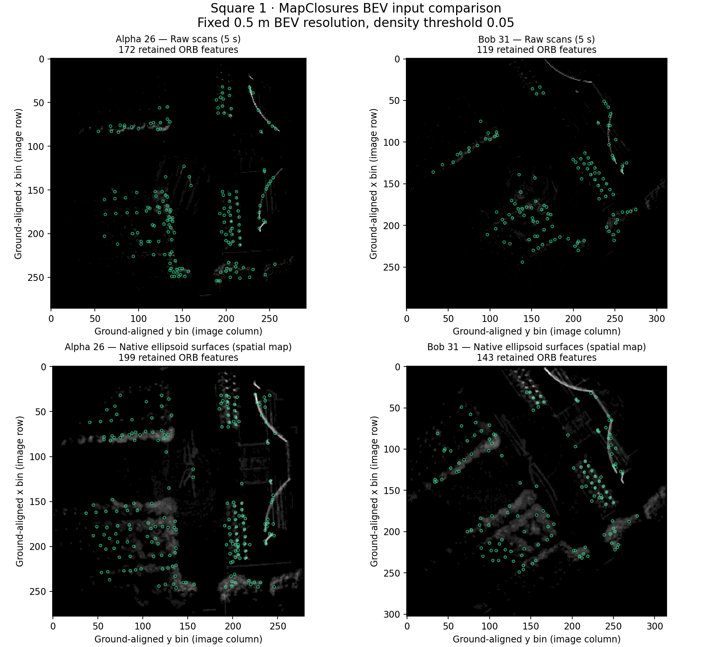
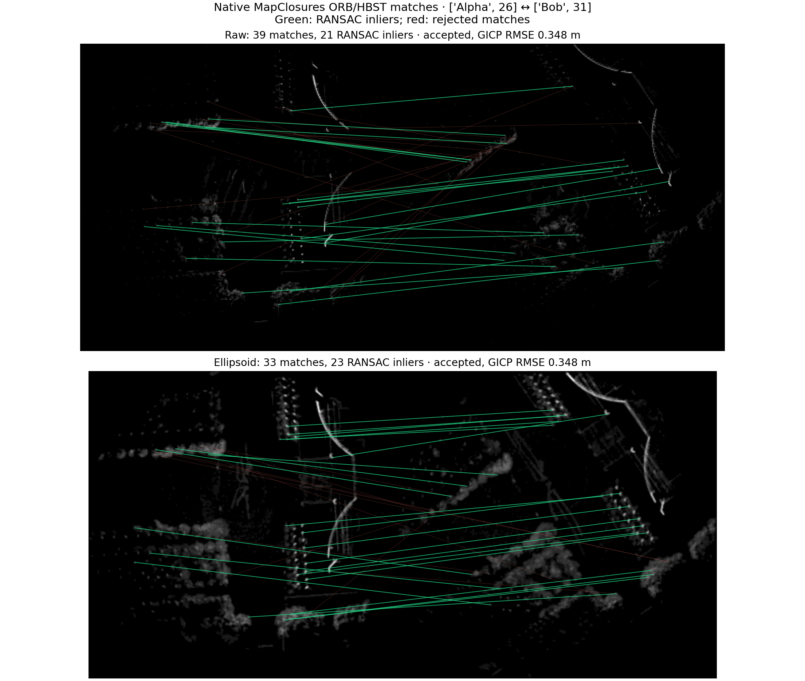

# EllipseLIO ellipsoid-map BEVs with MapClosures

**Full-sequence update:** the [Square 1 paired ATE experiment](figures/ellipsoid-bev-full-square1/REPORT.md)
is complete: ellipsoid BEVs achieve **1.1408 m** combined centralized-PGO ATE,
versus **1.1457 m** for raw BEVs on identical fresh odometry. The report below
retains the earlier eight-pair rendering diagnostic and its original scope.

The [second full-sequence run, Square 2](figures/ellipsoid-bev-full-square2/REPORT.md),
achieves **0.4641 m / 0.4703 m** combined ATE for ellipsoid/raw BEVs, respectively.
It includes descriptor workload, loop timings, individual robot errors and the
documented Carol replay retry.

The [indoor Laboratory 1 run](figures/ellipsoid-bev-full-laboratory1/REPORT.md)
connects all three robots with ellipsoid BEVs: **51 selected loops, including
14 inter-robot loops**. Raw BEVs leave three disconnected components after GNC,
with six selected intra-robot loops. Detection takes **13.12 s / 3.32 s** for
ellipsoid/raw inputs. This improves graph connectivity; **trajectory ATE and
GT-based loop accuracy are unavailable** because the supplied GT has only
untimestamped endpoints. Persistent spatial coverage differs from the raw trailing
submaps, so the gain cannot be attributed to ellipsoid geometry alone.

**MapClosures can match BEVs rendered from native ellipsoids, but this first
diagnostic has lower detection yield than raw-cloud BEVs.** Two of eight selected
reference pairs pass geometric verification, compared with five for fresh raw
submaps. This result supports feasibility, not replacing the working raw-cloud
branch or claiming better loop recall.

The test used Alpha, Bob and Carol from the first **43 seconds of S3E Square 1**.
Eight previously accepted loop pairs determined 13 snapshot endpoints before
rendering began. All 13 new snapshots matched their requested timestamps exactly.
No ground truth was used. This is a bounded positive-pair diagnostic, not a
full-sequence benchmark or a new CBS optimization run.

## Rendered images

Top: trailing five-second raw submaps. Bottom: the persistent spatial ellipsoid
map accumulated causally by EllipseLIO. Green circles mark retained ORB features.
All panels use 0.5 m pixels, native grayscale density and the same 80 m range
crop. The map histories differ; this experiment does not isolate representation
from temporal coverage. Thicker, more continuous structures in the ellipsoid
images do not by themselves establish better recognition.

For **Alpha 26 ↔ Bob 31**, ellipsoid input produces 33 binary matches and
23 native RANSAC inliers. Raw input produces 39 matches and 21 inliers. Both
pass the unchanged small_gicp check, with approximately **0.348 m RMSE** and
**62.6% overlap**. Green lines are RANSAC inliers; red lines are rejected matches.

[Open the Rerun recording](figures/ellipsoid-bev-square1/ellipsoid-bev.rrd)
(Rerun 0.37.1, **9.52 MiB**) to inspect every tested pair, raw/ellipsoid matches,
native 3D ellipsoids and registration overlays. The 3D display samples at most
15,000 ellipsoids per view; BEV rendering uses every exported fitted ellipsoid.

## Results

| Input to native MapClosures | Native hypotheses passing >5 inliers | GICP accepted |
|---|---:|---:|
| Raw trailing submap | 8 / 8 | 5 / 8 |
| Native ellipsoid surfaces | 3 / 8 | 2 / 8 |

| Reference pair | Raw RANSAC inliers | Ellipsoid RANSAC inliers | Ellipsoid outcome |
|---|---:|---:|---|
| Alpha 2 – Bob 0 | 10 | 0 | Bob has no fitted ellipsoids yet |
| Alpha 7 – Bob 14 | 32 | 17 | RMSE 0.354 m exceeds 0.350 m |
| Alpha 9 – Bob 11 | 21 | 15 | Accepted; RMSE 0.339 m, overlap 66.6% |
| Alpha 26 – Bob 31 | 21 | 23 | Accepted; RMSE 0.348 m, overlap 62.6% |
| Bob 0 – Carol 0 | 10 | 0 | Neither endpoint has fitted ellipsoids yet |
| Bob 0 – Carol 1 | 7 | 0 | Bob has no fitted ellipsoids yet |
| Bob 0 – Carol 2 | 10 | 0 | Bob has no fitted ellipsoids yet |
| Bob 13 – Carol 3 | 13 | 2 | Insufficient native RANSAC inliers |

Initialization explains four failed ellipsoid pair tests. Among the four pairs
with nonempty fitted maps at both endpoints, ellipsoids pass three native
hypotheses and two final registrations. The raw reference passes four and three,
respectively. Thresholds were not adjusted to rescue the 0.354 m rejection.

The raw reference is recomputed on the fresh replay using a two-map HBST index.
It is not an exact reproduction of the previous distributed index history.
Fresh poses differ from the saved run by at most 0.157 m over the tested interval;
both branches here use the same fresh poses and raw geometric evidence. Thus
the earlier eight accepted loops need not remain eight accepted reference tests.

A separate causal retrieval sanity check indexed only these selected snapshots,
in timestamp order. Across 26 directed query/remote-robot combinations, raw input
generated 19 top-candidate verifications and 12 accepted registrations; ellipsoid
input generated five and accepted four. Ellipsoid matches were Bob 11–Alpha 9,
Bob 13–Alpha 7, Bob 14–Alpha 9 and Bob 31–Alpha 26. This small, selected database
does not measure full-sequence recall, false-positive rate or distributed
communication performance.

## Implementation and verification

The native exporter reads every fitted map primitive after `MapIncremental`,
under the map lock, and stores a standard PointCloud2 message through the bounded
MCAP writer. It saves centers, native geometric semi-axes and orthonormal axis
directions in the current IMU frame. It does not use the marker publisher, which
samples only a small fraction of newly added ellipsoids. There are no synthetic
ellipsoids for initialization frames with no fitted map.

The renderer samples the actual ellipsoid surfaces, including their shape and
orientation. Sampling uses a nominal 0.125 m spacing with a count based on the
largest-axis enclosing sphere, followed by 0.25 m voxel centroids. Overlapping
surfaces merge through voxelization. No axes are inflated and no Gaussian kernel
is applied. These native semi-axes are geometric lengths, not statistical
covariance eigenvalues. This surface-sampling adapter is our implementation;
upstream MapClosures does not directly consume ellipsoid primitives.

Upstream MapClosures ground alignment, density counting, ORB, HBST and 2D RANSAC
are unchanged: commit `1710f15db000a579324e3ba045cd64a0b4d706da`, density resolution
0.5 m, density threshold 0.05, Hamming threshold 50, and more than five RANSAC
inliers. Both branches use the existing raw-cloud small_gicp verification:
minimum overlap 0.30, maximum RMSE 0.35 m, and the existing observability checks.
The production distributed detector continues to use its working raw submaps.

The three serial replays took **140.9 s** combined. Extraction, rendering,
pair tests and the small retrieval check took **96.7 s**, including **70.2 s**
of surface sampling. These are CPU timings; no GPU inference was used. The
unoptimized surface renderer is not yet suitable for rendering a large map at
every scan in an online pipeline.

Validation: the native ROS build succeeded; **17 targeted tests passed**,
covering ellipsoid geometry, thin planes, orientation, invalid axes, empty maps,
PointCloud2 field decoding, known-transform/reversed-pair matching and unchanged
native density/ORB extraction. All replay exports completed with finite poses;
all 1,183 exported frame timestamps matched the prior run. The Rerun recording
passed `rerun rrd verify` and the static figures were visually inspected.

The [machine-readable summary](figures/ellipsoid-bev-square1/summary.json),
[per-pair results](figures/ellipsoid-bev-square1/events.jsonl),
[retrieval log](figures/ellipsoid-bev-square1/retrieval.jsonl), snapshots, fitted
ellipsoid geometry, selected raw submaps, feature caches and source/configuration
provenance are retained beside the figures. Full replay MCAPs and incomplete
intermediate outputs were removed after archival verification (**345.9 MiB**
freed; **98.1 MiB** of selected evidence and visualization retained); original datasets
and earlier experiment reports are untouched. See
[the reproduction commands](ELLIPSELIO.md#ellipsoid-map-bev-diagnostic).
