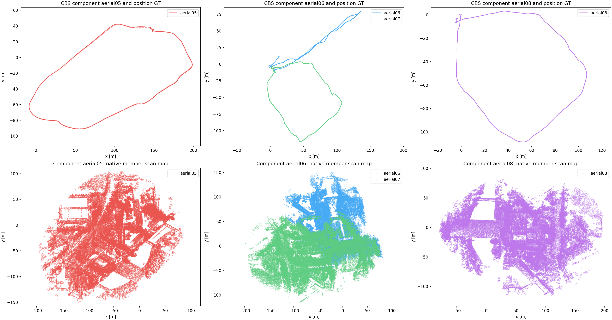

# GRACO aerial 05–08: four robots on 148

Completed on 2026-09-20 with four concurrent full-flight 1× replays, using
**temporal EllipseLIO submaps (10 s / 5 s overlap) → ellipsoid-BEV MapClosures →
distributed PCM → CBS with GICP**. The container had no CPU or memory quotas.
All four trajectories completed with finite chronological poses and maximum
speeds below 5 m/s.

**Subsequent projection audit:** the images called ellipsoid BEVs in this
experiment were projected onto the anchor IMU XY plane. MapClosures returned
identity ground alignment for all 253 submaps; aerial-05/submap-8's projection
plane is approximately **44° from horizontal**, estimated using IMU gravity
and the saved anchor pose without GT. Its surface cloud has at most eight
points per 0.5 m voxel after 0.25 m downsampling, below MapClosures' ten-point
minimum for ground-normal estimation. These are oblique orthographic density
projections, not gravity-levelled top-down images. The saved images and numeric
experiment results remain unchanged. The [gravity-horizontal rerun](RESULTS-GRACO-AERIAL-GRAVITY148.md)
now provides corrected images and a controlled backend comparison. See the
[orientation audit](figures/graco-aerial-four148/bev-gallery/projection-audit.json).

**The result is diagnostic:** aerial-06 and aerial-08 failed the stability gate
because of successful-LiDAR-update gaps of **2.656 s** and **1.464 s**. Their
failed gates were preserved while the backend processed the completed, validated
captures. Aerial-05 and aerial-07 passed that gate.

| Flight | Raw position ATE RMSE | CBS position ATE RMSE | Connectivity |
|---|---:|---:|---|
| aerial-05-40m | 0.8601 m | 0.8601 m | Separate |
| aerial-06-20m | 3.5598 m | 3.5955 m | Connected to aerial-07 |
| aerial-07-25m | 0.2034 m | 0.4948 m | Connected to aerial-06 |
| aerial-08-25m | 0.1668 m | 0.0735 m | Separate |

Raw trajectories use independent rigid fits. CBS uses one shared rigid fit per
connected component; aerial-06/07 share their fit and have **2.4526 m component
ATE**. There is **no common four-robot map or all-four ATE**. Evaluation uses
evo 1.36.5, 50 ms association, and no scale fitting; all 12,187 poses matched GT.
Ground truth was read only after optimization.

Six loops survived: **five inter-robot loops between aerial-06/07** and **one
intra-robot loop on aerial-08**. PCM rejected one of seven proposals. CBS used
six GICP factors; detection and backend execution took **14.02 s**. The full
run from frontend launch through evaluation and audit took approximately
**9 min 37 s**, excluding source build and sensor preparation.

The source comparisons verified every converted LiDAR/IMU measurement and its
original timestamps. All **253 completed submaps**, their matching descriptor
and registration memberships, eight excluded shutdown tails, frozen sources,
and **five Rerun recordings** passed their artifact checks. Both native CTests
and all 10 selected Python/integration tests passed, including four-robot
PCM/CBS/GICP. The supplied aerial calibration and IMU noise are recorded in
the per-robot mapping configurations.

The update logs show aerial-06 losing valid features near the 175-second
handover, briefly recovering, and losing them again in the same active map.
Aerial-08 lost valid features at the approximately 30-second handover, then
recovered. The [gap records](figures/graco-aerial-four148/full/update-gap-events.json)
retain the exact scan IDs, active-map IDs, features, and poses.

[Full report and runtime table](figures/graco-aerial-four148/full/REPORT.md) ·
[Numeric results](figures/graco-aerial-four148/full/report/report.json) ·
[Derived Rerun recording](figures/graco-aerial-four148/full/report/result.rrd) ·
[Ellipsoid BEV gallery: all 253 submaps](figures/graco-aerial-four148/bev-gallery/index.html) ·
[Artifact audit](figures/graco-aerial-four148/full/retention-audit.json) ·
[Retained-file hashes](figures/graco-aerial-four148/retained-files.json)

All bulk geometry and four live recordings remain on 148 under
`/data3/mikexyl/swarm_s3e_ws/src/.ros2/graco-aerial-four148-20260920`.
The local research copy contains reports, configuration, source hashes,
trajectories, evo evidence, plots, logs, and the verified derived recording.
Earlier experiments and the paused CU-Multi download are unchanged.
