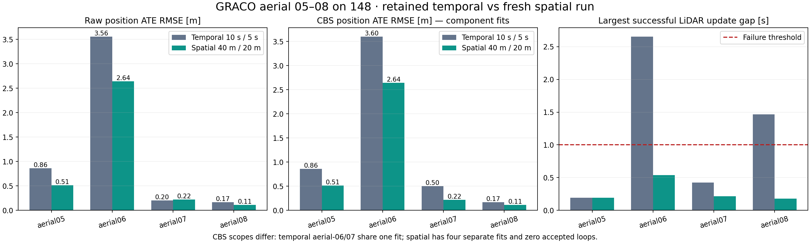
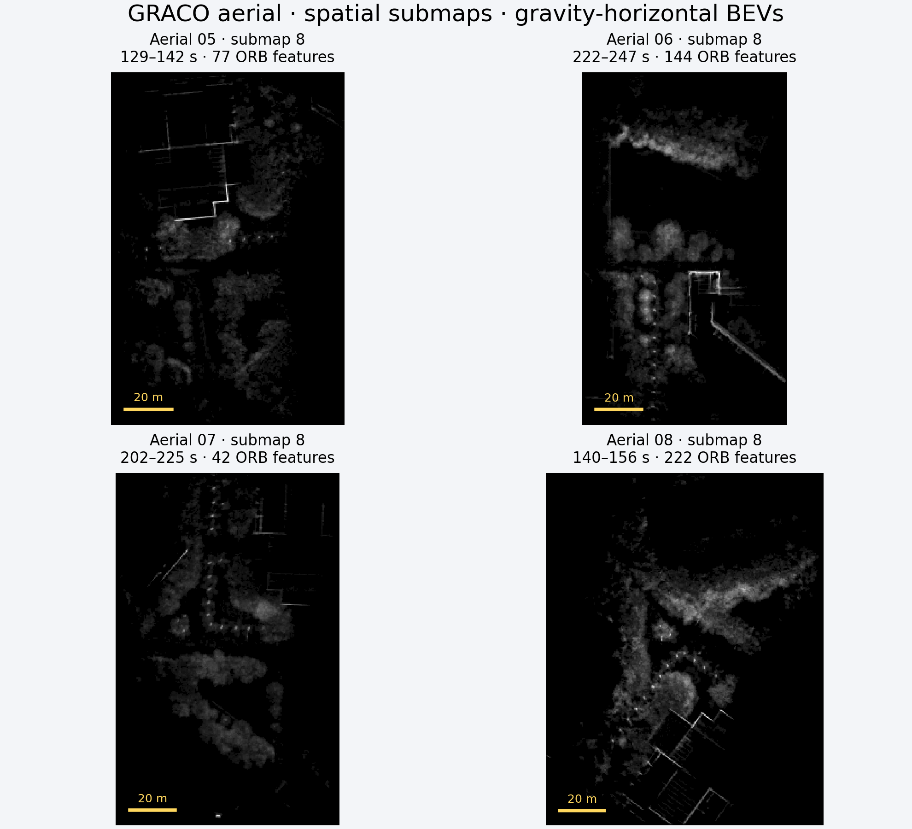

# GRACO aerial 05–08: spatial EllipseLIO → ellipsoid BEV → MapClosures → PCM/CBS

**Follow-up diagnostic:** [evidence downsampling caused false rejections](RESULTS-GRACO-SPATIAL-VERIFICATION-DIAGNOSTIC.md). The 16,000-point cap increased voxel size to roughly 1–1.9 m; retaining 0.4 m geometry makes 8/11 saved pairs pass the unchanged verifier. The historical result below is preserved; PCM/CBS has not been rerun with that correction.

Completed on workstation **148**, 2026-09-20. All four fresh 1× captures passed the frontend stability checks. **Raw ATE improved on three flights, but loop closure regressed: no loop passed geometric verification, and all four robots remain disconnected.** CBS completed with odometry factors only; it produced no trajectory correction or shared four-robot map.

| Flight | Temporal raw ATE | Spatial raw ATE | Spatial CBS ATE | Maximum successful LiDAR gap |
|---|---:|---:|---:|---:|
| aerial05 | 0.8601 m | **0.5121 m** | 0.5121 m | 0.1920 s |
| aerial06 | 3.5598 m | **2.6409 m** | 2.6409 m | 0.5360 s |
| aerial07 | 0.2034 m | 0.2172 m | 0.2172 m | 0.2140 s |
| aerial08 | 0.1668 m | **0.1129 m** | 0.1129 m | 0.1760 s |

All **12,177** native poses are finite and chronological, and every capture reached its processable sensor tail. Maximum speeds were **5.185 / 3.116 / 3.428 / 4.809 m/s**, below the 20 m/s gate. Aerial-06/08 now pass the one-second update-gap gate; their retained temporal gaps were **2.656 / 1.464 s**. All raw position ATEs are below 5 m, although aerial-06 remains substantially less accurate than the other flights.

ATE uses **evo 1.36.5**, nearest association within **50 ms**, rigid alignment and **no scale fitting**. All native samples matched ground truth. Each spatial robot forms a singleton component, so its CBS component fit and independent fit coincide. Ground truth was copied from the verified historical references only after backend completion and was used exclusively for evaluation.

The supplied spatial profile uses **40 m horizontal maximum displacement from the first member pose**, starts a successor at **20 m**, and applies a **120 s age guard**. A supported successor is required for handover. This is a trajectory-extent trigger, not a square tile or point-cloud crop. Calibration, requested IMU noise, reliable input, four-thread frontend launcher, MapClosures thresholds, geometric registration preprocessing, worker isolation, PCM and CBS/GICP settings were preserved. Four robots ran concurrently in a dedicated container with **no CPU, memory or GPU quotas**. The separate full-resolution deskew exporter remained disabled.

| Flight | Completed / excluded tail maps | Completed duration: min / median / max | Median BEV aspect ratio: temporal → spatial | Peak mapper RSS |
|---|---:|---:|---:|---:|
| aerial05 | 23 / 2 | 11.34 / 18.71 / 65.86 s | 1.83 → 1.49 | 638 MiB |
| aerial06 | 11 / 2 | 22.93 / 27.83 / 86.70 s | 1.93 → 1.51 | 1,011 MiB |
| aerial07 | 15 / 2 | 21.01 / 34.86 / 85.70 s | 1.94 → 1.34 | 883 MiB |
| aerial08 | 15 / 2 | 15.50 / 23.25 / 72.88 s | 1.81 → 1.29 | 751 MiB |

All **64 completed maps** closed by the radius criterion; eight partial tails were retained but excluded from retrieval. No age/capacity recovery occurred. Aerial-06 logged two waits for successor support. Most completed extents were 40.00–40.41 m, but **aerial-06/submap-7 reached 60.92 m**: it grew as a successor while the previous active map remained below its own handover threshold. It was promoted at 221.83 s with 60.49 m already accumulated, then closed at 222.17 s. Thus this implementation does not strictly cap every successor's extent at 40 m. Largest adjacent-pose translation steps at handover were 0.486 / 0.296 / 0.243 / 0.355 m, with no speed-gate violation; these include normal inter-scan motion and are not isolated jump measurements.

The BEVs are less narrow on average, with median bounding-box areas increasing from **12,423 / 11,820 / 11,982 / 12,763 m²** to **15,296 / 15,931 / 18,506 / 18,486 m²**. Bounding boxes include empty space and do not measure observed surface coverage. Every image uses the actual filter gravity saved at its anchor and reproduces its cached native ORB keypoints and descriptor bits exactly. Descriptor ellipsoids and registration evidence come from the same native processed member scans, expressed in the last member's IMU frame; these are not full-resolution raw clouds.

**Loop-closure outcome:** MapClosures supplied **11 geometric verification attempts**, seven inter-robot and four intra-robot. Eight failed the unchanged **0.35 m RMSE** limit, with measured RMSEs approximately **0.411–0.423 m**. Three failed the **0.30 overlap** requirement. No loop reached PCM, so PCM rejected **0 of 0**, and CBS instantiated **zero registration factors**. No threshold was relaxed and no parameter sweep was run. The retained gravity-horizontal temporal run accepted five loops, connected aerial-06/07, and achieved **2.4576 m** shared-component ATE. The spatial run has no comparable shared-component ATE because that component was not recovered.

The full capture-through-audit pipeline took **501.79 s (8 min 22 s)**. The distributed backend took **14.42 s**. Rendering and exact-feature verification of 64 BEVs took **27.30 s** afterward. Native processing averaged **17.6–19.0 ms per scan**, with 95th percentiles **34.8–36.7 ms**. These exclude asynchronous publication/writer work.

Validation on 148 passed **35 Python/integration tests and two native tests**. The experiment audit verified all 64 descriptor/evidence memberships, all **256 causal ranking events**, graph anchor timestamps, source/configuration immutability, and all **five Rerun recordings**. Geometry payloads, live recordings, trajectories, native telemetry, exports, evidence, source snapshots and hashes are retained.

This is one fresh spatial run compared with retained temporal captures, not a repeatability study. The temporal BEV baseline used an explicitly documented startup-gravity reconstruction; this run uses actual per-anchor filter gravity. Callback timing also changes native scan counts slightly. These differences limit causal attribution. The measured result supports better frontend continuity and broader BEV footprints on these flights, but does **not** support better multi-robot loop closure.

[Interactive gallery: all 64 BEVs](figures/graco-aerial-spatial148/bev-gallery/index.html) · [Numeric results](figures/graco-aerial-spatial148/full/report/report.json) · [Temporal comparison and handover data](figures/graco-aerial-spatial148/full/comparison.json) · [All verification attempts](figures/graco-aerial-spatial148/full/verification-attempts.csv) · [Trajectories and maps](figures/graco-aerial-spatial148/full/report/trajectories-maps.png) · [Verified Rerun recording](figures/graco-aerial-spatial148/full/report/result.rrd) · [Retention audit](figures/graco-aerial-spatial148/full/retention-audit.json) · [Retained-file hashes](figures/graco-aerial-spatial148/retained-files.json)

Complete remote artifacts remain at `/data3/mikexyl/swarm_s3e_ws/src/.ros2/graco-aerial-spatial148-20260920`. The local retained copy includes configuration/source snapshots, numerical results, trajectory/map exports, evo evidence, descriptors, native telemetry, the full gallery and derived Rerun recording; bulk per-submap NPZ geometry and four live Rerun captures remain on 148. Earlier experiments and the paused CU-Multi download were preserved.
