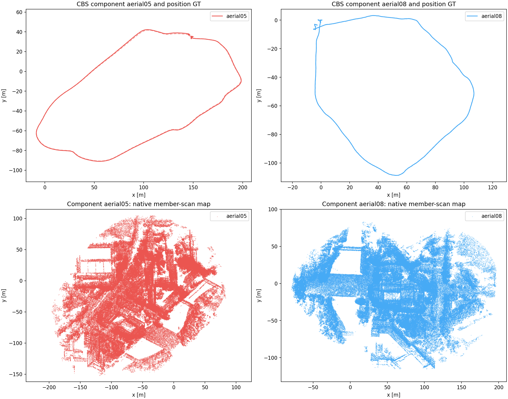

# GRACO aerial: two local temporal-submap runs

Completed locally on 2026-09-20 using **aerial-05-40m** and **aerial-08-25m** as
two robots. Both full-flight captures completed, followed by ellipsoid-BEV
MapClosures and the distributed PCM/CBS pipeline with GICP factors. The two
frontends ran concurrently at 1×, with four-thread native launchers.

**No inter-robot loop was accepted, so the flights remain two disconnected
components.** No joint two-robot map or joint ATE is reported. Aerial-08 also
failed the existing frontend stability criterion because of a 1.384-second gap
between successful LiDAR updates. The backend result is diagnostic: the original
failed gate remains recorded, and no estimator or backend thresholds were changed
to continue.

| Flight | Raw position ATE RMSE | CBS position ATE RMSE | Poses | Maximum successful-update gap | Frontend gate |
|---|---:|---:|---:|---:|---|
| aerial-05-40m | 0.8272 m | 0.8272 m | 2,778 | 0.132 s | Passed |
| aerial-08-25m | 0.2187 m | 0.0781 m | 2,610 | 1.384 s | Failed |

ATE uses **evo 1.36.5**, 50 ms association, rigid SE(3) alignment, and no scale
fitting. Raw trajectories are aligned independently; CBS uses one alignment per
connected component, which here also means independent fits. All reported poses
were associated with GT. GT was used only for evaluation after optimization.

The only accepted loop joins aerial-08 submaps 2 and 51. It reduced aerial-08's
ATE to 7.8 cm. PCM rejected zero loops, but with no inter-robot measurements its
inter-robot consistency checks and CBS belief exchange were not exercised by
accepted cross-robot constraints. Detection and backend execution took 12.22 s,
excluding descriptor preparation and evaluation.

The aerial-08 update gap occurred at the approximately 30-second handover from
active submap 4 to 5. Scans 286–297 had zero valid features and unsuccessful
LiDAR updates; scan 298 recovered with 58 features. LiDAR and IMU input continued
through the event. Both complete trajectories are finite and chronological;
maximum speeds were 5.47 and 4.57 m/s. This is a single fixed-configuration trial,
not a passing stability result for both robots or a reproducibility estimate.

## Configuration and verification

EllipseLIO uses the restored **temporal-only 10-second windows with 5-second
overlap**. The supplied aerial IMU–LiDAR calibration and IMU noise were used with
reliable ROS input and separate ROS domains. Original sensor timestamps and CDR
payloads were preserved. The local aerial-06 and aerial-07 bags contain stereo
and IMU without LiDAR, so this test used the two available LiDAR/IMU flights.

The 58 completed aerial-05 submaps and 54 completed aerial-08 submaps supplied
**112 descriptors and matching registration payloads**. Both use the same native
processed member scans; the evidence is not full-resolution raw geometry.
Four partial shutdown submaps were saved for inspection and excluded from
retrieval. Maximum correspondence ages were 9.976 and 9.988 seconds.

| Resource measurement | aerial-05 | aerial-08 |
|---|---:|---:|
| Mean scan processing | 19.15 ms | 20.74 ms |
| 95th-percentile scan processing | 32.32 ms | 34.47 ms |
| Peak mapper RSS | 482.38 MiB | 506.41 MiB |
| Descriptor preparation wall time | 21.82 s | 24.04 s |

The final audit verified exact descriptor/evidence membership, payload hashes,
anchor poses and timestamps, causal availability, same-robot exclusions, frozen
source hashes, and both live Rerun recordings plus the derived result recording.
It checked 112 descriptor/evidence memberships and 224 retrieval events.

## Retained outputs

- [Numeric results](figures/graco-aerial-temporal/report/report.json),
  [artifact audit](figures/graco-aerial-temporal/retention-audit.json), and
  [configuration](figures/graco-aerial-temporal/config.yaml).
- [Trajectory and map figure](figures/graco-aerial-temporal/report/trajectories-maps.png),
  [derived Rerun recording](figures/graco-aerial-temporal/report/result.rrd),
  [evo raw evidence](figures/graco-aerial-temporal/report/evo/raw/README.md), and
  [evo CBS evidence](figures/graco-aerial-temporal/report/evo/cbs/README.md).
- [Full generated report](figures/graco-aerial-temporal/REPORT.md) and
  [retained-file hashes](figures/graco-aerial-temporal/retained-files.json).

The complete local run remains at
`/home/mikexyl/workspaces/fast_livo2_ws/src/.ros2/graco-aerial-temporal-20260920`,
including native submaps, registration evidence, staged sensor bags, map arrays,
both live recordings, and logs. Bulk geometry has not been removed. The compact
research copy retains evaluation evidence, trajectories, configuration, hashes,
the figure, and the verified derived recording. No work was run on workstation
148 for this trial.
