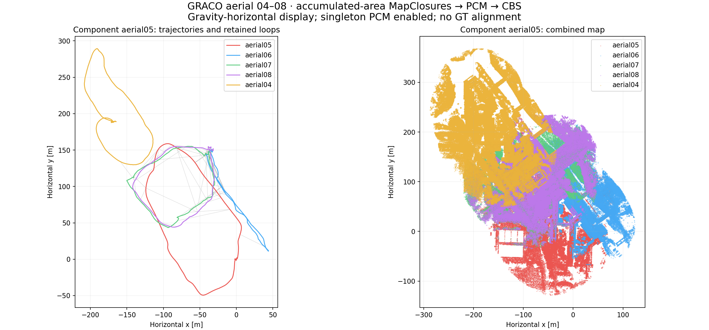
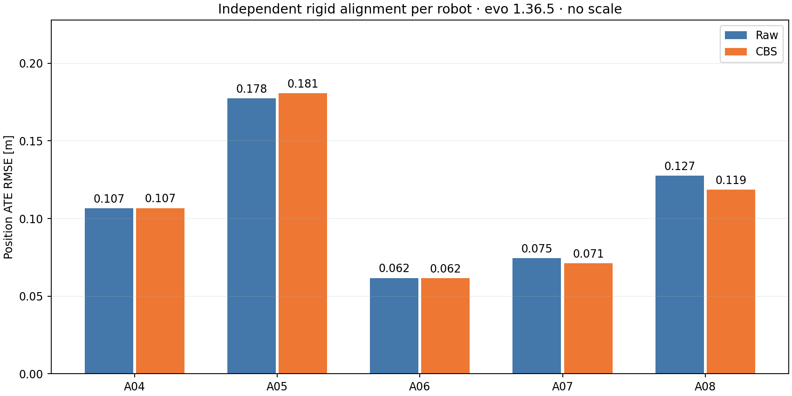

**GRACO aerial 04–08: PCM singleton acceptance — 21 September 2026**

**All five drones are connected.** A04 has **1 retained loop(s)**, including A04:22 ↔ A08:11. The candidate was retrieved and geometrically verified by the live distributed workers in this run; no diagnostic constraint was injected.

The verified five-flight captures and all 168 area descriptors/evidence payloads were reused byte-for-byte. Fresh workers ran retrieval, verification, PCM and CBS on workstation 148 without hardware quotas. Two settings changed: `dpgo.pcm.minimum_clique_size` **2 → 1**, and `loops.branch_verification_limits.mapclosures` **1 → 2**, allowing the previously skipped A04 candidate to reach verification. All geometric acceptance thresholds, calibration, odometry, evidence and CBS registration settings are unchanged.

Singleton loops still pass 3D registration, but cannot be checked against a second loop by PCM. Native PCM records such decisions as `singleton_unchecked`. This is an explicit acceptance policy, not a claim of pairwise confirmation. Candidate sets with multiple loops still undergo the existing consistency/clique procedure, with a one-vertex clique allowed.

The first attempt exposed an endpoint-order bug when A04 was appended after A08: native numeric robot order differed from Python name order. The bridge now converts PCM verdicts consistently, assigns registration ownership by native robot ID, and compares collected pairs independently of orientation. All 11 bridge/registration regression tests passed in the ROS environment, including an unsorted robot list. The failed attempt and its original frozen sources are preserved under `failed-endpoint-order`; the results below come from a fresh complete run with the fix.

| Flight | Raw ATE (m) | Previous CBS, individual (m) | New CBS, individual (m) | New CBS, shared alignment (m) |
|---|---:|---:|---:|---:|
| aerial04 | 0.1067 | 0.1067 | 0.1067 | 0.2395 |
| aerial05 | 0.1775 | 0.1776 | 0.1807 | 0.7661 |
| aerial06 | 0.0618 | 0.0616 | 0.0616 | 0.2427 |
| aerial07 | 0.0745 | 0.0713 | 0.0712 | 0.3280 |
| aerial08 | 0.1275 | 0.1193 | 0.1187 | 0.2613 |

evo 1.36.5 performs all trajectory association/alignment/ATE: 50 ms nearest timestamp association, rigid SE(3), scale fixed to one. Raw and individual CBS columns fit a separate transform for each flight; shared ATE uses one transform per component. Ground truth was accessed only after backend completion.

Component `aerial05` (aerial04, aerial05, aerial06, aerial07, aerial08): **0.4117 m** shared ATE.

The previous five-robot run had A04 separate and a four-robot A05–A08 component at 0.4381 m shared ATE. That four-robot metric is not directly comparable to a five-robot metric.

[Previous five-robot report](RESULTS-GRACO-AERIAL04-08.md).

| Retained robot pair | Loops |
|---|---:|
| aerial04 ↔ aerial08 | 1 |
| aerial05 ↔ aerial06 | 1 |
| aerial05 ↔ aerial07 | 16 |
| aerial05 ↔ aerial08 | 2 |
| aerial06 ↔ aerial07 | 23 |
| aerial06 ↔ aerial08 | 10 |
| aerial07 ↔ aerial08 | 18 |

Geometric verification accepted **71** proposals; PCM retained **71** and excluded **0**. Verification outcomes: `{"accepted": 71, "low_overlap": 3}`. Backend wall time: **234.73 s**; rerun through evaluation/audit: **304.32 s**, excluding original frontends and gallery/report generation.

A04 candidate ['aerial08', 11] → ['aerial04', 22]: **accepted**, overlap **0.5048**, residual RMSE **0.2996 m**.

The reused A04 capture completed with 2,760 native poses, zero unsuccessful LiDAR updates after initialization, maximum successful-update gap 0.120 s, mean/p95 native processing 5.02/9.64 ms, and 32 area snapshots. All five captures passed the sensor-only stability gate. A04 was converted from its original ROS1 bag to ROS2 with all 2,915 LiDAR and 36,431 IMU measurements and timestamps verified.

Odometry uses updated persistent-map EllipseLIO without submapping. MapClosures uses 80 m horizontal accumulated-area snapshots with no height or age cutoff, gravity-horizontal ellipsoid BEVs and geometric vertical initialization. Registration evidence consists of native processed map representatives, not full-resolution raw scans.

Validation: the native PCM regression suite passed, including default singleton rejection, explicit singleton acceptance, outlier selection, covariance, reversal and missing-evidence checks. This full five-robot run verifies actual distributed singleton handling. The audit checks unchanged raw trajectories, immutable descriptor/evidence hashes, causal retrieval, graph timestamps, historical outputs, frozen sources and Rerun recording integrity. All 168 gallery images and descriptors were rechecked against their saved hashes. The 100 configured settling iterations completed; this does not establish global optimality.

[BEV and retained-loop gallery](figures/graco-aerial-singleton148-20260921/full/bev-gallery/index.html) · [Rerun recording](figures/graco-aerial-singleton148-20260921/full/report/result.rrd) · [Numeric report](figures/graco-aerial-singleton148-20260921/full/report/report.json) · [A04 runtime verification](figures/graco-aerial-singleton148-20260921/full/diagnostics/aerial04-runtime-verification.json) · [PCM decisions](figures/graco-aerial-singleton148-20260921/full/dpgo/pcm.json) · [Audit](figures/graco-aerial-singleton148-20260921/full/retention-audit.json)

Full output on 148: `/data3/mikexyl/swarm_s3e_ws/src/.ros2/graco-aerial-singleton148-20260921/full`. Previous five-robot output: `/data3/mikexyl/swarm_s3e_ws/src/.ros2/graco-aerial-five148-20260921/full`. All bulk geometry remains retained.

[Verified local artifact manifest](figures/graco-aerial-singleton148-20260921/local-copy-verification.json).
