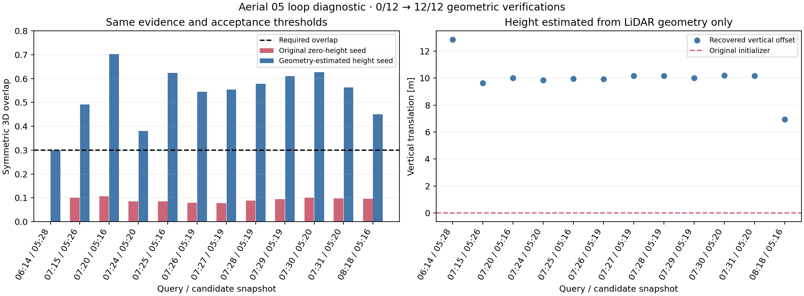

**GRACO aerial 05: missing vertical initialization — 21 September 2026**

The saved four-flight run produced 12 aerial-05 candidates that reached geometric verification; none passed. A geometry-only vertical initializer recovers all 12 under the same acceptance thresholds. This is an offline diagnostic using existing captures, not a new distributed PCM/CBS result.

The gravity-horizontal descriptor transform rotates each map into a level frame but deliberately retains zero translation. The MapClosures 2D initializer then supplies XY translation and yaw while leaving vertical translation zero. This is appropriate only as an incomplete initial guess; it cannot represent the flight-height difference. All twelve saved initial guesses have zero leveled vertical translation to numerical precision. The BEV pixel scale remains 0.5 m regardless of flight altitude. The 80 m area radius is horizontal, with no height cutoff; high flight altitude does not by itself exclude map points from the area.

Eleven original candidates failed final overlap (0.077–0.107 against the 0.30 threshold); the remaining candidate failed the initial-overlap gate (0.064 against 0.10). Therefore the original disconnection cannot be attributed solely to missing BEV retrieval.

The diagnostic fixes BEV XY/yaw, votes for vertical translation from horizontal-neighbor height differences, selects a height using symmetric coarse 3D overlap, then calls the existing GICP verifier. Height estimation uses 0.8 m voxels, eight XY neighbors within 1 m, 0.5 m height bins and five separated modal hypotheses plus zero. Verification still uses the original 0.4 m evidence/registration, 1.5 m correspondence distance, 0.6 m inlier distance, minimum overlap 0.30 and maximum RMSE 0.35 m. No flight-height labels, GNSS or ground truth enter estimation.

An exact-evidence replay reproduced all fourteen original verification results, including two accepted 06–07 control pairs. Both controls remain accepted. Original descriptors, odometry, graph and experiment results remain unchanged.

| Query | A05 snapshot | Original reason | New overlap | New RMSE (m) | Recovered vertical offset (m) |
|---|---:|---|---:|---:|---:|
| aerial06 / 14 | 28 | initial_low_overlap | 0.301 | 0.263 | 12.845 |
| aerial07 / 15 | 26 | low_overlap | 0.491 | 0.265 | 9.634 |
| aerial07 / 20 | 16 | low_overlap | 0.703 | 0.265 | 10.010 |
| aerial07 / 24 | 20 | low_overlap | 0.381 | 0.277 | 9.843 |
| aerial07 / 25 | 16 | low_overlap | 0.624 | 0.244 | 9.949 |
| aerial07 / 26 | 19 | low_overlap | 0.544 | 0.261 | 9.931 |
| aerial07 / 27 | 19 | low_overlap | 0.555 | 0.259 | 10.164 |
| aerial07 / 28 | 19 | low_overlap | 0.578 | 0.254 | 10.156 |
| aerial07 / 29 | 19 | low_overlap | 0.610 | 0.245 | 9.990 |
| aerial07 / 30 | 20 | low_overlap | 0.626 | 0.248 | 10.190 |
| aerial07 / 31 | 20 | low_overlap | 0.562 | 0.248 | 10.176 |
| aerial08 / 18 | 16 | low_overlap | 0.450 | 0.266 | 6.950 |

The ten 05–07 estimates imply odometry-frame alignments with maximum pairwise disagreements of 0.453 m and 0.267°. This consistency check uses odometry and registration only; it is not PCM.

Height difference is a demonstrated initialization problem in these candidates. Viewpoint and visible-surface differences can still affect retrieval and overlap, but there is enough shared geometry for these twelve verifications. The recovered offsets are about 7–13 m at the selected anchors; nominal 40 / 20 / 25 m flight labels should not be inserted as exact relative heights.

Post-hoc evaluation against independently GT-aligned raw trajectories finds approximately 0.91–1.11 m relative translation disagreement and 0.03–0.17° rotation disagreement. This reference is inferred from position-aligned odometry, not an exact six-DOF truth measurement. The consistent cross-flight translation discrepancy needs to remain visible in the eventual shared-component ATE; geometric verification success does not guarantee improved shared accuracy. This evaluation was not fed back into the height estimator.

The recommended next change is a gravity-constrained vertical initializer between BEV matching and GICP, followed by the unchanged distributed PCM/CBS pipeline using the existing captures. Keep the geometric gates, require pairwise consistency, and assess the final shared ATE. No frontend replay is needed.

[Exact-evidence numeric results](figures/upstream-area-graco-aerial148-20260921/a5-height-diagnostic/exact-evidence/summary.json) · [Diagnostic source](figures/upstream-area-graco-aerial148-20260921/a5-height-diagnostic/diagnose_exact.py) · [Post-hoc reference check](figures/upstream-area-graco-aerial148-20260921/a5-height-diagnostic/exact-evidence/posthoc-reference-check.json)

[Gravity-frame implementation](s3e_pipeline/gravity_bev.py) · [BEV initializer](adapters/mapclosures/adapter.cpp) · [Original four-flight report](RESULTS-UPSTREAM-AREA-GRACO-AERIAL.md)

The upstream [MapClosures paper](https://www.ipb.uni-bonn.de/pdfs/gupta2024icra.pdf) describes the planar pose supplied by density-map alignment; our gravity-only frame alignment does not supply the missing terrain-height translation.
