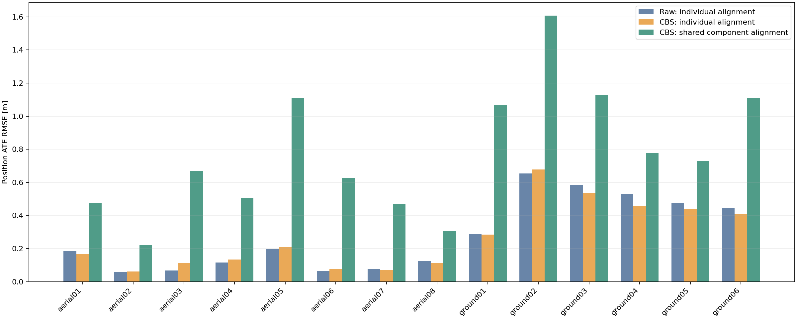
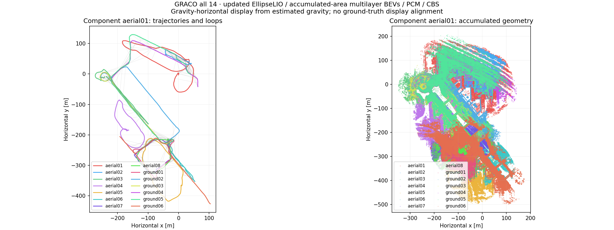

# GRACO all 14: multilayer accumulated-area EllipseLIO / MapClosures / PCM / CBS

Completed on workstation 148 on 22 September 2026, without CPU, memory, or GPU quotas. All **8 aerial and 6 ground** sequences received fresh full-length 1× captures. Updated EllipseLIO used persistent-map odometry; accumulated-area snapshots supplied multilayer ellipsoid BEVs and matching geometry to the distributed backend.

**All 14 robots connected in one component. Shared-alignment position ATE: 0.861 m.** The graph contains **541 retained loops**, including **243 aerial–ground** loops; PCM rejected 0. CBS used 540 additional registration factors. Backend wall time: 26.47 minutes.

[Interactive report](figures/graco-all14-multilayer148-20260922/full/index.html) · [All 504 BEVs](figures/graco-all14-multilayer148-20260922/full/gallery/index.html) · [Gravity-level Rerun](figures/graco-all14-multilayer148-20260922/full/report/result-gravity.rrd) · [Full report](figures/graco-all14-multilayer148-20260922/full/REPORT.md)

| Robot | Raw ATE [m] | CBS individual ATE [m] | CBS shared ATE [m] |
|---|---:|---:|---:|
| aerial01 | 0.185 | 0.168 | 0.475 |
| aerial02 | 0.060 | 0.063 | 0.221 |
| aerial03 | 0.068 | 0.111 | 0.667 |
| aerial04 | 0.116 | 0.135 | 0.507 |
| aerial05 | 0.196 | 0.208 | 1.109 |
| aerial06 | 0.063 | 0.076 | 0.628 |
| aerial07 | 0.076 | 0.071 | 0.472 |
| aerial08 | 0.124 | 0.112 | 0.305 |
| ground01 | 0.288 | 0.285 | 1.065 |
| ground02 | 0.655 | 0.677 | 1.608 |
| ground03 | 0.586 | 0.536 | 1.128 |
| ground04 | 0.532 | 0.460 | 0.777 |
| ground05 | 0.477 | 0.439 | 0.729 |
| ground06 | 0.448 | 0.409 | 1.111 |

ATE is evaluated entirely with evo 1.36.5, 50 ms association, rigid alignment, and no scale fitting. Shared ATE uses one rigid fit across all 14 trajectories. Ground truth entered only after optimization. Individually aligned ATE improved for 8 robots and worsened for 6; this is not uniform improvement over raw odometry.

Aerial 04 connects through 16 retained loops: 8 to aerial 03, 6 to aerial 05, and one each to aerial 07 and 08. All 541 retained loop transforms were evaluated afterward: translation error median 0.866 m, p95 2.288 m, maximum 2.960 m. These errors did not affect acceptance.

There were 658 geometric verification attempts: 541 accepted, 116 rejected for low overlap, and one for high RMSE. One accepted pose constraint did not get an extra CBS registration factor because the separately preprocessed CBS geometry had 0.2976 overlap against its 0.30 gate.

All frontends passed the stability checks. The largest successful-update gap was 0.337 s, and the largest speed was 5.315 m/s. Native per-scan timing, failed-update counts, memory, communication bytes and CBS settling statistics are in the full report. All 14 live recordings, the native-frame result recording, and the gravity-level result recording verified. All 504 gallery images reproduce the saved ORB features; descriptor/evidence membership, causal availability, anchors, source hashes, calibration hashes and sensor hashes verified. The 47 regression cases and separate 14-worker synthetic preflight passed.

This batch has no matched full-height BEV control, so it does not isolate the benefit of layering. Loop counts refer to submap pairs, not independent places; overlapping area snapshots reuse geometry. The low-surface plane can represent a roof or another level when terrain is not visible.

[Reference papers and implementation distinctions](MULTILAYER-BEV-REFERENCES.md).

Bulk frontend captures and native submap geometry remain on 148 at `/data3/mikexyl/swarm_s3e_ws/src/.ros2/graco-all14-multilayer148-20260922/full`. Portable reports, trajectories, map exports, backend records, source snapshots, and the BEV gallery are retained alongside this document. Previous experiments and the paused CU-Multi download were preserved.
