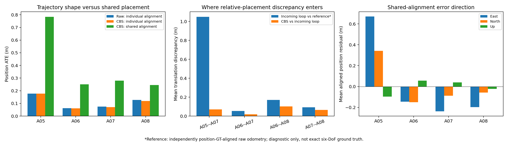

**GRACO A05–A08: why shared CBS ATE is higher — 21 September 2026**

The dominant error is A05's placement relative to the other flights. It is already present in the incoming A05–A07 loop measurements. These checks found no CBS solver or endpoint-frame error explaining the increase. They do not establish the underlying cause of the disagreement between A05's registered map and the trajectory reference.

The raw and shared-CBS columns use different alignment protocols. Independent alignment measures each trajectory's accuracy after removing its own rigid frame offset. Shared alignment additionally measures whether the robots are correctly placed relative to one another. The latter discrepancy remains a real limitation of this four-robot result.

| Flight | Raw, independent alignment (m) | CBS, independent alignment (m) | CBS, shared alignment (m) | Raw-to-CBS shape change RMS (m) |
|---|---:|---:|---:|---:|
| A05 | 0.17750 | 0.17763 | 0.78443 | 0.01740 |
| A06 | 0.06176 | 0.06160 | 0.25118 | 0.01208 |
| A07 | 0.07455 | 0.07107 | 0.27943 | 0.00964 |
| A08 | 0.12747 | 0.11930 | 0.24521 | 0.02914 |

All trajectory metrics use evo 1.36.5, rigid alignment and no scale fit. Saved matched trajectories retain the original 50 ms association. Shape change is evo position APE with the raw trajectory as reference and one rigid alignment of CBS to raw; it is a change diagnostic, not ground-truth accuracy.

Using the **same optimized output**, a shared alignment restricted to A06–A08 gives **0.09522 m** ATE, compared with **0.10234 m** for the previous three-robot component. All four together give **0.43781 m**. This subset check changes evaluation alignment only; it does not remove edges or rerun optimization.

The following diagnostics compare all 51 retained loop measurements with both the optimized relative poses and a reference constructed by independently aligning each raw trajectory to GT positions:

| Pair | Loops | Mean incoming-loop translation discrepancy against reference (m) | Mean CBS deviation from incoming loop (m) |
|---|---:|---:|---:|
| A05–A07 | 10 | 1.04981 | 0.07089 |
| A06–A07 | 23 | 0.05444 | 0.01887 |
| A06–A08 | 3 | 0.17046 | 0.10148 |
| A07–A08 | 15 | 0.09341 | 0.06417 |

The ten A05–A07 discrepancies span **0.923–1.117 m**. Their mean implied A07 anchor-position error in ENU is **[−0.921, −0.453, +0.215] m**: predominantly horizontal. The remaining shared error therefore cannot be attributed simply to a missing vertical initialization. CBS follows these measurements closely, preserving each flight's trajectory shape. A common systematic error can survive PCM's consistency test; these ten loops also reuse just four A05 area snapshots.

**Reference limitation:** the loop diagnostic uses raw odometry orientations after position-only GT alignment. It is not exact six-DoF relative-pose ground truth. It localizes the discrepancy before CBS but does not, by itself, distinguish registration bias, map distortion, sensor calibration, or reference error. No GT-derived correction was supplied to estimation.

Additional checks:

- All 51 canonical loop transforms match the verifier output, including endpoint inversion, to a maximum matrix difference of **1.42 × 10⁻¹⁴**.
- Four pairs of consecutive snapshots, one per robot, contain **602,139** shared persistent point IDs. Reconstructing their world coordinates from each anchor gives at most **0.0000262 m** disagreement. Point scan provenance agrees. This checks the sampled export frames directly.
- For the four sampled snapshots, every prepared evidence point exactly matches a native exported point. The stored `scan` and `cloud` arrays are identical accumulated-area geometry; they are not independent raw scans.
- For A05:16 ↔ A07:20, static symmetric overlap at 0.6 m is **0.703** at the registered loop pose versus **0.570** at the diagnostic reference pose. Truncated symmetric nearest-neighbor RMS is **0.668 m** versus **0.764 m**. The available clouds themselves favor the registered placement. Three representative non-A05 controls have much smaller differences. This is a geometric residual check at two fixed poses, not a new optimizer run.
- At iteration 100, each worker's last pose-change norm is below **4 × 10⁻¹⁴** and residual change below **1.2 × 10⁻¹⁵**. These are stable final local iterates; they do not prove global optimality.

The supplied, hash-verified `groundtruth.yaml` explicitly identifies `/gnss/ground_truth` as `T_Base_Imu`, from the RTK base-station ENU frame to the vehicle IMU. Our exporter copies that pose directly. The [official dataset documentation](https://sites.google.com/view/graco-dataset/download) also specifies ENU positions with the RTK base station as origin. There is currently no evidence justifying an antenna lever-arm correction or blaming a different origin between flights.

The next diagnostic target is A05's map geometry and registration against independent scan evidence, including calibration and timing. The recovered connection should be described as geometrically accepted and PCM-consistent, with a remaining roughly one-metre cross-flight discrepancy against the trajectory reference. No production settings or experiment outputs were changed during this investigation.

[Numerical analysis and input hashes](figures/graco-cbs-diagnostic-20260921/analysis.json) · [Geometry/frame checks and hashes](figures/graco-cbs-diagnostic-20260921/geometry-checks.json) · [Reproducible evo analysis](figures/graco-cbs-diagnostic-20260921/analyze.py) · [Geometry audit script](figures/graco-cbs-diagnostic-20260921/check_geometry.py) · [Full runtime report](RESULTS-UPSTREAM-AREA-GRACO-AERIAL.md)
