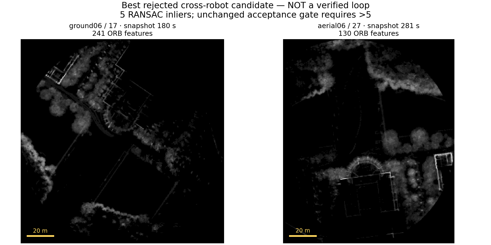
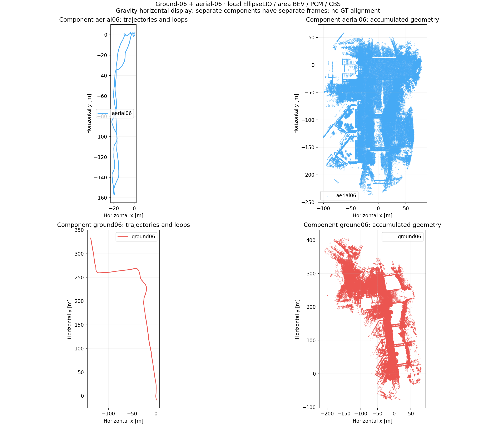
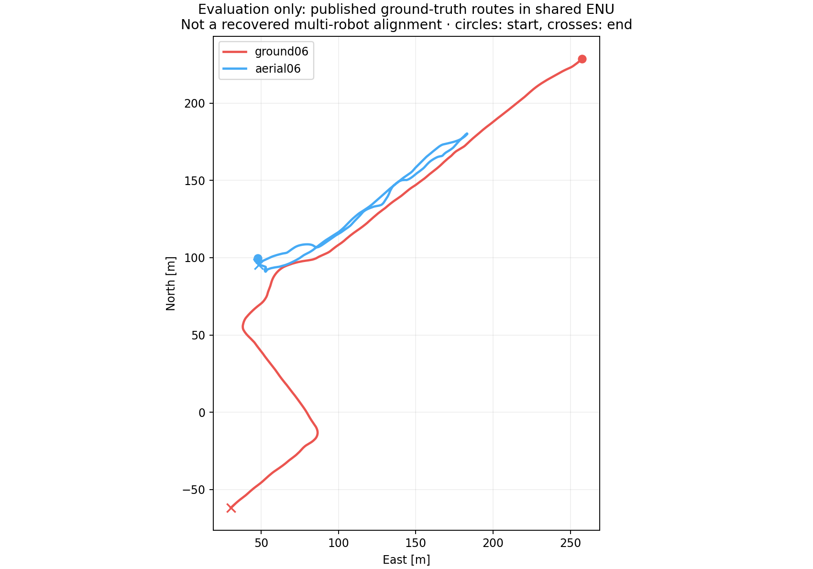

**GRACO ground-06 + aerial-06 (20 m): local ground–aerial experiment — 21 September 2026**

**The two robots remained disconnected.**

The complete local run retained **0 loops** from **0 geometrically accepted proposals**; PCM rejected **0**. Both full 1× frontend replays passed the sensor-only stability gate.

The failure occurred at **BEV retrieval**: 315 cross-robot candidate entries, maximum 5 RANSAC inliers, with the unchanged gate requiring **strictly more than 5**. **0 candidates reached geometric verification**. Consequently, the runtime vertical initializer and inter-robot registration factors were not exercised. This run does not test whether they could align a correct ground–aerial candidate.

The pair was selected from the official published route diagrams: both traverse the northeastern street, and aerial-06 has nominal 20 m altitude. This is a visual route-based choice, not an exhaustive overlap ranking. Numerical ground-truth trajectories were not consulted for selection, initialization, retrieval, verification or optimization.

[Official ground routes](https://github.com/SYSU-RoboticsLab/GrAco/blob/main/doc/sequence-ground.png) · [Official aerial routes](https://github.com/SYSU-RoboticsLab/GrAco/blob/main/doc/sequence-aerial.png)

Both bags were already ROS2. Sensor staging preserved the native LiDAR/IMU payloads and all record/header/point timestamps. Ground and aerial extrinsics and all four IMU noise values came from their respective supplied calibration files. The two frontends ran concurrently on this laptop; workstation 148 was not used.

| Robot | Raw ATE (m) | Individual CBS ATE (m) | Component-aligned CBS ATE (m) | Component |
|---|---:|---:|---:|---|
| ground06 | 0.4344 | 0.4344 | 0.4344 | ground06 |
| aerial06 | 0.0624 | 0.0624 | 0.0624 | aerial06 |

Component `aerial06` (aerial06): **0.0624 m** ATE.

Component `ground06` (ground06): **0.4344 m** ATE.

All ATE computation uses evo 1.36.5 with 50 ms association, rigid SE(3) alignment and no scale fitting. **There is no recovered shared ground–aerial alignment or joint ATE in this disconnected result.** Each row is aligned independently. CBS changes only the arbitrary frame with no accepted loops; its individual ATE is unchanged. Ground-truth files were read after the backend finished.

| Robot | Native poses | Failed updates after initialization | Largest successful-update gap (s) | Mean / p95 processing (ms) | Peak mapper RSS (MiB) | Area snapshots |
|---|---:|---:|---:|---:|---:|---:|
| ground06 | 2903 | 0 | 0.120 | 22.70 / 35.07 | 1341.7 | 31 |
| aerial06 | 3092 | 1 | 0.200 | 14.01 / 25.84 | 1002.2 | 33 |

Inter-robot retrieval returned 315 candidate entries, of which 0 were eligible. Verification outcomes: `{}`. Backend time: **15.02 s**.

The estimator is updated upstream EllipseLIO with persistent-map odometry and the tested octree storage fix. MapClosures uses 80 m horizontal accumulated-area snapshots with all historical in-area points, no height cutoff, 20 m/10 s snapshot triggers, and gravity-horizontal ellipsoid BEVs. Vertical translation is initialized from geometry. Evidence consists of processed native map representatives, not full-resolution raw scans.

Geometric thresholds match the five-drone singleton experiment: 0.4 m evidence voxels, 1.5 m correspondence distance, 0.6 m inlier distance, minimum symmetric overlap 0.30, maximum inlier RMSE 0.35 m, and unchanged observability checks. Two MapClosures candidates per query may reach verification. PCM minimum clique size is one; isolated accepted loops are labelled `singleton_unchecked` and have no pairwise consistency confirmation. Distributed robot isolation and live GICP registration factors remain enabled.

The local build passed all three native tests, 19 Python regression tests and the native PCM suite. CUDA surface sampling was compiled for the RTX 4070 (sm_89) to avoid a compiler/driver PTX mismatch. Earlier preflight failures are retained; neither started a dataset replay. The final audit verifies frozen sources, sensor bag hashes, descriptor/evidence membership, causal availability, graph anchors, and live/derived Rerun recordings.

Post-run ground-truth evaluation confirms route proximity: minimum horizontal path distance **0.67 m**; **100.0%** of aerial trajectory samples lie within 20 m horizontally of the ground route. This is a trajectory-only overlap check, not evidence of common LiDAR surfaces, and it was not used by retrieval or optimization.

[BEV gallery](figures/graco-ground-aerial-local-20260921/full/bev-gallery/index.html) · [Rerun recording](figures/graco-ground-aerial-local-20260921/full/report/result.rrd) · [Numeric report](figures/graco-ground-aerial-local-20260921/full/report/report.json) · [Verification events](figures/graco-ground-aerial-local-20260921/full/diagnostics/verification-events.json) · [Audit](figures/graco-ground-aerial-local-20260921/full/retention-audit.json)

Full local output: `/home/mikexyl/workspaces/fast_livo2_ws/src/.ros2/graco-ground-aerial-local-20260921/source/output`. All original data and bulk geometry are retained.
