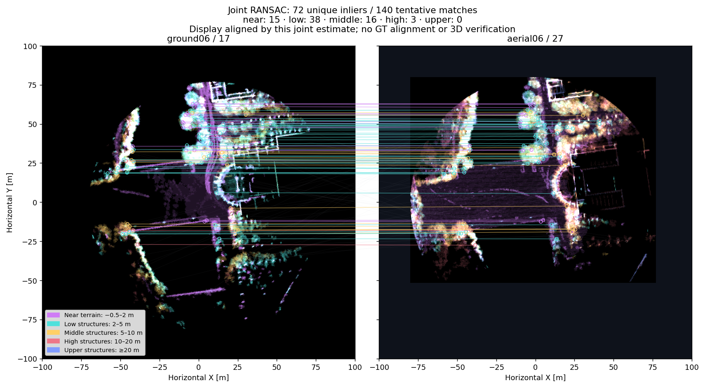
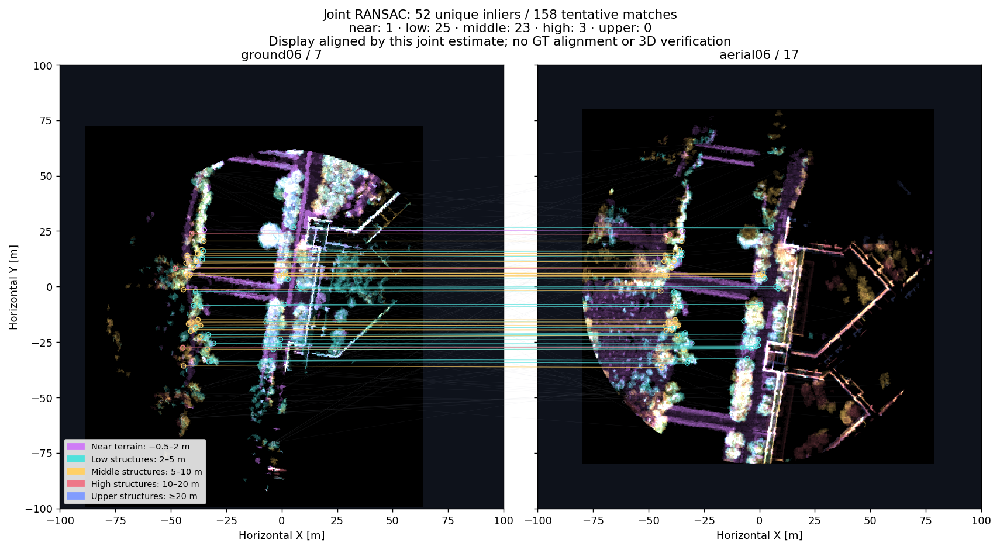

# Joint multilayer ellipsoid BEV matching: local GRACO ground06–aerial06

21 September 2026. Offline visual checkpoint on the laptop; workstation 148 was not used. The updated EllipseLIO odometry captures and all original experiment outputs are preserved. No bag replay, 3D registration, PCM, or CBS was run.

**Pooling height-layer matches produced more usable planar candidates in this fixed sample, but did not consistently improve individual pose accuracy.** All 16 joint fits passing the unchanged >5 gate were within 2.83 m horizontal translation and 1.55° yaw error in subsequent GT-only evaluation. None of the ten conservative non-overlap pairs passed the joint gate. These are preliminary 2D findings, not verified loops or an exhaustive retrieval result.

## Method and comparison

Each submap is independently sliced relative to its estimated terrain into −0.5–2, 2–5, 5–10, 10–20, and ≥20 m bands. Native ellipsoid sampling, gravity alignment, density images, ORB, self-pruning, and Hamming matching remain unchanged. Terrain estimation uses geometry only. Full-height cached ORB features were exactly reproduced.

Same-height tentative matches are combined before consensus; individual-layer RANSAC inlier lists are not added together. The full-height image is excluded from this pool. Native keypoint coordinates already contain the image-crop origin and are converted to metric coordinates. A new rigid SE(2) estimator balances sample draws across layers, rejects duplicate endpoint pairs and many-to-one support within 0.5 m, and recomputes support after refinement. It fits no scale. The residual tolerance remains strictly <1.5 m and acceptance remains strictly >5 unique inliers.

Every individual-layer and full-height control uses the same new consensus fitter and uniqueness rule. Original native fits remain in the diagnostics. The new fitter is not a bitwise reproduction of native MapClosures RANSAC. In particular, uniqueness and final support recounting mean these counts should not be compared directly to the earlier 46/29 native per-layer counts.

## Results

| Method | Pairs passing >5 | Passing poses within 5 m / 5° | Conservative non-overlap pairs passing |
|---|---:|---:|---:|
| Full height | 3/48 | 2/3 | 0/10 |
| 2–5 m only | 14/48 | 14/14 | 0/10 |
| 5–10 m only | 12/48 | 11/12 | 1/10 |
| Joint height layers | **16/48** | **16/16** | **0/10** |

The full-height control also produced one inaccurate planar fit whose footprints could overlap. The middle layer alone passed one clearly separated pair; the joint fit rejected that pair. Ten negatives are a small, correlated sample and do not establish a general false-positive rate. Possible footprint overlap is not treated as proof of common observed surfaces.

| Illustrated pair | Full inliers | 2–5 m inliers | Joint inliers | Joint XY / yaw error |
|---|---:|---:|---:|---|
| A06:27 ↔ G06:17 | 7 | 40 | **72** | 0.576 m / 0.783° |
| A06:17 ↔ G06:7 | 6 | 25 | **52** | 1.216 m / 1.045° |

For comparison, full-height XY errors are 0.335 m and 1.242 m, respectively. The first pair gains support but its point estimate becomes slightly less accurate. Joint support spans 49/53 occupied 5 m cells (query/candidate) on the first pair and 36/34 cells on the second. Repeats with random seeds 0, 1, and 2 return identical joint poses and support counts on both illustrated pairs.

## Protocol, verification, and limits

- Pair set fixed before matching: aerial IDs 7, 12, 17, 22, 27, 32 against ground IDs 0, 5, 7, 12, 17, 22, 27, 30; all 48 Cartesian-product pairs included.
- Matching and terrain construction never access GT. Only a separate evaluation process reads RTK/INS after matching results are frozen. Conservative negatives have horizontal GT anchor separation >180 m (two 80 m area radii plus 20 m margin). Relative pose interpolation requires a ≤50 ms bracket. These are planar seed errors, not trajectory ATE.
- Native fits and tentative correspondences, unique pooled constraints, final inlier membership, per-layer support, spatial spread, seed repeats, images, descriptors and source/input hashes are retained.
- Fixed matching/cache/figure run completed in 55.50 s. This is offline preview wall time, not per-scan processing time or full-pipeline runtime.
- Six joint-consensus numerical tests cover recovered poses amid a large bad layer, inverse endpoints, duplicate layers, many-to-one constraints, strict residual/gate boundaries, non-finite/empty inputs, proper rotation, and final support recounting. Three existing height-slicing tests also pass.
- Image colors identify height bands. Each comparison is displayed using its own joint pose, never GT; aligned-looking images are not independent validation.

The next step is to feed these candidate poses into the existing vertical initialization and unchanged 3D verification, then inspect accepted/rejected geometry. CBS should receive only verified constraints. That step has not been run at this visual checkpoint.

[Interactive match gallery](figures/graco-ground-aerial-local-20260921/joint-multilayer-preview/index.html) · [Complete evaluation](figures/graco-ground-aerial-local-20260921/joint-multilayer-preview/evaluation-report.md) · [Reference papers and deviations](MULTILAYER-BEV-REFERENCES.md)

