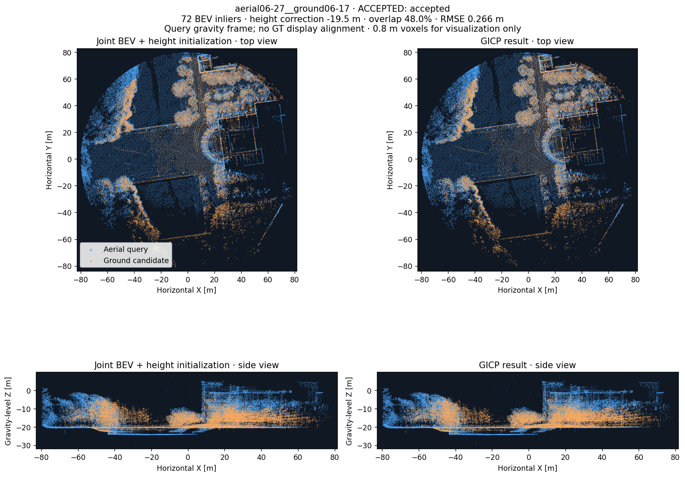
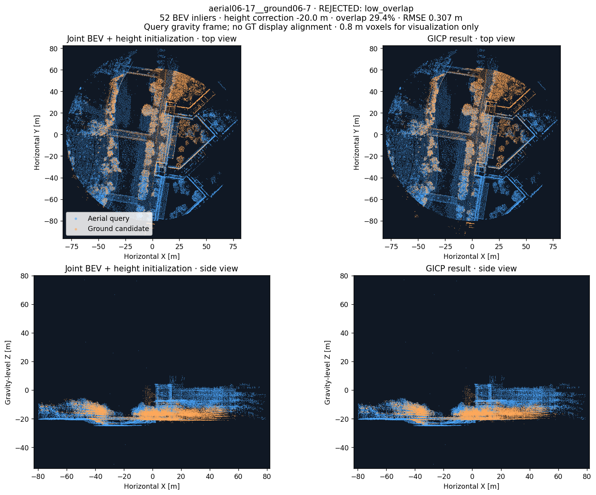

# Joint multilayer BEV → height initialization → 3D verification

21 September 2026 · local laptop · GRACO ground06 and aerial06. **Five of the 16 joint-RANSAC candidates pass the existing 3D verifier. Eleven are rejected for low overlap.** No thresholds were changed. No PCM or CBS was run, and these results have not been inserted into a graph.

## Results

| Pair | BEV inliers | Height correction [m] | Symmetric overlap | RMSE [m] | 3D position error [m] | Rotation error [deg] | Decision |
|---|---:|---:|---:|---:|---:|---:|---|
| aerial06-7__ground06-12 | 11 | -20.0 | 22.4% | 0.304 | 1.441 | 0.656 | low_overlap |
| aerial06-7__ground06-17 | 49 | -21.0 | 52.2% | 0.292 | 0.617 | 0.724 | accepted |
| aerial06-12__ground06-7 | 14 | -20.0 | 11.0% | 0.326 | 1.072 | 1.315 | low_overlap |
| aerial06-12__ground06-12 | 67 | -20.0 | 38.6% | 0.295 | 0.569 | 1.176 | accepted |
| aerial06-12__ground06-17 | 13 | -21.5 | 19.0% | 0.287 | 1.724 | 0.954 | low_overlap |
| aerial06-17__ground06-5 | 22 | -20.0 | 18.7% | 0.328 | 0.199 | 1.389 | low_overlap |
| aerial06-17__ground06-7 | 52 | -20.0 | 29.4% | 0.307 | 1.077 | 1.353 | low_overlap |
| aerial06-17__ground06-12 | 37 | -20.0 | 24.0% | 0.291 | 2.890 | 1.094 | low_overlap |
| aerial06-22__ground06-7 | 16 | -20.0 | 10.7% | 0.276 | 1.293 | 1.399 | low_overlap |
| aerial06-22__ground06-12 | 83 | -20.0 | 32.8% | 0.269 | 1.263 | 1.222 | accepted |
| aerial06-22__ground06-17 | 41 | -20.0 | 25.9% | 0.277 | 2.632 | 1.274 | low_overlap |
| aerial06-27__ground06-12 | 20 | -19.5 | 19.8% | 0.254 | 1.636 | 1.120 | low_overlap |
| aerial06-27__ground06-17 | 72 | -19.5 | 48.0% | 0.266 | 1.062 | 1.067 | accepted |
| aerial06-32__ground06-12 | 18 | +0.5 | 18.4% | 0.251 | 1.408 | 1.075 | low_overlap |
| aerial06-32__ground06-17 | 62 | +0.5 | 46.5% | 0.264 | 1.117 | 1.001 | accepted |
| aerial06-32__ground06-22 | 6 | +0.0 | 14.4% | 0.293 | 1.840 | 0.915 | low_overlap |

All 16 GICP runs converged. The minimum-overlap check determines all 11 rejections. The accepted results have 0.569–1.263 m relative 3D translation error (median 1.062 m) and 0.724–1.222° rotation error against RTK/INS. These are relative-transform diagnostics, not trajectory ATE. A low point-cloud RMSE is not the same as a small global pose error.

For the illustrated A06:27 ↔ G06:17 pair, 72 BEV inliers lead to a −19.5 m geometric height correction, 48.0% final symmetric overlap, and 0.266 m RMSE. Its horizontal error is 0.244 m, but the vertical component is −1.034 m, giving 1.062 m total translation error. Three accepted pairs retain vertical errors of about 1.0–1.24 m. Their source is not established by this diagnostic; acceptance does not prove precise inter-robot alignment.

## Why candidates were rejected

In every pair, the aerial-to-ground coverage fraction is lower than ground-to-aerial coverage. The verifier uses the minimum of these two fractions. For A06:17 ↔ G06:7, 52.86% of the ground points are near aerial points, but only 29.38% of the aerial points are near ground points. The pair is therefore rejected against the unchanged 30% requirement despite 52 BEV inliers and 0.307 m RMSE.

This coverage asymmetry is consistent with the different observed surfaces and spatial coverage visible in the plots. It does not isolate height as the only cause. We did not crop the clouds to favorable height bands or alter the overlap denominator to make candidates pass.

| Pair | Ground → aerial overlap | Aerial → ground overlap | Symmetric overlap | Decision |
|---|---:|---:|---:|---|
| aerial06-7__ground06-12 | 27.24% | 22.37% | 22.37% | low_overlap |
| aerial06-7__ground06-17 | 62.55% | 52.16% | 52.16% | accepted |
| aerial06-12__ground06-7 | 16.12% | 10.97% | 10.97% | low_overlap |
| aerial06-12__ground06-12 | 68.00% | 38.61% | 38.61% | accepted |
| aerial06-12__ground06-17 | 27.48% | 18.95% | 18.95% | low_overlap |
| aerial06-17__ground06-5 | 32.66% | 18.72% | 18.72% | low_overlap |
| aerial06-17__ground06-7 | 52.86% | 29.38% | 29.38% | low_overlap |
| aerial06-17__ground06-12 | 49.03% | 23.97% | 23.97% | low_overlap |
| aerial06-22__ground06-7 | 22.52% | 10.66% | 10.66% | low_overlap |
| aerial06-22__ground06-12 | 85.04% | 32.75% | 32.75% | accepted |
| aerial06-22__ground06-17 | 62.87% | 25.91% | 25.91% | low_overlap |
| aerial06-27__ground06-12 | 29.87% | 19.85% | 19.85% | low_overlap |
| aerial06-27__ground06-17 | 78.47% | 48.02% | 48.02% | accepted |
| aerial06-32__ground06-12 | 28.63% | 18.43% | 18.43% | low_overlap |
| aerial06-32__ground06-17 | 78.45% | 46.48% | 46.48% | accepted |
| aerial06-32__ground06-22 | 30.88% | 14.45% | 14.45% | low_overlap |

## Preserved settings and frame handling

- All 16 candidates were selected exclusively from the frozen joint >5-inlier gate. The 32 pairs that failed that gate were not sent to registration. No GT-based filtering was used.
- The proper SE(2) fit is lifted with `T_query_IMU_candidate_IMU = inverse(G_query) @ T_query_level_candidate_level @ G_candidate`. Level-frame Z starts at zero; the existing geometry-only height initializer supplies the missing offset. Endpoints and inverse transforms are covered by tests.
- Registration evidence is the native processed map-point geometry from the same accumulated-area snapshots used for the descriptors. It is not full-resolution raw LiDAR. All heights are included. Evidence and GICP use fixed 0.4 m voxels without range/point-count cropping.
- Height initialization retains the existing 0.8 m internal sampling, 1 m XY-neighbor radius, 0.5 m height-vote bins, five separated modes, and symmetric coarse-overlap scoring.
- GICP retains a 1.5 m correspondence radius, 40 maximum iterations, 0.6 m inlier radius, at least 100 inliers, at least 30% symmetric overlap, RMSE ≤0.35 m, minimum observability 1e-4 and maximum condition number 1e6. Convergence is required. Code hashes match the original local run.
- Vertical correction is relative to the snapshot anchor. Aerial snapshot 32 needs about +0.5 m rather than −20 m; the algorithm uses the actual saved geometry and has no fixed flight-height prior.
- GT is accessed only by the separate evaluator after registration is frozen. Pose interpolation requires a ≤50 ms bracket. GT never supplies a seed, a candidate selection rule, an acceptance decision, or a visualization alignment.

## Verification and retained artifacts

Fourteen numerical tests passed for frame conversion and the existing height initializer. An independent nearest-neighbor audit exactly reproduced all 16 initial overlaps, final forward/reverse overlaps, inlier counts, and RMSEs. Original inputs and source hashes are retained. The matching results and original experiment are unchanged.

Verification completed in 113.43 s: about 15.89 s for height initialization and 94.75 s for refinement, plus loading and export. This is offline batch time on the laptop, not per-scan odometry processing time.

The 16 before/after figures and interactive Rerun recording display 0.8 m visualization voxels; verification used the fixed 0.4 m evidence. The recording contains all accepted and rejected pairs and passes `rerun rrd verify`. No graph update, PCM, CBS, new odometry replay, or resource use on workstation 148 occurred.

[Interactive gallery](figures/graco-ground-aerial-local-20260921/joint-multilayer-registration/index.html) · [Interactive 3D Rerun recording](figures/graco-ground-aerial-local-20260921/joint-multilayer-registration/verification.rrd) · [Frozen verification results](figures/graco-ground-aerial-local-20260921/joint-multilayer-registration/summary.json) · [Separate evaluation](figures/graco-ground-aerial-local-20260921/joint-multilayer-registration/evaluation.json) · [Reference papers](figures/graco-ground-aerial-local-20260921/joint-multilayer-registration/REFERENCES.md)

