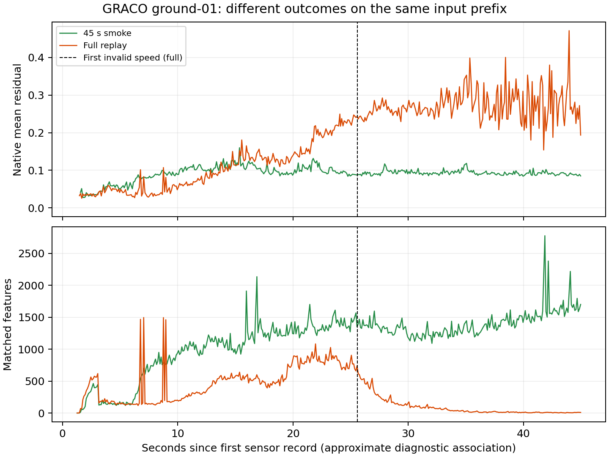

# GRACO ground-01..06: EllipseLIO + ellipsoid MapClosures + PCM/CBS

Status on 2026-09-17: the six-robot 45-second smoke completed, then the full
experiment **failed in robot1's EllipseLIO frontend**. The controller stopped
and the GRACO container is idle. **There is no valid full-sequence six-robot ATE
or connectivity result.** Full loop detection, PCM and CBS never started.

All six sessions form one requested group: `robot1`..`robot6` correspond to
`ground-01`..`ground-06`. Expected connectivity is one component, assessed from
retained measured loop constraints and native CBS output frames. No edges or
relative robot poses are supplied from ground truth.

The fixed pipeline is **EllipseLIO → native ellipsoid BEVs → MapClosures →
distributed PCM → CBS with live GICP registration factors**. There are six
independent loop workers and six CBS processes. Sensor replay is serial at 1x;
CUDA preparation is serial. Absolute sensor timestamps are preserved, making
this an offline chronological replay of six separate sessions.

## Input validation

| Robot | Sequence | LiDAR clouds | IMU samples | Maximum IMU gap [ms] |
|---|---|---:|---:|---:|
| robot1 | ground-01 | 3,338 | 41,728 | 8.011 |
| robot2 | ground-02 | 3,866 | 48,331 | 8.009 |
| robot3 | ground-03 | 2,969 | 37,112 | 8.010 |
| robot4 | ground-04 | 3,288 | 41,097 | 8.010 |
| robot5 | ground-05 | 5,198 | 64,999 | 8.011 |
| robot6 | ground-06 | 3,104 | 38,795 | 8.011 |

The six staged bags total 14.00 GB and contain only original LiDAR/IMU messages.
Sensor counts match source metadata. All CDR payloads and integer record/header
timestamps are preserved, with stream and file checksums; all transferred file
hashes were verified on 148. Native Velodyne ring/relative-time fields were
checked in every cloud. Ground-05 has two 0.2-second scans of 57,870 points;
these are retained and recorded explicitly. Ground-01 begins its IMU about
67 ms after its first LiDAR header, handled by native startup synchronization.

EllipseLIO's bundled `vlp16_graco.yaml` contains the **aerial** extrinsics and
IMU noise parameters: its translation and four noise values match the supplied
aerial calibration exactly, and its rounded quaternion reproduces the aerial
rotation to about 1e-7 per matrix entry. This was not explicitly identified as
an aerial preset before the run, although the differing calibration was noticed
and replaced before execution.

An audit of all six archived smoke runtime files and the full robot1 runtime
confirms that **both ground rotation/translation and all four ground IMU noise
values were used**. Ground translation is `[-0.01192777, -0.01973063, 0.12260907]`
m, rather than the aerial `[-0.02436555, -0.0053221, 0.18020739]` m.
The shared VLP-16 specifications (16 beams, 10 Hz, 30-degree vertical FoV),
125 Hz IMU rate, 0.1 m map resolution and 2–100 m range filter were inherited.
The latter two are declared algorithm choices, not validated ground-specific
tuning; 0.1 m is also the native estimator's default map resolution. No further
aerial-only estimator parameter appears in the bundled preset. This audit does
not establish the cause of the observed divergence.
[Archived configuration audit](figures/graco148/ground-versus-aerial-calibration-audit.json).

Supplied IMU noise parameters are used with EllipseLIO's parameter convention.
Published GT is `T_Base_Imu`, so
no antenna or LiDAR lever-arm correction is applied to the IMU trajectory.
References: [official dataset](https://github.com/SYSU-RoboticsLab/GrAco),
[sensor system](https://sites.google.com/view/graco-dataset/system), and the
retained dataset calibration files.

## Observed outcomes

The smoke processed all six robots and ran six DDS detection workers plus six
native CBS processes. It proposed no loops, retained no loops, and left six
separate components. Detection/PCM/CBS took 19.24 seconds. This short prefix
does not determine whether the full sessions can form the expected connected
group. Passing the sensor-only motion guard also does not establish accuracy:
robots 2 and 3 already have substantial short-prefix trajectory errors.

| Robot | Smoke raw ATE [m], independent evo fit | Full-run outcome |
|---|---:|---|
| robot1 | 0.0686 | Frontend divergence; rejected before loop detection |
| robot2 | 3.7203 | Not run: group stopped at robot1 failure |
| robot3 | 7.5883 | Not run: group stopped at robot1 failure |
| robot4 | 0.0548 | Not run: group stopped at robot1 failure |
| robot5 | 0.0458 | Not run: group stopped at robot1 failure |
| robot6 | 0.0403 | Not run: group stopped at robot1 failure |

Robot1's full replay exported 3,123 scan-associated poses and 3,123 native
analytics messages, but first exceeded the 20 m/s validity limit **25.611 s**
after the first sensor record. Its maximum apparent speed was **2,817.66 m/s**,
with 377.8 km of accumulated scan-pose travel. The native mapper exited normally;
the independent trajectory guard rejected its output afterward. The largest
raw IMU gap was only 8.011 ms. These observations do not identify the underlying
cause, and do not establish a broken bag.

The successful smoke and failed full run used byte-identical robot1 mapping
configuration and the same sensor-only bag. In the failed replay, the native
mean residual rises and matched features collapse during the same first 45 s
that the smoke handled. Near 40 s, the failed run has about 10 matched features,
versus about 1,419 in the smoke. This is a reproducibility problem that needs
investigation; neither execution timing nor a particular native-code defect
has been established as its cause. Analytics lack native timestamps, so the
plot uses explicitly approximate association to the last observed odometry stamp.

[Smoke report](figures/graco148/smoke/REPORT.md),
[full-run failure](figures/graco148/full-failure/failure.json),
[motion guard](figures/graco148/full-failure/robot1/quality.json),
[diagnostic comparison audit](figures/graco148/diagnostic-audit.json),
[controller terminal status](figures/graco148/controller/status.json).

## Execution and reporting

The smoke uses the first 45 seconds per robot and does not establish full-session
connectivity. The initial attempt failed before producing any odometry because
the new sensor-bag metadata lacked the ROS2 `files` entry. The adapter was
corrected, ROS2 bag inspection passed, and the failed attempt/metadata were
retained. Sensor payloads were unchanged. The corrected attempt records native
EllipseLIO analytics, including residuals, feature rejections and observability;
their capture timestamps are approximate because the native message has no header.

Local validation: six GRACO/estimator tests passed; the combined GRACO/CU-Multi
adapter suite passed eight tests with one ROS-dependent skip. Three GRACO tests
also passed inside the deployment runtime before the metadata correction; actual
ROS2 playback is checked by the corrected smoke run.

Completing all six full frontends would require about 36.4 minutes of 1x replay
before descriptor preparation and the backend; this attempt stopped after
robot1. The evaluator supports per-robot raw ATE, CBS ATE using one shared rigid
fit per connected component, trajectory/map/BEV figures and Rerun. Scale fitting
and additional per-robot CBS alignment are disabled. A combined six-robot ATE
requires all six to share a consistent output frame and usable GT.

Compact logs, analytics, evo evidence and smoke figures were retrieved locally.
The smoke's **126.8 MB** Rerun recording remains on 148 at
`.ros2/graco/runs/ground-01-06-smoke-20260917/report/result.rrd`.
Original bags and calibration are untouched; failed-run evidence is retained.

Container: `ellipsoid-graco148`, DDS domain 190. It runs independently of the
official Swarm-SLAM job. CU-Multi download and its automatic watcher are paused
at the user's request.

Remote status: `/data3/mikexyl/swarm_s3e_ws/src/.ros2/graco/controller/status.json`.
Full attempt: `.ros2/graco/runs/ground-01-06-full-20260917` under that workspace.
[Implementation and reproduction](../scripts/graco148/README.md).
