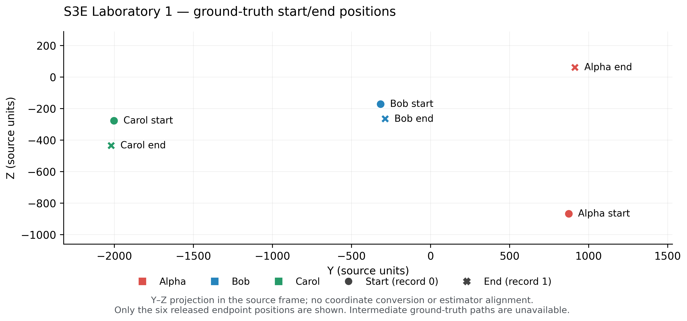
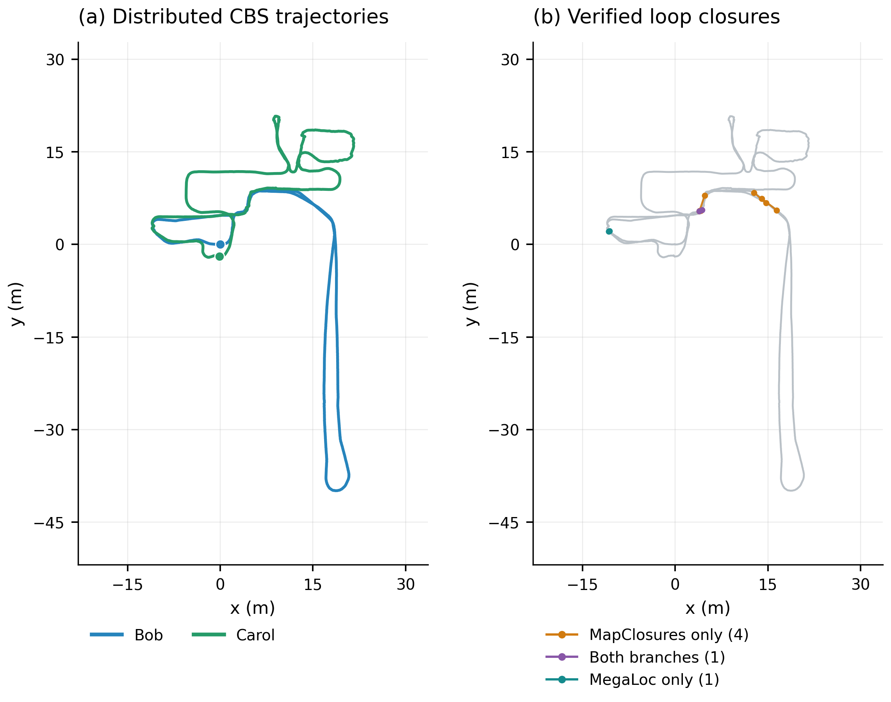
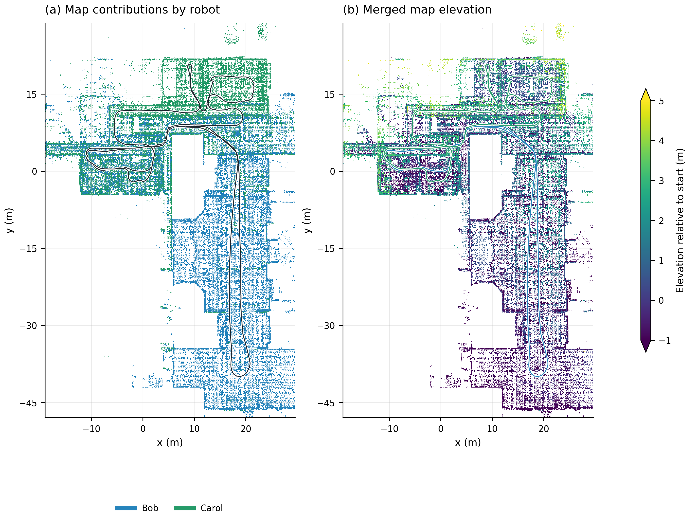
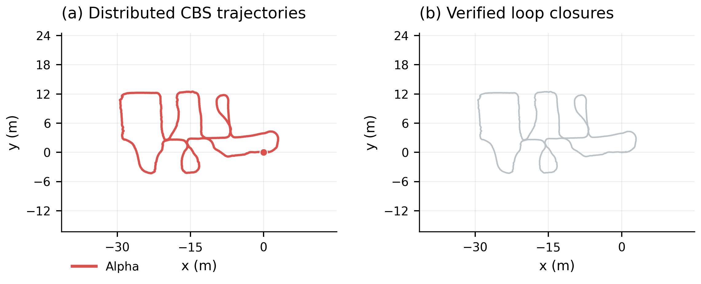
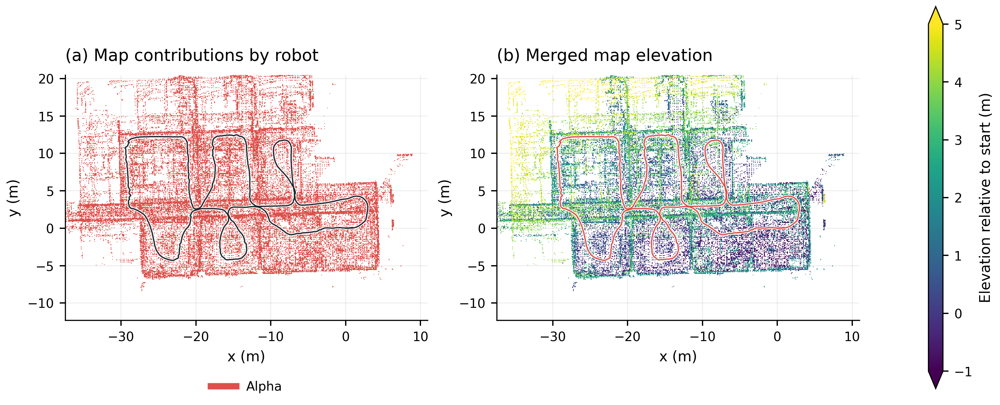

# S3E Laboratory 1: MegaLoc + MapClosures + CBS

Paths under `.ros2/` refer to local artifacts; generated data and Rerun recordings are not published in this repository.

Completed 2026-09-13 using the local `S3E_Laboratory_1` sequence. This is the
indoor Laboratory sequence, distinct from the outdoor `S3E_Library_1` originally
requested; the earlier name substitution was an incorrect assumption.
The full three-robot Laboratory run completed, but **did not
connect all three robots**: Bob and Carol formed one component; Alpha remained
independent. Six constraints were accepted, including three Bob–Carol loops
and three within Bob. No detection or registration threshold was tuned for
this sequence.

Trajectory evaluation is now delegated to **evo 1.36.5**. Its timestamp
association found **zero matches** for every robot. The released Laboratory GT
contains only start/end motion-capture poses, as confirmed by the
[authors' dataset notes](https://huggingface.co/datasets/PengYu-Team/S3E/blob/main/README.md#known-issues)
and [paper, Section III-C](https://arxiv.org/pdf/2210.13723).
The values 0 and 1 identify the two endpoint records; they are not sensor epoch
timestamps. The earlier attempt to associate them as timestamps was inapplicable.
**Full-trajectory APE and retrieval proximity accuracy are unavailable.**
Maps, graph residuals and visually overlapping trajectories
are not substitutes for ground-truth accuracy.

Run registry (local: `.ros2/laboratory1-megaloc-mapclosures-cbs/run-be92d0f21b5310d4.json`) · Numeric report (local: `.ros2/laboratory1-megaloc-mapclosures-cbs/dpgo_evaluate/e0f0fa09d4a57aadb46d813b60ad3625736209a17a2913930fc711e2a96aa1f2/report.json`) · Rerun recording (local: `.ros2/laboratory1-megaloc-mapclosures-cbs/dpgo_evaluate/e0f0fa09d4a57aadb46d813b60ad3625736209a17a2913930fc711e2a96aa1f2/result.rrd`) · evo association results (local: `.ros2/laboratory1-megaloc-mapclosures-cbs/dpgo_evaluate/e0f0fa09d4a57aadb46d813b60ad3625736209a17a2913930fc711e2a96aa1f2/evo/cbs/evaluation.json`) · Audit (local: `.ros2/laboratory1-megaloc-mapclosures-cbs/audit.json`)

## Result

| Measurement | Result |
|---|---:|
| Bag duration | 295.318 s |
| Input LiDAR scans received | 8,804 / 8,804 |
| Synchronized exported frames / dense corrected poses | 8,784 |
| Keyframes | 804 |
| Ranked retrieval replies | 2,412 |
| Selected pair verifications | 117 |
| Rejected: no MapClosures pose hypothesis | 111 |
| Accepted loops | 6 |
| Verification yield | 5.13% |
| MapClosures only / both branches / MegaLoc only | 4 / 1 / 1 |
| Inter-robot / intra-robot loops | 3 / 3 |
| Connected components | 2: Alpha; Bob + Carol |
| Detection + concurrent CBS wall time | 23.46 s |
| Median / p95 wall detection latency | 25.8 / 47.9 ms |
| Sum of pair-verification processing times | 0.544 s |
| Loop exchange serialized CDR bytes | 61,673,550 |
| CBS request + response serialized CDR bytes | 24,596 |
| Post-hoc original-factor Gaussian cost | 0.248898 |
| Corrected keyframe-map points | 270,734 |
| evo timestamp matches / position APE | 0 / unavailable |

The MapClosures branch contributed five of the six constraints, and MegaLoc
contributed two, counting the jointly retrieved constraint in both. These are
branch attributions from one configured run, not ablation results. The six
accepted registrations had 0.244–0.278 m point-alignment RMSE and 80.3–91.8%
symmetric overlap. These registration diagnostics do not establish trajectory
accuracy or loop correctness against external ground truth.

All CBS processes finished their fixed 100-iteration settling budgets. Final
pose changes were below 2e-18, with no newly received beliefs in the last ten
updates. This is numerical stability of the saved graph, not a claim that the
missing Alpha connection was recovered.

## Why Alpha remained disconnected

All **51 selected proposals involving Alpha** failed at native MapClosures pose
initialization. They never reached GICP refinement. The density-map descriptors
were sparse with the unchanged Square 1 preprocessing:

| Robot | Keyframes | Nonempty density ORB descriptors | Median ORB features | Maximum |
|---|---:|---:|---:|---:|
| Alpha | 295 | 86 | 0 | 57 |
| Bob | 223 | 166 | 23 | 98 |
| Carol | 286 | 58 | 0 | 62 |

MegaLoc retrieval alone cannot overcome that failure in this implementation:
visual-only proposals also require a native two-map MapClosures pose before
GICP. The recorded failure is therefore pose-initialization availability;
registration runtime was small. The data do not establish which rejected
proposals were true revisits, because usable position GT is absent.

## Trajectories and maps



*Released motion-capture ground truth for Alpha, Bob and Carol: circles mark
starts and crosses mark ends. This is a Y–Z projection of the six supplied
positions, with coordinates and units retained exactly as supplied. The
release does not provide intermediate Laboratory 1 trajectories, so no paths
are drawn between endpoints. No alignment to the estimated trajectories is
applied. [PDF](figures/cbs-laboratory1/ground_truth/ground_truth_endpoints.pdf) ·
[XYZ positions](figures/cbs-laboratory1/ground_truth/positions.csv) ·
[Sources and rendering metadata](figures/cbs-laboratory1/ground_truth/figure.json).*

Each component stays in its own CBS coordinate frame. Alpha is not placed into
the Bob–Carol map by a guessed or ground-truth alignment. Full corrected TUM
trajectories, complete XYZ map arrays and both components are in the saved
artifacts and Rerun recording.



*Bob–Carol component: corrected trajectories and all six accepted constraints,
including three within Bob. [PDF](figures/cbs-laboratory1/Bob/trajectories_and_loops.pdf).*



*Bob–Carol map, colored by contributing robot and elevation. This display shows
the trajectory extent plus an 8 m XY margin; it does not change submaps or
registration. [PDF](figures/cbs-laboratory1/Bob/map_top_down.pdf).*



*Alpha remains an independent odometry component with no accepted loops.
[PDF](figures/cbs-laboratory1/Alpha/trajectories_and_loops.pdf).*



*Alpha map in its own frame. XYZ points are colored by robot identity or
relative elevation; these are not camera RGB colors.
[PDF](figures/cbs-laboratory1/Alpha/map_top_down.pdf).*

The [figure gallery](figures/cbs-laboratory1/README.md) includes oblique 3D maps,
350-dpi PNGs and PDFs, rendering details and a reproduction command.

## Runtime and validation

| Stage | Saved stage wall time |
|---|---:|
| Serial odometry: Alpha / Bob / Carol | 306.1 / 308.9 / 306.6 s |
| Keyframes and causal submaps, all robots | 226.27 s |
| MegaLoc CUDA descriptor stages, all robots | 42.01 s |
| MapClosures descriptor stages, all robots | 4.36 s |
| Distributed detection and CBS | 23.46 s |
| Maps, evo assessment and Rerun export | 39.54 s |

MegaLoc used the RTX 4070 Laptop GPU with one inference worker. MapClosures,
GICP and CBS used CPU. Stage timings exclude some artifact hashing and launcher
overhead; their sum is not an end-to-end wall-clock measurement.

The candidate audit checked 1,058 eligible candidates across 2,412 replies and
found zero future-observation or 30-second same-robot exclusion violations.
All six endpoint pairs were unique. Recomputed wire-log byte counts matched
the summary. CDR accounting excludes RTPS, discovery and retransmission.
Rerun 0.37.1 verified the recording without decoding errors.
An evaluation `--resume` reused the completed cache and left all 3,354 checked
artifact files unchanged. All 12 PNG/PDF figure files passed hash checks;
the six PDFs are valid single-page documents.

The Python suite passed 29 tests; four optional ROS tests were skipped.
New tests cover unmatched/missing GT, degenerate evo alignment, native evo
result ZIP reproduction, shared alignment preserving an inter-robot offset,
and rejection of a registry from another sequence. The run retained the
existing local CBS and cbs_ros project branches.

## Reproduce evaluation without rerunning odometry or loop detection

```bash
FAST-LIVO2-ROS2/scripts/s3e_experiment.sh run --stage dpgo_evaluate \
  --config FAST-LIVO2-ROS2/research/configs/laboratory1-cbs.yaml \
  --input-run .ros2/laboratory1-megaloc-mapclosures-cbs/run-be92d0f21b5310d4.json --resume
```

For timestamped trajectory ground truth, evo handles association, SE(3)
alignment and translation APE, with a 0.05 s
maximum timestamp difference, no interpolation, no time offset, no scale
fitting and one alignment per connected component. No APE result ZIP is
created when there are no matched positions; the prior failed timestamp
association is saved in `evo/cbs/evaluation.json`. Laboratory 1 instead has
endpoint-only ground truth, so that association is inapplicable and full-path
APE remains unavailable. Ground-truth orientations are not used for the
position plot or translation APE. See [the evo integration](DPGO.md#laboratory-1-and-evo-evaluation).
