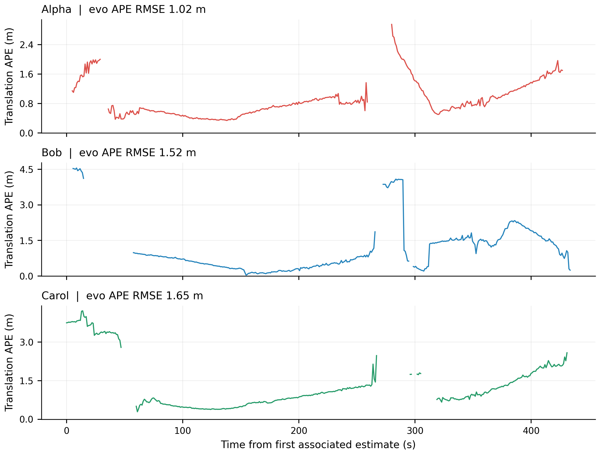
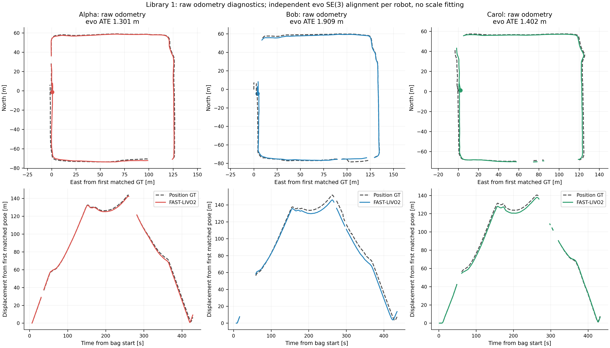
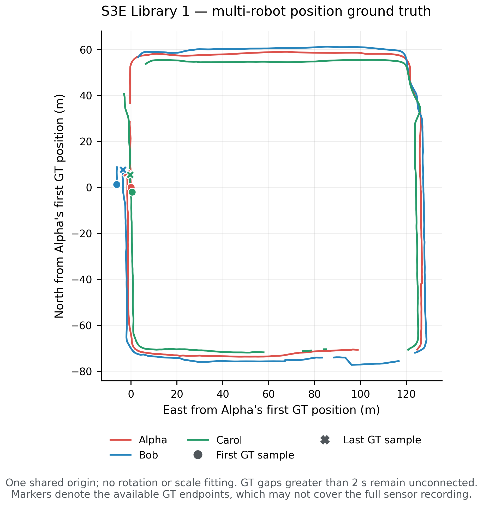
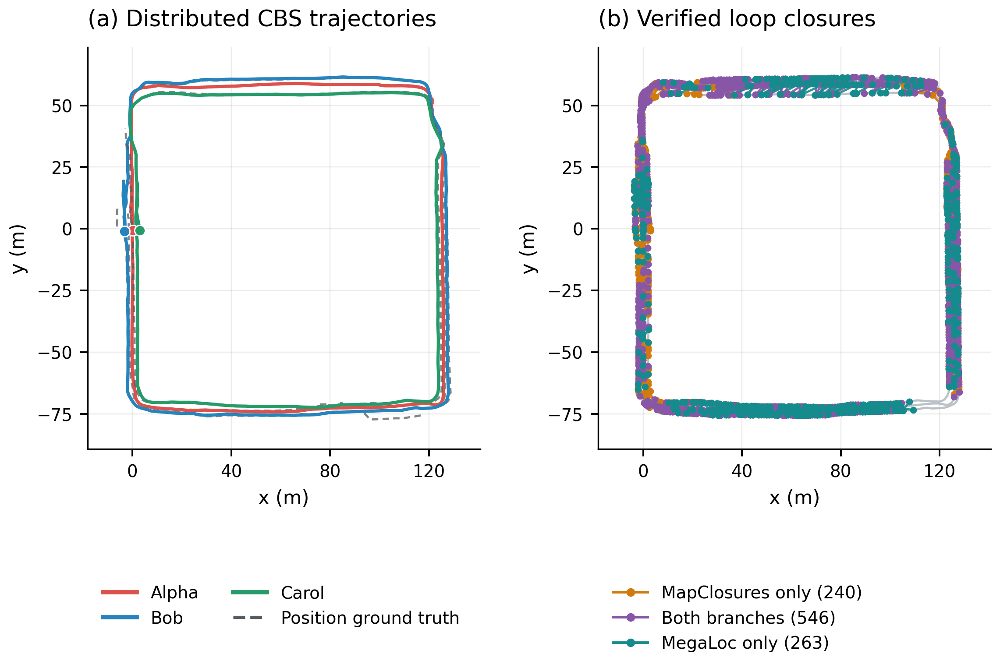
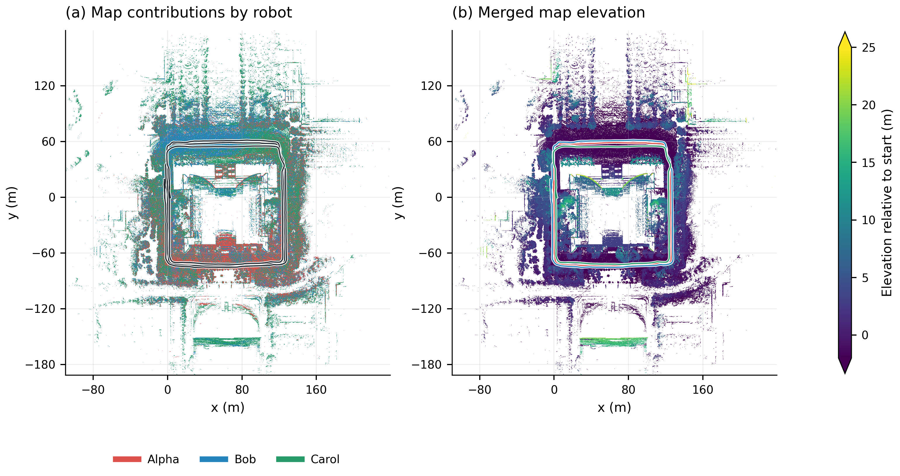
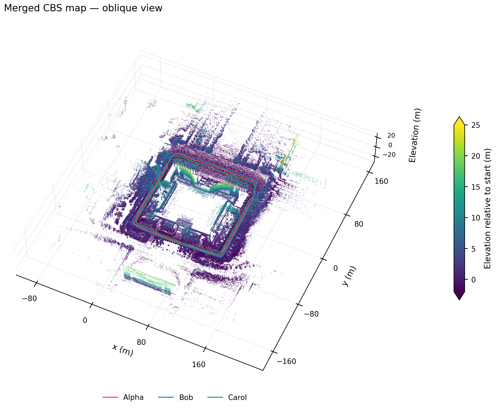

# S3E Library 1: MegaLoc + MapClosures + CBS

Completed 2026-09-14 on **outdoor Library 1**, separate from the previously tested indoor Laboratory 1.

All three robots connected through **1010 inter-robot loop constraints**, with **1.4172 m combined CBS ATE RMSE**. There were 1049 accepted loops in total.

The **17.53 GB** bag and all supplied ground-truth files were downloaded from the [official S3E release](https://huggingface.co/datasets/PengYu-Team/S3E/tree/main/S3Ev1/S3E_Library_1), revision `dd2d0dccb95985468800ed858a5418005ce75cd3`, and verified against the released checksums. SQLite integrity and metadata message counts passed. The bag spans **454.358 s**. [Input and download audit](figures/cbs-library1/input.json).

## Configuration

The working Square 2 detector and CBS settings are unchanged. All robots start at bag offset zero with `vio.img_point_cov=100`, recorded in their effective mapping YAML files. FAST-LIVO2 runs serially at 1×. Keyframes use 1 m / 10° / 2 s thresholds and trailing five-second local submaps, a 0.25 m voxel representative and an 80 m range crop.

MegaLoc uses pretrained CUDA descriptors and cosine similarity ≥0.50. MapClosures independently retrieves LiDAR density images through ORB/HBST and supplies native pose hypotheses. Visual-only proposals also require a native two-map MapClosures pose. The common small_gicp GICP gates include RMSE ≤0.35 m and symmetric overlap ≥0.30. Retrieval retains top-20 candidates, a 30 s same-robot exclusion and at most one selected candidate per branch with a two-second cooldown. [Method details](METHODS.md).

Three robot front ends and three CBS optimizers exchange messages through Fast DDS on one host using frozen artifacts. This is **offline distributed replay**; simultaneous live sensor-to-model operation is not established by this experiment. Ground truth is used only in evaluation, and corrections affect saved poses/maps without estimator feedback.

## CBS trajectory accuracy

**Evo 1.36.5** performs nearest timestamp association within 0.05 s, with no interpolation or time offset, and one shared SE(3) alignment per connected component with no scale fitting. Robot scores receive no additional alignment. Combined RMSE pools matched position errors. Placeholder GT orientations are unused and the antenna lever arm is uncorrected.

| Robot | Component | ATE RMSE (m) | Median (m) | Matched GT positions |
|---|---|---|---|---|
| Alpha | Alpha | 1.0239 | 0.7763 | 397 |
| Bob | Alpha | 1.5216 | 0.8162 | 378 |
| Carol | Alpha | 1.6474 | 0.9499 | 376 |
| **Component Alpha combined** | Alpha | **1.4172** | 0.8279 | 1151 |



Native evo archives and matched trajectories are retained under [evo](figures/cbs-library1/evo/cbs/README.md).

Released GT has 400 / 379 / 377 positions and 2 / 3 / 5 gaps exceeding two seconds for Alpha / Bob / Carol. Maximum gaps are 21.0 / 43.0 / 29.0 s. Missing intervals are excluded from ATE.

## Raw odometry and coverage

These raw ATEs use independent per-robot SE(3) fits for diagnosis. They cannot be subtracted directly from the shared-component CBS scores.

| Robot | Received / expected clouds | Exported frames | Export span (s) | Raw ATE RMSE (m) |
|---|---|---|---|---|
| Alpha | 4468 / 4468 | 4443 | 444.206 | 1.3011 |
| Bob | 4469 / 4469 | 4463 | 446.203 | 1.9088 |
| Carol | 4544 / 4544 | 4535 | 453.405 | 1.4021 |



All exports completed with finite poses. The largest IMU intervals were 119.99 / 15.85 / 120.79 ms; no stream had a gap over 0.2 s. All IMU header timestamps were strictly increasing. [Raw diagnostics and provenance](figures/cbs-library1/raw_odometry.json).

## Loops and communication

| Measurement | Result |
|---|---|
| Keyframes: Alpha / Bob / Carol | 489 / 501 / 484 |
| Accepted loops | 1049 |
| Inter-robot / intra-robot | 1010 / 39 |
| MapClosures only / both branches / MegaLoc only | 240 / 546 / 263 |
| Alpha–Bob / Alpha–Carol / Bob–Carol | 437 / 314 / 259 |
| Connected components | 1 |
| Verification attempts | 1492 |
| Verification yield | 70.31% |
| Recall@1 / @5 / @20 | 97.70% / 99.75% / 99.92% |
| Proximity precision / recall | 67.63% / 77.38% |
| Accepted within 10 m / assessable | 772 / 798 |
| Loop exchange CDR bytes | 514354524 |
| CBS belief CDR bytes | 4281694 |
| Median / p95 wall detection latency | 0.279 / 0.418 s |
| Detection + CBS wall time | 181.41 s |

Branch counts are mutually exclusive attributions within this single fused run; proposals from both branches are deduplicated. Position-proximity labels do not establish exact 6-DoF correctness. Overlapping submaps can have origins farther than 10 m apart. CDR byte counts exclude RTPS, discovery and retransmission overhead.

Every keyframe had nonempty MapClosures features, with median counts of
182 / 175 / 217 for Alpha / Bob / Carol. Ground truth was unavailable for
251 accepted loops. Among the 1,089 selected, assessable proposals within
10 m, 772 were accepted, 303 failed the RMSE gate, 13 lacked a native pose
and one did not converge. These are proximity diagnostics, not exact pose labels.

## Ground truth, trajectories and maps









Map colors show robot identity or LiDAR elevation, not camera RGB. Display uses a 0.30 m grid and an oblique sample of at most 650,000 points. Both PNG and PDF versions are retained.

## Runtime and validation

| Stage | Alpha / Bob / Carol (s) |
|---|---|
| Odometry | 463.6 / 464.9 / 470.1 |
| Keyframes / submaps | 286.8 / 305.0 / 287.5 |
| MegaLoc CUDA descriptors | 27.7 / 24.2 / 24.0 |
| MapClosures descriptors | 9.5 / 11.1 / 12.2 |

Detection/CBS took **181.41 s**; evaluation, map rebuilding and Rerun export took **100.92 s**. Alpha and Bob keyframes were prepared during the following robot's replay, so stage durations overlap and must not be added as end-to-end wall time. MegaLoc uses CUDA; mapping, MapClosures, GICP and CBS use CPU. Memory and convergence diagnostics are in the [numeric report](figures/cbs-library1/report.json).

The audit found zero future-frame or same-robot-exclusion violations, unique loop endpoint pairs and exact serialized-byte accounting. It independently reproduced evo statistics from saved poses. The research Python suite passed **40 tests**, with four optional ROS tests skipped. [Audit](figures/cbs-library1/audit.json) · [Stage, configuration and figure provenance](figures/cbs-library1/figures.json).

The first replay was interrupted before Alpha finished. Its incomplete output was never accepted as a cache; the successful run restarted from offset zero with the same frozen source and settings.

## Retention and reproduction

The verified Rerun 0.37.1 recording is retained locally at `.ros2/recordings/library1-cbs.rrd` (**313.3 MB**). It passed `rerun rrd verify`, including footer checks.

Generated intermediate outputs totaling **14.08 GiB** were removed after validation. Reports, figures, accepted constraints, compact evo/trajectory evidence, effective configurations and stage manifests are retained. The original dataset remains under `/data/s3e/S3E_Library_1`. Removed caches require regeneration.

```bash
FAST-LIVO2-ROS2/scripts/s3e_experiment.sh run --stage all \
  --config FAST-LIVO2-ROS2/research/configs/library1-cbs.yaml --resume
```

CBS branch: `dev/fast-livo2-s3e-dpgo` at `11d84afe3397870cddecb5b6c07f4ed6866466a4`. CBS ROS branch: `dev/fast-livo2-s3e-dpgo` at `86e3e3511b9c4bb2750628c823b682b5200c34a3`.
