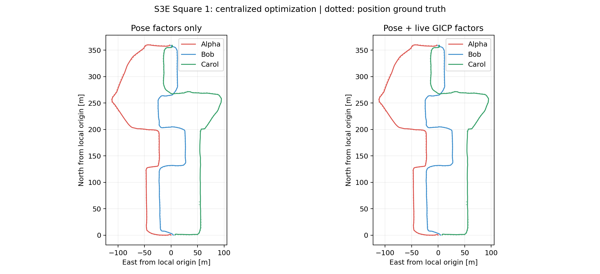
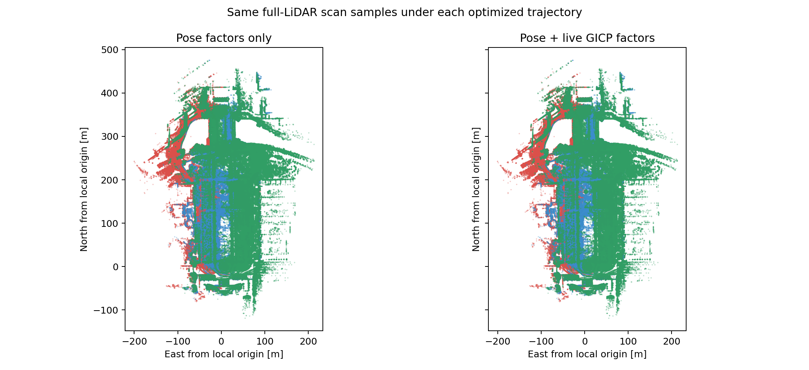

# Square 1: centralized pose + GICP factors

The mixed graph runs successfully on all three robots. It adds **50 live
gtsam_points GICP factors** to **1,598 pose factors** (1,547 odometry,
50 loop poses, one component anchor), optimizing 1,550 keyframe poses.
All 50 registration pairs pass initial and final geometry checks.
The first conservative configuration gives **no meaningful trajectory ATE
improvement** over its pose-only initialization.

| evo translation ATE RMSE [m] | Pose factors only | Pose + GICP |
|---|---:|---:|
| Alpha | 1.533907 | 1.533608 |
| Bob | 1.036869 | 1.038650 |
| Carol | 0.936022 | 0.934089 |
| Combined | **1.197976** | **1.198012** |

Both columns use the same frozen odometry and 50 MegaLoc + MapClosures loops.
The pose-only column is the native GTSAM LM refit of the existing GNC-selected
pose graph, immediately before adding registration factors. This is a
centralized comparison; it is not a rerun of CBS or distributed PCM.
All robots form one component. Evo 1.36.5 associates 1,176 GT positions
(Alpha 384, Bob 454, Carol 338) within 0.05 s. Each solution uses one shared
SE(3) alignment, no per-robot alignment, no scale fitting, and no GT
orientations. The 0.000037 m combined change is not evidence of an improvement.

The map figures use every fifth saved keyframe's full scan and 0.5 m display
voxels. They show the same measurements under each solution, and are
qualitative views rather than map accuracy measurements.

## Runtime and geometry

| Measurement | Result |
|---|---:|
| Complete PGO stage, including pose GNC and cloud preparation | 8.694 s |
| Registration adapter, including Python cloud I/O | 7.433 s |
| Native process, including native pose-only refit and preparation | 2.465 s |
| Native cloud preparation and factor setup | 1.296 s |
| Mixed LM optimization | 0.821 s |
| Mixed LM iterations | 3 |
| Native peak RSS | 245.3 MiB |
| Unique submaps / sampled points | 73 / 728,240 |
| Device / thread budget | CPU / 4 |

Times are nested rather than additive. They exclude the one-time dependency
build, report rendering, evo and immutable-input validation before entering
the PGO stage. No odometry, descriptor inference, retrieval or loop verification
was rerun. No new registration-pair search or sweep was performed.

The scaled mixed objective decreases from **3.017461 to 2.988526**. The pose-only
portion increases from 0.165537 to 0.172925 as the solver trades pose and
point-cloud costs. Median bidirectional overlap remains approximately 0.758;
the minimum is 0.499. All factors are linearized five times, including setup
and optimizer linearizations, and update their correspondences.
Euclidean inlier RMSE under the 1.5 m trimming threshold does not improve
(median 0.599465 to 0.599994 m); the optimized GICP objective uses directional
covariance weighting and is a different quantity. There is no claim of better
map accuracy from this run.

## Configuration and provenance

The [configuration](configs/square1-mixed-pgo.yaml) uses full-LiDAR trailing
five-second submaps, 0.5 m voxel centroids, at most 12,000 points per submap,
80 m range, 20 covariance neighbors, 1.5 m correspondence trimming, and
initial registration information capped at one times the verified loop
information. Point-count scaling is frozen per factor. The pose and registration
factors reuse LiDAR evidence; they are not claimed to be independent.

[Implementation, build and reproduction commands](MIXED-PGO.md) describe
the native adapter and its limitations. The adapter compiles the unmodified
CPU GICP component from [koide3/gtsam_points v1.2.2](https://github.com/koide3/gtsam_points/tree/9d32e7dbecf6015560d84b4901d6b0a6f483ec46),
commit `9d32e7dbecf6015560d84b4901d6b0a6f483ec46`, against native GTSAM 4.3a2.
The Python GNC initializer remains GTSAM 4.2 in a separate process environment.
The existing distributed pipeline is unchanged.

Run registry:
`.ros2/square1-mixed-pgo/run-4901cc390df01e42.json`.
Completed stage:
`60b6a548b1b4b67d24a1ae13f5e3900bf4bf5961057bf28e00fbdc1a7409abea`.

The [full-precision report](figures/mixed-pgo-square1/report.json),
[registration diagnostics](figures/mixed-pgo-square1/registration.json),
[pose-only evo evidence](figures/mixed-pgo-square1/evo/pose_only/README.md),
[mixed evo evidence](figures/mixed-pgo-square1/evo/mixed/README.md),
and [file hashes](figures/mixed-pgo-square1/files.json) retain compact evidence.
Input artifact references and source cloud hashes are unchanged; temporary
binary cloud copies were removed after native execution.

Validation: eight mixed-factor tests passed, including actual native known
transforms in both directions, independent components, low overlap, planar
degeneracy, reciprocal duplicates, GNC rejection and immutable input clouds.
The existing Python regression suite passed 40 tests; seven optional ROS/DDS
cases were skipped in this environment. Native CBS code was not modified.
