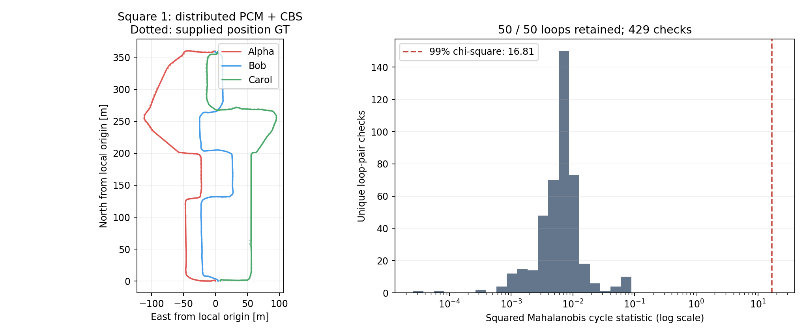

# Distributed PCM + CBS validation

Completed 2026-09-14. Distributed PCM now filters inter-robot loop proposals
before any CBS pose/anchor initialization or optimization. It follows
[DOOR-SLAM Section III-B](https://arxiv.org/pdf/1909.12198): each endpoint
constructs a consistency graph for each neighbor, selects a clique locally,
and passes only retained measurements to optimization. Both endpoints must
agree on the selection. There is no central PCM solver.

The [implementation notes](../../cbs_ros/docs/distributed_pcm.md) document the
paper, inspected upstream commits, squared-Mahalanobis correction,
right-tangent covariance propagation, peer protocol and limitations.
The current S3E defaults are a 0.99 chi-square probability (6 DoF threshold
16.81189383) and minimum clique size 2. These values were not tuned using GT.
Intra-robot loops retain geometric verification and are outside this PCM scope.
This implementation gates one immutable offline batch per node lifetime.

## Synthetic and protocol validation

All six native three-robot CBS integration tests passed: three baseline cases
with PCM disabled, and three PCM cases with unknown initial frame offsets,
false SE(3) closures and disconnected components. The PCM cases retained all
**15 valid loops** across their three graphs and withheld all **12 injected
bad closures**. Two of those bad closures were unsupported singleton bridges;
they were withheld by the minimum-support policy. Component membership and
SE(3) poses matched the synthetic truth (translation tolerance 1 mm, rotation
tolerance 0.0001 rad).

Five CBS core tests and four native ROS tests passed. PCM-specific checks cover
noncommuting SE(3) transforms, numerical covariance Jacobians, the squared
chi-square statistic, reversed endpoints, duplicate loops, separator-summary
equivalence, missing odometry, singleton policy, delayed/absent peers,
configuration mismatch, seal/graph delivery reordering, stale sessions,
changed selections and actual serialized-byte accounting. The normal Python
suite passed 40 tests, with 7 optional ROS/DDS cases skipped there and executed
through the native environment separately as applicable.

## Square 1 frozen measurements

The validation reused the **same 50 loop transforms and information matrices**
as the previously reported Square 1 CBS experiment. Odometry, keyframes,
descriptors and geometric registration were not rerun. Inputs were hash-checked
by the experiment stage; retained input indices and manifests were checked
again during report collection. GT was read only for the subsequent evo
evaluation.

| Robot pair | Proposed | PCM retained | PCM excluded |
|---|---:|---:|---:|
| Alpha–Bob | 18 | 18 | 0 |
| Alpha–Carol | 10 | 10 | 0 |
| Bob–Carol | 22 | 22 | 0 |
| **Total** | **50** | **50** | **0** |

All **429 distinct loop-pair cycles** were checkable and consistent. The
largest squared Mahalanobis statistic was **0.087325**, below the configured
threshold **16.811894**. Each pair was computed independently at both endpoints,
giving 858 local checks in the saved CSVs.

| Robot | PCM computation | Seal to local agreement | Outgoing PCM CDR bytes |
|---|---:|---:|---:|
| Alpha | 1.277 ms | 88.6 ms | 18,956 |
| Bob | 2.163 ms | 141.9 ms | 26,016 |
| Carol | 1.461 ms | 169.2 ms | 20,808 |
| **Total traffic** | | | **65,780 bytes (64.24 KiB)** |

Computation measures cycle checks plus clique selection. Seal-to-agreement
also includes input drainage, summary construction, delivery and timer
scheduling. These are one-host timings. Traffic comprises six directed
snapshots plus six selections, counted using actual CDR serialization; RTPS,
discovery, retransmission and local input/status messages are excluded.

The full frozen PCM + CBS run took **12.485 s**, including process startup,
input delivery and 100 local CBS iterations at 10 Hz. This excludes input
artifact hashing before the run and the subsequent evo/report generation.

### Trajectory position error

evo 1.36.5; nearest timestamp association within 0.05 s; one shared SE(3)
alignment for the connected three-robot component; no scale fitting or
per-robot additional alignment. Supplied placeholder GT orientations are unused.

| Robot | PCM + CBS ATE RMSE | GT matches |
|---|---:|---:|
| Alpha | **1.5203 m** | 384 |
| Bob | **0.9653 m** | 454 |
| Carol | **1.1335 m** | 338 |
| **Combined** | **1.2181 m** | **1,176** |

The earlier CBS-only saved run was **1.2147 m** combined. No loop was removed
here, so the small difference must not be presented as a PCM improvement or
degradation: the earlier run optimized incremental input while this validation
started from a gated frozen batch, and CBS uses independent asynchronous
timers. Both results and their distinct execution conditions are retained.



### Interpretation

**PCM found no mutually inconsistent Square 1 loops under the configured
relative-edge noise models.** This does not certify all 50 as correct.
The earlier [loop-quality audit](LOOP-QUALITY.md) flagged 7 of 49 loops with
usable endpoint GT for a translation-length discrepancy above 2 m. That scalar
GT diagnostic and this sensor-only SE(3) consistency test answer different
questions. Mutually consistent bias or false matches can survive PCM, and
imperfect GT can cause distance flags. The existing covariance floors and
accumulated odometry uncertainty also affect the gate's sensitivity.
The per-neighbor cliques do not establish joint consistency across all
three-robot cycles.

## Saved evidence and reproduction

* [Compact report with full-precision metrics and hashes](figures/cbs-pcm-square1/report.json).
* [PCM per-loop decisions](figures/cbs-pcm-square1/pcm.json),
  [retained constraints](figures/cbs-pcm-square1/constraints.jsonl),
  [all proposals](figures/cbs-pcm-square1/proposed-constraints.jsonl).
* [Native evo results/settings](figures/cbs-pcm-square1/evo/evaluation.json),
  [figure PDF](figures/cbs-pcm-square1/pcm_square1.pdf),
  [source stage manifest](figures/cbs-pcm-square1/dpgo-stage-manifest.json).

The compact folder also contains each robot's pair-check/decision/communication
CSVs, corrected trajectories, CBS statistics, source registry and file hashes.
It is about 6 MB. The complete native DPGO output is only 3.5 MB, so it is also
retained. No new clouds, maps, MCAP or Rerun recording were generated by this
validation; existing dataset and experiment evidence remain in place.

From the workspace `src` directory, the completed validation registry is
`.ros2/square1-cbs-pcm-validation/run-27eef5f933795f04.json`.
Its saved config uses `dpgo.mode: frozen`, PCM enabled, and a separate output
root. The initial input registry is
`.ros2/megaloc-mapclosures-cbs/run-af384eeda86f7f19.json`.

```bash
FAST-LIVO2-ROS2/scripts/s3e_experiment.sh run --stage dpgo \
  --config .ros2/pcm-square1-frozen.yaml \
  --input-run .ros2/megaloc-mapclosures-cbs/run-af384eeda86f7f19.json --resume

OMP_NUM_THREADS=1 OPENBLAS_NUM_THREADS=1 \
  .ros2/research-venv/bin/python \
  FAST-LIVO2-ROS2/research/figures/cbs-pcm-square1/collect.py \
  .ros2/square1-cbs-pcm-validation/run-27eef5f933795f04.json
```

The first command reuses a completed cache only when its configuration and
code hashes match; later source changes produce a new stage. The second
regenerates the compact report from the named completed stage without SLAM or
retrieval. Historical results for other sequences have not been relabeled as
PCM results.
