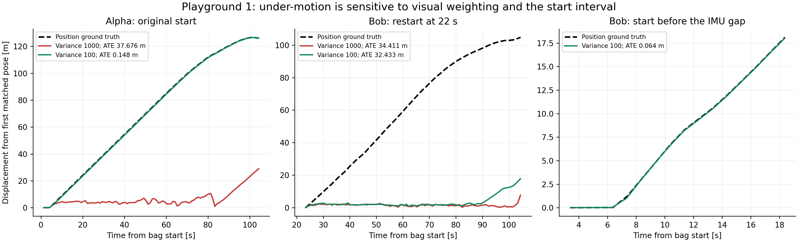
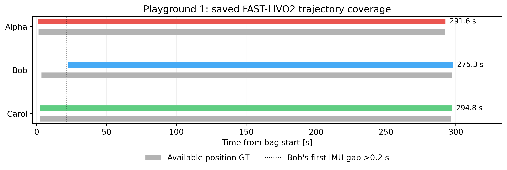
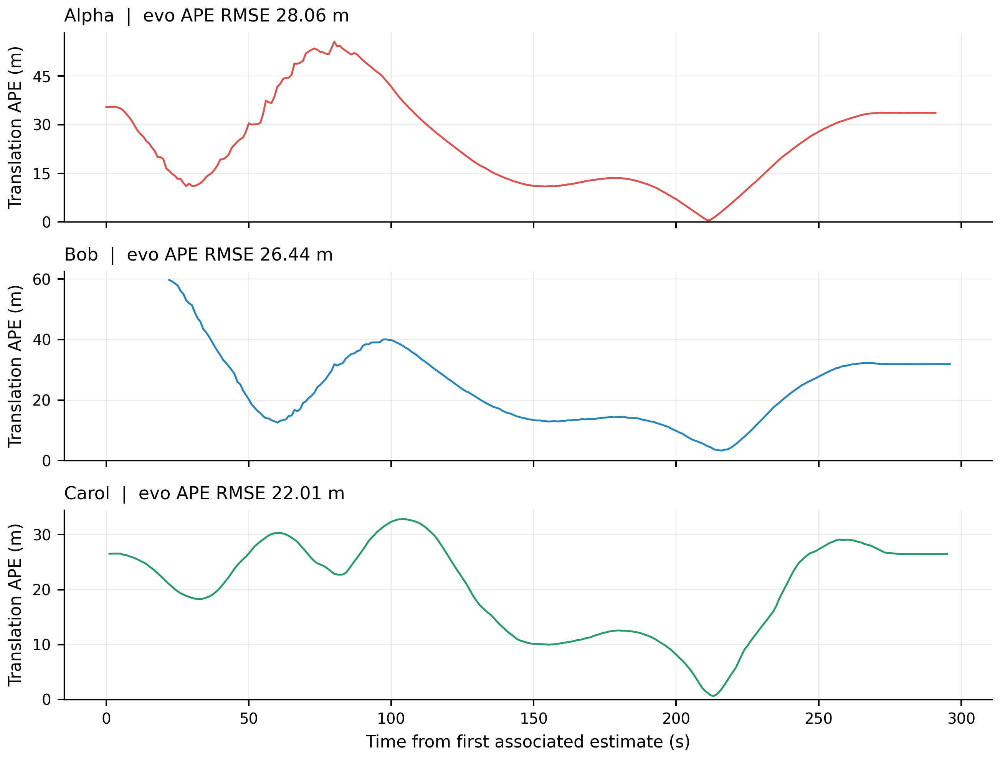
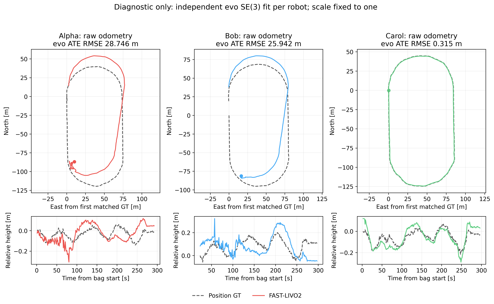
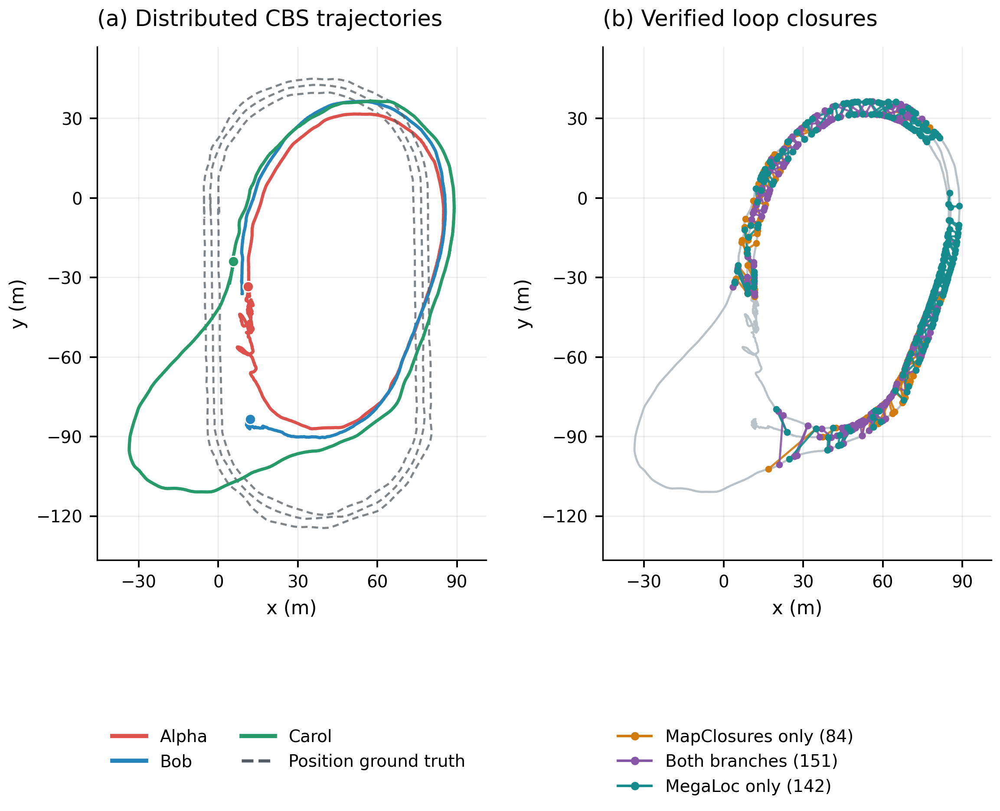
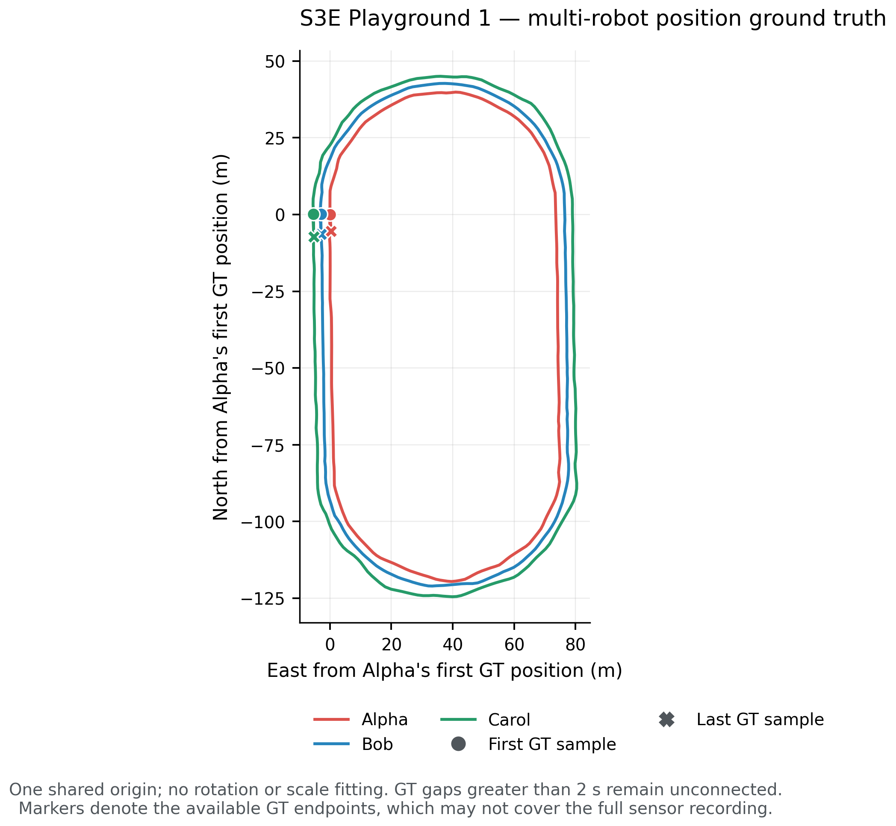
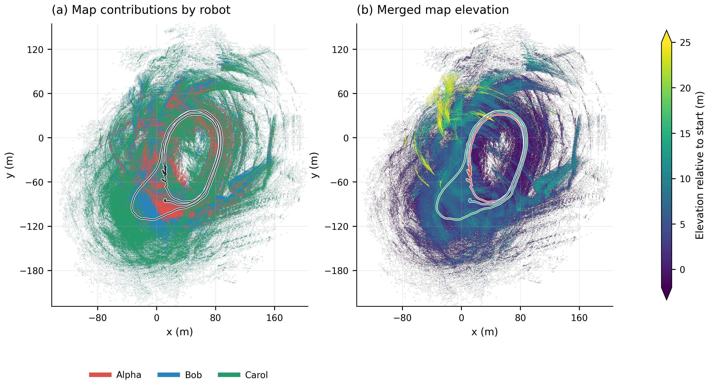
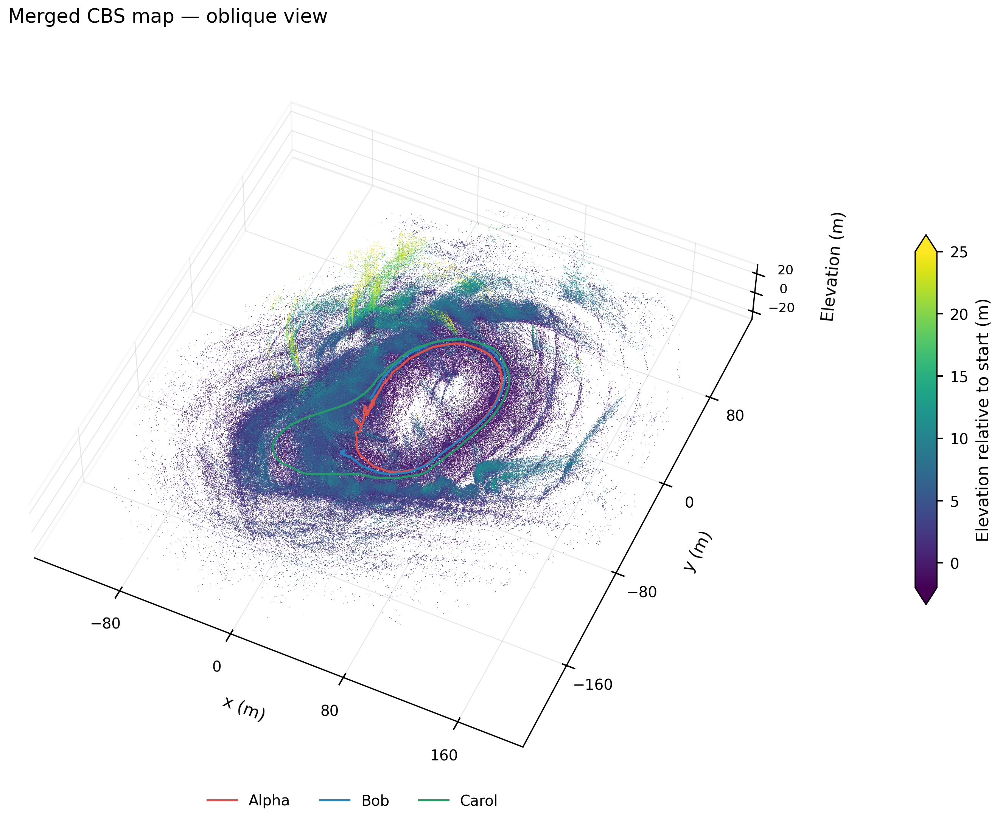

# S3E Playground 1: MegaLoc + MapClosures + CBS

Paths under `.ros2/` refer to local artifacts; generated data and Rerun recordings are not published in this repository.

**Status: excluded from further experiments at the user's request.** The
results below are retained as a failed historical run. The follow-up startup
diagnosis identified a configuration sensitivity in Alpha and an unresolved
post-gap startup problem in Bob; this sequence is not a validated benchmark
result for FAST-LIVO2 or CBS.

## Follow-up startup diagnosis

Bounded replays reproduced the early under-motion before loop detection or
CBS. Changing only `vio.img_point_cov` from 1000 to the upstream Avia
configuration's 100 restored Alpha's early trajectory. This gives the visual
measurements ten times their previous inverse-variance weight. The same
change did not resolve Bob's post-gap restart.

| Robot / requested bag interval | Visual variance | Position ATE RMSE (m) | Matched GT samples |
|---|---:|---:|---:|
| Alpha / 0–105 s | 1000 | 37.6765 | 104 |
| Alpha / 0–105 s | 100 | 0.1478 | 104 |
| Bob / 22–105 s | 1000 | 34.4114 | 82 |
| Bob / 22–105 s | 100 | 32.4329 | 82 |
| Bob / 0–19 s, before the gap | 100 | 0.0640 | 16 |

These are **prefix diagnostics**, each independently aligned by evo 1.36.5
with one rigid SE(3) transform and no scale fitting. Nearest timestamp
association uses 0.05 s, with no interpolation or time offset. Each paired
variance comparison uses identical matched GT timestamps. Actual estimate
coverage begins after sensor startup; raw and matched trajectories and native
evo result archives are retained in the [diagnostic evidence](figures/cbs-playground1/startup-audit/diagnosis.json).



Bob's stored IMU stream contains the three gaps documented below. The SQLite
database passes `PRAGMA quick_check`, and all topic message counts agree with
the bag metadata. This establishes gaps in the stored stream, without
evidence of structural database corruption; it does not identify where the
samples were lost. After 22 s, the inspected IMU prefix has no further gaps
over 0.2 s. Alpha and Carol have no such gaps in the inspected first 105 s.
All inspected LiDAR and image payloads change between adjacent messages,
header timestamps are monotonic and equal their bag timestamps, and every
diagnostic export timestamp matches an input camera timestamp exactly.
[Timing audit](figures/cbs-playground1/startup-audit/sensor_timing.json) ·
[Database integrity](figures/cbs-playground1/startup-audit/bag_integrity.json).

Bob tracks the short pre-gap segment accurately with variance 100, but fails
after restarting while moving. Initialization is therefore a remaining
suspect, not an isolated cause: these intervals also contain different
measurements. No full-sequence replay or CBS rerun followed these controls.
The historical experiment configuration and its full-run scores below remain
unchanged. The earlier raw-odometry error alone did **not** establish an
intrinsic FAST-LIVO2 limitation.

The runner now accepts `--mapping-config` and saves the exact YAML it loads.
The experiment CLI supports per-robot `odometry.mapping_overrides`, includes
effective mapping configuration and camera-file hashes in new odometry cache
identities, and rejects frozen odometry with a different mapping configuration.
These controls preserve the existing robot defaults. Verification after these
changes: 37 Python tests passed, 4 optional ROS tests skipped.

## Historical full pipeline run

**Bob was restarted at bag offset 22.0 seconds**, after its final IMU gap.
**The restart fixes the odometry stall, but joint trajectory accuracy remains
poor: 25.6036 m combined CBS ATE RMSE.**
The pipeline finished with **377 accepted loops**. Alpha and Carol use
whole-sequence replays; Bob uses the requested post-gap interval. The first
22 seconds of Bob are deliberately absent from this result.

MegaLoc, MapClosures, registration and CBS settings remain unchanged from the
working Square 1 setup. Alpha and Carol's completed odometry and keyframes
were reused. No estimator gap-recovery modification, sweep or ablation was
applied. Three front ends and three CBS optimizers exchanged ROS2 Fast DDS
messages on one host. This is offline distributed replay, not a multi-machine
test. Ground truth was available only to evaluation.

[Configuration](configs/playground1-cbs.yaml) · [Figure gallery](figures/cbs-playground1/README.md)

## Post-gap restart and trajectory coverage

Bob's raw bag contains three IMU header timestamp gaps over 0.2 seconds:
**0.569737029, 0.310469660 and 0.280655148 seconds**. The first ends at
1661163899.046991936 seconds. In `src/LIVMapper.cpp:900`, FAST-LIVO2 rejects
such messages before updating `last_timestamp_imu`. Every subsequent IMU
message then remains beyond that same threshold. The initial Bob trajectory
stopped after 17.2 seconds; the user stopped that run and requested a restart
after the gaps. Bob's requested replay start is **1661163899.933 seconds**, offset 22 seconds
from the original bag start, after the last gap ending at offset 21.814923 s.
Sensor timestamps are preserved. The remaining 2,761 LiDAR scans are replayed
with a fresh estimator. Alpha and Carol have no IMU gaps over 0.2 seconds.

The raw timestamps and source provenance are saved in the
[IMU gap audit](figures/cbs-playground1/imu_gaps.json) and
[experiment metadata](figures/cbs-playground1/figures.json).
This diagnosis concerns odometry input handling, before loop detection.
The runner's `success` and `export_complete` flags describe clean process and
file completion; they do not establish complete temporal coverage. The
coverage audit below explicitly catches that distinction.

| Robot | Received / expected LiDAR scans | Exported frames | Export span (s) | Frames / input scans |
|---|---:|---:|---:|---:|
| Alpha | 2,923 / 2,923 | 2,917 | 291.605 | 99.79% |
| Bob | 2,761 / 2,761 | 2,754 | 275.303 | 99.75% |
| Carol | 2,956 / 2,956 | 2,949 | 294.800 | 99.76% |



*Colored bars show actual saved exports; gray bars show available GT.
[PDF](figures/cbs-playground1/trajectory_coverage.pdf).*

## CBS position ATE on available trajectories

evo 1.36.5 performs timestamp association within 0.05 seconds, without
interpolation or time offsets. Each connected component receives one shared
SE(3) fit, with scale fixed to one. Each robot's ATE uses the same component
fit without another per-robot alignment. Components: **Alpha, Bob, Carol**.
Bob's ATE covers its post-gap estimate. Missing estimates and the skipped
prefix are excluded from ATE, not counted as zero error.

| Robot | Component | ATE RMSE (m) | Median ATE (m) | Matched / supplied GT positions |
|---|---|---:|---:|---:|
| Alpha | Alpha | 28.0625 | 22.7097 | 292 / 292 |
| Bob | Alpha | 26.4365 | 22.4367 | 275 / 295 |
| Carol | Alpha | 22.0118 | 23.0726 | 295 / 295 |
| **Combined (Bob starts at 22 s)** | Alpha | **25.6036** | **22.8585** | **862** |



*Statistics and curves read native evo result arrays.
[PDF](figures/cbs-playground1/position_error.pdf). S3E's placeholder GT
orientations are unused. The GT antenna lever arm is not corrected.*

## Accuracy diagnosis from the saved odometry

Before CBS, evo already measures large errors in the saved FAST-LIVO2 output:
**28.7455 m Alpha, 25.9419 m Bob, and 0.3149 m Carol RMSE**. These diagnostic
values each use an independent SE(3) alignment, since the raw odometries have
separate coordinate frames. They are not a shared multi-robot score and cannot
be subtracted directly from the CBS ATEs above. The diagnostic uses only saved
poses; no additional estimator configuration or replay was run.



*Independently aligned raw odometry against matched GT, with height shown
below each XY track. [PDF](figures/cbs-playground1/raw_odometry_diagnostic.pdf).
All associations, alignment and ATE statistics use evo.*

Large errors therefore predate graph optimization for Alpha and Bob. CBS does
not recover accurate joint geometry. The map distortion and high shared ATE
make this an accuracy failure despite completed playback and full graph
connectivity. The test does not isolate the underlying cause of the original
odometry errors. Fifteen accepted constraints are outside the 10 m
position-proximity label; placeholder GT orientations prevent exact 6-DoF
constraint error validation.

## Separating odometry failure from backend damage

Both stages contribute to the final failure. Raw Alpha/Bob odometry already
has 28.7455 / 25.9419 m independent-alignment ATE, while raw Carol is accurate
at 0.3149 m. The loop-constrained CBS result also deforms Carol's trajectory.

To check that this is more than a shared evaluation-alignment effect, the
retained Rerun recording was read back. Its initial and optimized positions
refer to the same ordered keyframes. Evo removes the best rigid transform
between each pair of trajectories, with scale fixed to one, and measures the
remaining positional changes:

| Robot | Keyframes | RMS change after removing rigid alignment (m) |
|---|---:|---:|
| Alpha | 358 | 31.3456 |
| Bob | 318 | 25.0025 |
| Carol | 421 | 20.7019 |

These are **changes relative to raw odometry, not GT ATEs**. Carol's 20.70 m
change confirms substantial backend deformation of its originally accurate
track. The preceding raw-odometry and joint-CBS ATEs use different alignment
scopes and must not be compared by direct subtraction. This check separates
the front-end error from backend changes, but does not isolate erroneous loop
poses from CBS weighting or optimization behavior. No SLAM rerun or parameter
sweep was performed. [Diagnostic provenance and statistics](figures/cbs-playground1/cbs_shape_change.json).

## Loop detection on the available exports

| Measurement | Result |
|---|---:|
| Keyframes: Alpha / Bob / Carol | 358 / 318 / 421 |
| Selected geometric verifications | 885 |
| Accepted unique loops | 377 |
| Inter-robot / intra-robot loops | 370 / 7 |
| MapClosures only / both branches / MegaLoc only | 84 / 151 / 142 |
| Alpha–Bob / Alpha–Carol / Bob–Carol | 181 / 76 / 113 |
| Connected components | 1 |
| Verification yield | 42.60% |
| Retrieval Recall@1 / @5 / @20 | 97.90% / 100.00% / 100.00% |
| Queries with a causal GT-proximity positive | 1094 |
| Proximity retrieval precision / recall | 69.73% / 81.28% |
| Accepted loops with usable GT within 10 m | 362 / 377 |
| Accepted loops without usable GT | 0 |
| Median / p95 wall detection latency | 0.246 / 0.408 s |
| Summed verification processing time | 114.17 s |
| Loop exchange serialized CDR bytes | 311,532,139 |
| CBS request + response serialized CDR bytes | 5,227,309 |
| Original-factor Gaussian cost at CBS poses | 4037.578282 |

Branch counts are mutually exclusive attributions within this one run;
“both branches” means the same accepted constraint was retrieved by each
branch. It is not a separate configuration. Rejection reasons:
high_rmse: 320, low_overlap: 8, mapclosures_no_pose: 179, not_converged: 1.

Of 885 selected verifications,
884 had usable GT for both endpoints;
847 were within 10 m. Their outcomes were
accepted: 362, high_rmse: 304, low_overlap: 8, mapclosures_no_pose: 172, not_converged: 1.
These are position-proximity labels, not exact 6-DoF loop truth: nearby
positions do not guarantee visible overlap or a valid registration.
Retrieval metrics cover only available keyframes and exclude future
candidates and same-robot frames within 30 seconds.

## Trajectories and maps



*Corrected trajectories, position GT and accepted loops after the requested Bob restart.
[PDF](figures/cbs-playground1/trajectories_and_loops.pdf).*



*All supplied GT positions in a shared coordinate frame, translated by
Alpha's first GT position. [PDF](figures/cbs-playground1/ground_truth_trajectories.pdf).
The 298.088-second bag supplies 292 / 295 / 295 GT positions for Alpha / Bob /
Carol, with no internal gaps exceeding two seconds.*



*3,887,899 corrected keyframe-map points. Colors indicate robot identity or
relative elevation, not camera RGB. Bob contributes only its post-gap map.
The display retains the highest point per 0.30 m pixel; elevation colors
saturate outside −2 to 25 m, without removing points by height.
[PDF](figures/cbs-playground1/map_top_down.pdf).*



*A fixed-seed map sample with metric proportions and no vertical exaggeration.
[PDF](figures/cbs-playground1/map_oblique.pdf).*

## Runtime and verification

The restart invocation took **10.5 minutes**, measured from creation
of its log to the final registry write. This includes Bob replay and subsequent
stages, while reusing Alpha/Carol artifacts. Initial-run work, figure rendering
and cleanup are additional; saved stage times below include reused stages
and must not be summed as the restart wall time.

| Stage | Saved wall time |
|---|---:|
| Odometry: Alpha / Bob / Carol | 304.6 / 285.9 / 308.5 s |
| Keyframes and submaps: Alpha / Bob / Carol | 124.2 / 112.0 / 209.5 s |
| MegaLoc CUDA descriptors: Alpha / Bob / Carol | 19.1 / 17.5 / 21.7 s |
| MapClosures descriptors: Alpha / Bob / Carol | 8.3 / 7.1 / 12.2 s |
| Distributed detection + CBS | 113.10 s |
| Map reconstruction, evo and Rerun | 55.41 s |

MegaLoc used one CUDA inference worker; MapClosures, GICP and CBS used CPU.
All preprocessing and verification thresholds match `square1-cbs.yaml`.
CDR counts exclude RTPS, discovery, retransmissions and local diagnostics.

| Robot | CBS sampled peak MiB | Front-end sampled peak MiB |
|---|---:|---:|
| Alpha | 443.7 | 249.3 |
| Bob | 191.5 | 232.8 |
| Carol | 168.7 | 283.7 |

RSS was sampled every 0.2 seconds. Worker peaks occur at different times.
CBS stopped after its fixed settling budget; Bob still received three
beliefs during its last ten updates, with a maximum pose change of 0.0034.
This is not a proof of global convergence or geometric correctness.

The audit checked 3,291 ranked replies containing
86,021 candidates, with no causal/exclusion violations.
All 377 loop endpoint pairs were unique. Serialized byte accounting
matched the reported totals exactly. Independent evo calls reproduced the
saved component errors and each robot's errors under its shared alignment.
Eleven sequence-boundary, restart-lineage and evo checks passed before the
restart. The lineage test verifies that replacing Bob leaves Alpha/Carol
artifacts intact and rejects old Bob exports under a new start offset.

## Retained artifacts and reproduction

The report and seven figures have verified PNG and single-page PDF exports
(14 files). Full-precision metrics, source/stage hashes and the cleanup audit
are in [figures.json](figures/cbs-playground1/figures.json).

The 275.5 MB Rerun recording was subsequently removed at the user's request when switching to Playground 2. Reports, figures and small diagnostic evidence remain.
was verified by Rerun 0.37.1 and its SHA-256 was checked after moving it outside
the run directory. It contains maps, trajectories, loop/registration views
and sampled sensor data. Both the stopped attempt and restarted run's large
generated files (7.18 GiB) were removed after validation. The input
dataset is preserved.

Native project branches: `cbs` `dev/fast-livo2-s3e-dpgo` at
`11d84afe3397870cddecb5b6c07f4ed6866466a4`; `cbs_ros` `dev/fast-livo2-s3e-dpgo` at
`86e3e3511b9c4bb2750628c823b682b5200c34a3`.

```bash
FAST-LIVO2-ROS2/scripts/s3e_experiment.sh run --stage all \
  --config FAST-LIVO2-ROS2/research/configs/playground1-cbs.yaml --resume
```

Reproducing deleted intermediate outputs requires rerunning the pipeline.
The configured 22-second Bob offset is applied automatically. To reproduce
from an existing registry, add `--odometry-robots Bob --input-run RUN.json`;
Alpha/Carol are then validated and reused. The estimator's IMU-gap behavior is
unchanged; this restart avoids the gaps rather than bridging missing IMU data.
