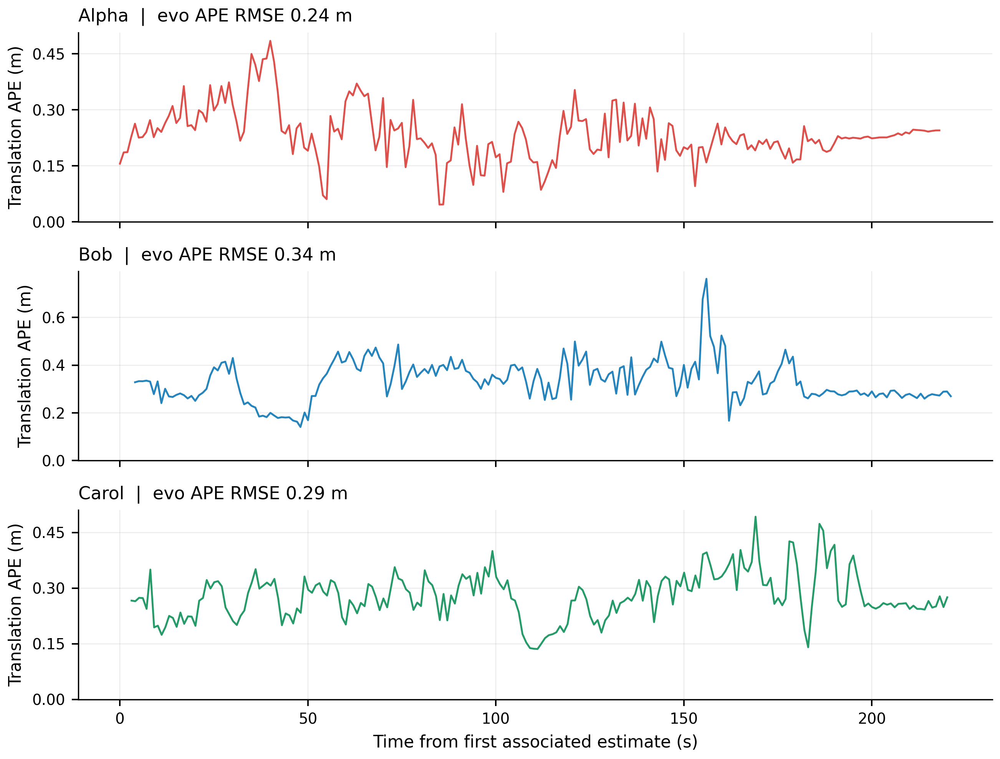
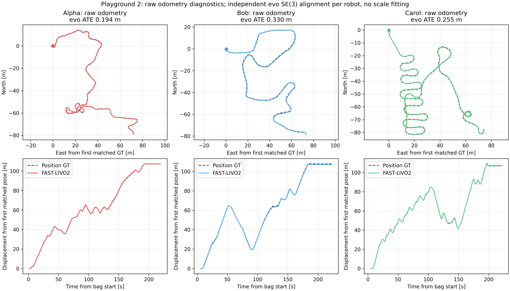
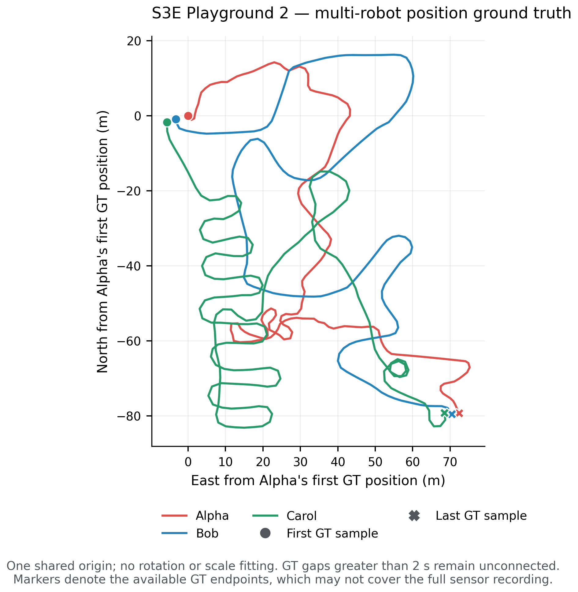
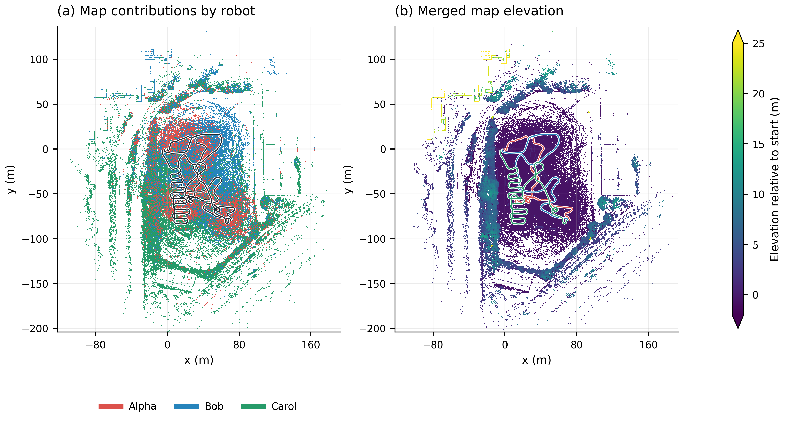
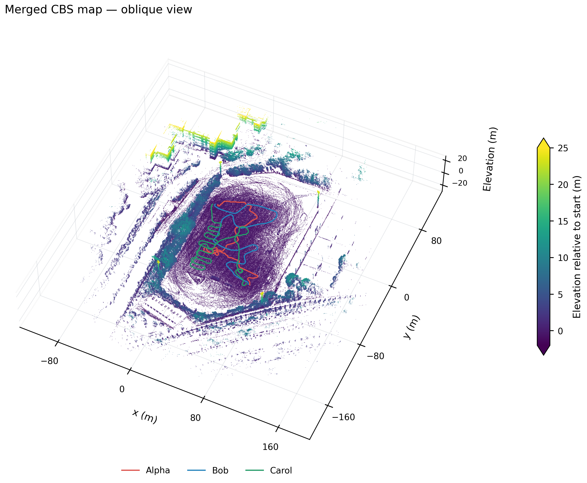

# S3E Playground 2: MegaLoc + MapClosures + CBS

Completed 2026-09-13 on the requested Playground 2 sequence. Components: **Alpha: Alpha, Bob: Alpha, Carol: Alpha**.
The pipeline produced **165 accepted loops** and connected all three robots, with **0.2941 m combined CBS ATE RMSE** under one shared rigid alignment. Raw odometry and corrected trajectories both track the supplied position ground truth throughout the sequence; the early under-motion seen in Playground 1 is absent here.

The official 6.73 GB download was verified against repository revision `dd2d0dccb95985468800ed858a5418005ce75cd3`. The bag spans 222.845 seconds. All three IMU streams have monotonic timestamps, finite measurements and no gaps over 0.2 seconds. Their largest intervals are 16.89, 20.06, and 15.96 ms. SQLite integrity and all metadata message counts pass. [Input and download audit](figures/cbs-playground2/input.json).

Each robot starts at bag offset zero. `vio.img_point_cov=100` is explicitly applied to all three robots, following the Playground 1 startup diagnosis. All other mapping parameters and the working MegaLoc, MapClosures, registration and CBS settings are unchanged. There is one configuration, with no sweep. Ground truth is used only for evaluation.

FAST-LIVO2 runs serially at 1× replay. The three loop front ends and three CBS optimizers then run concurrently through Fast DDS on one host using frozen odometry/descriptors. This remains offline distributed replay, not end-to-end online operation.

## CBS trajectory accuracy

Evo 1.36.5 handles timestamp association, rigid alignment and translation APE. Association uses a 0.05 s tolerance, no interpolation and no time offset. Each connected component has one shared SE(3) alignment, no scale fitting and no additional per-robot fit. Placeholder GT orientations are unused. The antenna lever arm is uncorrected.

| Robot | Component | ATE RMSE (m) | Median ATE (m) | Matched GT positions |
|---|---|---:|---:|---:|
| Alpha | Alpha | 0.2446 | 0.2269 | 219 |
| Bob | Alpha | 0.3438 | 0.3304 | 218 |
| Carol | Alpha | 0.2856 | 0.2731 | 218 |
| **Component Alpha combined** | Alpha | **0.2941** | **0.2720** | **655** |



Native evo archives and matched trajectories are preserved under [evo](figures/cbs-playground2/evo/cbs/README.md).

## Raw odometry and coverage

The raw odometry ATEs below use independent per-robot SE(3) fits for diagnosis. They cannot be subtracted directly from the shared-component CBS ATEs.

| Robot | Received / expected clouds | Exported frames | Export span (s) | Raw odometry ATE RMSE (m) |
|---|---:|---:|---:|---:|
| Alpha | 2207 / 2207 | 2199 | 219.805 | 0.1941 |
| Bob | 2194 / 2194 | 2188 | 218.702 | 0.3302 |
| Carol | 2185 / 2185 | 2179 | 217.798 | 0.2548 |



[Raw trajectories, evo statistics and provenance](figures/cbs-playground2/raw_odometry.json).

## Loops and communication

| Measurement | Result |
|---|---:|
| Keyframes: Alpha / Bob / Carol | 407 / 342 / 542 |
| Accepted loops | 165 |
| Inter-robot / intra-robot | 144 / 21 |
| MapClosures only / both branches / MegaLoc only | 79 / 31 / 55 |
| Alpha–Bob / Alpha–Carol / Bob–Carol | 79 / 43 / 22 |
| Connected components | 1 |
| Verification attempts | 525 |
| Verification yield | 31.43% |
| Recall@1 / @5 / @20 | 57.92% / 72.43% / 78.89% |
| Proximity precision / recall | 19.42% / 18.61% |
| Accepted loops within 10 m / assessable | 107 / 165 |
| Loop exchange CDR bytes | 211033052 |
| CBS belief CDR bytes | 675498 |
| Median / p95 wall detection latency | 0.275 / 0.464 s |
| Detection + CBS wall time | 95.83 s |

Branch counts are mutually exclusive attributions within this single fused run. A constraint proposed by both retrieval branches is counted once. Recall and precision use position-proximity labels; they do not establish exact 6-DoF loop correctness. In particular, valid overlapping submaps can have origins farther than the 10 m proximity threshold. CDR accounting excludes RTPS, discovery and retransmission overhead.

## Ground truth, corrected trajectories and maps








Map colors show robot identity or elevation, not camera RGB. The map figures use a 0.30 m display grid and an oblique sample of at most 650,000 points. PNG and PDF versions are retained.

## Runtime and validation

| Stage | Alpha / Bob / Carol (s) |
|---|---:|
| Odometry | 229.1 / 231.4 / 230.6 |
| Keyframes / submaps | 115.1 / 106.2 / 241.3 |
| MegaLoc CUDA descriptors | 22.4 / 16.0 / 25.1 |
| MapClosures descriptors | 6.5 / 4.7 / 24.7 |

Detection/CBS took 95.83 s; evaluation, map reconstruction and Rerun export took 54.59 s. MegaLoc used one CUDA inference worker; mapping, MapClosures, GICP and CBS used CPU. Memory and convergence diagnostics are in the [complete numeric report](figures/cbs-playground2/report.json).

The audit found zero future-frame or same-robot-exclusion violations, unique loop endpoint pairs and exact serialized-byte accounting. It reproduced evo statistics from saved poses. The Python suite passed 38 tests with four optional ROS tests skipped. [Audit](figures/cbs-playground2/audit.json) · [Figure and stage provenance](figures/cbs-playground2/figures.json). Accepted constraints, verification diagnostics, effective mapping configurations and stage manifests are also retained beside the figures.

## Retention and reproduction

The Rerun 0.37.1 recording is retained locally at `.ros2/recordings/playground2-cbs.rrd` (216.1 MB). The recording passed `rerun rrd verify`, including footer checks. Generated intermediate outputs totaling 5.47 GiB were removed after validation. Reports, figures, small trajectory/evo evidence and the original dataset are retained.

Playground 1's large generated outputs and recording were removed; its reports and small diagnostic evidence remain. Its original dataset was not deleted.

```bash
FAST-LIVO2-ROS2/scripts/s3e_experiment.sh run --stage all \
  --config FAST-LIVO2-ROS2/research/configs/playground2-cbs.yaml --resume
```

CBS branch: `dev/fast-livo2-s3e-dpgo` at `11d84afe3397870cddecb5b6c07f4ed6866466a4`. CBS ROS branch: `dev/fast-livo2-s3e-dpgo` at `86e3e3511b9c4bb2750628c823b682b5200c34a3`.
