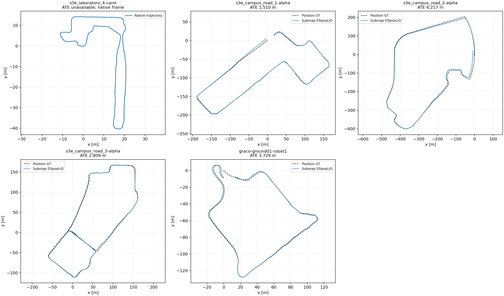

# Submap EllipseLIO: retries of previously failed frontends

**All five targeted frontend replays completed without observed divergence.** Campus Road 1, Campus Road 3 and GRACO ground-01 also meet the 5 m position-ATE reference threshold used for the earlier Bob gate. Campus Road 2 remains above that threshold. Laboratory 4 has no usable timestamp-matched GT, so its accuracy remains unverified.

The serial queue ran on workstation 148 on 2026-09-18 and finished at 11:57:54 UTC. Results and artifacts were audited on 2026-09-19. These are fresh, full selected-sensor replays of the previously failed robot in each sequence. They do not cover other robots or the sequences whose earlier failures occurred only in descriptor preparation or CBS. [Library 2 was already tested separately](RESULTS-RECENT-SUBMAPS-LIBRARY2.md).

| Case | Frontend outcome | Position ATE [m] | Maximum speed [m/s] | Maximum successful-update gap [s] |
|---|---|---:|---:|---:|
| Laboratory 4 / Carol | Completed, stable | Unavailable | 1.355 | 0.201 |
| Campus Road 1 / Alpha | Completed, stable | 1.5096 | 2.904 | 0.102 |
| Campus Road 2 / Alpha | Completed, stable | 6.2167 | 3.033 | 0.211 |
| Campus Road 3 / Alpha | Completed, stable | 2.8090 | 2.177 | 0.205 |
| GRACO ground-01 / robot1 | Completed, stable | 3.7293 | 2.243 | 0.328 |

“Stable” means finite chronological native poses, no scan-derived speed above 20 m/s, and no post-initialization gap of one second or more between successful LiDAR updates. ATE is evaluated separately. The machine-readable `gate_pass` additionally requires ATE ≤5 m; it is false for Laboratory 4 because accuracy is unavailable, not because the frontend diverged.

All ATE values use **evo 1.36.5**, nearest timestamp association within **50 ms**, independent rigid alignment per raw trajectory, and **no scale fitting or timestamp interpolation**. GT was read only for evaluation. S3E GT orientations are unused and its antenna lever arm is uncorrected. GRACO is evaluated against the supplied `T_Base_Imu` positions in the IMU frame; no antenna correction applies. The original GRACO evaluation's generic S3E reference label was corrected in a separate retained evaluation directory; all numeric metrics reproduced exactly.

Laboratory 4 / Carol's supplied GT contains only two samples, with no matching sensor timestamps. No GT time shift or substitute reference was introduced. Source-tail audits confirm all five captures reached the selected sensors' processable tail within 0.2 seconds; Campus Road 3 ends approximately 0.098 seconds before its last cloud header. The full multi-robot bag duration can exceed a selected robot's stream duration, as in Campus Road 1. Native pose counts exclude startup synchronization and unprocessed source scans; completion does not mean every source cloud became a pose.

## What these retries establish

The earlier documented failures were severe motion divergence on Laboratory 4 / Carol and Campus Road 1–2 / Alpha, divergence followed by an octree-capacity exit on Campus Road 3 / Alpha, and early divergence on GRACO / robot1. None recurred in these captures. Campus Road 2 nevertheless has 6.2167 m ATE, so avoiding divergence does not eliminate trajectory error.

These are **current-configuration frontend checks, not controlled submap-only comparisons**. The S3E retries use the requested IMU noise from the successful Library 2 configuration rather than the historical dataset-noise settings. They also use the guarded `-O3` native build and four-thread launcher. GRACO preserves its original ground calibration and all four supplied ground IMU noise values. There was one replay per case, no fresh persistent-map baseline for this batch, and no parameter sweep. In particular, GRACO previously showed run-to-run variability; this single successful replay does not establish reproducibility or a general cure.

No MapClosures, PCM or CBS stage ran in this batch. These results therefore establish frontend outcomes only, not multi-robot connectivity or backend accuracy on these sequences.

## Configuration and verification

All captures used native **10-second submaps with 5-second overlap**, reliable sensor input, 1× serial replay, the same four-thread launcher, OMP=4, a 12-core container quota and a 40 GiB memory limit. S3E noise is `(acc_noise, gyr_noise, acc_bias, gyr_bias) = (0.1, 0.1, 0.0001, 0.0001)`. Original per-robot LiDAR calibration, filtering, sensor topics and rates were preserved. The separate research deskew exporter remained disabled and its assertion unchanged. Ground truth was not supplied to odometry.

All five captures used the same native library SHA-256 as the successful Library 2 trials: `702e54bec085ad8d0b621fa4ed5ba95161ddd35ef15f7ee783f751fdea253964`. The [retention/control audit](figures/recent-submaps-failed-frontends/retention-audit.json) checks binary identity, calibration and sensor settings, source-tail coverage and recording verification.

The snapshots comprise **771 completed submaps and 10 inspection-only tails**. Every capture passed exact member-scan/window, anchor-pose, finite-geometry and payload-hash validation. Maximum matched-point source age stayed below 10 seconds. All five live Rerun recordings passed `rerun rrd verify`. Snapshot geometry is the native processed member scans, not full-resolution raw LiDAR.

| Case | Native poses | Frontend wall [s] | Mean processing [ms/scan] | Peak mapper RSS [MiB] |
|---|---:|---:|---:|---:|
| Laboratory 4 / Carol | 3,794 | 390.26 | 3.69 | 361.4 |
| Campus Road 1 / Alpha | 7,129 | 721.99 | 15.60 | 556.2 |
| Campus Road 2 / Alpha | 15,704 | 1593.81 | 12.68 | 551.7 |
| Campus Road 3 / Alpha | 8,892 | 912.32 | 13.09 | 528.1 |
| GRACO ground-01 / robot1 | 3,142 | 341.24 | 15.85 | 575.6 |

RSS measures the mapper process, not the recorder. Saved per-scan diagnostics contain successful-update flags, residuals, correspondence ages, processing times and handovers; memory traces and complete runtime configurations are retained.

The runner now accepts a bag path and robot namespace and derives its recorder time origin from that bag. Recorder options support a dataset label and the actual raw IMU topic, including GRACO's `/gnss/imu`. Existing Library 2 evaluator metrics reproduced exactly after adding separate motion, continuity and accuracy verdicts. Python syntax and source-diff whitespace checks passed; the actual five dataset runs exercise the generalized runner.

## Artifacts and reproduction

[Machine-readable results](figures/recent-submaps-failed-frontends/summary.json), [frozen cases and configurations](figures/recent-submaps-failed-frontends/cases.json), and [queue status](figures/recent-submaps-failed-frontends/status.json) accompany the figure. Each case directory contains native TUM trajectories, metrics, evo archives and aligned/matched trajectories where GT is available, snapshot-validation results, coverage audits, source hashes and recording-verification logs.

Full outputs remain on 148 under `/data3/mikexyl/swarm_s3e_ws/src/.ros2/recent-submaps/failed-frontends-20260918/`. Case directories are `s3e_laboratory_4-carol`, `s3e_campus_road_1-alpha`, `s3e_campus_road_2-alpha`, `s3e_campus_road_3-alpha`, and `graco-ground01-robot1`. Each live recording is `recording/live.rrd`; immutable geometry and indices are in `frontend/submaps/`. Their SHA-256 hashes and sizes are in the retention audit. Laboratory 4's recording retains the older “Library 2” application title; its case path, sensor timestamps and recorded data are Laboratory 4.

Local compact evidence is under workspace `.ros2/recent-submaps-evidence/failed-frontends-20260918/`. The dedicated [queue script](../scripts/recent_submaps/failed_frontends.py), [coverage audit](../scripts/recent_submaps/sensor_coverage.py), [retention audit](../scripts/recent_submaps/failed_frontends_audit.py) and [report generator](../scripts/recent_submaps/failed_frontends_report.py) retain the workflow. Existing output directories are never reused as new attempts.

No bulk geometry was retired. Previous experiments and the paused CU-Multi download were left unchanged.
