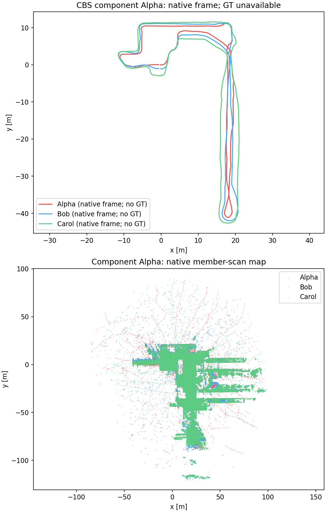
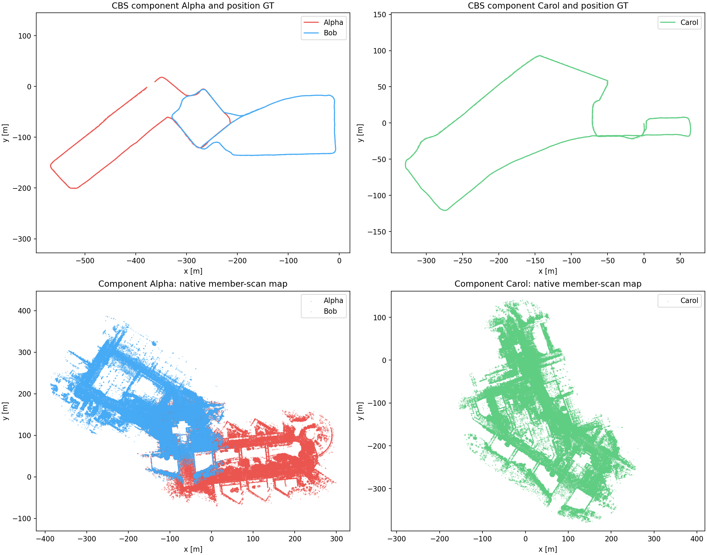
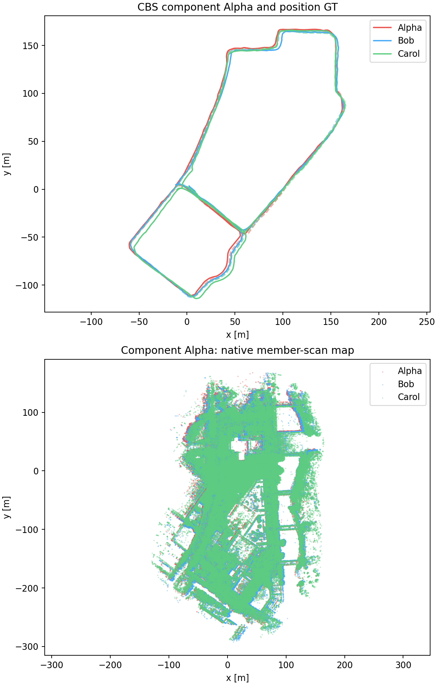
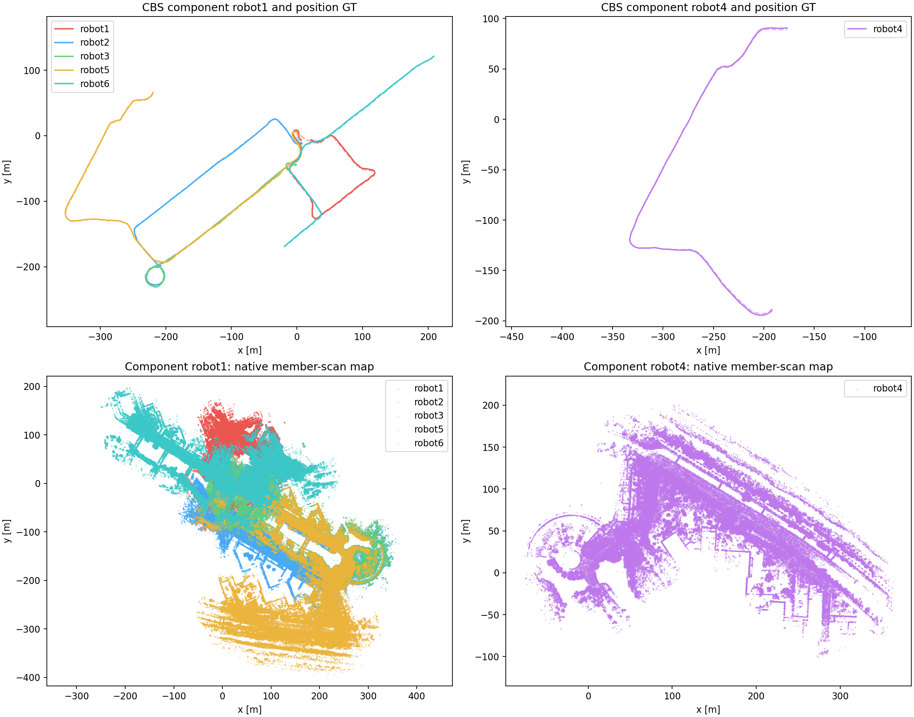

# Submap EllipseLIO: full multi-robot results on five previously failed groups

**All 18 frontends completed without observed divergence, but the full pipeline did not deliver consistently accurate, connected results.** Campus Road 1 connected Alpha/Bob and reduced their reported errors, while Carol remained separate. Campus Road 3 connected all robots but had higher shared-frame errors. GRACO connected five of six robots with higher shared-frame errors. Laboratory 4 connected all robots but has no usable position GT. Campus Road 2 failed the CBS common-frame check despite a connected loop graph.

The batch ran on workstation 148 from **2026-09-19 09:56:20 to 11:15:29 UTC** (79 minutes 9 seconds). It contains 13 new parallel replays and five verified captures reused from the earlier frontend retries. No parameter sweep or backend repair was performed.

Native EllipseLIO uses 10-second submaps with 5-second overlap. Completed native submaps supply both ellipsoid-BEV descriptors and processed member-scan registration evidence to MapClosures → distributed PCM → CBS with GICP factors.

Three independent 1× frontend replays run concurrently, with four executor threads each, separate ROS domains, and the then-existing shared 12-core / 40 GiB container limits. These were historical agent-selected settings, not a user-imposed budget; the user subsequently requested uncapped resource use on 148. Five verified prior captures are reused. Group backends run serially after frontend completion.

ATE uses evo 1.36.5, 50 ms association, rigid alignment, and no scale fitting. Raw trajectories have independent alignments. CBS uses one alignment per measured connected component; per-robot CBS values below use that shared alignment. Ground truth is confined to evaluation. A missing value is not a zero error. Raw and CBS alignment scopes differ: these numbers assess the resulting shared map and do not alone isolate how CBS changes each trajectory’s intrinsic shape. S3E uses supplied position GT with orientations unused and antenna lever arm uncorrected; GRACO uses supplied IMU-reference positions.

| Group | Pipeline status | Connected robots | Retained loops | PCM rejected | Backend wall [s] |
|---|---|---|---:|---:|---:|
| S3E_Laboratory_4 | Complete | Alpha+Bob+Carol | 84 | 0 | 34.72 |
| S3E_Campus_Road_1 | Complete | Alpha+Bob; Carol | 12 | 0 | 29.27 |
| S3E_Campus_Road_2 | Invalid CBS common frame | Loop graph: Alpha+Bob+Carol; inconsistent output frames | 217 | 3 | 194.07 |
| S3E_Campus_Road_3 | Complete | Alpha+Bob+Carol | 103 | 0 | 107.14 |
| GRACO_ground_01_06 | Complete | robot1+robot2+robot3+robot5+robot6; robot4 | 23 | 1 | 28.49 |

## S3E_Laboratory_4

| Robot | Raw ATE [m] | CBS ATE in shared component [m] | Maximum speed [m/s] | Maximum successful-update gap [s] | Peak mapper RSS [MiB] |
|---|---:|---:|---:|---:|---:|---:|
| Alpha | Unavailable | Unavailable | 1.013 | 0.110 | 353.5 |
| Bob | Unavailable | Unavailable | 1.132 | 0.117 | 356.9 |
| Carol | Unavailable | Unavailable | 1.355 | 0.201 | 361.4 |

Shared-component ATE: unavailable. Each supplied GT file contains only two samples at 0 and 1 seconds, with no overlap with sensor timestamps.

Full metrics, evo archives, trajectories, map arrays and verified Rerun recording: `S3E_Laboratory_4/report/`.

No evaluable raw position ATE for: Alpha, Bob, Carol. See ground-truth status in the JSON report; no reference repair or timestamp shift was applied.

## S3E_Campus_Road_1

| Robot | Raw ATE [m] | CBS ATE in shared component [m] | Maximum speed [m/s] | Maximum successful-update gap [s] | Peak mapper RSS [MiB] |
|---|---:|---:|---:|---:|---:|---:|
| Alpha | 1.5096 | 1.2198 | 2.904 | 0.102 | 556.2 |
| Bob | 4.2158 | 2.2835 | 2.427 | 0.201 | 590.2 |
| Carol | 1.5904 | 1.5904 | 3.230 | 0.201 | 601.7 |

Shared-component ATE: Alpha: 1.9743 m; Carol: 1.5904 m.

Full metrics, evo archives, trajectories, map arrays and verified Rerun recording: `S3E_Campus_Road_1/report/`.

## S3E_Campus_Road_2

**CBS failed to produce a consistent common frame.** Its retained loop graph connects all three robots (96 Alpha–Bob, 73 Alpha–Carol and 47 Bob–Carol inter-robot loops, plus one same-robot loop), but output poses label Alpha in frame `Alpha` and Bob/Carol in frame `Bob`. The evaluation therefore rejects the output rather than computing a misleading shared ATE. There were 220 proposed loops, three PCM rejections, 217 retained loops and 217 GICP factors. Optimization/detection ran for 194.07 seconds. This is a backend outcome, not a frontend divergence.

Raw-only evaluation was subsequently run against the unchanged native captures using the same evo protocol; no CBS output was altered.

| Robot | Raw ATE [m] | Valid CBS ATE |
|---|---:|---|
| Alpha | 6.2167 | Unavailable: inconsistent common frame |
| Bob | 14.1300 | Unavailable: inconsistent common frame |
| Carol | 3.3508 | Unavailable: inconsistent common frame |

## S3E_Campus_Road_3

| Robot | Raw ATE [m] | CBS ATE in shared component [m] | Maximum speed [m/s] | Maximum successful-update gap [s] | Peak mapper RSS [MiB] |
|---|---:|---:|---:|---:|---:|---:|
| Alpha | 2.8090 | 3.2512 | 2.177 | 0.205 | 528.1 |
| Bob | 3.1979 | 4.2626 | 2.711 | 0.204 | 544.6 |
| Carol | 2.5207 | 3.2425 | 2.845 | 0.209 | 623.8 |

Shared-component ATE: Alpha: 3.6144 m.

Full metrics, evo archives, trajectories, map arrays and verified Rerun recording: `S3E_Campus_Road_3/report/`.

## GRACO_ground_01_06

| Robot | Raw ATE [m] | CBS ATE in shared component [m] | Maximum speed [m/s] | Maximum successful-update gap [s] | Peak mapper RSS [MiB] |
|---|---:|---:|---:|---:|---:|---:|
| robot1 | 3.7293 | 4.2606 | 2.243 | 0.328 | 575.6 |
| robot2 | 2.2601 | 4.1353 | 3.007 | 0.312 | 573.1 |
| robot3 | 10.8679 | 12.0275 | 3.566 | 0.320 | 536.1 |
| robot4 | 0.9279 | 0.9279 | 2.190 | 0.216 | 537.6 |
| robot5 | 1.2587 | 2.8836 | 2.483 | 0.192 | 547.9 |
| robot6 | 1.1625 | 5.6643 | 2.182 | 0.192 | 536.7 |

Shared-component ATE: robot1: 6.1543 m; robot4: 0.9279 m.

Full metrics, evo archives, trajectories, map arrays and verified Rerun recording: `GRACO_ground_01_06/report/`.

## Verification and retained evidence

All 18 live Rerun recordings passed verification. The four successfully evaluated groups also have verified derived Rerun recordings and completed audits of descriptor/evidence membership, causal retrieval availability, same-robot loop exclusion, graph anchor timestamps, and immutable artifact hashes. Campus Road 2 has no derived common-frame report or recording; its frontend artifacts were validated and backend diagnostic outputs are retained. All 18 trajectories are finite and chronological, with maximum scan-derived speed below 3.57 m/s and maximum successful-LiDAR-update gap below 0.329 s. There are 2,579 completed submaps plus 36 inspection-only tails. Maximum matched-point age remains below 10 seconds. Per-scan diagnostics retain handover steps, correspondence ages, successful-update status, processing time and memory measurements. Geometry is native processed member-scan data, not full-resolution raw LiDAR.

All frozen source/binary hashes were rechecked after completion. The parallel scheduler passed its five tests; the generic report reproduced Library 2 ATE results, and the additional artifact audit passed against its 280 completed submaps and 840 retrieval events.

This is one current-configuration full-pipeline trial per group, with no parameter sweep. Successful completion does not establish general robustness. The earlier serial partial capture is retained separately with its parallel-relaunch annotation. Previous experiments and the paused CU-Multi download are preserved.

Machine-readable outputs: `batch-summary.json`, `retention-audit.json`, `plan.json`, `source-hashes.json`, and each group’s `report/report.json` or `failure.json`. All bulk geometry is retained.

## Artifact locations and earlier comparison

[Batch summary](figures/recent-submaps-full-five-groups/batch-summary.json), [retention audit](figures/recent-submaps-full-five-groups/retention-audit.json), and [run status](figures/recent-submaps-full-five-groups/status.json) accompany this report. Compact configurations, logs, metrics, evo archives, raw/CBS trajectories and figures are retained locally under `research/figures/recent-submaps-full-five-groups/`. The Campus Road 2 raw-only evaluation is retained there in its separate `raw-evaluation-after-backend-failure/` directory. The original automatic report remains unchanged alongside these artifacts.

Full immutable geometry, map NPZ files and live/derived Rerun recordings remain on 148 under `/data3/mikexyl/swarm_s3e_ws/src/.ros2/recent-submaps/full-five-groups-parallel-20260919/`, with reused captures under the earlier `failed-frontends-20260918/` root. File hashes are in the retention audit.

The earlier [Library 2 controlled comparison and three-robot result](RESULTS-RECENT-SUBMAPS-LIBRARY2.md) achieved **1.5522 m shared CBS ATE**, with 105 loops retained and all three robots connected. That result is separate from the five groups above. The present mixed outcomes do not support treating submaps plus CBS as a general accuracy fix.
