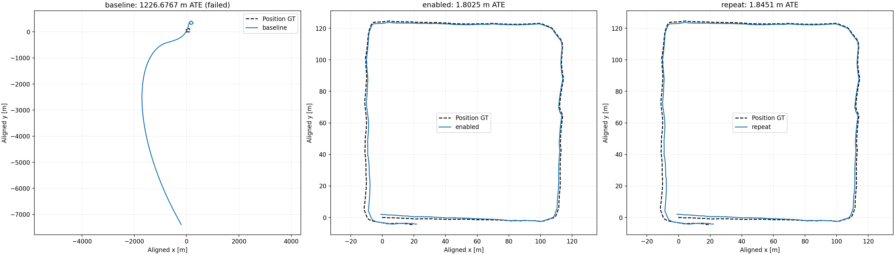
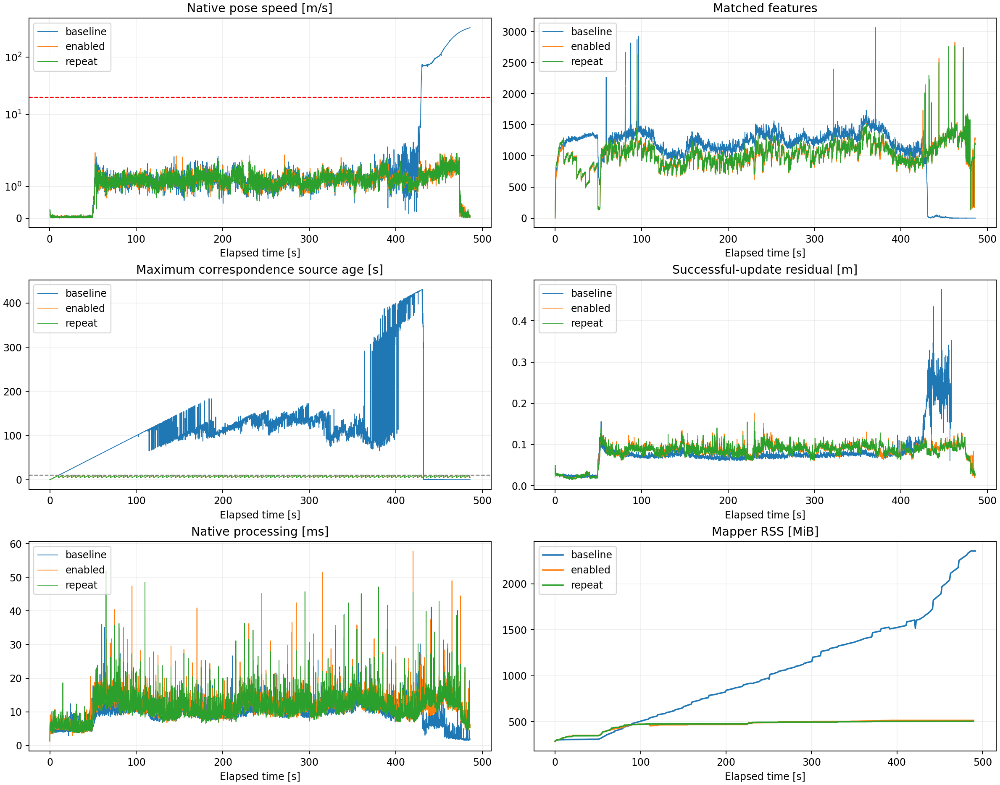
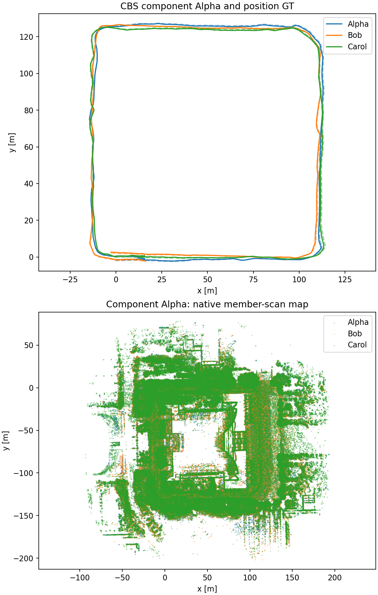

# Library 2: recent-history EllipseLIO submaps

**Implemented and validated. Bob passed the rollout gate twice; the three-robot MapClosures → PCM → CBS run completed in one shared component.**

The fresh persistent-map baseline reproduced late divergence. Ten-second submaps with five-second overlap completed Bob at **1.8025 m position ATE**, and the confirmation run achieved **1.8451 m**. This supports improvement on Library 2 under these settings; it does not establish a general cure. There was no parameter sweep.

All ATE values are translation RMSE from **evo 1.36.5**, nearest association within **50 ms**, rigid alignment and **no scale fitting**. GT was used only for evaluation and the rollout gate. Supplied GT orientations were unused and the antenna lever arm was uncorrected. Baseline ATE is a failed-run diagnostic.

## Controlled Bob comparison

| Mode | Full replay | ATE [m] | Maximum speed [m/s] | Maximum successful-update gap [s] | Peak mapper RSS [MiB] |
|---|---|---:|---:|---:|---:|
| Persistent baseline | yes | 1226.6767 | 328.364 | 20.599 | 2357.1 |
| Submaps | yes | 1.8025 | 2.162 | 0.203 | 513.6 |
| Submaps confirmation | yes | 1.8451 | 2.130 | 0.203 | 504.3 |

Both enabled captures had finite chronological poses, no speed above 20 m/s, no successful-update gap of one second or more, and ATE below 5 m. Each had 96 handovers, 96 completed retrievable submaps and two inspection-only tails. Complete window membership, anchor poses and payload hashes passed validation. Maximum matched-point source age stayed below 10 seconds; the baseline reached 430.80 seconds. The baseline first exceeded the speed gate 429.19 seconds after its first native pose.

The largest consecutive pose steps at handovers were 0.196 m and 0.264 m in the enabled and confirmation captures. These include ordinary robot motion; they are not isolated measurements of an artificial handover jump. The synthetic handover test separately verifies unchanged filter state and covariance.

All three runs used the same guarded native library, calibration, requested IMU noise `(0.1, 0.1, 0.0001, 0.0001)`, reliable input, four-thread launcher, 1× serial replay, OMP=4, 12-core quota, 40 GiB limit and publication settings. Numerical guards and `-O3` apply to both modes; this baseline is not the historical unguarded binary. No loop or CBS process ran during this comparison. [Control audit](figures/recent-submaps-library2/validation/comparison-controls.json).

Native per-scan logs are authoritative for poses and successful updates; live ROS/Rerun streams can lose messages. Update gaps use sensor timestamps, while speeds use pose timestamps. Small differences in processed scan counts between 1× captures are retained rather than hidden.

## Three-robot result

The first successful Bob capture was reused. Alpha and Carol completed serially with the same submap settings and their supplied S3Ev2 calibrations. Alpha's maximum speed/update gap were 2.052 m/s / 0.211 s; Carol's were 3.006 m/s / 0.200 s. Both had finite chronological native output. The backend consumed 95 Alpha, 96 Bob and 89 Carol completed submaps; two partial tails per robot were retained only for inspection.

| Robot | Raw ATE, individual rigid fit [m] | CBS ATE, shared component fit [m] |
|---|---:|---:|
| Alpha | 1.6884 | 1.0260 |
| Bob | 1.8025 | 0.9755 |
| Carol | 2.6197 | 2.3253 |

**Shared-component CBS ATE: 1.5522 m.** All 14,151 dense native poses are represented in the raw and corrected tracks; the saved evo files document the exact associated sample counts. The CBS column uses one component-wide rigid fit with no additional per-robot alignment. Raw and CBS alignment scopes therefore differ.

MapClosures performed 243 geometric verifications: 106 passed and 137 failed the existing RMSE threshold. PCM retained 105 of the 106 proposed loops and rejected one Bob–Carol loop outside its selected clique. Retained connectivity was Alpha–Bob 39, Alpha–Carol 39 and Bob–Carol 24, plus one Alpha and two Bob intra-robot loops. All robots established Alpha's reference frame. The existing 30-second exclusion and non-overlap restriction held for every retained same-robot loop. An audit checked 1,083 timestamped query events and verification evidence for causal availability.

All 105 retained loops supplied live GICP registration factors. Each owner completed the configured 100 settling iterations. Final pose-change norms were approximately `7.7e-14`, `1.1e-13` and `2.4e-14` for Alpha/Bob/Carol. Termination used the existing fixed settling budget, not a newly tuned convergence criterion. Distributed isolation, MapClosures thresholds, registration preprocessing, PCM and CBS settings were preserved; temporary registration transport geometry was retained for inspection.

The upper panel uses the shared evaluation alignment; the map panel stays in the native CBS reference frame. Maps are reconstructed from **native processed member-scan geometry**, not full-resolution raw LiDAR. The separate research deskew exporter remained disabled, with its strict assertion unchanged.

## Runtime and resources

| Frontend capture | Wall [s] | Mean / maximum processing per scan [ms] | Peak mapper RSS [MiB] |
|---|---:|---:|---:|
| Bob baseline | 493.36 | 9.81 / 41.69 | 2357.1 |
| Bob submaps | 491.37 | 11.54 / 57.81 | 513.6 |
| Bob confirmation | 491.36 | 11.55 / 51.83 | 504.3 |
| Alpha submaps | 491.43 | 11.56 / 52.82 | 481.6 |
| Carol submaps | 501.40 | 14.82 / 55.55 | 542.1 |

Mapper RSS excludes recorder processes. Descriptor/evidence preparation took 24.37 / 24.87 / 28.84 seconds for Alpha/Bob/Carol. The distributed backend took **77.26 seconds**, followed by 42.60 seconds for dense evaluation and map export. Sampled CBS worker peak RSS was 508.8 / 257.2 / 107.2 MiB; retrieval worker peak RSS was 167.8 / 159.1 / 150.7 MiB. Serialized directed CDR traffic was 63,407,762 bytes for loops, 145,126 for PCM, 270,302 for CBS and 15,432,126 for registration; these exclude RTPS/discovery/retransmission overhead.

## Implementation and verification

Both repositories are on `dev/multi-robot-lidar-slam-submaps`, based on published development heads `dba681503308b642dd57e9a0353d5bea1c400d8b` (EllipseLIO) and `37ce474b82a054928a36cc41517a3d9f884e3e9f` (wrapper). Changes remain reviewable in the working trees. [Implementation and reproduction workflow](../scripts/recent_submaps/README.md).

The feature defaults off. Two reusable map buffers own independent geometry, octrees, tensors, neighbours, filters and adaptive statistics. Matching uses the active map throughout the iterated update; insertion follows correction, and archived maps are never queried. Filter state, covariance, IMU propagation, trajectory history and thresholds persist across handovers. Snapshots have versioned metadata, compressed immutable payloads and hashes; geometry is expressed in the last included scan's corrected IMU frame, with anchor and availability timestamps stored separately.

An isolated build and disabled/enabled smoke captures passed before the controlled trials. Native synthetic tests cover boundaries/overlap, startup/gaps, two-buffer reuse and index validity, member-only contributions, no self-matching, unchanged state/covariance, empty/one-feature/non-finite updates and disabled persistent-map behavior. The bounded-writer test delivered 80 immutable 1 MiB packets through capacity two, with 1.724 s of producer time/backpressure, 4,184 KiB peak RSS growth and clean explicit shutdown. Full captures passed snapshot membership/hash/anchor audits. The retained memory traces and two-buffer tests check that retired geometry does not accumulate in active maps; trajectory history intentionally remains persistent.

The local Python suite passed 38 tests with two environment-dependent skips. Those cases were subsequently exercised in the native ROS/CBS environment: the submap DDS/PCM/CBS/GICP integration passed, and all three CBS bridge tests passed. Coverage includes immutable exports, inspection-only tails, descriptor/evidence membership, causal scheduling, overlap rejection, reversed endpoints and isolated retrieval. Final diff whitespace checks passed. [Validation records](figures/recent-submaps-library2/validation/).

All five live Rerun recordings and the derived CBS recording passed `rerun rrd verify`. The recordings distinguish active and archived maps and contain handovers, IDs, correspondence ages, feature counts, residuals, successful-update status and processing time. The source/config/binary hashes confirm that the native frontend library was identical across **all five** full captures.

## Retained artifacts

Numeric results and evo archives: [Bob baseline](figures/recent-submaps-library2/baseline/metrics.json), [Bob enabled](figures/recent-submaps-library2/enabled/metrics.json), [confirmation](figures/recent-submaps-library2/repeat/metrics.json), [Alpha](figures/recent-submaps-library2/alpha-raw/metrics.json), [Carol](figures/recent-submaps-library2/carol-raw/metrics.json), and [complete backend report](figures/recent-submaps-library2/multi-robot/report.json). The backend report directory also contains raw/CBS TUM trajectories, per-robot map NPZs, evo results and the figure above.

[Retention audit and SHA-256 hashes](figures/recent-submaps-library2/validation/retention-audit.json) records all live recordings, derived report outputs, backend sources and configuration. Full immutable snapshots, descriptor/evidence stores, registration transport geometry, native logs, runtime configurations and verified recordings remain on workstation 148 at `/data3/mikexyl/swarm_s3e_ws/src/.ros2/recent-submaps/`. Live recordings are `<trial>/recording/live.rrd` for `bob-baseline`, `bob-enabled`, `bob-enabled-repeat`, `alpha-submaps`, and `carol-submaps`; the derived recording is `multi-robot/report/result.rrd`. Local evidence is under workspace `.ros2/recent-submaps-evidence/`.

No bulk geometry was retired. Previous experiments and the paused CU-Multi download were not modified.
