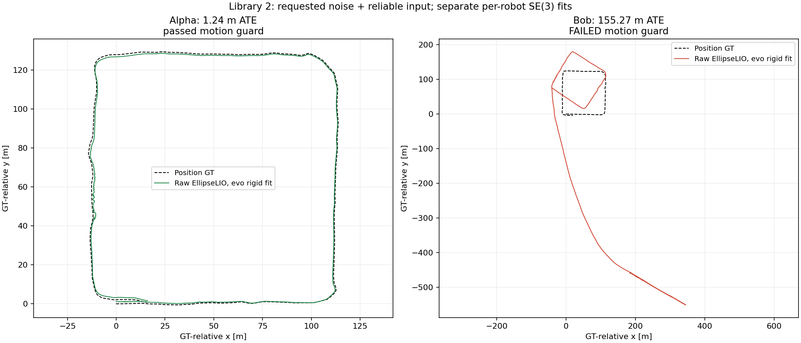
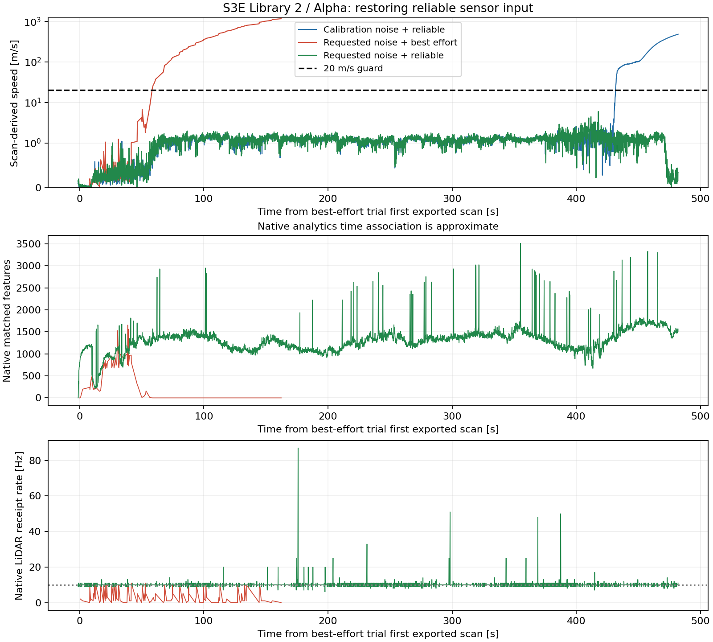
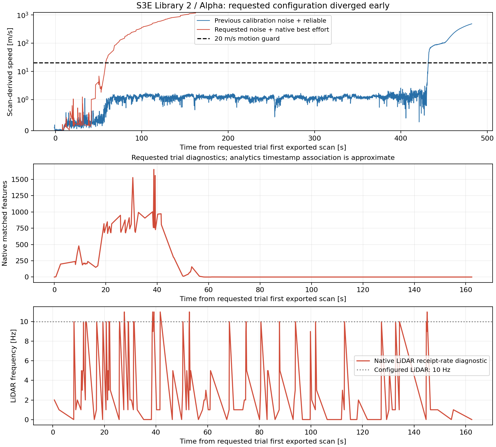

# S3E: requested IMU noise and input QoS

## Latest retry: reliable input restored

Restoring **`input.reliable: true`**, while keeping the requested IMU noise, allowed **Alpha to complete Library 2 with 1.2407 m raw ATE**. Bob still diverged late in the sequence. The queue stopped at Bob's frontend motion check, before Carol, MapClosures, PCM or CBS. There is **no valid three-robot/CBS result** from this retry. The experiment and its container are stopped.

| Robot | Full replay | Exported scan poses | Motion check | Raw translation ATE RMSE [m] | GT-matched poses |
|---|---|---:|---|---:|---:|
| Alpha | Completed | 4,788 | Passed; maximum 5.97 m/s | **1.2407** | 4,788 |
| Bob | Completed | 4,844 | **Failed**; maximum 54.05 m/s | **155.2664**, failed-run diagnostic | 4,823 |
| Carol | Not started | — | — | — | — |

Evo 1.36.5 performs all trajectory association, alignment and ATE calculations: a separate rigid fit per raw robot trajectory, no scale fitting, nearest association within 50 ms, no timestamp interpolation. GT orientations are unused and the antenna lever arm is uncorrected. Passing the motion guard alone is not an accuracy claim; Alpha's independent evo result supplies that additional evidence. Bob's numeric error remains explicitly a failed-run diagnostic.



Both robots maintained median native receipt rates of **10 Hz LiDAR / 100 Hz IMU**, with no zero-feature updates in the recorded post-initialization analytics. Alpha's native log contains only the same startup timing messages as the historical run. Bob first exceeded the motion bound at **443.70 seconds** after its first exported pose. Its median LiDAR/IMU rates remain 10/100 Hz in the late failure interval, and its log has no later explicit estimator error. The recorded median matched-feature count falls from 1,413 at 350–400 seconds to 669 at 450–485 seconds, while median native residual rises from 0.0761 to 0.2104. These are diagnostic correlations, not an established root cause.

The earlier severe scan-update loss is absent with reliable input restored. Over the same **162.30-second timestamp window** used for the best-effort trial:

| Alpha configuration | Exported poses | Window ATE [m] | Window motion check |
|---|---:|---:|---|
| Dataset noise + reliable input, historical run | 1,622 | 0.6846 | Passed |
| Requested noise + best-effort input | 146 | 11,924.35 | Failed |
| Requested noise + reliable input | 1,620 | **0.6831** | Passed |

These are common-window diagnostics with differing samples, not three full-sequence benchmark scores. The historical dataset-noise run subsequently failed at 433 seconds; Alpha's new reliable-input replay passed through that interval and completed.



The retry used the exact pipeline source and binary hashes of the best-effort trial, the same 1x playback, calibration, 12-core quota, 40 GiB memory limit and pinned image. Runtime comparison confirms the only mapper YAML changes were `input.reliable: true` and the unique export path. This flag changes both reliability and queue depths: reliable depths are 100 LiDAR / 1,000 IMU, versus the native sensor QoS depth of five. This experiment tests that combined input policy; it does not isolate reliability from buffering, nor prove the underlying DDS loss mechanism.

The requested values remain `acc_noise: 0.1`, `gyr_noise: 0.1`, `acc_bias: 0.0001`, `gyr_bias: 0.0001`. [Retry config](configs/s3e-ellipselio-user-noise-reliable.yaml), [actual Alpha runtime](figures/s3e-user-noise/library2/reliable/attempt/Alpha/runtime.yaml), [actual Bob runtime](figures/s3e-user-noise/library2/reliable/attempt/Bob/runtime.yaml), [live LiDAR QoS](figures/s3e-user-noise/library2/reliable/lidar-qos.txt), [live IMU QoS](figures/s3e-user-noise/library2/reliable/imu-qos.txt).

The run lasted **16 min 25 s**, from **2026-09-17 14:34:46 to 14:51:11 UTC**. Host run directory:

```text
/data3/mikexyl/swarm_s3e_ws/src/.ros2/s3e-noise-reliable-test/library2-20260917/S3E_Library_2/20260917T143446Z-ac1857
```

Both frontend exports completed normally and their compressed frame indices verify against the original export manifests. The failure was the subsequent Bob motion guard, not a process crash. Cleanup removed **3.286 GB** of generated clouds and ellipsoid deltas. Compact evidence, complete analytics, plots, evo results and configuration remain; no Rerun recording was generated because the backend was not reached. The CU-Multi download remains paused.

[Frontend audit](figures/s3e-user-noise/library2/reliable/frontend-audit.json), [Alpha evo result](figures/s3e-user-noise/library2/reliable/evo-full/Alpha/evaluation.json), [Bob evo diagnostic](figures/s3e-user-noise/library2/reliable/evo-full/Bob/evaluation.json), [terminal queue status](figures/s3e-user-noise/library2/reliable/queue.json), [cleanup](figures/s3e-user-noise/library2/reliable/attempt/cleanup.json). Reproduce the audit from retained evidence using `.ros2/research-venv/bin/python FAST-LIVO2-ROS2/research/figures/s3e-user-noise/library2/reliable-audit.py` from the workspace `src` directory.

## Earlier trial: reliable input omitted

The **2026-09-17 Library 2 / Alpha trial failed**. With the requested noise values and `input.reliable` omitted, the exported trajectory first exceeded the existing 20 m/s motion guard **58.60 seconds after its first scan pose**. The previous run first crossed that guard at **433.00 seconds**. This setting did not resolve the frontend failure on this sequence.

That intended full replay was stopped after clear divergence, at approximately 168 seconds of bag playback. Bob and Carol were not started, and no MapClosures, PCM or CBS stage ran. This earlier best-effort attempt produced **no full-sequence or multi-robot ATE**. Its process is stopped.

## Applied configuration

| Requested name | EllipseLIO native name | Value |
|---|---|---:|
| `acc_cov` | `imu.acc_noise` | 0.1 |
| `gyr_cov` | `imu.gyr_noise` | 0.1 |
| `b_acc_cov` | `imu.acc_bias` | 0.0001 |
| `b_gyr_cov` | `imu.gyr_bias` | 0.0001 |

Values are applied directly to EllipseLIO's process-noise parameters, without squaring. They override dataset noise after loading S3E calibration. The runtime YAML contains no `input` section. Live ROS endpoint inspection confirmed `BEST_EFFORT` on both native LiDAR and IMU subscriptions; the bag player offered reliable delivery. Removing the YAML parameter uses the existing native default `input.reliable=false`; no estimator binary was rebuilt.

The S3Ev2 LiDAR/IMU extrinsics, sensor rates, 0.1 m map resolution and LiDAR filtering exactly match the saved previous runtime. Replay remained 1x. Native analytics was enabled for diagnosis. Noise and subscription QoS changed together, so this result cannot attribute the failure to either change alone. The new container had a 12-core CPU quota versus the original queue's 16; this is not a controlled single-variable comparison.

[Experiment config](configs/s3e-ellipselio-user-noise.yaml), [actual runtime YAML](figures/s3e-user-noise/library2/attempt/Alpha/runtime.yaml), [previous runtime YAML](figures/s3e-user-noise/library2/previous/Alpha/runtime.yaml).

## Observations

| Diagnostic | Previous run | Requested trial |
|---|---:|---:|
| First motion-guard violation, seconds from each first exported pose | 433.00 | 58.60 |
| Scan poses in the same 162.30-second timestamp window | 1,622 | 146 |
| Maximum scan-derived speed in that window [m/s] | 1.727 | 1,174.313 |
| Motion guard in that window | Passed | Failed |
| Native `Lidar has no new data` log messages, whole recorded run | 3 | 111 |

The log counts are throttled messages, not counts of dropped packets. Native analytics reported a median LiDAR receipt frequency of **3 Hz** against the configured 10 Hz, while IMU receipt remained at **100 Hz**. Of 145 updates after initialization, **68 had zero matched features**. Median measured native update time was **5.35 ms**. These observations indicate inadequate LiDAR delivery/update continuity and feature support during this trial. They do not establish the transport failure mechanism, or prove that noise alone is unsuitable.



The top panel includes the entire previous replay and the stopped new replay. The lower panels show only the new trial. Native analytics messages have no header; their time axis uses the latest observed odometry stamp and is approximate. Motion-guard timing comes from the exact exported scan timestamps.

For diagnosis only, evo 1.36.5 evaluated both trajectories within the same **162.30-second timestamp bounds**, with independent rigid alignment, 50 ms nearest association and no scale fitting. The previous prefix had **0.6846 m** translation ATE over 1,622 matched poses. The diverged trial had **11,924.35 m** over 146 matched poses. Sampling differs, and the trial is incomplete: these are failed-prefix diagnostics, not valid full-sequence benchmark results. GT orientations are unused and the antenna lever arm remains uncorrected. [Saved evo results](figures/s3e-user-noise/library2/evo-prefix/attempt/evaluation.json).

## Evidence and reproduction

The trial ran on 148 from **14:19:53 to 14:22:42 UTC**, using the pinned existing image and native binaries. Host run directory:

```text
/data3/mikexyl/swarm_s3e_ws/src/.ros2/s3e-noise-test/library2-20260917/S3E_Library_2/20260917T141953Z-ca4af0
```

The failed attempt remains explicitly incomplete. Its wrapper records `Interrupted` because it was stopped after independently detecting divergence. The export writer's subsequent EOF error is a consequence of that interruption, not the initiating failure. No completion manifest was manufactured. Cleanup removed **51.76 MB** of generated clouds and ellipsoid deltas; logs, analytics, configuration and compressed frame indices remain. Earlier experiment results and the paused CU-Multi download are unchanged.

[Machine-readable audit](figures/s3e-user-noise/library2/audit.json), [stop reason](figures/s3e-user-noise/library2/attempt/stop-reason.json), [native log](figures/s3e-user-noise/library2/attempt/Alpha/mapping.log), [analytics](figures/s3e-user-noise/library2/attempt/Alpha/analytics.jsonl), [cleanup record](figures/s3e-user-noise/library2/attempt/cleanup.json).

Reproduce diagnostics from retained evidence, from the workspace `src` directory:

```bash
.ros2/research-venv/bin/python FAST-LIVO2-ROS2/research/figures/s3e-user-noise/library2/audit.py
```

The queue accepts an explicit `--config`; the existing default experiment stays reproducible. Its four focused tests pass, including verification that requested noise survives dataset calibration loading and that native sensor QoS removes the generated parameter. Any new replay must use a fresh output base; a completed failed attempt is never reused as a valid cache.

## Bob online Rerun capture — 2026-09-17

A fresh 1× Library 2 / Bob replay was recorded directly from the running native
ROS publishers: scans, map chunks, sparse ellipsoid markers, post-LiDAR TF poses,
IMU, residuals, feature counts and timing. It completed with 4,847 received
scan/pose updates. The first scan-derived speed over 20 m/s occurred at
**417.492 seconds from bag start**; inspect around 400–420 seconds. Neither
MapClosures nor CBS ran in this capture.

The recording is retained locally at
`.ros2/bob-live-rerun/20260917T154757Z/recording/live.rrd` relative to workspace
`src`, and at the same relative path under `/data3/mikexyl/swarm_s3e_ws/src` on
148. It is **509.3 MB (485.7 MiB)** and passed Rerun 0.37.1 verification on both
workstations. [Verification and hash](figures/s3e-user-noise/library2/live-bob/verification.json),
[stream counts](figures/s3e-user-noise/library2/live-bob/status.json),
[actual runtime](figures/s3e-user-noise/library2/live-bob/runtime.yaml),
[process summary](figures/s3e-user-noise/library2/live-bob/summary.json).
The stream status records size before the final footer; verification records
the closed file size.

Requested noise settings and `input.reliable: true` were retained. Native map
publication sleeps between chunks and blocks sensor processing in the installed
single-threaded launcher. This capture uses a separate four-thread launcher
loading the unchanged estimator library, consistent with upstream's
multithreaded component launch. An initial concurrent attempt stopped on the
research exporter's strict deskew/reference-timestamp assertion at 95 seconds.
The successful capture disables that separate exporter and records native ROS
outputs. The assertion is preserved, and earlier experiment results are
unchanged. Different callback scheduling and export overhead mean this capture
is not an exact replay of the earlier research result.

31 of 48 map snapshots had all 100 chunks received; later snapshots are partial
on the best-effort output channel. Visualization caps each scan at 6,000 points
and each map chunk at 1,000 points. Native markers represent a sparse subset
of fitted ellipsoids. Analytics timestamps are approximate because native
messages have no header.
[Recorder and reproduction instructions](../scripts/ellipselio_live/README.md).
