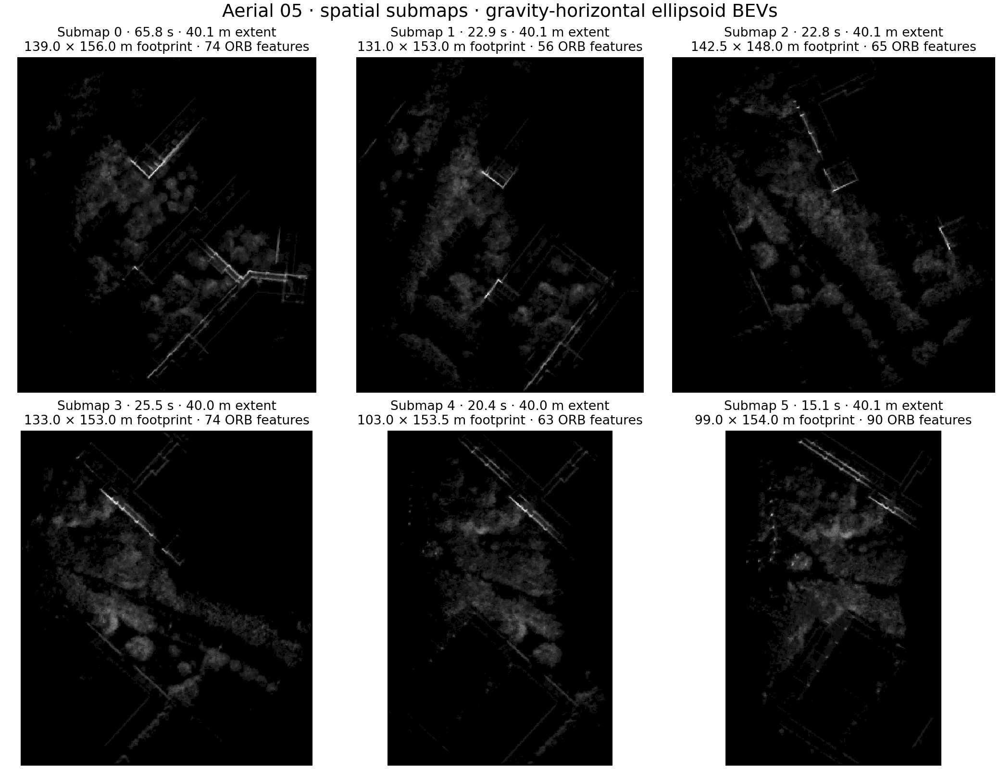

# Spatial EllipseLIO submaps: implementation and aerial smoke test

Implemented locally on 2026-09-20 as opt-in `mapping.submaps.strategy: spatial`.
Temporal submapping remains the default, and disabled submapping still uses the
persistent map. This is a new distance-driven policy; the retired keyframe-count
motion/overlap experiment was not restored.

The supplied profile prioritizes coverage for MapClosures: **40 m horizontal
maximum displacement from the first member pose**, with a successor starting at
**20 m**. A normal handover needs at least 50 supported sampled points and a 20%
support ratio. Horizontal distance uses the first member's estimated gravity
plane; altitude-only motion does not force a spatial split. Euclidean 3D distance
is also selectable. A 120 s age guard and the existing snapshot payload-capacity
limit bound retention; their events are recorded separately from spatial closures.

Each buffer owns independent tensors, indices and geometry. Incoming scans match
before insertion and are transformed once. The active map stays fixed through
the LiDAR update; IMU state and covariance survive handover. Both descriptors
and registration evidence use the same native processed member scans, with actual
per-anchor filter gravity for BEV projection. Schema 3 records spatial settings,
extent, finish reason, members, anchor time and availability time. Same-robot
exclusions and distributed PCM/CBS behavior remain unchanged.

The **120-second, 1× aerial-05 replay on this machine passed** the sensor-only
checks: **1,120 finite chronological native poses**, maximum speed **4.5113 m/s**,
and maximum successful-LiDAR-update gap **0.1200 s**. It produced **six completed
submaps**, all closed by the spatial-radius criterion, plus two excluded tails.
Their observed extents were 40.03–40.15 m and durations 15.12–65.80 s. No age or
capacity recovery occurred. This is a short operation check, not a full-sequence
accuracy result; ground truth was not used and no ATE improvement is claimed.

All six gravity-aligned descriptors and evidence memberships verified. The real
single-robot backend completed with six graph nodes and zero loops in 11.20 s.
That run checks actual export/descriptor/graph integration; the separate native
multi-robot PCM/CBS tests exercise inter-robot constraints. The live Rerun file
verified without error, and frozen source/configuration hashes still match.
All six PNGs reproduce their cached ORB keypoints and bits exactly. The first
BEV covers about **139 × 156 m**; larger bounding boxes do not by themselves
establish better retrieval or accuracy.

Validation passed **two native tests and 22 Python/integration tests**. Coverage
includes temporal compatibility, distance boundaries at different speeds,
horizontal versus 3D displacement, backtracking, supported/unsupported handovers,
timestamp gaps, geometry capacity, buffer reuse, local indices, no self-matching,
state/covariance preservation, immutable exports, variable-duration membership,
tails, gravity, causal scheduling and native distributed PCM/CBS registration.

[Policy and usage](../scripts/recent_submaps/SPATIAL-SUBMAPS.md) ·
[Initial profile](../scripts/recent_submaps/spatial_submaps.yaml) ·
[Machine-readable validation](figures/spatial-submaps/implementation/validation.json) ·
[Artifact hashes](figures/spatial-submaps/implementation/retained-hashes.json)

Use `run_trial.py --submap-strategy spatial` with a calibrated mapping config
and the newly built launcher/library. The isolated local build, original geometry,
recording and complete smoke outputs remain in `.ros2/spatial-submaps-20260920`.
A subsequent [full four-robot trial on 148](RESULTS-GRACO-AERIAL-SPATIAL148.md)
completed with all frontends stable, but no accepted loop closures. No parameter
sweep was launched. Previous experiments and the paused CU-Multi download remain unchanged.
