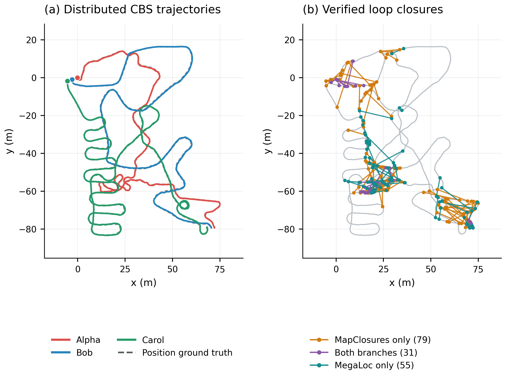

# Multi-robot FAST-LIVO2: results summary

Updated 2026-09-21. This document consolidates the completed **MegaLoc +
MapClosures + distributed CBS** experiments for Alpha, Bob and Carol.

**Temporal EllipseLIO submapping remains the default: 10 seconds with 5 seconds overlap.**
Opt-in spatial displacement and observed-coverage strategies are available. The
earlier keyframe-count motion/overlap implementation remains retired, with its
historical artifacts retained.

**Accumulated-area odometry on Aerial 08:** [results](RESULTS-AREA-ODOMETRY.md).
The new opt-in mode matches inside an 80 m horizontal area of the persistent map,
without recent-map handovers. Two short replays reduced the maximum update gap
from **1.904 s** in a fresh control to **0.128 s**, with every processed scan after
initialization corrected. A full flight then completed with **0.1322 m raw ATE**,
**0.128 s maximum update gap**, and **12.26 ms median scan processing**. All 68
area snapshots and four recordings verified. This is single-robot odometry
validation; no new multi-robot backend result is established.

**Accumulated area maps for MapClosures:** [implementation results and gallery](RESULTS-AREA-MAPS.md).
An independent persistent map now supplies every stored point within an 80 m
horizontal radius, at any height and from any earlier scan, while odometry retains
its recent map. Three native and 77 Python tests passed. Two fresh 120-second
captures produced 26 verified area snapshots and exact BEVs. Aerial-08 still
failed the successful-update-gap gate at **3.320 s** (median scan computation
**40.5 ms**). The diagnostic distributed backend finished with no verification
attempts or loops. No ground truth or full-flight accuracy evaluation was used.

**Observed-coverage implementation:** [local validation](RESULTS-COVERAGE-SUBMAPS.md)
passes two native test executables, 62 Python tests and six distributed integration
tests. Boundaries use occupied/new scene area and measured overlap, with motion/time
as secondary guards. The profile also preserves 0.4 m verification resolution.
Two 120-second aerial captures produced 93 verified completed maps, but aerial-08
failed the successful-update-gap gate at **1.712 s**. A diagnostic backend run
finished with four initial-overlap rejections and zero loops. This is experimental;
no accuracy improvement or full four-flight coverage result is established.

**Spatial four-robot GRACO aerial trial on 148:** [full results](RESULTS-GRACO-AERIAL-SPATIAL148.md).
All four fresh captures passed the stability checks with the 40 m / 20 m horizontal
profile. Raw/CBS ATE was **0.5121 / 2.6409 / 0.2172 / 0.1129 m**; raw accuracy
improved on three of four flights. However, all 11 geometric verifications failed,
so no loops reached PCM, CBS applied no corrections, and all four robots remain
disconnected. All 64 completed spatial submaps, exact BEV images and five Rerun
recordings verified.
A [follow-up diagnostic](RESULTS-GRACO-SPATIAL-VERIFICATION-DIAGNOSTIC.md) identified
excessive adaptive evidence downsampling: fixed 0.4 m geometry makes 8/11 saved
pairs pass unchanged verification thresholds. PCM/CBS has not yet been rerun. The earlier aerial-06/08 update-gap failures did not recur.

**Four-robot GRACO aerial trial on 148:** [aerial-05/06/07/08](RESULTS-GRACO-AERIAL-FOUR148.md)
completed four concurrent full captures with no CPU/RAM quotas. Raw ATE was
**0.8601 / 3.5598 / 0.2034 / 0.1668 m**; CBS ATE was
**0.8601 / 3.5955 / 0.4948 / 0.0735 m**, with a shared fit for aerial-06/07
and separate fits for the other components. Five inter-robot loops connected
aerial-06/07 (**2.4526 m shared ATE**); aerial-05 and aerial-08 remained separate.
One intra-robot loop improved aerial-08, and PCM rejected one proposal.
Aerial-06/08 failed the update-gap gate (**2.656 / 1.464 s**), so the backend
results are diagnostic. All 253 completed submaps and five Rerun recordings verified.
A later projection audit found identity ground alignment for all 253 descriptors;
the images use tilted anchor-IMU XY planes (approximately 44° for aerial-05/submap-8).
These results therefore do not test gravity-levelled top-down BEVs.

**Local GRACO aerial temporal trial:** [aerial-05-40m and aerial-08-25m](RESULTS-GRACO-AERIAL-TEMPORAL.md)
completed both full captures. Raw ATE was **0.8272 / 0.2187 m**; diagnostic CBS
ATE was **0.8272 / 0.0781 m**, using separate alignments because the flights
remain disconnected. One intra-robot loop was accepted on aerial-08 and no
inter-robot loop was accepted. Aerial-08 had a **1.384 s successful-LiDAR-update
gap** at the 30-second submap handover, so this is not a passing frontend-stability
trial. All 112 completed submap memberships and three Rerun recordings verified.

**Retired motion/overlap EllipseLIO experiment:** the
[experimental strategy](RESULTS-MOTION-SUBMAPS.md) passed native,
distributed integration and two 120-second smoke checks. The fresh five-group
batch completed all 18 frontends and all five distributed backends in 67 minutes
on 148, with six concurrent frontends and no CPU/RAM quotas. Raw ATE improved on
5/15 measured robots, but Campus Road 2/Carol regressed from **3.3508 to 59.1508 m**.
Shared CBS ATE was **6.2599 m** for Campus Road 1 Alpha/Bob, **10.9227 m** for
Campus Road 2, **1.0081 m** for Campus Road 3, and **4.8373 m** for all six GRACO
robots. Campus Road 1 still left Carol separate; Laboratory 4 connected all
three but has no usable GT. The motion configuration is now retired;
the following results describe the earlier temporal strategy.

**Recent-history EllipseLIO submaps:** [Library 2](RESULTS-RECENT-SUBMAPS-LIBRARY2.md)
passed the Bob frontend gate twice (1.8025 / 1.8451 m raw ATE), then completed
three-robot ellipsoid-BEV MapClosures → PCM → CBS with **1.5522 m shared ATE**.
The fresh persistent-map Bob baseline diverged.
[Retries of five previously failed frontends](RESULTS-RECENT-SUBMAPS-FAILED-FRONTENDS.md)
all completed stably: Campus Road 1/2/3 raw ATEs were **1.5096 / 6.2167 / 2.8090 m**,
and GRACO ground-01/robot1 achieved **3.7293 m**. Laboratory 4/Carol has no usable
timestamp-matched GT. Campus Road 2 remains above the 5 m reference threshold;
these frontend-only retries do not establish backend or multi-robot outcomes.

[Full submap multi-robot trials on those five groups](RESULTS-RECENT-SUBMAPS-FULL-FIVE-GROUPS.md)
completed all **18 frontends stably**. Laboratory 4 and Campus Road 3 connected
all three robots; Campus Road 1 left Carol disconnected and GRACO left robot4
disconnected. Shared CBS ATE was **1.9743 m** for Campus Road 1 Alpha/Bob,
**3.6144 m** for Campus Road 3, and **6.1543 m** for GRACO’s five-robot component.
Laboratory 4 has no usable GT. Campus Road 2 retained 217 loops but failed the
CBS common-frame contract, so no valid shared CBS ATE is reported. Accuracy
improvement was not consistent across groups.

The [2026-09-17 S3E IMU-noise/QoS trials](RESULTS-S3E-IMU-NOISE.md)
initially failed on Library 2 / Alpha with best-effort input. Restoring
`input.reliable: true`, with the requested noise unchanged, restored normal
scan updates and Alpha completed with **1.2407 m raw ATE**. Bob still diverged
late (**155.2664 m** diagnostic ATE), stopping the queue before Carol or CBS.
That September 17 retry did not produce a valid multi-robot result.

Earlier trial (2026-09-17): [GRACO ground-01..06 as one six-robot group](RESULTS-GRACO.md)
uses EllipseLIO, ellipsoid BEVs, MapClosures and PCM/CBS. The six-robot smoke
completed without loops; the full run stopped at robot1 frontend divergence,
so there is no valid full-sequence GRACO result. The [CU-Multi download](CU-MULTI.md)
and its automatic test watcher are paused at the user's request.

**Alternative frontend:** [EllipseLIO + LiDAR-only MapClosures + PCM/CBS/GICP](RESULTS-ELLIPSELIO-CBS.md)
completed Square 1 with all three robots connected, 29 loops, **1.1907 m**
shared ATE, and **40.35 s** for detection plus optimization. Individual shared
CBS ATEs were **1.4394 / 0.8909 / 1.2279 m**; raw EllipseLIO ATEs with separate
fits were **1.0922 / 0.7956 / 0.5925 m**. Four of 29 loops have GT distance
discrepancies above 2 m. This separate run used no visual descriptors; it does
not alter the historical FAST-LIVO2 tables or establish a controlled comparison.
Its figures, evo evidence and 87.18 MiB Rerun recording are retained; cleanup
removed 6.53 GiB of generated intermediates.
A subsequent centralized pose-factor PGO run on the same 29 loops achieved
**1.1371 m** shared ATE. It excludes the live GICP factors used by CBS.
A bounded [ellipsoid-map BEV diagnostic](RESULTS-ELLIPSOID-BEV.md) on the first
43 seconds confirms MapClosures can match native ellipsoid surfaces: **2/8**
selected pairs pass GICP, versus **5/8** for fresh raw submaps. Four ellipsoid
pair tests lack fitted maps at initialization. This does not establish improved
recall; rendered images, ORB matches and a small Rerun recording are retained.

The subsequent [full-sequence paired ellipsoid-BEV experiment](figures/ellipsoid-bev-full-square1/REPORT.md)
achieved **1.1408 m** shared centralized-PGO ATE versus **1.1457 m** for raw BEVs
on identical fresh EllipseLIO odometry and keyframes. Individual shared ATEs
(Alpha/Bob/Carol) were **1.3950 / 0.9906 / 0.9981 m** for ellipsoids versus
**1.4889 / 0.9559 / 0.9041 m** for raw BEVs. Fresh raw odometry, independently
aligned per robot, achieved **1.0957 / 0.8004 / 0.5927 m**. Both graphs connected
all robots. Ellipsoids supplied 63 loops (55 intra, 8 inter), while raw BEVs
supplied 38 inter-robot loops. Detection took **102.19 s / 35.79 s** respectively;
PGO took under 0.5 s per graph, excluding odometry and descriptor preparation.
The 5 mm aggregate difference does not establish an accuracy advantage. This
test uses centralized pose-factor PGO, not CBS. Position-only GT checks flagged
1/52 checkable ellipsoid loops and 6/38 raw loops for endpoint-distance errors
above 2 m; these are not full 6-DoF outlier labels. The 0.43 MiB Rerun recording,
plots and compact evidence remain after removing 6.14 GiB of generated data.

The same paired path also completed [Square 2](figures/ellipsoid-bev-full-square2/REPORT.md).
Centralized shared ATE was **0.4641 m** for ellipsoid BEVs versus **0.4703 m**
for raw BEVs. Individual shared ATEs (Alpha/Bob/Carol) were
**0.4583 / 0.6236 / 0.2316 m** versus **0.4612 / 0.6332 / 0.2358 m**.
Raw EllipseLIO ATEs with independent robot fits were **0.5138 / 0.5974 / 0.2014 m**.
Both graphs connect all robots; ellipsoid BEVs contribute 30 loops (6 intra,
24 inter), while raw BEVs contribute 26 (1 intra, 25 inter). No endpoint-distance
discrepancy above 2 m was found among the 23/30 GT-checkable ellipsoid loops or
24/26 GT-checkable raw loops. This does not establish full 6-DoF correctness.

| Paired centralized-PGO comparison | Raw ATE | Ellipsoid ATE | Raw detection | Ellipsoid detection |
|---|---:|---:|---:|---:|
| Square 1 | 1.1457 m | 1.1408 m | 35.79 s | 102.19 s |
| Square 2 | 0.4703 m | 0.4641 m | 24.22 s | 51.71 s |
| Laboratory 1 | Unavailable | Unavailable | 3.32 s | 13.12 s |

On Square 2, ellipsoid BEVs retain **291,486 ORB features** over 861 keyframes,
versus **197,101** for raw BEVs (+48%). Native descriptor construction takes
**120.74 s / 9.10 s**, respectively, plus **268.96 s** of ellipsoid CUDA sampling.
Descriptor inputs average approximately **1.33 million / 77,811 points** per
keyframe, so this is substantially different preprocessing work rather than an
equal-input feature-matcher benchmark. These two runs show only 5–6 mm changes
in aggregate ATE, with higher computation and no increase in inter-robot loops.

Square 2 required a documented Carol retry at **0.5x replay** after the native
frontend stalled at 1x and the raw-cloud queue limit stopped the process. The
bag's IMU timestamps were monotonic, with a maximum 15.94 ms interval. The full
retry succeeded with unchanged estimator/loop settings; both BEV branches share
that same replay. Frozen PGO reproduced exactly and left all 1,728 watched inputs
unchanged. Cleanup removed **3.10 GiB** of generated data, including the failed
attempt's incomplete MCAP, while retaining reports, plots, evo evidence and Rerun.

The indoor [Laboratory 1 paired run](figures/ellipsoid-bev-full-laboratory1/REPORT.md)
used 804 frozen keyframes and unchanged loop/PGO settings. Ellipsoid BEVs yielded
**51 accepted and selected loops (37 intra, 14 inter)** and connected all three
robots. Raw BEVs yielded **9 accepted loops**, but GNC removed all three inter-robot
factors, leaving **6 selected intra-robot loops and three separate components**.
This is an improvement in graph connectivity. **ATE and GT-based loop accuracy
remain unavailable:** the released records contain only endpoints labeled 0 and 1,
without sensor timestamps. They were not converted into an artificial trajectory.
Retained ORB features increased from **7,717 to 74,861**, with different accumulated
map coverage; this does not isolate the effect of the ellipsoid representation.
Ellipsoid detection took **13.12 s** versus **3.32 s** for raw BEVs, excluding
preparation. All three frontend replays completed at 0.5x without retries.
The report includes corrected component maps, density/ORB examples and Rerun.
Frozen PGO reproduced exactly without changing any of 1,614 watched input hashes;
31 regression tests passed. Cleanup removed **2.83 GiB**, retaining approximately
**45 MiB** of reports and evidence, including an **11 MiB** Rerun recording.

The historical FAST-LIVO2 + MegaLoc + MapClosures + CBS runs connected all three robots on **Square 1, Square 2, Library 1,
Campus Road 1 and Playground 2**, with combined position ATE RMSE of
**1.2147 m, 0.5340 m, 1.4172 m, 1.4707 m and 0.2941 m**, respectively.
Laboratory 1 achieved partial connectivity and has
no usable full-trajectory ground truth. Playground 1 is an excluded historical
failure with documented odometry configuration and startup problems.

These are individual saved runs on different sequences. They establish the
observed outcomes; they are not repeated-trial performance estimates or a
controlled comparison of estimator settings.

**PCM update:** Current configurations add distributed PCM before CBS. The
historical table below remains unchanged. A separate
[Square 1 frozen-constraint validation](RESULTS-PCM-CBS.md) retained 50/50 loops
and produced 1.2181 m combined ATE; PCM added 65,780 CDR bytes and took
1.3–2.2 ms computation per robot. Its batch execution differs from the earlier
incremental CBS run, so the ATE difference is not attributed to PCM.

**Centralized registration-factor test:** The separate
[mixed pose/GICP Square 1 graph](RESULTS-MIXED-PGO.md) adds 50 live
gtsam_points factors to 1,598 pose factors. Native execution took 2.465 s on
CPU. Combined evo ATE was effectively unchanged: 1.197976 m pose-only versus
1.198012 m mixed. This first configuration establishes working integration,
without evidence of an ATE improvement; it does not alter the CBS results below.

**Distributed registration-factor test:** [PCM + CBS with live GICP](RESULTS-CBS-REGISTRATION.md)
completed Square 1 in 24.8 s with all 50 added factors passing geometry checks.
Combined evo ATE was **1.2045 m**; Alpha/Bob/Carol were
**1.5148 / 0.9301 / 1.1308 m**, using one shared alignment. This is slightly
lower than the earlier frozen PCM/CBS run's 1.2181 m; asynchronous scheduling
and a changed relinearization policy prevent attributing that difference solely
to GICP. Geometry transfer added 6.20 MiB. Historical rows remain unchanged.

## System and evaluation

The path used for the historical experiments below was:

`FAST-LIVO2 exports → keyframes/local submaps → independent MegaLoc and MapClosures retrieval → native MapClosures pose initialization → small_gicp GICP acceptance → per-robot CBS → corrected trajectories/maps`

MegaLoc uses pretrained CUDA inference. MapClosures uses LiDAR density images,
ORB features, HBST matching and native 2D RANSAC poses. A visual-only proposal
also needs a native two-map MapClosures pose before GICP; failure to obtain
that pose is recorded explicitly. The retained setup uses 1 m / 10° / 2 s
keyframes, trailing five-second submaps, an 80 m range crop, MegaLoc cosine
similarity ≥0.50, top-20 retrieval and a 30 s same-robot exclusion. Each
requester selects at most one proposal per branch, with cooldown and pair
deduplication. [Method details](METHODS.md).

Odometry is replayed serially, with one GPU model worker at a time. Three
robot front ends and three CBS optimizers subsequently exchange ROS2 Fast DDS
messages on one host using frozen artifacts. **Offline distributed replay is
validated; simultaneous live sensor-to-model operation and deployment across
physical robots have not been demonstrated.** Corrections affect saved poses
and maps, with no feedback into FAST-LIVO2. [Distributed implementation](DPGO.md).

All CBS ATE values below use **evo 1.36.5**, nearest timestamp association
within 0.05 s, no interpolation or time offset, and **one shared SE(3)
alignment per connected component, with scale fixed to one**. Individual
robots receive no additional fit. Combined RMSE pools matched position errors;
it is not the arithmetic mean of robot RMSEs. Missing GT is excluded, supplied
placeholder orientations are unused and the GNSS antenna lever arm is
uncorrected. Ground truth is available only to evaluation.

## CBS trajectory results

All ATE values are translation RMSE in metres. “Connected” means all three
robots share one estimated component.

| Sequence | Outcome | Alpha | Bob | Carol | Combined | Matched GT positions |
|---|---|---:|---:|---:|---:|---:|
| [Square 1](RESULTS-CBS.md) | Connected | 1.5182 | 1.0740 | 0.9827 | **1.2147** | 1,176 |
| [Square 2](RESULTS-SQUARE2-CBS.md) | Connected | 0.6261 | 0.6335 | 0.3020 | **0.5340** | 694 |
| [Library 1](RESULTS-LIBRARY1-CBS.md) | Connected | 1.0239 | 1.5216 | 1.6474 | **1.4172** | 1,151 |
| [Campus Road 1](RESULTS-CAMPUS-ROAD1-CBS.md) | Connected | 1.5669 | 1.4956 | 1.3486 | **1.4707** | 1,905 |
| [Playground 2](RESULTS-PLAYGROUND2-CBS.md) | Connected | 0.2446 | 0.3438 | 0.2856 | **0.2941** | 655 |
| [Laboratory 1](RESULTS-LABORATORY1-CBS.md) | Alpha isolated; Bob–Carol connected | N/A | N/A | N/A | N/A | 0 timestamp matches |
| [Playground 1](RESULTS-PLAYGROUND1-CBS.md) | **Excluded failure**, connected graph | 28.0625 | 26.4365 | 22.0118 | **25.6036** | 862; Bob starts at 22 s |

Square 1 uses the later evo evaluation of frozen CBS trajectories. Its older
**1.2112 m** score used interpolated GT and is superseded for cross-sequence
reporting. Some archived Square 1 figures retain that older evaluation.
[Current full-precision evo results](figures/cbs-square1/evo_ate.json).

Square 2, Library 1 and Playground 2 use `vio.img_point_cov=100` for all robots, following the
Playground 1 diagnosis. Earlier sequence runs used the S3E setting of 1000.
Detection and CBS settings are unchanged. Their lower errors cannot be
attributed to this parameter alone because the sequences also changed.

**Laboratory 1 is not Library 1.** The indoor Laboratory sequence was run
after an incorrect name substitution. The requested outdoor Library 1 has
now been downloaded, verified and evaluated separately. **Correction:**
Square 2 is available in the official release;
the earlier claim of unavailability was incorrect. It has now been downloaded,
verified and evaluated.

## Raw FAST-LIVO2 odometry ATE

These are translation ATE RMSE values in metres **before loop closure and
CBS**, evaluated with **evo 1.36.5**. Each robot receives an independent
SE(3) alignment to its available position GT, with no scale fitting,
interpolation or time offset and a 0.05 s association tolerance. This differs
from the shared component alignment used for CBS above; subtracting these
raw scores from CBS scores does not measure an optimization improvement.

| Sequence | Alpha | Bob | Carol | GT matches: Alpha / Bob / Carol |
|---|---:|---:|---:|---:|
| [Square 1](figures/cbs-square1/raw_odometry.json) | 1.3058 | 0.8698 | 0.6335 | 384 / 454 / 338 |
| [Square 2](figures/cbs-square2/raw_odometry.json) | 0.5441 | 0.5772 | 0.2179 | 195 / 245 / 254 |
| [Library 1](figures/cbs-library1/raw_odometry.json) | 1.3011 | 1.9088 | 1.4021 | 397 / 378 / 376 |
| [Campus Road 1](RESULTS-CAMPUS-ROAD1-CBS.md) | Not retained | Not retained | Not retained | — |
| [Playground 2](figures/cbs-playground2/raw_odometry.json) | 0.1941 | 0.3302 | 0.2548 | 219 / 218 / 218 |
| [Laboratory 1](RESULTS-LABORATORY1-CBS.md) | N/A | N/A | N/A | No usable timestamped trajectory GT |
| [Playground 1, excluded](figures/cbs-playground1/figures.json) | 28.7455 | 25.9419 | 0.3149 | 292 / 275 / 295 |

Square 1 was evaluated from the exact saved odometry used by the reported
CBS run, without replaying SLAM or changing its input artifacts. Native evo
archives and matched trajectories are retained alongside its linked numeric
results. Campus Road 1's retained evidence does not contain raw ATE scores;
its timestamped raw poses were removed during the requested cleanup. A new
odometry replay would be needed to fill that row. Laboratory 1 has only
start/end motion-capture records, so full-path ATE remains unavailable.

The excluded Playground 1 row is the historical full run with Bob starting
at 22 s and visual variance 1000. The bounded startup diagnostics below are
separate results. Square 2, Library 1 and Playground 2 use visual variance
100; the other reported full runs use 1000.

## Loop detection and communication

Branch columns are mutually exclusive attributions from one fused run.
“Both” means the same accepted constraint was independently proposed by both
retrieval branches and counted once. These columns are not separate ablations.

| Sequence | Keyframes | Verifications | Accepted | Inter / intra | MapClosures only | Both | MegaLoc only | Yield |
|---|---:|---:|---:|---:|---:|---:|---:|---:|
| Square 1 | 1,550 | 175 | 50 | 50 / 0 | 29 | 12 | 9 | 28.57% |
| Square 2 | 861 | 154 | 37 | 37 / 0 | 25 | 8 | 4 | 24.03% |
| Library 1 | 1,474 | 1,492 | 1,049 | 1,010 / 39 | 240 | 546 | 263 | 70.31% |
| Campus Road 1 | 2,890 | 595 | 156 | 116 / 40 | 35 | 99 | 22 | 26.22% |
| Playground 2 | 1,291 | 525 | 165 | 144 / 21 | 79 | 31 | 55 | 31.43% |
| Laboratory 1 | 804 | 117 | 6 | 3 / 3 | 4 | 1 | 1 | 5.13% |
| Playground 1, excluded | 1,097 | 885 | 377 | 370 / 7 | 84 | 151 | 142 | 42.60% |

The LiDAR branch makes an independent contribution. On Square 1, all **29
MapClosures-only loops** were below MegaLoc's 0.50 similarity threshold. On
Playground 2, **79 of 165** accepted loops were MapClosures-only. The original
Square 1 native inspection reproduced density images, ORB/HBST evidence and
RANSAC results for **211 local maps and 175 verified pairs** in Rerun.
[Inspection details](INSPECTION.md).

| Sequence | Recall@1 / @5 / @20 | Accepted pairs within 10 m / assessable | Detection + CBS (s) | Loop exchange (MB) | CBS exchange (MB) |
|---|---:|---:|---:|---:|---:|
| Square 1 | 78.07% / 86.10% / 88.77% | 41 / 49 | 57.99 | 180.404 | 0.338 |
| Square 2 | 75.45% / 82.04% / 87.43% | 23 / 33 | 45.76 | 109.519 | 0.254 |
| Library 1 | 97.70% / 99.75% / 99.92% | 772 / 798 | 181.41 | 514.355 | 4.282 |
| Campus Road 1 | 88.12% / 90.20% / 91.23% | 112 / 112 | 176.64 | 396.763 | 1.087 |
| Playground 2 | 57.92% / 72.43% / 78.89% | 107 / 165 | 95.83 | 211.033 | 0.675 |
| Laboratory 1 | N/A | N/A | 23.46 | 61.674 | 0.025 |
| Playground 1, excluded | 97.90% / 100.00% / 100.00% | 362 / 377 | 113.10 | 311.532 | 5.227 |

Recall uses causal position-proximity labels where GT is available. Nearby
origins do not guarantee a correct registration, and overlapping submaps can
have origins farther than 10 m apart. Consequently these labels do not
establish exact 6-DoF loop correctness. Square 1 has one accepted loop without
a usable GT label, Square 2 has four, Library 1 has 251 and Campus Road 1 has 44. Playground 1 demonstrates that high
proximity recall and a connected graph can coexist with severe trajectory
error.

MB means 10⁶ bytes. Communication counts serialized CDR messages per directed
recipient; RTPS, discovery and retransmission overhead are excluded. Timings
cover detection and concurrent CBS, excluding odometry, descriptors and map
export. Square 1 reused saved odometry and MegaLoc features. Campus Road 1's
full pipeline took **70.0 minutes**, dominated by odometry and submap
preparation, while its detection/CBS stage took under three minutes. Low GPU
utilization outside MegaLoc inference is expected: mapping, MapClosures,
GICP and CBS use CPU.

## Loop quality and suspected outliers

A [dedicated loop-quality audit](LOOP-QUALITY.md) checks the retained accepted
measurements. A distance flag means that the measured translation length
differs from the GT endpoint distance by **more than 2 m**. This is a
diagnostic flag, not a confirmed 6-DoF outlier: GT orientations are
placeholders, antenna offsets are uncorrected, and GT may contain errors.

| Experiment | Accepted loops | Distance flags / GT-assessable | Local cycle flags / eligible loops |
|---|---:|---:|---:|
| Square 1 | 50 | **7 / 49** | 0 / 38 |
| Square 2 | 37 | **0 / 33** | 0 / 3 |
| Library 1 | 1,049 | **25 / 798** | 0 / 551 |
| Campus Road 1 | 156 | Unknown; transforms removed | Unavailable |
| Playground 2 | 165 | **0 / 165** | 0 / 11 |
| Laboratory 1 | 6 | N/A; no usable trajectory GT | Insufficient support |
| Playground 1, excluded | 377 | Unknown; transforms removed | Unavailable |

The cycle test uses short raw odometry segments and nearby inter-robot
loops, requiring at least three neighbours. A loop is flagged only when a
majority of cycles exceed 2 m translation or 5° rotation. All 18 distance
flags with sufficient cycle support pass that local test; 14 other distance
flags lack enough support. Shared registration biases can pass cycle checks,
so exact false-closure counts remain undetermined.

Accepted endpoints farther than 10 m apart are **not automatically false
closures**. Playground 2 has 58 such pairs, yet all 165 measured translation
lengths agree with available GT within 0.71 m. The detailed report includes
1/2/5 m threshold sensitivity, branch attribution, problematic endpoint IDs,
coverage limits and [all per-loop measurements](figures/loop-quality/per-loop.csv).

## Findings and limitations

**Square 1:** distributed CBS recovered the exact **50 loop measurements**
from the working centralized pipeline. Under the original shared evaluation,
CBS gave 1.2112 m versus 1.1954 m for centralized GNC-TLS. The centralized run
reduced its initial-alignment position RMSE from 2.1997 m to 1.1954 m. Those
are archived, interpolated-GT numbers and are kept separate from the evo
table above. One accepted visual-only pair was flagged by a 2.622 m
translation-length discrepancy; passing registration does not certify every
constraint. [Centralized reference and audit](RESULTS-MAPCLOSURES.md).
The expanded audit of all 49 GT-assessable accepted loops finds seven
translation-length disagreements above 2 m; the earlier single-pair
highlight came from the narrower discussion of origins beyond 10 m.
[Full loop-quality audit](LOOP-QUALITY.md).

**Square 2:** the 255.197-second bag and ground-truth files passed official
checksum verification and SQLite checks. All 7,411 expected LiDAR messages
were received; no robot had an IMU gap over 0.2 s. The 37 accepted loops
comprise 22 Alpha–Bob, five Alpha–Carol and ten Bob–Carol constraints. Every
keyframe had nonempty MapClosures density features. Combined CBS ATE was
**0.5340 m**, with **45.76 s** for detection and CBS. Raw independently aligned
odometry ATEs were **0.5441 / 0.5772 / 0.2179 m** for Alpha/Bob/Carol. GT has
five gaps over two seconds for Alpha and two for Bob, so the score covers only
available timestamp matches.

**Campus Road 1:** all three robots connected and all 23,010 expected LiDAR
messages were received. GT has substantial gaps. Of 445 selected, assessable
proposals within 10 m, 331 failed the registration RMSE gate and two lacked a
native pose. These are rejected nearby candidates, not a proven missed-loop
count.

**Library 1:** the official 17.53 GB bag passed checksum, SQLite and sensor
continuity checks. All 13,481 expected clouds were received and 13,441 frames
exported. Every keyframe had nonempty MapClosures density features. The
1,049 loops include 437 Alpha–Bob, 314 Alpha–Carol, 259 Bob–Carol and 39
intra-robot constraints. The graph connected all robots with **1.4172 m**
combined CBS ATE; detection/CBS took **181.41 s**. Raw independently aligned
odometry ATEs were **1.3011 / 1.9088 / 1.4021 m**, with no early under-motion
visible in the saved diagnostics. GT has gaps up to 21 / 43 / 29 seconds,
so evaluation covers only available timestamp matches. The high loop yield
on this sequence does not establish exact correctness of every constraint.

**Laboratory 1:** all 51 selected proposals involving Alpha failed native
MapClosures pose initialization before GICP. Only 86/295 Alpha density maps
had nonempty ORB features, with a median of zero features. MegaLoc proposals
could not bypass this pose-initialization dependency. The release provides
start/end motion-capture records, not timestamped intermediate trajectories;
full-path ATE and retrieval proximity accuracy remain unavailable.

**Playground 1:** the historical full run had large raw Alpha/Bob errors
before CBS. Bob's stored IMU stream contains gaps of approximately 0.570,
0.310 and 0.281 s. Restarting at 22 s restored output coverage but did not
restore accuracy. Database integrity checks passed; the gaps do not by
themselves prove structural bag corruption. Follow-up bounded replays found:

| Diagnostic interval | Visual variance 1000: raw ATE (m) | Visual variance 100: raw ATE (m) |
|---|---:|---:|
| Alpha, 0–105 s | 37.6765 | 0.1478 |
| Bob, 22–105 s | 34.4114 | 32.4329 |

Bob's short pre-gap segment at variance 100 achieved 0.0640 m ATE. Moving-start
initialization remains a suspect for the post-gap failure, not an isolated
cause. CBS also deformed Carol's initially accurate trajectory: 20.70 m RMS
change remained after removing the best rigid transform between raw and
corrected tracks. That change is not a GT ATE and does not isolate faulty
loop poses from optimizer behavior. No corrected full-sequence run followed
these diagnostics; the sequence was excluded at the user's request.

**Playground 2:** the official download passed checksum and SQLite checks;
all three IMU streams had no gaps over 0.2 s. All expected clouds were
received, and the early under-motion seen in Playground 1 was absent. Raw
odometry ATEs were **0.1941 / 0.3302 / 0.2548 m** for Alpha/Bob/Carol, each
with an independent rigid fit. These diagnostic scores have a different
alignment scope from joint CBS ATE and cannot be subtracted to quantify a
CBS improvement. The final shared CBS ATE was **0.2941 m**.

## Figures and retained evidence

| Sequence | Trajectories and loops | Map | Ground truth / diagnostics |
|---|---|---|---|
| Square 1 | [Trajectory PNG](figures/cbs-square1/trajectories_and_loops.png) | [Top view](figures/cbs-square1/map_top_down.png) | [Gallery and archived figure protocol](figures/cbs-square1/README.md) |
| Square 2 | [Trajectory PNG](figures/cbs-square2/trajectories_and_loops.png) | [Top view](figures/cbs-square2/map_top_down.png) | [GT trajectories](figures/cbs-square2/ground_truth_trajectories.png) |
| Library 1 | [Trajectory PNG](figures/cbs-library1/trajectories_and_loops.png) | [Top view](figures/cbs-library1/map_top_down.png) | [GT trajectories](figures/cbs-library1/ground_truth_trajectories.png) |
| Campus Road 1 | [Trajectory PNG](figures/cbs-campus-road1/trajectories_and_loops.png) | [Top view](figures/cbs-campus-road1/map_top_down.png) | [GT trajectories](figures/cbs-campus-road1/ground_truth_trajectories.png) |
| Playground 2 | [Trajectory PNG](figures/cbs-playground2/trajectories_and_loops.png) | [Top view](figures/cbs-playground2/map_top_down.png) | [GT trajectories](figures/cbs-playground2/ground_truth_trajectories.png) |
| Laboratory 1 | [Bob–Carol component](figures/cbs-laboratory1/Bob/trajectories_and_loops.png) | [Separate component maps](figures/cbs-laboratory1/README.md) | [GT endpoints only](figures/cbs-laboratory1/ground_truth/ground_truth_endpoints.png) |
| Playground 1, excluded | [Historical trajectories](figures/cbs-playground1/trajectories_and_loops.png) | [Historical map](figures/cbs-playground1/map_top_down.png) | [Startup diagnosis](figures/cbs-playground1/startup-audit/startup_motion.png) |

PNG and PDF figures are available through the individual reports. Map colors
show robot identity or elevation from LiDAR XYZ, rather than camera RGB.

Rerun **0.37.1** recordings remain local: approximately **426.7 MB** for the
reported Square 1 run, **88.4 MB** for Laboratory 1, **471.7 MB** for Campus
Road 1, **216.1 MB** for Playground 2, **250.0 MB** for Square 2 and **313.3 MB**
for Library 1. Their locations are listed in the
sequence reports. Playground 1's recording and large generated outputs were
removed; reports and small diagnostic evidence remain. Campus Road 1 and
Playground 2 intermediates were also removed after validation, freeing
**26.08 GiB** and **5.47 GiB**, respectively. Square 2 cleanup freed another
**7.98 GiB**, including the stopped sandbox attempt. Library 1 cleanup freed
**14.08 GiB**, including its interrupted initial replay. Original datasets are retained.
Deleted caches require regeneration; retained reports are not completed stage
caches.

The sequence audits checked causal candidates, same-robot exclusion, unique
loop pairs and serialized-byte totals. Saved evo results were independently
reproduced, and retained Rerun recordings passed decoding checks. The latest
research Python suite passed **40 tests**, with four optional ROS tests
skipped; earlier native validation passed seven CBS/cbs_ros CTest cases and
three DDS synthetic cases. Native project branches are
`dev/fast-livo2-s3e-dpgo`, with CBS at `11d84af` and cbs_ros at `86e3e35`.
Full hashes, configurations, timing and validation details are linked from
each sequence report.

## Swarm-SLAM comparison on workstation 148

The separate [Swarm-SLAM results](RESULTS-SWARM-SLAM.md#workstation-148) use
saved EllipseLIO inputs and three native Swarm robot instances, followed by evo.
This multistage benchmark was explicitly retained by the user; it is not an
untouched official online launch. The final remote checks passed 32 tests and the
three-robot integration fixture passed exact input and geometry checks.
The linked report tracks completed sequence ATEs, raw odometry ATEs, loop
diagnostics, figures, and cleanup records independently of the CBS results above.

## Ellipsoid MapClosures + PCM/CBS overnight queue on 148

[Completed overnight results and failure report](RESULTS-ELLIPSOID-CBS-148.md): the exact EllipseLIO → ellipsoid-projected BEVs → MapClosures → distributed PCM/CBS pipeline finished 17 attempts in 9 h 21 min on 2026-09-17. Four completed every stage; two additional runs have valid trajectory results despite reporting crashes. Shared three-robot ATEs are **1.1491 m** (Square 1), **0.5717 m** (Square 2, recovered), **2.0994 m** (Square 3, reproduced), **0.3234 m** (Playground 2) and **0.3271 m** (Playground 3). Laboratory 1 completed with two components and no usable trajectory GT. Eleven other attempts failed before a valid combined score: five frontends, four descriptor preparations and two CBS reference-frame failures. The linked report includes individual CBS/raw ATEs, PCM counts, figures and evidence. These results are separate from the earlier centralized ellipsoid-PGO experiments; the matched Swarm-SLAM comparison remains pending.

## GRACO aerial 05–08: gravity-horizontal BEV correction (2026-09-20)

[Full comparison](RESULTS-GRACO-AERIAL-GRAVITY148.md): all 253 saved temporal submaps
were reprojected using reconstructed startup IMU gravity, then rerun through
MapClosures → distributed PCM → CBS/GICP on 148 without resource quotas.
The corrected images did **not** improve the backend result: five loops (four
aerial06/07, one aerial05), unchanged three components, and aerial06/07 shared
ATE 2.4576 m versus 2.4526 m previously. Aerial08 lost its previous loop; CBS
ATE became 0.1668 m versus 0.0735 m. Raw trajectories/evidence are byte-identical;
original successful-update gap failures remain. Future exports now carry the
actual per-anchor filter gravity. Thirty Python and two native tests passed;
all corrected PNGs reproduce cached ORB features exactly.

## Spatial submaps: implementation and local aerial smoke (2026-09-20)

[Implementation report](RESULTS-SPATIAL-SUBMAPS.md): opt-in spatial displacement
scheduling, with a BEV-oriented 40 m horizontal radius and 20 m overlap profile.
Temporal mode remains the default. A 120 s aerial-05 replay produced six completed
spatial maps (15.12–65.80 s each), with 1,120 finite chronological poses and a
0.120 s maximum successful-update gap. All six descriptors, exact native BEV
images, endpoint timestamps and the live Rerun file verified. Two native and
22 Python/integration tests passed. This validates operation, not full-sequence
ATE. The subsequent [full four-robot run](RESULTS-GRACO-AERIAL-SPATIAL148.md)
passed frontend stability but accepted no loops, leaving four disconnected components.
