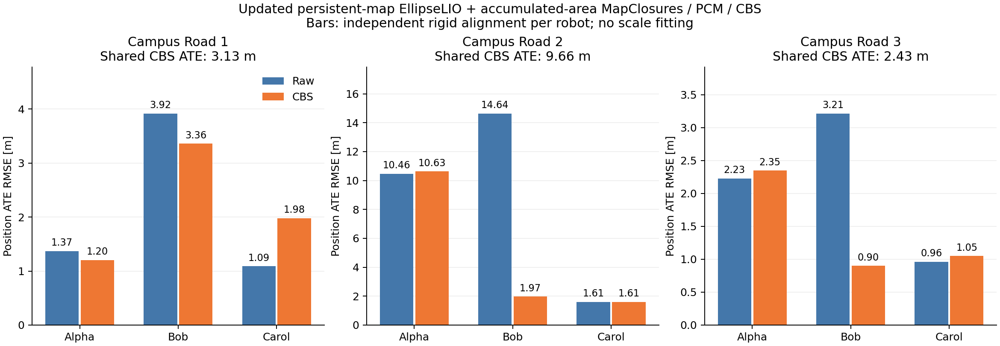

**Updated EllipseLIO + accumulated-area MapClosures + distributed PCM/CBS — S3E, 21 September 2026**

Campus Road 1, 2 and 3 completed the three-robot pipeline. Laboratory 4 failed the frontend stability check because Bob diverged; its backend was not run. All twelve requested robot sequences were attempted fresh at 1×. Campus Road 2 / Carol required one replay after fixing an upstream octree storage-capacity crash.

CBS substantially improves Bob on Campus Roads 2 and 3, but does not solve Campus Road 2 / Alpha: its individual ATE remains 10.63 m. Campus Road 2 / Carol is unchanged in individual ATE to displayed precision. Laboratory 4 / Bob still diverges.

Odometry uses updated upstream EllipseLIO’s persistent map, with temporal submapping and area-cropped odometry disabled. Accumulated area snapshots supply only MapClosures and registration evidence.

**Position ATE (RMSE, metres)**

Raw and individual CBS trajectories each receive an independent rigid SE(3) alignment. The shared result uses one SE(3) alignment for the entire connected three-robot component. All numbers come from evo 1.36.5, 50 ms association, scale fixed to one. Ground truth is confined to evaluation. Supplied GT orientation is unused; the antenna lever arm is uncorrected.

| Sequence | Robot | Raw | CBS, individual | CBS, shared alignment | Matched GT samples |
|---|---|---:|---:|---:|---:|
| Campus Road 1 | Alpha | 1.369 | 1.204 | 1.988 | 455 |
| Campus Road 1 | Bob | 3.917 | 3.361 | 3.971 | 847 |
| Campus Road 1 | Carol | 1.088 | 1.979 | 2.301 | 539 |
| Campus Road 2 | Alpha | 10.464 | 10.626 | 14.777 | 15447 |
| Campus Road 2 | Bob | 14.640 | 1.973 | 6.042 | 14949 |
| Campus Road 2 | Carol | 1.610 | 1.610 | 5.016 | 15820 |
| Campus Road 3 | Alpha | 2.229 | 2.349 | 3.401 | 8705 |
| Campus Road 3 | Bob | 3.214 | 0.901 | 1.887 | 8741 |
| Campus Road 3 | Carol | 0.962 | 1.049 | 1.606 | 8825 |

| Sequence | Shared-component ATE | Verified loops before PCM | Retained / rejected | Inter-robot pairs A–B / A–C / B–C | Connected | Backend wall time |
|---|---:|---:|---:|---|---|---:|
| Campus Road 1 | 3.127 | 48 | 48 / 0 | 15 / 6 / 27 | True | 167.2 s |
| Campus Road 2 | 9.664 | 438 | 438 / 0 | 152 / 92 / 194 | True | 572.4 s |
| Campus Road 3 | 2.426 | 260 | 260 / 0 | 98 / 80 / 82 | True | 360.3 s |

| Sequence | Descriptor preparation A / B / C (s) | Evaluation and map reconstruction (s) | Largest backend process RSS (GiB) |
|---|---:|---:|---:|
| Campus Road 1 | 92.4 / 115.6 / 144.4 | 167.4 | 1.69 |
| Campus Road 2 | 139.7 / 259.1 / 324.2 | 339.1 | 3.39 |
| Campus Road 3 | 170.2 / 125.3 / 185.3 | 238.0 | 2.56 |

Descriptor times are elapsed per robot; Road 2 prepared robots concurrently, while Roads 1 and 3 prepared them sequentially. The largest backend process RSS is the maximum sampled process peak, not aggregate memory. Initial batch playback ran from 10:20:44 to 10:55:38 UTC; later storage repairs, the Carol replay, backends and verification are separate stages.

Backend completion means the configured 100 local settling iterations finished after peer input completion; it is not a claim of mathematical convergence. These are single runs, not a controlled comparison against earlier temporal or area-odometry experiments. A connected graph does not guarantee better accuracy for every robot.

**Frontend completion, update gaps and processing**

An update gap is elapsed sensor time between successful LiDAR corrections, including the end interval. It differs from wall-clock processing time. The stability check requires full sensor-tail coverage, finite chronological poses, scan-derived speed ≤20 m/s and no successful-update gap ≥1 s. It does not impose an ATE cutoff on this requested batch.

| Sequence | Robot | Stability | Poses | Max update gap (s) | Max speed (m/s) | Processing mean / p95 (ms) | Peak mapper RSS (GiB) | Replay wall (s) | Area snapshots |
|---|---|---|---:|---:|---:|---:|---:|---:|---:|
| Laboratory 4 | Alpha | pass | 3707 | 0.300 | 2.476 | 38.4 / 108.9 | 0.41 | 392.7 | 38 |
| Laboratory 4 | Bob | FAIL | 3771 | 28.898 | 602.112 | 6.9 / 21.1 | 0.77 | 391.8 | 579 |
| Laboratory 4 | Carol | pass | 3796 | 0.201 | 1.524 | 5.8 / 17.7 | 0.52 | 391.5 | 38 |
| Campus Road 1 | Alpha | pass | 6967 | 0.300 | 2.964 | 65.0 / 118.0 | 2.14 | 755.3 | 71 |
| Campus Road 1 | Bob | pass | 8595 | 0.300 | 1.805 | 53.8 / 111.5 | 1.87 | 883.5 | 87 |
| Campus Road 1 | Carol | pass | 6684 | 0.401 | 3.145 | 73.3 / 126.4 | 3.33 | 740.6 | 73 |
| Campus Road 2 | Alpha | pass | 15449 | 0.400 | 3.452 | 59.5 / 113.6 | 2.66 | 1595.2 | 157 |
| Campus Road 2 | Bob | pass | 15031 | 0.699 | 2.013 | 64.8 / 120.5 | 5.58 | 1600.1 | 156 |
| Campus Road 2 | Carol | pass | 15820 | 0.301 | 2.219 | 27.5 / 44.0 | 8.11 | 1611.8 | 159 |
| Campus Road 3 | Alpha | pass | 8706 | 0.602 | 2.290 | 57.5 / 113.0 | 2.83 | 918.0 | 89 |
| Campus Road 3 | Bob | pass | 8768 | 0.500 | 2.083 | 55.4 / 107.3 | 2.01 | 913.9 | 89 |
| Campus Road 3 | Carol | pass | 8825 | 0.602 | 3.043 | 61.9 / 113.2 | 2.94 | 919.0 | 91 |

Native timed undistortion, LiDAR update, map insertion, and area snapshot/export; excludes input synchronization and ROS publication. Times include snapshot/writer backpressure where it occurs. RSS is the native mapper process high-water mark, not whole-machine peak usage. Six original frontend workers shared workstation 148; the corrected Carol replay ran separately. These conditions do not provide an isolated throughput benchmark. Correspondence age is explicitly unmeasured, with null fields in diagnostics. All native diagnostics report persistent-map odometry and zero handovers.

Laboratory 4 / Bob completed playback but produced a trajectory-implied peak speed of 602.11 m/s, a 28.90 s successful-update gap, and 665 unsuccessful updates after initialization. Alpha and Carol passed stability. Laboratory 4 GT files contain only two samples at 0/1 s with no overlap with sensor timestamps, so no valid ATE is reported. This remains a genuine frontend failure; no tuning sweep was performed.

[Laboratory 4 diagnostic plots](figures/upstream-area-s3e-20260921/S3E_Laboratory_4/diagnostics/frontend-performance.png) and [unchanged raw trajectory files](figures/upstream-area-s3e-20260921/S3E_Laboratory_4/raw-evaluation-after-failure/) are retained.

**Area definition and fixed settings**

After matching and inserting each corrected scan, the exporter can snapshot all stored native point representatives within an 80 m horizontal disk around the current corrected IMU position in the estimated gravity plane. Membership has no height or scan-age limit. A new snapshot is triggered after 20 m horizontal displacement or 10 s, plus a nonduplicate shutdown tail. The trigger is not a temporal membership window. Native tensors keep their persistent-map neighborhood support; export does not refit them. Ellipsoid centers and sampled surfaces are restricted to the horizontal area.

Both descriptors and geometric evidence use the same snapshot, represented in its IMU anchor frame. These are native processed map representatives, not full-resolution raw scans. Schema 5 records point/scan membership, anchor time, later availability time and payload hashes. Retrieval is scheduled by availability; graph poses retain anchor timestamps. Same-robot endpoints retain the 30 s exclusion and reject any shared persistent point IDs.

Calibration comes from each dataset version’s Alpha/Bob/Carol files. All captures retain reliable input, the four-thread launcher and IMU acc/gyr noise 0.1 / 0.1 with bias terms 0.0001 / 0.0001. The separate research deskew exporter is disabled. Workstation 148 containers have no CPU quota, CPU affinity restriction or memory cap.

MapClosures uses the existing gravity-aligned ellipsoid surface projection, 0.5 m density pixels, density threshold 0.05, Hamming threshold 50, five inliers and twenty hypotheses. Verification retains 0.4 m preprocessing, minimum 100 points, overlap 0.3, RMSE 0.35 m and 1.5 m correspondence distance, without a 3D spherical range filter. Distributed PCM retains probability 0.99, minimum clique size 2 and 60 s timeout. CBS and optional geometric registration factors use the existing settings; no threshold was tuned.

**Failures repaired without changing estimator or backend thresholds**

1. Campus Road 2 / Carol hit the upstream ten-million-octant allocation limit at about 22.4 min, after retaining 7.44 million map points. Stable dynamically allocated octree leaf blocks preserve existing pointers and query behavior. The full replay then finished with 8,831,645 retained map points and passed the frontend checks. Its original partial capture remains retained and is excluded from the final ATE table.
2. Descriptor preparation exceeded the CUDA sampler’s fixed voxel hash capacity. The table now grows and rehashes integer sums/counts. Forced-growth tests matched the original sampler’s centroids bit-for-bit across repeated batches and reset/reuse; voxel resolution and sampling were unchanged. All reported backends use this fix.
3. Some large live Rerun recordings passed data-stream verification but exceeded the footer Arrow table limit. Lossless entity partitions retain all source entities and recording IDs; each partition passes full verification. Recombined data were compared with the source, using equal compaction settings where needed. Original recordings remain untouched. Open every part together for the complete recording.

**Verification and provenance**

Native accumulated-area and bounded-writer tests passed; after the capacity fix the native suite passed 3/3. The octree growth test also passed AddressSanitizer, UndefinedBehaviorSanitizer and LeakSanitizer. Python integration tests passed 40/40, including actual DDS/PCM/CBS operation. Source comparison checks retain the upstream estimator function bodies; the later native capacity change is confined to octree storage and test registration.

- Campus Road 1: 231 descriptor/evidence memberships, 693 causal retrieval events, finite timestamp-matched graph poses, and verified derived Rerun recording. Gallery: 11 sampled images reproduce cached ORB features exactly.
- Campus Road 2: 472 descriptor/evidence memberships, 1416 causal retrieval events, finite timestamp-matched graph poses, and verified derived Rerun recording. Gallery: 9 sampled images reproduce cached ORB features exactly.
- Campus Road 3: 269 descriptor/evidence memberships, 807 causal retrieval events, finite timestamp-matched graph poses, and verified derived Rerun recording. Gallery: 10 sampled images reproduce cached ORB features exactly.

Upstream EllipseLIO revision: `6506f46f1947b4ef86cfba402f11f10a6ef520ee`. Source worktrees are on `dev/upstream-ellipselio-area-mapclosures` and `dev/upstream-ellipselio-octree-growth`; integration changes are retained but not committed or pushed by this experiment. [Source patches, new files, tests and hashes](figures/upstream-area-s3e-20260921/provenance/implementation/sha256.json), [complete audited results](figures/upstream-area-s3e-20260921/final-summary.json), and [initial failure record](figures/upstream-area-s3e-20260921/provenance/initial-batch-summary.json) are retained.

All full trajectories, native diagnostics, area payloads, maps, descriptors, constraints, PCM decisions and recordings remain on 148 under `/data3/mikexyl/swarm_s3e_ws/src/.ros2/upstream-area-s3e-20260921/`. `full/` preserves initial captures; `capacity-run/frontends/Carol/` holds the corrected replay; `recovered-cuda/` holds the three complete backends. Bulk geometry has not been retired. Existing experiments and the paused CU-Multi download were preserved.

**Figures and galleries**

[Campus Road 1: trajectories and maps](figures/upstream-area-s3e-20260921/S3E_Campus_Road_1/report/trajectories-maps.png) · [BEV gallery](figures/upstream-area-s3e-20260921/S3E_Campus_Road_1/bev-gallery/index.html) · [frontend diagnostics](figures/upstream-area-s3e-20260921/S3E_Campus_Road_1/diagnostics/frontend-performance.png) · [numeric report](figures/upstream-area-s3e-20260921/S3E_Campus_Road_1/report/report.json) · [Rerun recording](figures/upstream-area-s3e-20260921/S3E_Campus_Road_1/report/result.rrd)

[Campus Road 2: trajectories and maps](figures/upstream-area-s3e-20260921/S3E_Campus_Road_2/report/trajectories-maps.png) · [BEV gallery](figures/upstream-area-s3e-20260921/S3E_Campus_Road_2/bev-gallery/index.html) · [frontend diagnostics](figures/upstream-area-s3e-20260921/S3E_Campus_Road_2/diagnostics/frontend-performance.png) · [numeric report](figures/upstream-area-s3e-20260921/S3E_Campus_Road_2/report/report.json) · [Rerun recording](figures/upstream-area-s3e-20260921/S3E_Campus_Road_2/report/result.rrd)

[Campus Road 3: trajectories and maps](figures/upstream-area-s3e-20260921/S3E_Campus_Road_3/report/trajectories-maps.png) · [BEV gallery](figures/upstream-area-s3e-20260921/S3E_Campus_Road_3/bev-gallery/index.html) · [frontend diagnostics](figures/upstream-area-s3e-20260921/S3E_Campus_Road_3/diagnostics/frontend-performance.png) · [numeric report](figures/upstream-area-s3e-20260921/S3E_Campus_Road_3/report/report.json) · [Rerun recording](figures/upstream-area-s3e-20260921/S3E_Campus_Road_3/report/result.rrd)
