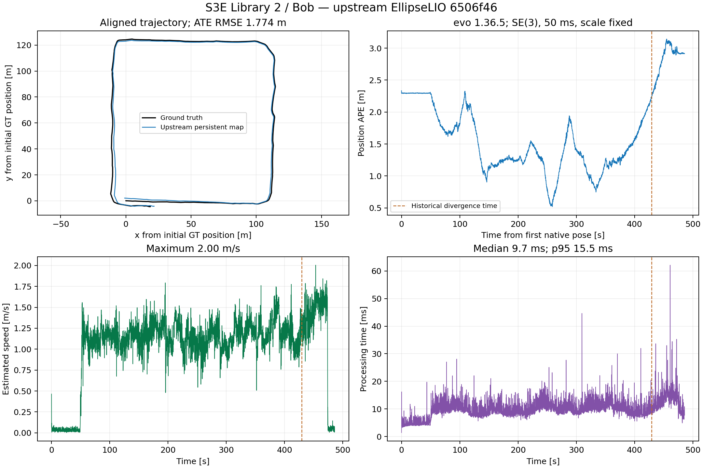

# Upstream EllipseLIO: Library 2 / Bob, 2026-09-21

Upstream [6506f46](https://github.com/v4rl-ucy/ellipselio/commit/6506f46f1947b4ef86cfba402f11f10a6ef520ee), published September 18, completed the previously diverging S3E Library 2 / Bob sequence twice. Both runs passed the existing stability and accuracy gate. The gate requires full completion, finite chronological poses, maximum speed at most 20 m/s, successful-update gaps below 1 second, and position ATE at most 5 m. These trials use the upstream persistent map, without our temporal or accumulated-area submapping, MapClosures, or CBS.

| Run | Position ATE RMSE | Maximum speed | Maximum successful-update gap | Full completion |
|---|---:|---:|---:|---|
| Historical guarded persistent baseline | 1226.6767 m | 328.364 m/s | 20.599 s | Yes |
| New upstream | 1.7738 m | 2.004 m/s | 0.202 s | Yes |
| New upstream repeat | 1.7725 m | 2.105 m/s | 0.203 s | Yes |
| Historical temporal submaps, 10 s / 5 s overlap | 1.8025 m | 2.162 m/s | 0.203 s | Yes |

The new runs have 4849 / 4844 finite chronological native scan poses, and 0 / 0 failed updates after initialization. The initial scan seeds the map. Successful updates require upstream iEKF success, positive final feature count, and finite residual and pose; neither run reported success without valid final features. The final processed scan is 18.2 / 18.2 ms before Bob's final IMU sample. Other robots' messages extend the bag beyond Bob's input.

| Native mapper resource measure | New upstream | Repeat |
|---|---:|---:|
| Mean processing per scan | 10.06 ms | 10.00 ms |
| Median processing per scan | 9.67 ms | 9.53 ms |
| p95 processing per scan | 15.51 ms | 15.50 ms |
| Maximum processing per scan | 62.11 ms | 37.15 ms |
| Peak mapper RSS | 1744.6 MiB | 1723.6 MiB |
| Replay wall time including startup/drain | 493.02 s | 493.11 s |
| Final persistent-map points | 1,686,813 | 1,682,445 |

The runs were serial at 1× on workstation 148, in a separate container with zero CPU and memory quotas, four executor threads and OMP=4 for consistency with earlier trials. Both use identical S3Ev2 Bob calibration, map resolution 0.1 m, requested IMU noise 0.1/0.1 and bias noise 0.0001/0.0001, reliable LiDAR/IMU input, and the same publication settings. The research deskew exporter remains disabled.

The estimator, correspondence rules and compiler flags are the published upstream implementation. An isolated [instrumentation patch](figures/upstream-ellipselio-library2-20260921/instrumentation.patch) adds reliable-input configuration, observes iEKF success, and records exact completed-scan diagnostics. It does not change filter arithmetic, map geometry or numerical guards. The existing four-thread launcher is reused. Source, configuration and binary hashes, loaded-library paths, input QoS and container settings are retained. The first smoke test exposed an undeclared reliable-input parameter in the adapter; it was corrected before the validated smoke test and both full trials.

ATE is calculated entirely through evo 1.36.5, using nearest timestamp association within 50 ms and rigid SE(3) alignment with scale fixed to 1; no interpolation, time-offset fitting or pose filtering. Ground truth is used only for evaluation. The supplied S3E positions retain the earlier evaluation convention: GT orientations unused and antenna lever arm uncorrected.

The earlier persistent baseline and temporal result are historical references. The earlier guarded build used -O3; the upstream build preserves its published -Ofast flags. This trial therefore supports successful operation of the new version on this case, without attributing the improvement to one particular source change. The current development estimator branches have not been merged with upstream.

The dashed line marks the historical persistent baseline's first speed violation. The plot shows the first new-upstream run; both runs' numeric results and matched trajectories are retained in [the experiment directory](figures/upstream-ellipselio-library2-20260921/).

Full captures and native logs are retained locally under `.ros2/upstream-ellipselio-20260921/bob-upstream` and `bob-upstream-repeat`, and on 148 under `/data3/mikexyl/swarm_s3e_ws/src/.ros2/upstream-ellipselio-20260921/`. Each `recording/live.rrd` was checked with `rerun rrd verify`. Rerun records native published map/scan data and sparse ellipsoid markers; best-effort map chunks are partial late in the run, and a few published poses may be missed. Accuracy and update-gap results use every native logged pose rather than sampled ROS/Rerun output. No earlier experiment or paused download was changed.
