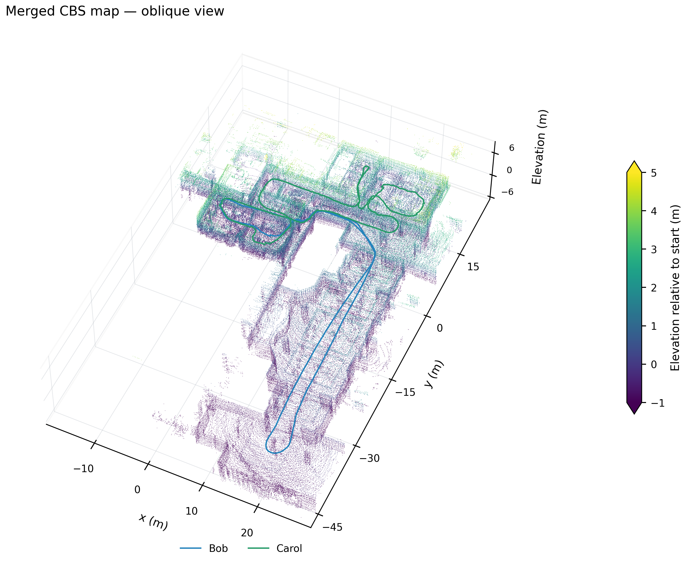

# Laboratory 1 report figures

The unchanged MegaLoc + MapClosures + CBS setup connected Bob and Carol, while
Alpha stayed separate. These figures use the completed result in each CBS
component frame. Laboratory 1 releases only motion-capture start/end ground
truth; record IDs 0 and 1 are not sensor timestamps. No ground-truth alignment
or full-trajectory position-error plot is produced.


The ground-truth figure shows all six supplied endpoint positions in a Y–Z
projection, without connecting them into unobserved paths. Source coordinates
and units are retained; this view has no estimator alignment. See the
[authors' endpoint-only GT description](https://huggingface.co/datasets/PengYu-Team/S3E/blob/main/README.md#known-issues).
[PNG](ground_truth/ground_truth_endpoints.png) · [PDF](ground_truth/ground_truth_endpoints.pdf) ·
[Full XYZ positions](ground_truth/positions.csv) · [Input and output hashes](ground_truth/figure.json).

| Figure | Bob–Carol component | Independent Alpha |
|---|---|---|
| Trajectories and loops | [PNG](Bob/trajectories_and_loops.png) · [PDF](Bob/trajectories_and_loops.pdf) | [PNG](Alpha/trajectories_and_loops.png) · [PDF](Alpha/trajectories_and_loops.pdf) |
| Top-down map | [PNG](Bob/map_top_down.png) · [PDF](Bob/map_top_down.pdf) | [PNG](Alpha/map_top_down.png) · [PDF](Alpha/map_top_down.pdf) |
| Oblique map | [PNG](Bob/map_oblique.png) · [PDF](Bob/map_oblique.pdf) | [PNG](Alpha/map_oblique.png) · [PDF](Alpha/map_oblique.pdf) |





All seven figures are available as 350-dpi PNGs and PDFs. Map colors encode robot
identity or height, not camera RGB. Height colors saturate outside −1 to 5 m
relative to the component origin, without changing the geometry. The displayed
XY region is the trajectory extent plus 8 m; the full map arrays and Rerun
recording retain all points. This view crop does not change the five-second
submaps, 80 m detector crop, or 0.5 m density-map resolution.

The top-down rendering uses the highest observed point in each 0.10 m display
pixel. Oblique views preserve metric aspect ratios with no vertical exaggeration.
Input and figure hashes, point counts, component transforms, and display limits
are in [figures.json](figures.json).

From the workspace `src` directory:

```bash
PYTHONPATH=FAST-LIVO2-ROS2/research OMP_NUM_THREADS=1 OPENBLAS_NUM_THREADS=1 \
  .ros2/research-venv/bin/python -m s3e_pipeline.report_figures \
  --input-run .ros2/laboratory1-megaloc-mapclosures-cbs/run-be92d0f21b5310d4.json \
  --output FAST-LIVO2-ROS2/research/figures/cbs-laboratory1 \
  --bev-resolution 0.10 --height-range -1 5 --map-view-margin 8
```

See the [complete run report](../../RESULTS-LABORATORY1-CBS.md) for loop failures,
branch attribution, runtime and evo's ground-truth limitation.

Reproduce the ground-truth figure separately, without loading an experiment:

```bash
.ros2/research-venv/bin/python \
  FAST-LIVO2-ROS2/research/figures/cbs-laboratory1/plot_ground_truth.py \
  --dataset /data/s3e/S3E_Laboratory_1
```
