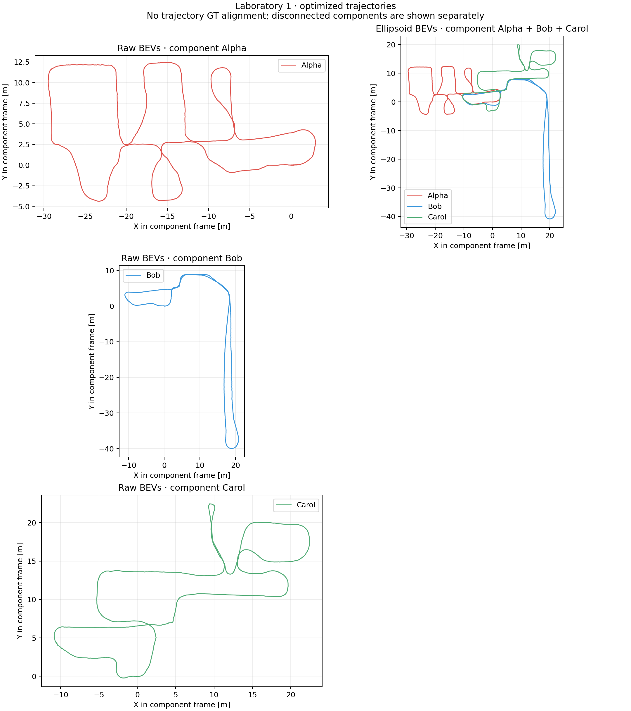
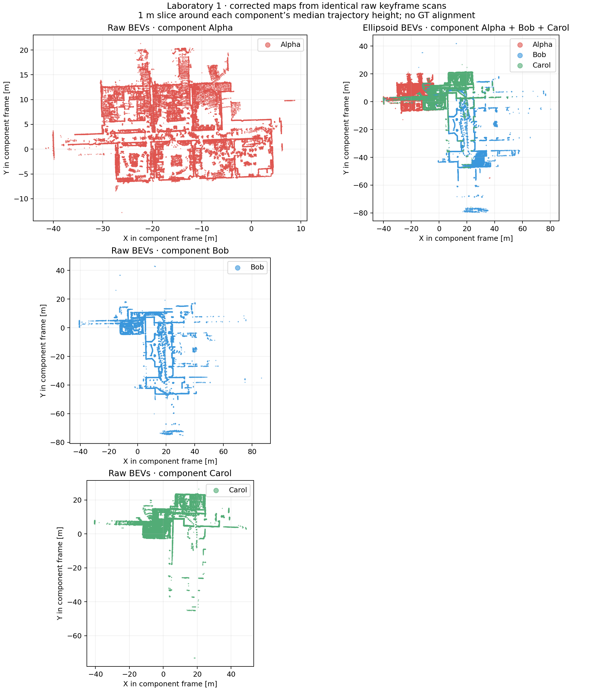
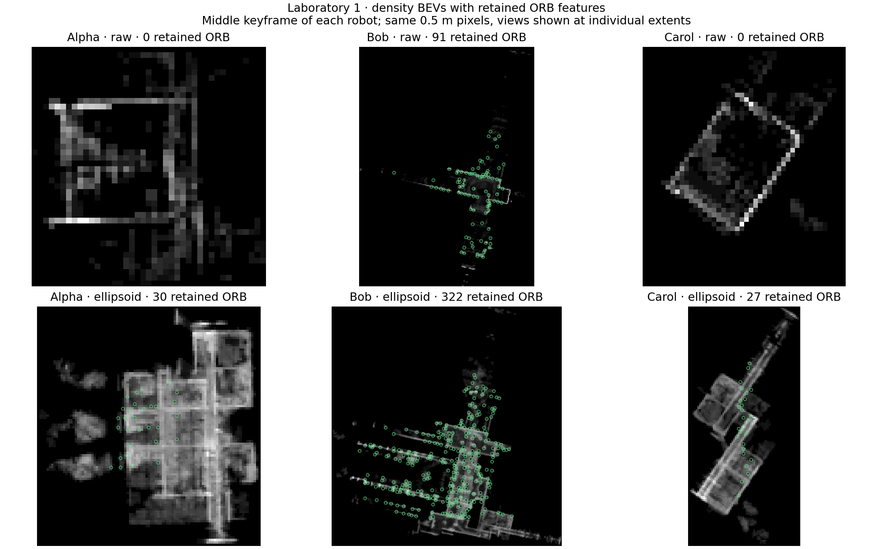

# Laboratory 1: raw versus ellipsoid BEVs

Both branches use identical fresh EllipseLIO odometry, keyframes and raw geometric
verification evidence. MapClosures runs in three isolated robot workers with causal
simulated delivery; centralized GTSAM 4.2 GNC-TLS and a selected-inlier LM refit
optimize the saved pose graphs. These results use pose factors, without CBS or live
registration factors in the optimizer.

**Raw BEVs: 3 components, 6 selected loops (0 inter-robot). Ellipsoid BEVs: 1 component, 51 selected loops (14 inter-robot).**
Full-trajectory accuracy remains unmeasured because timestamped trajectory GT is unavailable.

## Trajectory ATE

Position RMSE in metres, evaluated entirely through evo 1.36.5.

| Configuration | Combined | Alpha | Bob | Carol |
|---|---:|---:|---:|---:|
| Raw odometry (independent robot alignment) | unavailable | unavailable | unavailable | unavailable |
| Raw BEV + PGO | unavailable | unavailable | unavailable | unavailable |
| Ellipsoid BEV + PGO | unavailable | unavailable | unavailable | unavailable |

**Full-trajectory ATE is unavailable.** Evo could not produce a trajectory
ATE; association and alignment status are saved in the evo evaluation files.
Retrieval
recall and GT-based loop accuracy are also unavailable. Connectivity, accepted
loops, graph residuals and map appearance do not establish an accuracy improvement.
The plots use independent PGO component frames, without GT alignment.

The supplied Laboratory records describe only endpoints labeled 0 and 1;
those labels are not sensor epoch timestamps. They have not been remapped
to the trajectory start/end times or interpolated into an artificial path.

With timestamped GT, connected trajectories receive one shared SE(3) fit across all robots, with no
scale fitting or subsequent per-robot realignment. Disconnected components are
independently anchored and aligned; no combined three-robot ATE is reported for
a disconnected graph. Raw-odometry diagnostics use separate robot alignments.
The timestamp tolerance is 0.05 s. GT orientations are unused and the
antenna lever arm is uncorrected. Ground truth enters only after optimization.

## Loops and computation

| BEV input | Verification attempts | Accepted | Selected intra | Selected inter | Components |
|---|---:|---:|---:|---:|---:|
| raw | 9 | 9 | 6 | 0 | 3 |
| ellipsoid | 237 | 51 | 37 | 14 | 1 |

Verification attempts count candidate cloud pairs, not individual ORB matches.
Accepted registrations and GNC-selected graph factors are distinct decisions.
A larger total loop count need not imply more inter-robot matches.

| BEV input | Detection wall time | PGO wall time | Serialized exchange | Verification task time sum |
|---|---:|---:|---:|---:|
| raw | 3.32 s | 0.176 s | 1.49 MiB | 0.28 s |
| ellipsoid | 13.12 s | 0.180 s | 8.21 MiB | 6.77 s |

Detection time excludes preparation. Verification task times include evidence
packing and registration; their sum can exceed wall time because robot tasks
overlap. It is not a pure GICP-kernel timing. Delivery is reliable/unrestricted.
MapClosures and small_gicp use CPU; CUDA accelerates ellipsoid surface sampling.

### Descriptor workload

| Robot | Keyframes | Raw retained ORB | Ellipsoid retained ORB | Raw describe | Ellipsoid describe | CUDA sampling |
|---|---:|---:|---:|---:|---:|---:|
| Alpha | 295 | 1,266 | 10,382 | 0.35 s | 4.57 s | 38.23 s |
| Bob | 223 | 5,646 | 47,053 | 0.49 s | 8.92 s | 28.89 s |
| Carol | 286 | 805 | 17,426 | 0.26 s | 3.44 s | 16.01 s |

ORB counts sum retained features over all keyframes, including repeated
observations of the same structures; they are not correspondence counts.
Describe times cover native MapClosures ground alignment, density construction
and ORB extraction. They exclude raw-submap assembly, ellipsoid reconstruction,
surface sampling, debug rendering and artifact I/O.

Serial odometry replay: **29.64 min**. Preparation of both
branches: **5.51 min**, including
**1.39 min** of CUDA sampling.
Preparation overlaps later robot replays, so those stage totals are not additive.

Native descriptor inputs average **8,655 raw points** versus
**264,525 sampled ellipsoid points** per keyframe. Thus construction
time includes substantially different point-processing workloads; it should
not be interpreted as feature-matching speed for equal inputs.

Nonempty descriptor views: **310/804 raw**
and **675/804 ellipsoid**.
A nonempty descriptor is not a verified place match. Persistent ellipsoid maps
also cover more accumulated space than the trailing raw submaps, so any gain
cannot be attributed to the ellipsoid representation alone.

The unchanged native ORB detector excludes a 31-pixel image border.
Images with a dimension at most 62 pixels have no interior beyond that border:
**415/804 raw**
and **128/804 ellipsoid**.
This is an image-extent limitation under the fixed 0.5 m pixel setting;
the run does not tune the detector or resolution for indoor scenes.

## Fixed settings and provenance

Keyframes: {'Alpha': 295, 'Bob': 223, 'Carol': 286}. Dense frames: {'Alpha': 2874, 'Bob': 2880, 'Carol': 2892}.

Native ellipsoid centers, geometric semi-axes and axis directions define the
rendered surfaces: 0.125 m nominal sampling, 0.25 m voxel centroids, deterministic
CUDA accumulation at 0.1 micrometre resolution. Earlier validation on three real
maps reproduced CPU density pixels and ORB descriptors exactly. The ellipsoid
map is persistent and causal, cropped at 80 m. Raw BEVs use trailing 5-second
submaps with the same crop. Different map histories remain part of the comparison.

MapClosures uses 0.5 m pixels, density threshold 0.05, Hamming threshold 50 and
more than five RANSAC inliers. Retrieval keeps a top-20 shortlist with one selected
LiDAR candidate per query, a two-second cooldown and 30-second same-robot exclusion.
Common raw-evidence GICP uses the existing 0.35 m RMSE, 30% overlap and observability
gates. No thresholds were tuned on this sequence. Full settings are in inputs.json.

The fixed 1 m / 10 degree / 2 s schedule comes from saved **FAST-LIVO2**
raw trajectories, without loop labels or ground truth. Both branches use fresh
EllipseLIO states and the same actual export timestamps. A requested snapshot
before filter initialization is associated with the first valid export, with
a two-second startup allowance; later associations retain the 250 ms guard.
Observed association delays and merged schedule entries are retained in the audit.

## Validation and loop quality

Frozen PGO was rerun for both branches. All 1,614 watched
odometry/keyframe/descriptor input hashes stayed unchanged. Pose differences:
ellipsoid: 0, raw: 0.
The regression selection passed 31 tests.

| BEV input | GT-checkable loops | Flagged distance discrepancies >2 m |
|---|---:|---:|
| ellipsoid | 0/51 | unavailable |
| raw | 0/9 | unavailable |

Checks compare constraint translation magnitude with GT endpoint separation.
Both endpoints need GT interpolation across gaps of at most two seconds. Flags
are position-only diagnostics, not proof of full 6-DoF outliers. These post hoc
checks did not select or remove factors. Intra/inter-robot mixtures differ.

Replay policy is retained in [replay-policy.json](provenance/replay-policy.json).
The configured serial playback rate is **0.5x**.
Replay wall time includes this deliberate pacing and is not an online throughput measurement.

## Retained artifacts

Full poses, constraints, evo association-status evidence, graph residuals
and weights, source/configuration provenance and figures are retained.
The compact [Rerun recording](trajectories.rrd) shows trajectories and maps in separate component frames.

Cleanup removed **2.83 GiB** of generated MCAP, ellipsoid deltas
and geometry stages. Frozen PGO remains reproducible from the retained evidence;
reconstructing descriptors requires replay. The original dataset is unchanged.

## Map and BEV inspection

Both maps are rebuilt from the same raw keyframe scans, using each graph's
optimized poses. The plan view shows a one-metre height slice around the
median trajectory height of each component; Rerun retains the full-height maps.
Disconnected components remain separate. No endpoint-GT
alignment is applied, and visual sharpness is not a ground-truth accuracy score.

The middle keyframe of each robot is selected independently of loop results.
