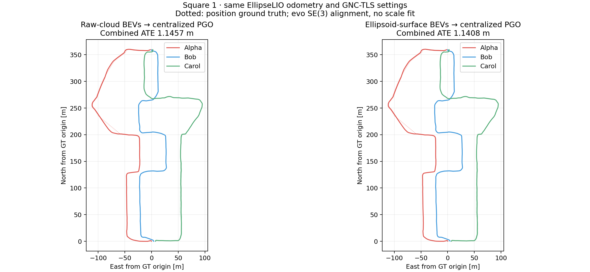
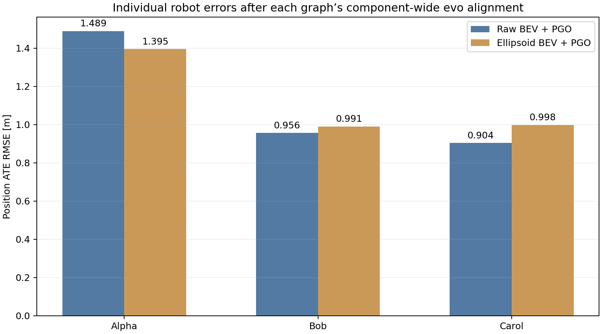

# Square 1: full-sequence ellipsoid BEVs and trajectory ATE

Both inputs were evaluated on the **same new EllipseLIO odometry and keyframes**
for Alpha, Bob and Carol. Native MapClosures retrieval and small_gicp acceptance
run in isolated robot workers with the existing deterministic delivery scheduler.
Both resulting graphs use centralized GTSAM 4.2 GNC-TLS followed by a
selected-inlier LM refit. This is a centralized PGO comparison; CBS and live
registration factors are not part of these two solver objectives.

**Observed result:** ellipsoid BEVs achieve 1.1408 m combined ATE versus
1.1457 m for raw BEVs, a 0.0049 m (0.43%) difference. Alpha improves, while
Bob and Carol worsen. This single paired run establishes working full-sequence
integration, with little change in aggregate ATE.

## Trajectory ATE

Position RMSE in metres, evaluated entirely through **evo 1.36.5**:

| Configuration | Combined ATE | Alpha | Bob | Carol |
|---|---:|---:|---:|---:|
| Raw EllipseLIO (independent robot alignment) | unavailable | 1.0957 | 0.8004 | 0.5927 |
| Raw BEVs + centralized PGO | 1.1457 | 1.4889 | 0.9559 | 0.9041 |
| Ellipsoid BEVs + centralized PGO | 1.1408 | 1.3950 | 0.9906 | 0.9981 |

Connected optimized trajectories receive one shared SE(3) alignment across all
three robots. Each listed robot error uses that same alignment, without a second
robot fit. Disconnected components are independently anchored and aligned; a
combined three-robot ATE is unavailable if the graph stays disconnected. Raw
odometry uses separate robot fits and is a diagnostic with a different alignment
scope. No scale is fitted, timestamp tolerance is 0.05 seconds, and supplied GT
orientations are unused. GT is introduced only after both graphs are optimized.

## Loop detection and graph selection

| BEV input | Verification attempts | Accepted constraints | GNC-selected loops | Selected inter-robot loops | Components |
|---|---:|---:|---:|---:|---:|
| raw | 115 | 38 | 38 | 38 | 1 |
| ellipsoid | 589 | 63 | 63 | 8 | 1 |

Keyframes: {'Alpha': 543, 'Bob': 483, 'Carol': 522}. Dense odometry frames: {'Alpha': 4542, 'Bob': 4522, 'Carol': 4569}.
Loop acceptance and robust factor selection are separate steps; selected-loop
counts exclude factors rejected by GNC or unsupported initial robot alignment.
Native acceptance and registration reasons are retained in `report.json` and
the branch-specific verification logs.

The ellipsoid branch's 63 loops comprise **55 intra-robot and 8 inter-robot**
constraints. All 38 raw-branch loops are inter-robot. The extra ellipsoid loops
therefore do not represent increased inter-robot detection. Both graphs connect
all three robots, and GNC selects every accepted loop in each graph.

## Rendering and controls

The renderer uses each actual native ellipsoid’s center, geometric semi-axes
and orthonormal axis directions. Surfaces are sampled at the same nominal
0.125 m spacing as the short diagnostic and merged with 0.25 m voxel centroids.
CUDA accelerates the sampler using deterministic integer accumulation at 0.1 µm
precision. Three retained real snapshots reproduced the CPU prototype’s density
images, ORB keypoints and descriptors exactly, including a 144,474-ellipsoid map;
that map took 0.28 s to sample on this machine. Repeated GPU rendering was also
identical. Native MapClosures ground alignment, density/ORB/HBST/RANSAC and their
thresholds are unchanged.

The ellipsoid map is spatial, persistent and causal, cropped at 80 m around the
current pose. The raw branch uses trailing five-second scan submaps. Their map
histories differ, so this comparison includes that effect. Both branches use
the same raw geometric evidence for GICP and the same odometry pose factors.
The existing 1 m / 10° / 2 s keyframe schedule is taken from the complete prior
odometry keyframe list, independently of loops and GT. Any merged scan intervals
are recorded. Empty fitted maps at initialization produce empty descriptors.

MapClosures settings: 0.5 m BEV pixels, density threshold 0.05, Hamming threshold
50, more than five native RANSAC inliers, top-20 shortlist, one selected LiDAR
candidate per query with the existing two-second cooldown and 30-second
same-robot exclusion. GICP retains the existing 0.35 m RMSE and 30% overlap gates
and observability checks. There is no parameter sweep.

Native ellipsoid snapshots are stored as lossless world-frame changes between
keyframes. Raw scans and states remain standard ROS2 MCAP messages. New stores,
descriptor caches, loop transcripts and PGO graphs are versioned immutable
stages. Both loop branches refer to identical preparation hashes, recorded in
`report.json`. The solver corrects saved trajectories only.

This fresh paired experiment supersedes using the earlier raw-BEV 1.1371 m ATE
as a direct comparison: that value came from a different replay and loop set.
The earlier eight-pair test remains a separate rendering diagnostic.

Machine-readable metrics, per-robot TUM trajectories, graph residuals and robust
weights, evo result ZIPs and alignment evidence are retained alongside this
report. `inputs.json` records the stage lineage. The Rerun recording presents
the two optimized trajectory sets and position GT.

## Runtime and communication

| BEV input | Distributed detection | Centralized PGO | Serialized exchange |
|---|---:|---:|---:|
| raw | 35.79 s | 0.448 s | 53.27 MiB |
| ellipsoid | 102.19 s | 0.460 s | 72.44 MiB |

These are measured wall times after descriptor preparation. Detection runs three
isolated CPU workers with reliable unrestricted simulated delivery. CUDA is used
for ellipsoid surface sampling; MapClosures and small_gicp run on CPU. Full fresh
serial odometry replay took 23.17 minutes in total. Preparing both descriptor
branches took 29.93 minutes, including 10.67 minutes of CUDA surface sampling.
Preparation overlapped later robot replays, so these totals are not additive.

## Verification and retained evidence

Frozen PGO reproduced both graphs with zero pose-matrix difference; hashes of
all 3,102 watched odometry, keyframe and descriptor files stayed unchanged.
The regression selection passed 29 tests. All 1,548 scheduled keyframe snapshots were
captured, with no schedule entries merged. The export audit records the observed
scan intervals and association delays.

Post hoc loop checks compare the estimated endpoint distance with interpolated
GT positions. They flag discrepancies above 2 m, and require bracketing GT samples
no more than 2 seconds apart at both endpoints. This is a position-only diagnostic;
GT orientations are unavailable, so it does not establish full 6-DoF correctness.

| BEV input | GT-checkable loops | Flagged (>2 m distance discrepancy) |
|---|---:|---:|
| raw | 38/38 | 6 |
| ellipsoid | 52/63 | 1 |

These checks are diagnostic only and did not select or remove optimization factors.
Different intra/inter-robot loop mixes prevent treating these counts as a direct
comparison of outlier rates. Eleven ellipsoid loops lack sufficient GT coverage.

Cleanup removed 6.14 GiB of generated MCAP, map deltas and geometry
stages. Full frozen poses and constraints, compressed exchanges, evo evidence,
source/configuration hashes, figures and the 0.43 MiB [Rerun recording](trajectories.rrd)
remain. Descriptor/retrieval reconstruction requires replay after cleanup; frozen
pose-only PGO remains reproducible from retained evidence. The original dataset
and earlier experiment reports are unchanged.
