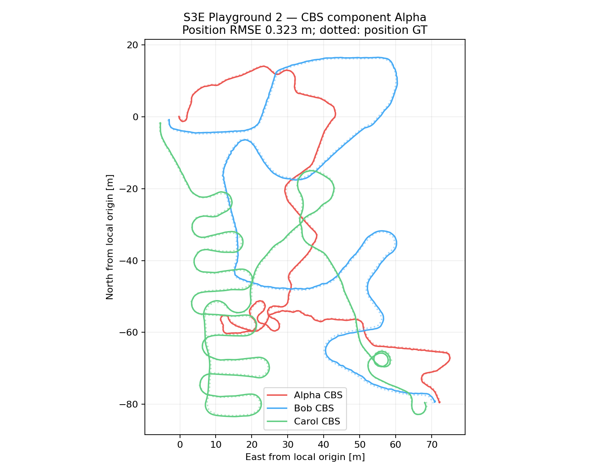
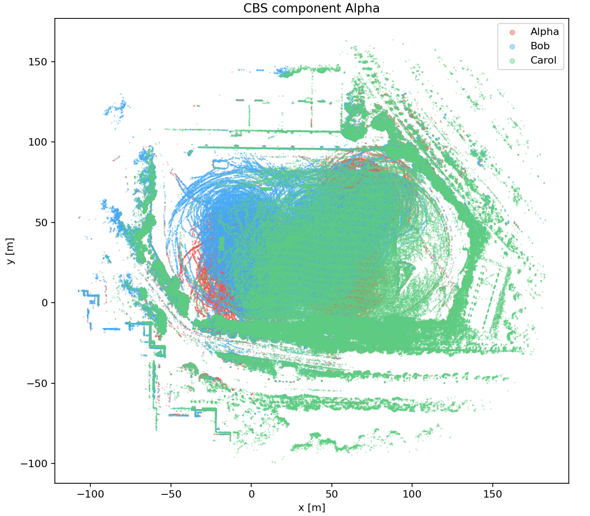
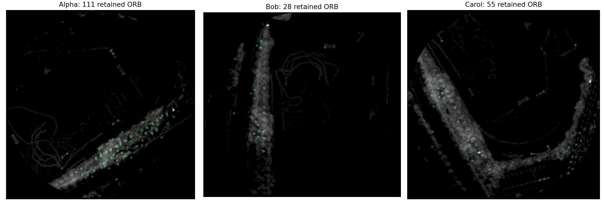

# S3E_Playground_2: EllipseLIO + ellipsoid MapClosures + PCM/CBS

EllipseLIO -> native ellipsoid surface BEVs -> MapClosures -> distributed PCM -> CBS with live GICP factors.

Retrieval uses ellipsoid-projected BEVs only. Three isolated DDS workers detect loops; distributed PCM gates inter-robot loops before native CBS optimization. Native GICP factors retain the existing CBS configuration. No centralized PGO is used.

| Robot | Raw ATE, independent fit [m] | CBS ATE, shared component fit [m] |
|---|---:|---:|
| Alpha | 0.1671 | 0.2072 |
| Bob | 0.3049 | 0.4232 |
| Carol | 0.2606 | 0.3036 |

Combined CBS ATE: **0.3234 m**.

Evo 1.36.5, 50 ms timestamp association, one shared rigid fit per CBS component, no scale fitting or additional robot fit. Supplied GT orientations are unused. Raw odometry uses separate fits.

PCM: **76 proposed / 75 retained / 1 excluded**. PCM applies to inter-robot measurements; verified intra-robot loops pass unchanged.

Components: `{'Alpha': 'Alpha', 'Bob': 'Alpha', 'Carol': 'Alpha'}`. Detection/PCM/CBS wall time: **47.17 s**.

The ellipsoid float bases are projected to their nearest orthogonal basis only when the maximum Gram-matrix defect is at most 0.001; larger defects fail preparation. Axes and centers are unchanged. Per-keyframe adjustment magnitudes are retained in preparation timings.

[Numeric report](report.json), [PCM decisions](dpgo/pcm.json), [evo evidence](evo/cbs/evaluation.json), [Rerun recording](result.rrd).
