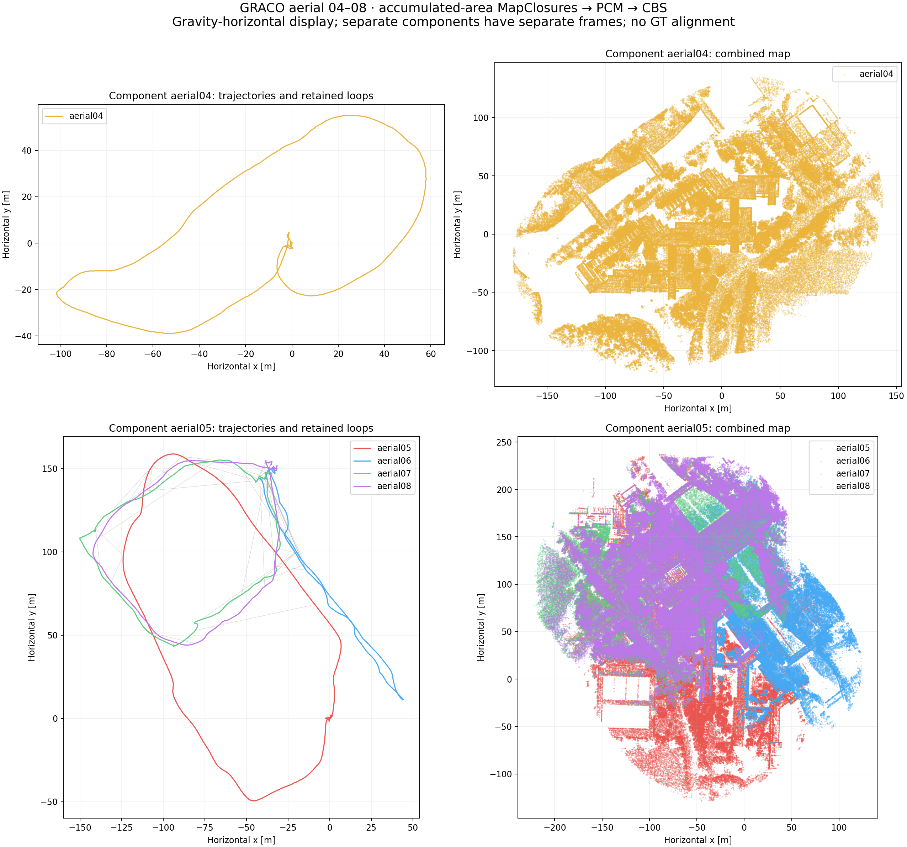
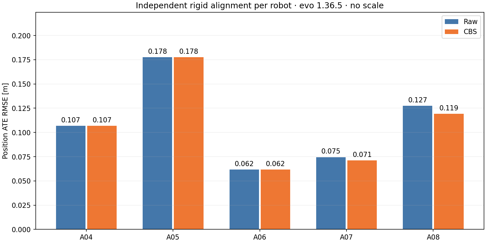

**GRACO aerial 04 added to aerial 05–08 — 21 September 2026**

**A04 remained disconnected.** It produced 32 accumulated-area descriptors, 0 geometric verification attempts, 0 accepted loop proposals and 0 retained loops after PCM. A disconnected A04 is an accepted experimental outcome, not an execution failure.

A04 received a fresh full-flight 1× replay on workstation 148. The verified A05–A08 frontend captures and descriptor/evidence payloads were reused unchanged; all five isolated workers ran fresh retrieval, geometric verification, PCM and CBS. The earlier four-robot result is preserved. No hardware resource quotas were imposed.

| Flight | Raw ATE (m) | CBS, individual (m) | CBS, component alignment (m) | Component |
|---|---:|---:|---:|---|
| aerial04 | 0.1067 | 0.1067 | 0.1067 | aerial04 |
| aerial05 | 0.1775 | 0.1776 | 0.7847 | aerial05 |
| aerial06 | 0.0618 | 0.0616 | 0.2520 | aerial05 |
| aerial07 | 0.0745 | 0.0713 | 0.2799 | aerial05 |
| aerial08 | 0.1275 | 0.1193 | 0.2451 | aerial05 |

All metrics use evo 1.36.5, nearest timestamp association within 50 ms, rigid SE(3) alignment and no scale fitting. Individual ATE fits one transform per flight; component ATE fits one transform per connected component. Disconnected components are never displayed or evaluated as if their relative placement were known. Ground truth was first accessed for A04 after backend completion.

Component `aerial04` (aerial04): **0.1067 m** shared ATE.
Component `aerial05` (aerial05, aerial06, aerial07, aerial08): **0.4381 m** shared ATE.

| Retained loop pair | Count |
|---|---:|
| aerial05 ↔ aerial07 | 10 |
| aerial06 ↔ aerial07 | 23 |
| aerial06 ↔ aerial08 | 3 |
| aerial07 ↔ aerial08 | 15 |

All robots: 53 geometrically accepted proposals, 51 retained loops, 2 PCM exclusions. Verification outcomes: `{"accepted": 53, "low_overlap": 1}`.
A04 verification outcomes: `{}`. Backend wall time: **155.48 s**.

A04 retrieval requires a qualification: 746 inter-robot candidate entries were returned. Of these, 745 failed the retrieval threshold. A08:11 → A04:22 was eligible with six BEV inliers, but the existing one-candidate-per-query rule selected A08:11 → A07:31, which had nine inliers. The A04 candidate was explicitly skipped as `verification_budget`; it did not fail a runtime 3D test.

A separate diagnostic applied the unchanged production verifier to that single skipped candidate. It **accepted**: overlap **0.5048**, residual RMSE **0.2996 m**. The diagnostic read no ground truth and did not modify the graph. The configured PCM minimum clique size is two, so one isolated A04–A08 proposal would still lack the required consistency support. No singleton exception or threshold change was introduced.

A post-hoc reference check of that candidate gives 0.346 m translation and 0.256° rotation discrepancy against independently position-GT-aligned raw odometry. This is an approximate relative-anchor reference, not exact six-DoF GT; it was not fed back to estimation. The result supports further examination of this match, while the completed runtime result remains disconnected.

The ranked-candidate metadata retains a stale default `rejection_reason` even for the eligible candidate. The counts above use the final rejection events, which correctly distinguish `retrieval_threshold` from `verification_budget`.

| Flight | Stable | Native poses | Failed updates after initialization | Max successful-update gap (s) | Mean / p95 processing (ms) | Peak mapper RSS (MiB) | Snapshots |
|---|---|---:|---:|---:|---:|---:|---:|
| aerial04 | True | 2760 | 0 | 0.120 | 5.02 / 9.64 | 868.3 | 32 |
| aerial05 | True | 2753 | 0 | 0.192 | 11.34 / 24.06 | 1099.2 | 34 |
| aerial06 | True | 3107 | 0 | 0.168 | 11.98 / 25.66 | 1005.2 | 33 |
| aerial07 | True | 3713 | 0 | 0.152 | 12.02 / 25.81 | 1162.8 | 40 |
| aerial08 | True | 2623 | 0 | 0.136 | 12.42 / 25.45 | 1045.1 | 29 |

A05–A08 performance numbers describe the reused captures. Processing time is native scan processing, including map insertion and snapshot export; successful-update gaps use sensor timestamps.

Configuration matches the four-robot height-initialization run: updated persistent-map EllipseLIO without odometry submapping; 80 m horizontal area snapshots with no height or age cutoff; 20 m movement / 10 s snapshot triggers; gravity-horizontal ellipsoid BEVs; geometry-only vertical initialization; unchanged GICP gates, PCM and CBS registration factors. Geometry consists of native processed accumulated-map representatives. The supplied aerial calibration, IMU noise, reliable input and four-thread launcher are unchanged.

A04 conversion preserved all 2,915 LiDAR and 36,431 IMU measurements and their record, header and point timestamps. Only these sensor streams entered estimation. Frozen source hashes, descriptor/evidence membership, causal availability, graph anchors, input hashes and live/derived Rerun recordings were checked. The configured 100 settling iterations completed; this does not claim global optimality.

The four-robot investigation found a discrepancy between A05-related loop placement and the trajectory reference, while cloud registration appeared geometrically consistent. This experiment tests A04 connectivity; it does not resolve that earlier map/reference discrepancy.

[BEV gallery](bev-gallery/index.html) · [Rerun](report/result.rrd) · [Numeric report](report/report.json) · [A04 retrieval and skipped-candidate diagnostic](aerial04-retrieval-diagnostic.json) · [Post-hoc reference check](aerial04-skipped-candidate-reference-check.json) · [Audit](retention-audit.json)

Full output on 148: `/data3/mikexyl/swarm_s3e_ws/src/.ros2/graco-aerial-five148-20260921/full`. No bulk geometry was deleted.
