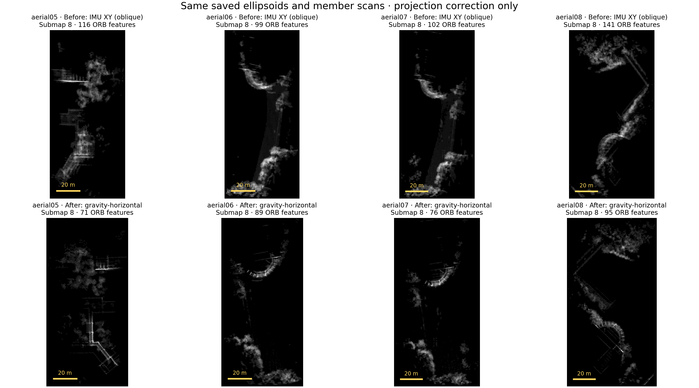

# GRACO aerial 05–08: gravity-horizontal ellipsoid BEVs

Completed on 2026-09-20 on workstation 148. All **253 completed temporal submaps** were reprocessed with gravity-horizontal orthographic density projection, then passed through **MapClosures → distributed PCM → CBS/GICP**. The original four trajectories and every registration-evidence NPZ are byte-identical to the previous run. No CPU/RAM/GPU quotas were imposed.

**The projection correction did not improve ATE or connectivity in this comparison.** The graph still contains three components: aerial-05, aerial-06/07, and aerial-08. There is no four-robot shared map or all-four ATE.

| Flight | Raw ATE RMSE | Previous CBS ATE | Gravity-BEV CBS ATE |
|---|---:|---:|---:|
| aerial05 | 0.8601 m | 0.8601 m | 0.8601 m |
| aerial06 | 3.5598 m | 3.5955 m | 3.6017 m |
| aerial07 | 0.2034 m | 0.4948 m | 0.5024 m |
| aerial08 | 0.1668 m | 0.0735 m | 0.1668 m |

Aerial-06/07 shared-component ATE changed from **2.4526 m** to **2.4576 m**. Raw fits are independent; CBS uses one rigid fit per connected component. These are position ATEs from **evo 1.36.5**, 50 ms association, scale fixed to one. All 12,187 trajectory samples matched. Ground truth was first accessed after backend completion.

Five loops survived, compared with six previously: **four inter-robot loops between aerial-06/07 and one intra-robot loop on aerial-05**. PCM rejected zero of five proposals (four inter-robot proposals went through PCM; the intra-robot proposal passed geometric verification). The previous aerial-08 loop was not recovered. All five retained loops supplied CBS GICP factors. Backend time was **16.23 s**, versus 14.02 s previously. Reprocessing, optimization, evaluation and audit took **138.60 s**; rendering and exact-feature verification of the full gallery took another **46.07 s**, partly overlapping evaluation.

The accepted endpoints are aerial05/1 ↔ aerial05/7; aerial06/7 ↔ aerial07/7; and aerial06/10 ↔ aerial07/{9,10,11}. Of 32 geometric verifications, five passed, twelve failed RMSE, seven failed initial overlap, and eight failed final overlap. No retrieval, registration, PCM or CBS thresholds were tuned.

**Gravity provenance:** the historical captures did not save per-anchor filter gravity. This rerun reconstructs a constant world gravity direction from the first **126 `/gnss/imu` accelerometer measurements**, then rotates it into each saved anchor IMU frame. This approximates the native initializer; it does not recover its callback-specific sample membership or subsequent ESKF gravity corrections. Startup half-window direction differences were 0.003–0.014°, which indicates stable startup measurements, not a bound on absolute orientation error. No IMU orientation field or ground truth was used. Sidecars bind the estimate to sensor, index, payload and anchor hashes/timestamps.

The new native exporter records **actual filter gravity at each anchor**, in world and IMU coordinates, for future captures. Preparation now requires that metadata or an explicitly supplied reconstruction. The descriptor keeps the full IMU-to-level rotation so loop poses return to the original IMU endpoint frames. Stored geometric evidence remains in the original anchor frame. `projection_alignment: local_ground` remains available to reproduce legacy behavior.

The old projection plane was approximately **36.6–54.4° from horizontal** across these submaps. Every corrected projection maps its estimated up direction exactly onto +Z within floating-point precision. All 253 displayed PNGs reproduce their cached native ORB keypoints and descriptor bits exactly. A BEV remains a density integration through height: building outlines, wall thickness and ellipsoid footprints can still appear. It is not an occlusion-rendered aerial photograph.

Gravity determines horizontal orientation, but not terrain height or inter-flight altitude. The projection transform has zero vertical translation. The planar initial hypothesis therefore leaves relative vertical displacement for 3D registration within its unchanged capture range; this experiment does not establish that altitude initialization is solved.

**The result remains diagnostic:** aerial-06 and aerial-08 retain their original successful-LiDAR-update gap failures of 2.656 s and 1.464 s. Frontends were reused, so raw ATE and stability are unchanged.

Validation passed **30 Python tests and two native tests**, including inverted/tilted gravity, vertical-wall collapse, original/reversed endpoint transforms, unchanged evidence, immutable exports, causal availability and four-robot distributed PCM/CBS. Runtime audit checked all 253 memberships, all 1,012 ranked scheduling events, original/source immutability, identical evidence and raw trajectories, and the new Rerun recording. Initial build/test environment failures (CMake setup, ROS overlay loading and the isolated module path) were corrected before this run; worker filesystem isolation stayed enabled.

[Interactive gallery: 253 corrected images](../bev-gallery/index.html) · [Numeric results](report/report.json) · [Comparison audit](comparison.json) · [Projection audit](projection-audit.json) · [Derived Rerun recording](report/result.rrd) · [Retained-file hashes](../retained-files.json)

New bulk results, geometry and isolated builds remain on 148 at `/data3/mikexyl/swarm_s3e_ws/src/.ros2/graco-aerial-gravity148-20260920`. The original captures, recordings and oblique-projection results remain unchanged at `.ros2/graco-aerial-four148-20260920`. The local retained copy contains reports, configs, source snapshots, hashes, descriptors, trajectories, evo evidence, the gallery and the verified derived Rerun recording. Existing experiments and the paused CU-Multi download were preserved.
