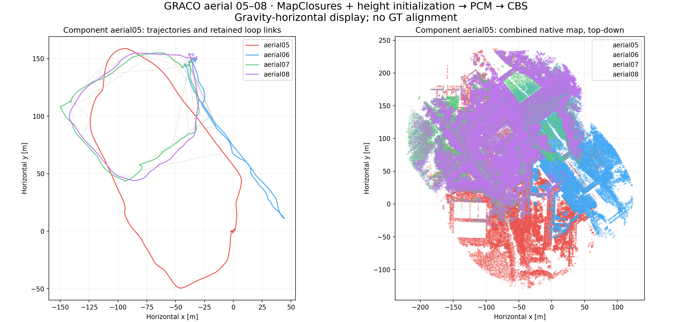
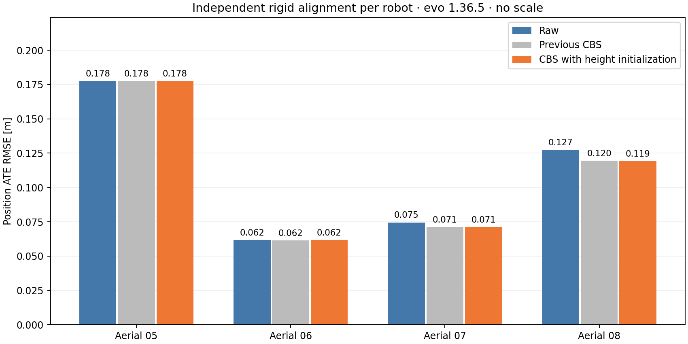

**GRACO aerial 05–08: full distributed backend with runtime height initialization — 21 September 2026**

**All four drones are connected in one optimized component.** A05 has **10 retained inter-robot loops**. This is the completed runtime MapClosures → PCM → CBS result, including native GICP registration factors.

The four previously verified updated-EllipseLIO captures were reused byte-for-byte. Odometry uses its persistent map without submapping; 80 m horizontal accumulated-area snapshots supply BEVs and registration evidence. All 136 descriptors and their native processed geometry are unchanged. Fresh isolated workers performed retrieval, runtime verification, PCM and CBS; no diagnostic loop list was injected. Workstation 148 had no CPU, memory or GPU quotas.

| Flight | Raw ATE (m) | Previous CBS, individual (m) | New CBS, individual (m) | New CBS, component alignment (m) | Matched poses |
|---|---:|---:|---:|---:|---:|
| Aerial 05 | 0.1775 | 0.1775 | 0.1776 | 0.7844 | 2753 |
| Aerial 06 | 0.0618 | 0.0615 | 0.0616 | 0.2512 | 3107 |
| Aerial 07 | 0.0745 | 0.0711 | 0.0711 | 0.2794 | 3713 |
| Aerial 08 | 0.1275 | 0.1196 | 0.1193 | 0.2452 | 2623 |

Raw and individual CBS ATE each use an independent rigid SE(3) alignment per robot. Component ATE uses one alignment shared by all robots in that component. Evaluation is entirely evo 1.36.5, 50 ms timestamp association, no scale fitting. GRACO IMU-frame position GT is accessed after backend completion and never used by the height initializer.

Component `aerial05` (aerial05, aerial06, aerial07, aerial08): **0.4378 m** shared position ATE.

The previous run had two components: A05 alone (0.1775 m ATE) and A06–A07–A08 (0.1023 m shared ATE). Its three-robot shared ATE is not directly comparable to a new four-robot shared ATE. Connecting A05 does not itself establish an accuracy improvement.

Geometric verification accepted **53** loop proposals; PCM retained **51** and rejected **2**. A05: 12/12 geometric candidates accepted; 10 survived PCM.

| Retained pair | Loops |
|---|---:|
| aerial05 ↔ aerial07 | 10 |
| aerial06 ↔ aerial07 | 23 |
| aerial06 ↔ aerial08 | 3 |
| aerial07 ↔ aerial08 | 15 |

Verification outcomes: `{"accepted": 53, "low_overlap": 1}`.

The initializer fills the unobserved vertical component of a gravity-horizontal BEV pose. It votes on height differences of horizontally adjacent 3D points, scores five separated modes plus zero by symmetric coarse overlap, and changes only vertical translation before GICP. It runs on all robot-pair candidates, not an A05-specific rule. No nominal flight heights, GNSS or GT enter it. Default-disabled configuration preserves existing behavior elsewhere.

Height estimation uses 0.8 m voxels, eight XY neighbors within 1 m, 0.5 m bins, >2 m mode separation and 1.5 m coarse overlap distance. Evidence/registration remain fixed 0.4 m; GICP keeps 1.5 m correspondence distance, 0.6 m inlier distance, minimum overlap 0.30 and maximum RMSE 0.35 m. Retrieval, same-robot exclusions, PCM probability 0.99 / minimum clique 2, and CBS settings are unchanged.

Backend wall time: **150.64 s** (previously 226.00 s). Rerun preparation, regression, backend, evaluation and audit: **222.70 s**; this excludes the original odometry capture and this gallery/report generation. Runtime height initialization ran 54 times, with mean / p95 706.5 / 1482.7 ms per candidate. These are backend costs, not per-scan odometry times.

All reused frontends completed with finite chronological poses and zero unsuccessful LiDAR updates after initialization. Max update gaps for 05/06/07/08 remain 0.192 / 0.168 / 0.152 / 0.136 s; mean native processing remains 11.34 / 11.98 / 12.02 / 12.42 ms. No new frontend performance claim is made.

Verification: 38 tests passed, including gravity/reversal and actual distributed integration. The production verifier reproduced all fourteen offline regression outcomes (twelve recovered A05 candidates and two accepted controls). The final audit checked unchanged raw trajectories, input/descriptor/evidence hashes, causal availability, graph anchor timestamps, unchanged historical results, runtime initializer diagnostics, frozen sources and Rerun integrity. The 136 gallery images retain their verified original bytes and cached ORB features; its loop-pair list uses this new PCM result.

Backend completion means the configured 100 local settling iterations finished after peer input completion; it is not a claim of mathematical convergence. This is one run with fixed settings.

[BEV and retained-loop gallery](bev-gallery/index.html) · [Rerun recording](report/result.rrd) · [Trajectories and maps with evaluation](report/trajectories-maps.png) · [Numeric report](report/report.json) · [Artifact audit](retention-audit.json) · [Runtime summary](diagnostics/summary.json)

Full output on 148: `/data3/mikexyl/swarm_s3e_ws/src/.ros2/graco-aerial-height148-20260921/full`. The original disconnected run remains at `/data3/mikexyl/swarm_s3e_ws/src/.ros2/upstream-area-graco-aerial148-20260921/full`.
