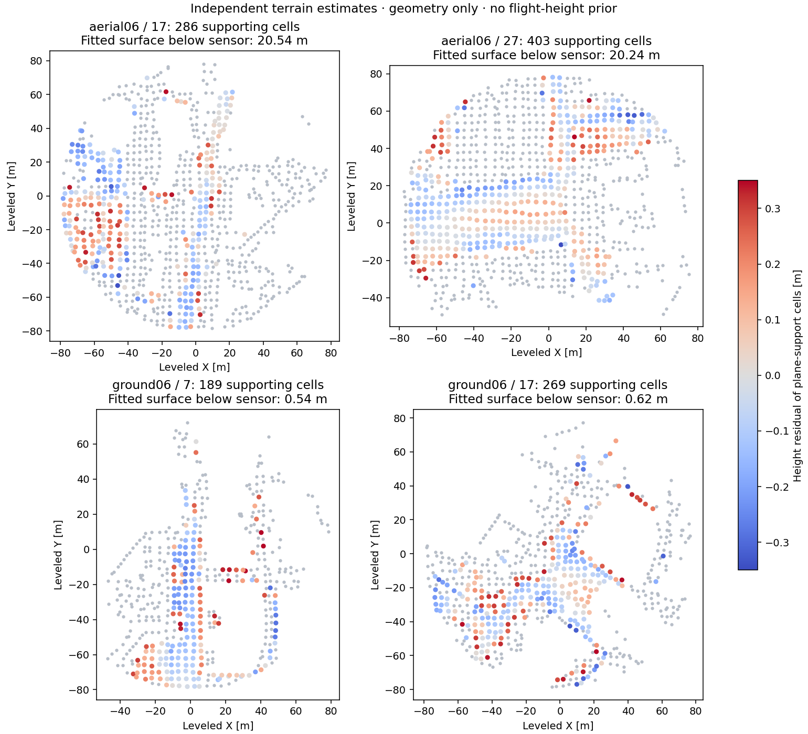
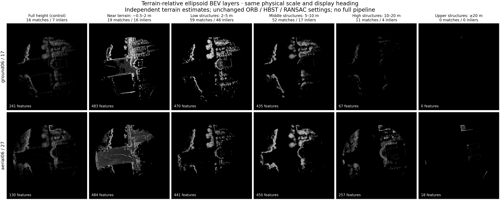
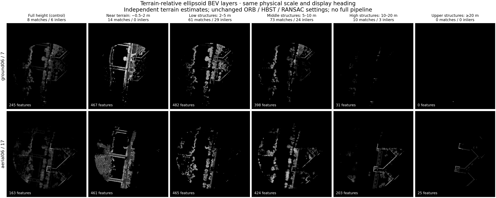

**Terrain-relative multilayer ellipsoid BEV preview**

Four saved submaps, two selected pairs. No bags replayed, no ground truth accessed, no 3D registration, PCM or CBS. The original experiment remains unchanged.

Each snapshot independently estimates a low-surface plane using 4 m spatial cells and their 10th-percentile native map-point heights. A slope-constrained robust fit supplies terrain-relative heights. The plane is a local approximation, and support does not prove terrain identity when ground is obscured. Fitted planes do not rotate the gravity-aligned XY projection.

The original ellipsoids are sampled exactly as before. Their surface samples are split into fixed height bands −0.5–2, 2–5, 5–10, 10–20 and ≥20 m. This slices complete sampled surfaces, not ellipsoid centers. Samples below −0.5 m remain available in the full-height control.

All images use the original 0.5 m pixels, native linear density normalization, ORB and self-pruning, Hamming threshold 50, native 3-pixel RANSAC distance and strict >5-inlier gate. This isolates height slicing; logarithmic density and learned descriptors are not added. Inlier counts are never pooled across layers.

**These are two-map matching diagnostics, not database retrieval results.** Each band is matched to the same band. The full-height control uses the same two-map protocol, while original database counts are retained separately in summary.json. Full-height images reproduce the original cached ORB features exactly.

All comparisons use one saved full-height RANSAC pose only to set a common display heading and position. It does not guide terrain estimation, layer matching or RANSAC. Green lines indicate each layer’s own RANSAC support; they are not accepted 3D loop correspondences.

| Query ↔ candidate | Height band | Matches | Inliers | Passes unchanged 2D gate |
|---|---|---:|---:|---|
| ('aerial06', 27) ↔ ('ground06', 17) | full | 16 | 7 | Yes |
| ('aerial06', 27) ↔ ('ground06', 17) | near | 19 | 16 | Yes |
| ('aerial06', 27) ↔ ('ground06', 17) | low | 59 | 46 | Yes |
| ('aerial06', 27) ↔ ('ground06', 17) | middle | 52 | 17 | Yes |
| ('aerial06', 27) ↔ ('ground06', 17) | high | 11 | 4 | No |
| ('aerial06', 27) ↔ ('ground06', 17) | upper | 0 | 0 | No |
| ('aerial06', 17) ↔ ('ground06', 7) | full | 8 | 6 | Yes |
| ('aerial06', 17) ↔ ('ground06', 7) | near | 14 | 0 | No |
| ('aerial06', 17) ↔ ('ground06', 7) | low | 61 | 29 | Yes |
| ('aerial06', 17) ↔ ('ground06', 7) | middle | 73 | 24 | Yes |
| ('aerial06', 17) ↔ ('ground06', 7) | high | 10 | 3 | No |
| ('aerial06', 17) ↔ ('ground06', 7) | upper | 0 | 0 | No |

[Interactive gallery](index.html) · [Complete diagnostics](summary.json) · [Reference papers and adaptations](REFERENCES.md)

