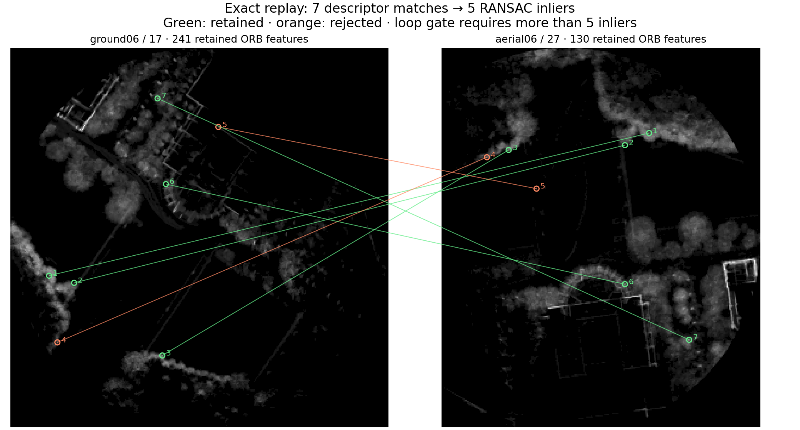
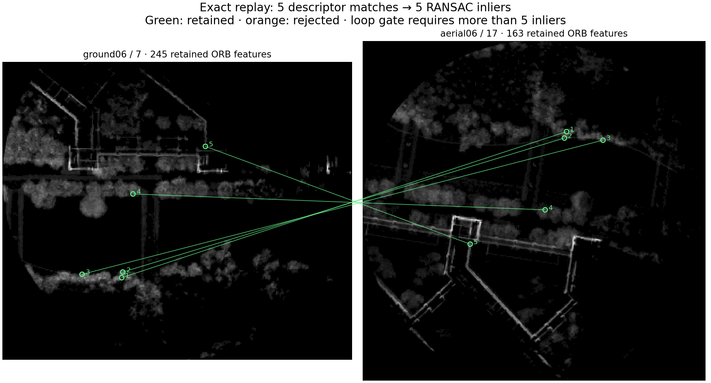

The original loop-retrieval result remains unchanged. These figures replay the saved descriptor matches and native RANSAC exactly. Green links are RANSAC inliers, not verified 3D loop correspondences. Ground truth is consulted only afterward to evaluate horizontal translation and yaw.

[Numeric diagnostics](summary.json)

The displayed pair produced 7 descriptor matches and 5 RANSAC inliers from 241 ground and 130 aerial ORB features. A second pair produced 5 matches and retained all 5. Both fail the unchanged strict >5 retrieval gate.

Post-run evaluation of the frozen hypotheses (no ground truth used for estimation):

| Query ↔ candidate | Horizontal translation error | Yaw error |
|---|---:|---:|
| ['aerial06', 27] ↔ ['ground06', 17] | 0.465 m | 0.792° |
| ['aerial06', 17] ↔ ['ground06', 7] | 0.831 m | 0.814° |

These results indicate too few descriptor correspondences to pass retrieval, despite a near-correct horizontal fit. Different above/below surface visibility is a plausible cause of the descriptor mismatch, not a proven isolated cause. The original 3D height initialization and verification were never reached; this diagnostic does not establish a valid 3D loop.
