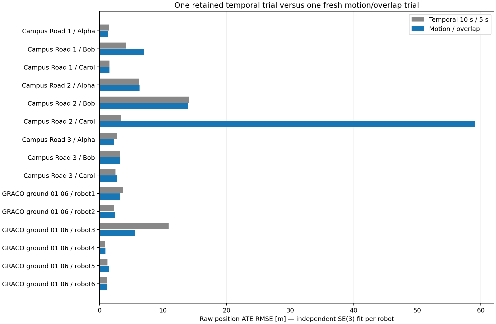
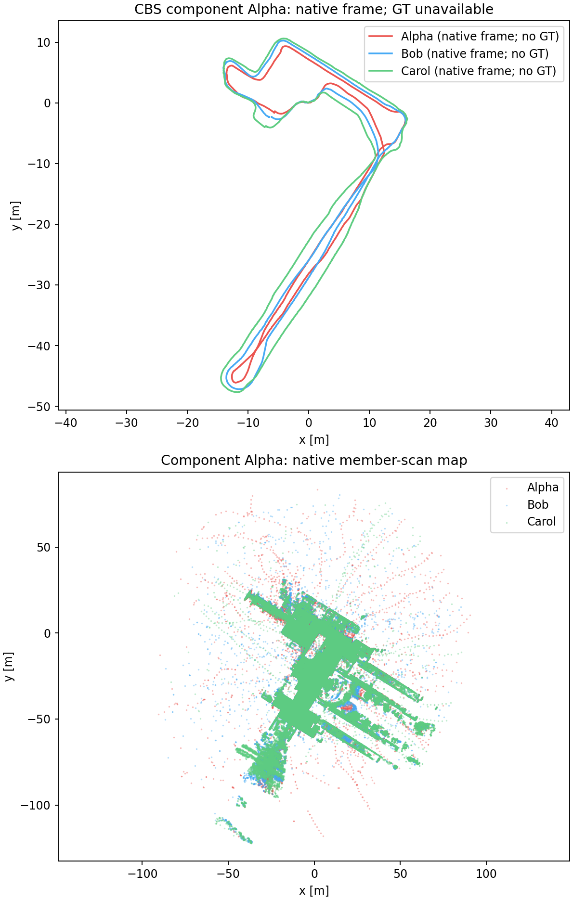
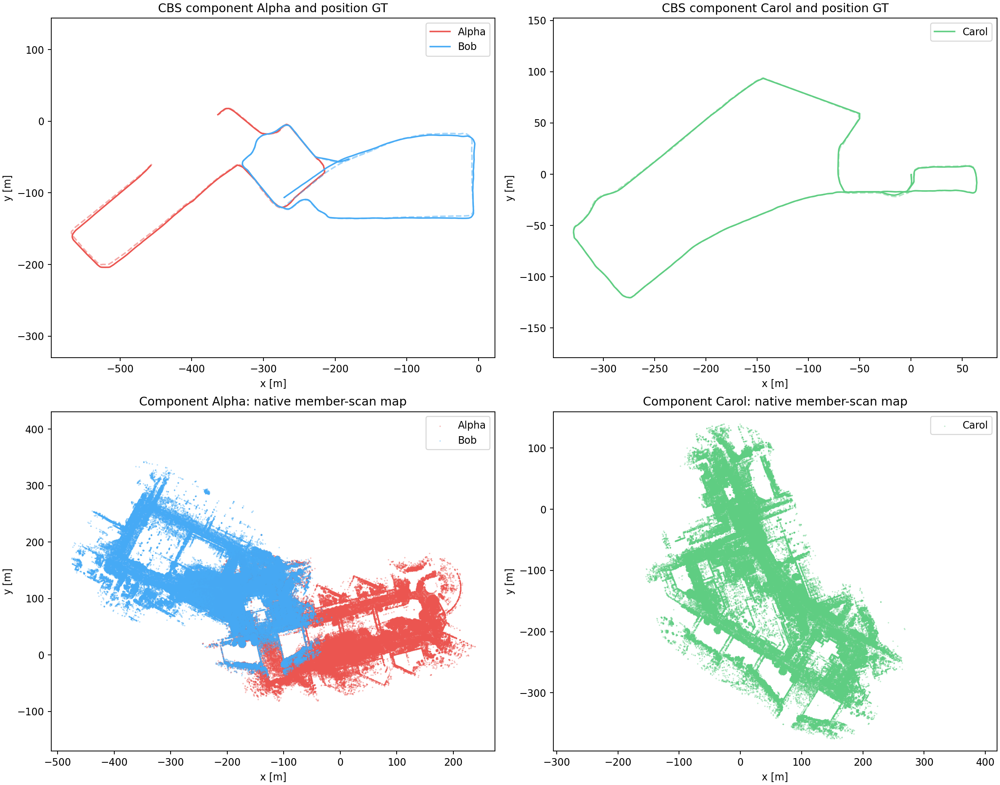
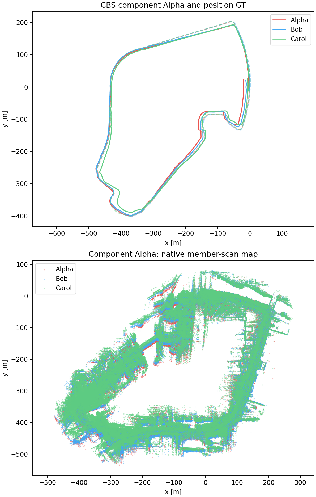
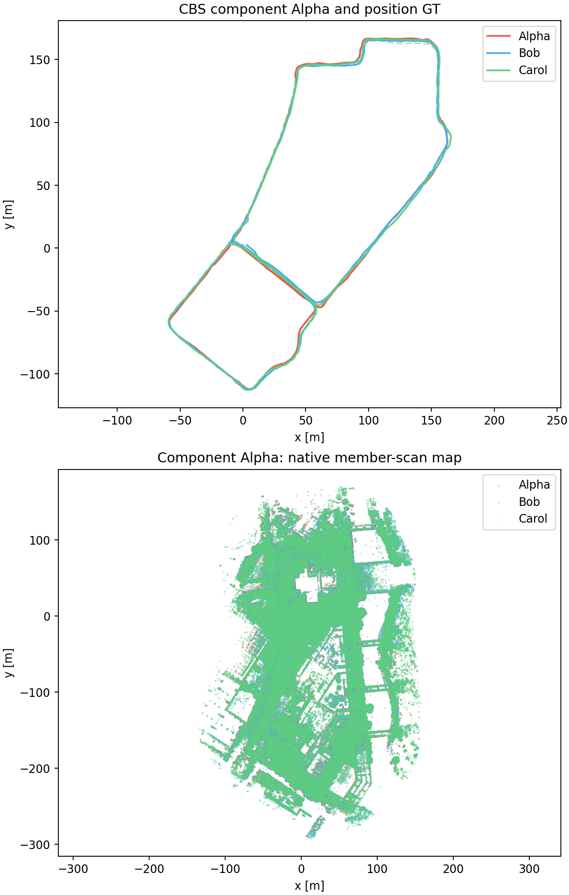
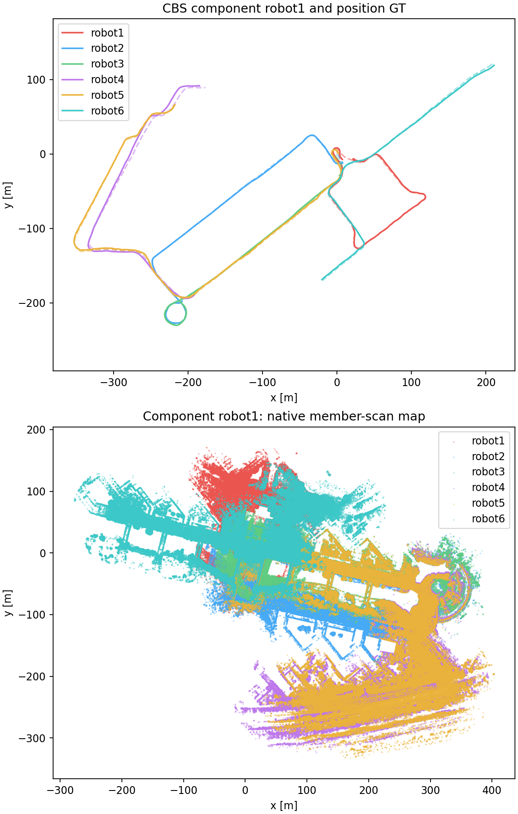

# Motion/overlap submap EllipseLIO: five-group comparison

This is the first fixed-configuration motion/overlap trial. Keyframes use 1 m translation, 10° rotation, or geometric overlap below 0.6. Maps request retirement at 20 m extent or 15 selected keyframes, with a growing successor and a geometric readiness check. Thirty seconds is a stale-geometry guard. Descriptor and registration evidence membership remain identical.

All 18 robot captures are fresh. Six 1× frontends run concurrently with four executor threads each, distinct ROS domains and no container CPU/RAM/swap quotas. Historical temporal trials used a different concurrency/resource configuration; this is not a repeated controlled ablation. MapClosures, registration, PCM and CBS settings are preserved.

Position ATE uses evo 1.36.5, 50 ms association, SE(3) alignment without scale. Each raw trajectory is aligned independently; CBS uses one fit per measured connected component, whose membership can differ across strategies. GT is read only by evaluation. Backend frame failures yield no valid shared CBS ATE. Raw ATE for a failed/incomplete frontend is diagnostic only.

| Group | Pipeline outcome | Connected robots / output frames | Retained loops | PCM rejected | Backend wall [s] |
|---|---|---|---:|---:|---:|
| S3E_Laboratory_4 | Complete | Alpha+Bob+Carol | 49 | 0 | 23.46 |
| S3E_Campus_Road_1 | Complete | Alpha+Bob; Carol | 7 | 0 | 26.47 |
| S3E_Campus_Road_2 | Complete | Alpha+Bob+Carol | 181 | 0 | 165.16 |
| S3E_Campus_Road_3 | Complete | Alpha+Bob+Carol | 42 | 0 | 68.22 |
| GRACO_ground_01_06 | Complete | robot1+robot2+robot3+robot4+robot5+robot6 | 43 | 1 | 42.17 |

Raw ATE decreased on 5/15 matched robots and increased on 10. See the individual values; no pooled independently aligned ATE is reported.

## S3E_Laboratory_4

| Robot | Temporal raw ATE [m] | Motion raw ATE [m] | Temporal CBS ATE [m] | Motion CBS ATE [m] | Frontend status |
|---|---:|---:|---:|---:|---|
| Alpha | Unavailable | Unavailable | Unavailable | Unavailable | complete |
| Bob | Unavailable | Unavailable | Unavailable | Unavailable | complete |
| Carol | Unavailable | Unavailable | Unavailable | Unavailable | complete |

Shared-component CBS ATE: Unavailable.

| Robot | Max speed [m/s] | Max LiDAR update gap [s] | Handovers | Stale recoveries | Completed / retrievable submaps | Max correspondence age [s] | Mapper peak RSS [MiB] |
|---|---:|---:|---:|---:|---:|---:|---:|
| Alpha | 1.777 | 0.301 | 33 | 0 | 33 / 33 | 26.4971 | 390.6 |
| Bob | 1.282 | 0.303 | 32 | 0 | 32 / 32 | 29.9984 | 415.4 |
| Carol | 1.355 | 0.301 | 34 | 0 | 34 / 34 | 29.9995 | 397.4 |

## S3E_Campus_Road_1

| Robot | Temporal raw ATE [m] | Motion raw ATE [m] | Temporal CBS ATE [m] | Motion CBS ATE [m] | Frontend status |
|---|---:|---:|---:|---:|---|
| Alpha | 1.5096 | 1.3339 | 1.2198 | 2.7608 | complete |
| Bob | 4.2158 | 7.0254 | 2.2835 | 7.4449 | complete |
| Carol | 1.5904 | 1.5908 | 1.5904 | 1.2532 | complete |

Shared-component CBS ATE: Alpha: 6.2599 m; Carol: 1.2532 m.

| Robot | Max speed [m/s] | Max LiDAR update gap [s] | Handovers | Stale recoveries | Completed / retrievable submaps | Max correspondence age [s] | Mapper peak RSS [MiB] |
|---|---:|---:|---:|---:|---:|---:|---:|
| Alpha | 2.784 | 0.302 | 137 | 0 | 137 / 137 | 23.4001 | 567.3 |
| Bob | 2.292 | 0.400 | 146 | 0 | 146 / 146 | 29.8989 | 593.6 |
| Carol | 3.163 | 0.302 | 185 | 0 | 185 / 185 | 12.4006 | 538.6 |

## S3E_Campus_Road_2

| Robot | Temporal raw ATE [m] | Motion raw ATE [m] | Temporal CBS ATE [m] | Motion CBS ATE [m] | Frontend status |
|---|---:|---:|---:|---:|---|
| Alpha | 6.2167 | 6.3149 | Unavailable | 10.6007 | complete |
| Bob | 14.1300 | 13.9017 | Unavailable | 9.2319 | complete |
| Carol | 3.3508 | 59.1508 | Unavailable | 12.7002 | complete |

Shared-component CBS ATE: Alpha: 10.9227 m.

| Robot | Max speed [m/s] | Max LiDAR update gap [s] | Handovers | Stale recoveries | Completed / retrievable submaps | Max correspondence age [s] | Mapper peak RSS [MiB] |
|---|---:|---:|---:|---:|---:|---:|---:|
| Alpha | 2.495 | 0.305 | 267 | 0 | 267 / 267 | 29.9111 | 555.4 |
| Bob | 2.162 | 0.302 | 281 | 0 | 281 / 281 | 26.3990 | 550.1 |
| Carol | 2.617 | 0.401 | 368 | 0 | 368 / 368 | 29.9991 | 626.2 |

## S3E_Campus_Road_3

| Robot | Temporal raw ATE [m] | Motion raw ATE [m] | Temporal CBS ATE [m] | Motion CBS ATE [m] | Frontend status |
|---|---:|---:|---:|---:|---|
| Alpha | 2.8090 | 2.2687 | 3.2512 | 1.0563 | complete |
| Bob | 3.1979 | 3.2630 | 4.2626 | 0.7547 | complete |
| Carol | 2.5207 | 2.7830 | 3.2425 | 1.1663 | complete |

Shared-component CBS ATE: Alpha: 1.0081 m.

| Robot | Max speed [m/s] | Max LiDAR update gap [s] | Handovers | Stale recoveries | Completed / retrievable submaps | Max correspondence age [s] | Mapper peak RSS [MiB] |
|---|---:|---:|---:|---:|---:|---:|---:|
| Alpha | 2.140 | 0.300 | 138 | 0 | 138 / 138 | 22.2996 | 578.4 |
| Bob | 2.046 | 0.300 | 146 | 0 | 146 / 146 | 27.0978 | 564.5 |
| Carol | 2.170 | 0.299 | 176 | 0 | 176 / 176 | 29.9026 | 643.8 |

## GRACO_ground_01_06

| Robot | Temporal raw ATE [m] | Motion raw ATE [m] | Temporal CBS ATE [m] | Motion CBS ATE [m] | Frontend status |
|---|---:|---:|---:|---:|---|
| robot1 | 3.7293 | 3.1968 | 4.2606 | 3.9340 | complete |
| robot2 | 2.2601 | 2.4185 | 4.1353 | 3.8109 | complete |
| robot3 | 10.8679 | 5.5994 | 12.0275 | 6.1166 | complete |
| robot4 | 0.9279 | 0.9485 | 0.9279 | 5.1695 | complete |
| robot5 | 1.2587 | 1.5492 | 2.8836 | 3.5684 | complete |
| robot6 | 1.1625 | 1.2181 | 5.6643 | 6.2617 | complete |

Shared-component CBS ATE: robot1: 4.8373 m.

| Robot | Max speed [m/s] | Max LiDAR update gap [s] | Handovers | Stale recoveries | Completed / retrievable submaps | Max correspondence age [s] | Mapper peak RSS [MiB] |
|---|---:|---:|---:|---:|---:|---:|---:|
| robot1 | 2.328 | 0.344 | 76 | 0 | 76 / 76 | 11.9760 | 520.4 |
| robot2 | 2.344 | 0.360 | 82 | 0 | 82 / 82 | 13.1481 | 543.0 |
| robot3 | 2.107 | 0.533 | 57 | 0 | 57 / 57 | 16.8880 | 523.5 |
| robot4 | 2.044 | 0.280 | 62 | 0 | 62 / 62 | 16.2640 | 527.6 |
| robot5 | 2.461 | 0.344 | 115 | 0 | 115 / 115 | 12.1355 | 537.7 |
| robot6 | 2.035 | 0.256 | 59 | 0 | 59 / 59 | 14.4800 | 539.3 |

## Retained evidence

Native window/member/anchor/hash validation and live Rerun verification are required for every admitted frontend. Successfully evaluated groups additionally retain verified derived Rerun recordings, raw/CBS trajectories, evo archives, map arrays, and descriptor/evidence/causality audits. Partial or failed outputs are kept with their failure status. All bulk geometry is retained.

Checks before launch: two native CTest cases (including motion policy and temporal compatibility), eight Python snapshot/endpoint cases, six scheduler/admission cases, two actual native retrieval/PCM/CBS integration cases, and two 120-second dataset smokes. No parameter sweep was performed.

The batch configuration, sources and binary hashes are frozen. `batch-summary.json` contains the numeric comparison, `retention-audit.json` contains immutable artifact hashes and validation, and each group retains its complete logs.
