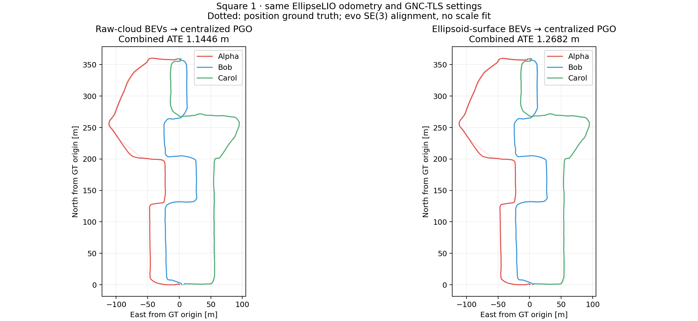
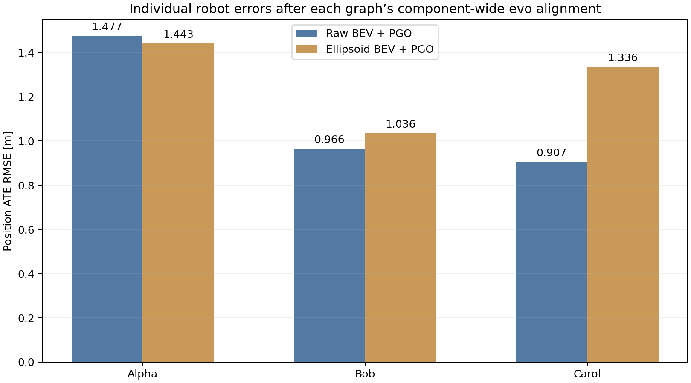

# Square 1: raw versus ellipsoid BEVs

Both branches use identical fresh EllipseLIO odometry, keyframes and raw geometric
verification evidence. MapClosures runs in three isolated robot workers with causal
simulated delivery; centralized GTSAM 4.2 GNC-TLS and a selected-inlier LM refit
optimize the saved pose graphs. These results use pose factors, without CBS or live
registration factors in the optimizer.

## Trajectory ATE

Position RMSE in metres, evaluated entirely through evo 1.36.5.

| Configuration | Combined | Alpha | Bob | Carol |
|---|---:|---:|---:|---:|
| Raw odometry (independent robot alignment) | unavailable | 1.0970 | 0.7945 | 0.5921 |
| Raw BEV + PGO | 1.1446 | 1.4765 | 0.9664 | 0.9070 |
| Ellipsoid BEV + PGO | 1.2682 | 1.4425 | 1.0357 | 1.3359 |

Ellipsoid combined ATE is **0.1236 m (10.80%) higher**
than raw BEV ATE in this one paired run. This is not a repeated-trial estimate.

With timestamped GT, connected trajectories receive one shared SE(3) fit across all robots, with no
scale fitting or subsequent per-robot realignment. Disconnected components are
independently anchored and aligned; no combined three-robot ATE is reported for
a disconnected graph. Raw-odometry diagnostics use separate robot alignments.
The timestamp tolerance is 0.05 s. GT orientations are unused and the
antenna lever arm is uncorrected. Ground truth enters only after optimization.

## Loops and computation

| BEV input | Verification attempts | Accepted | Selected intra | Selected inter | Components |
|---|---:|---:|---:|---:|---:|
| raw | 123 | 31 | 0 | 31 | 1 |
| ellipsoid | 586 | 59 | 51 | 8 | 1 |

Verification attempts count candidate cloud pairs, not individual ORB matches.
Accepted registrations and GNC-selected graph factors are distinct decisions.
A larger total loop count need not imply more inter-robot matches.

| BEV input | Detection wall time | PGO wall time | Serialized exchange | Verification task time sum |
|---|---:|---:|---:|---:|
| raw | 75.57 s | 0.946 s | 54.86 MiB | 25.81 s |
| ellipsoid | 178.22 s | 0.760 s | 73.31 MiB | 147.65 s |

Detection time excludes preparation. Verification task times include evidence
packing and registration; their sum can exceed wall time because robot tasks
overlap. It is not a pure GICP-kernel timing. Delivery is reliable/unrestricted.
MapClosures and small_gicp use CPU; CUDA accelerates ellipsoid surface sampling.

### Descriptor workload

| Robot | Keyframes | Raw retained ORB | Ellipsoid retained ORB | Raw describe | Ellipsoid describe | CUDA sampling |
|---|---:|---:|---:|---:|---:|---:|
| Alpha | 543 | 102,252 | 165,929 | 7.84 s | 101.16 s | 210.36 s |
| Bob | 483 | 118,860 | 155,162 | 7.91 s | 130.92 s | 327.16 s |
| Carol | 522 | 160,124 | 168,541 | 9.64 s | 125.68 s | 314.63 s |

ORB counts sum retained features over all keyframes, including repeated
observations of the same structures; they are not correspondence counts.
Describe times cover native MapClosures ground alignment, density construction
and ORB extraction. They exclude raw-submap assembly, ellipsoid reconstruction,
surface sampling, debug rendering and artifact I/O.

Serial odometry replay: **23.18 min**. Preparation of both
branches: **38.97 min**, including
**14.20 min** of CUDA sampling.
Preparation overlaps later robot replays, so those stage totals are not additive.

## Fixed settings and provenance

Keyframes: {'Alpha': 543, 'Bob': 483, 'Carol': 522}. Dense frames: {'Alpha': 4539, 'Bob': 4490, 'Carol': 4570}.

Native ellipsoid centers, geometric semi-axes and axis directions define the
rendered surfaces: 0.125 m nominal sampling, 0.25 m voxel centroids, deterministic
CUDA accumulation at 0.1 micrometre resolution. Earlier validation on three real
maps reproduced CPU density pixels and ORB descriptors exactly. The ellipsoid
map is persistent and causal, cropped at 80 m. Raw BEVs use trailing 5-second
submaps with the same crop. Different map histories remain part of the comparison.

MapClosures uses 0.5 m pixels, density threshold 0.05, Hamming threshold 50 and
more than five RANSAC inliers. Retrieval keeps a top-20 shortlist with one selected
LiDAR candidate per query, a two-second cooldown and 30-second same-robot exclusion.
Common raw-evidence GICP uses the existing 0.35 m RMSE, 30% overlap and observability
gates. No thresholds were tuned on this sequence. Full settings are in inputs.json.

The fixed 1 m / 10 degree / 2 s schedule comes from saved **odometry**
raw trajectories, without loop labels or ground truth. Both branches use fresh
EllipseLIO states and the same actual export timestamps. A requested snapshot
before filter initialization is associated with the first valid export, with
a two-second startup allowance; later associations retain the 250 ms guard.
Observed association delays and merged schedule entries are retained in the audit.

## Retained artifacts

Full poses, constraints, evo ZIPs and shared-alignment evidence, graph residuals
and weights, source/configuration provenance and figures are retained.
The compact [Rerun recording](trajectories.rrd) shows both trajectory sets and GT.
