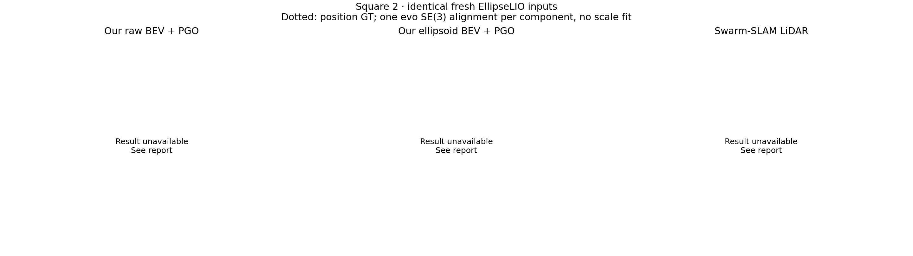

# Square 2: Swarm-SLAM LiDAR comparison

**ATE reporting correction:** the actual recorded Swarm trajectory has **0.7359 m** shared position ATE. The strict replay audit still fails. See [actual trajectory evaluation](ACTUAL-TRAJECTORY-ATE.md); the original controlled-comparison table below retains its failed-replay gate.

All systems consume the same fresh EllipseLIO odometry and full deskewed LiDAR exports.
[Swarm-SLAM](https://github.com/MISTLab/Swarm-SLAM) runs its actual ROS2 LiDAR nodes for each robot.
Our raw and ellipsoid BEV paths use MapClosures and centralized GNC-TLS PGO.
This compares complete loop/optimization paths; keyframes, map history and factor noise differ.

Native run status: **incomplete**.

Reason: `TimeoutError('Native keyframes/descriptors did not drain within bounded wait')`. The strict all-scan replay check did not pass.

Native optimized trajectories cover all observed keyframes, but the lossless input-selection audit failed. Actual trajectory error is reported separately above.

**Paired BEV comparison unavailable:** Square 2 Alpha hit the ellipsoid renderer’s numerical validation guard: one native basis had orthogonality error 2.6305e-5 against the 2e-5 tolerance. The joint preparation aborted before either BEV branch was solved. This is a preprocessing failure, not evidence of failed odometry or failed raw MapClosures.
The shared frontend exports and Swarm run are evaluated independently. No historical ATE is substituted for this fresh run.

## Controlled-comparison ATE

RMSE in metres, evaluated entirely through evo 1.36.5 on the same dense frontend timestamps.
One shared rigid alignment per connected component, no scale fitting, no additional robot fit.

| Method | Combined | Alpha | Bob | Carol |
|---|---:|---:|---:|---:|
| Raw odometry (separate robot fits) | unavailable | 0.5101 | 0.5974 | 0.1994 |
| Our raw BEV + PGO | unavailable | unavailable | unavailable | unavailable |
| Our ellipsoid BEV + PGO | unavailable | unavailable | unavailable | unavailable |
| Swarm-SLAM LiDAR | unavailable | unavailable | unavailable | unavailable |

## Loop and graph outcomes

| Method | Keyframes | Verification attempts | Accepted registrations | Accepted inter | Output frames |
|---|---:|---:|---:|---:|---:|
| Our raw BEV + PGO | unavailable | unavailable | unavailable | unavailable | unavailable |
| Our ellipsoid BEV + PGO | unavailable | unavailable | unavailable | unavailable | unavailable |
| Swarm-SLAM LiDAR | 1403 | 4 | 2 | 2 | unavailable |

Accepted registrations are counted before robust optimization. Swarm-SLAM does not export GNC weights in its native result messages;
its output frames reflect native origin IDs, and should not be interpreted as a verified graph of GNC-selected inter-robot factors.
Our GNC-selected loops: raw **unavailable**, ellipsoid **unavailable**.

Swarm GT-checkable registrations: **2/2**; endpoint-distance discrepancies above 2 m: **0**.
This position-only test compares translation magnitude against GT endpoint separation. It is not a complete 6-DoF outlier test.

## Runtime and delivery

Our detection-only wall times: raw **unavailable s**, ellipsoid **unavailable s**.
**These wall-time definitions are different and do not support a direct speedup ratio.**

Swarm observed coordination payload: **201.12 MiB** of serialized CDR.
This counts each observed publication once on the listed topics, including local deliveries; DDS transport/discovery overhead and broadcast fanout are excluded.
Our communication figures use compressed simulated envelopes, so the byte totals have different wire semantics.

Scans published/acknowledged: **[2358, 2428, 2502] / [2356, 2425, 2498]**.
Keyframes expected/observed: **[521, 436, 446] / [521, 436, 446]**; descriptors: **[521, 436, 446]**.

## Setup and adaptations

The pinned checkout uses native Scan Context, FPFH/TEASER++ with ICP refinement, spectral candidate selection,
and elected-robot GTSAM optimization. The LiDAR pose-factor direction is corrected by inverting the
source-to-target registration transform; forward/reversed synthetic tests validate that convention.
GTSAM 4.3 compatibility changes replace removed shared-pointer, quaternion and value-filter APIs.
A LiDAR-only build avoids compiling the unrelated visual frontend. A processing acknowledgement
adds bounded replay backpressure without changing keyframe selection or registration.

Native LiDAR settings come from upstream graco_lidar.yaml: 0.5 m keyframe distance/voxel size,
similarity threshold 0.8, more than 60 registration inliers, 20-keyframe intra exclusion,
one selected inter-robot candidate per five-second detection period. Synchronization tolerance is 1 ms
for exact timestamp pairs; the operational backend wait timeout is 60 seconds. Logs are enabled.

Swarm uses a full scan per keyframe; our raw BEVs use trailing five-second submaps and ellipsoid BEVs use persistent spatial maps.
All loop selection and optimization exclude GT. GT orientations are unused; the antenna lever arm is uncorrected.

## Artifacts

[Rerun trajectories](trajectories.rrd), [machine-readable comparison](report.json),
[native run](swarm/summary.json), [native loop checks](swarm/loop-quality.jsonl), and [our paired report](ours/REPORT.md).
The project setup and adaptation details are in `Swarm-SLAM/s3e/README.md`.
