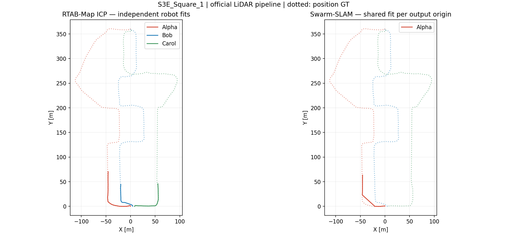

# S3E_Square_1: official Swarm-SLAM LiDAR

Native run: **incomplete_optimized_coverage**. Full sequence: **False**. Replay: 1.0×; wall time: 143.1 s.

Three simultaneous RTAB-Map ICP odometry instances feed the unchanged upstream Swarm-SLAM Scan Context, FPFH/TEASER++/ICP and native GNC optimizer. Raw LiDAR/IMU bags are replayed online. No EllipseLIO, FAST-LIVO2, MapClosures, CBS, external pose factors or registration-direction fix is used.

| Trajectory | Shared ATE [m] | Alpha | Bob | Carol |
|---|---:|---:|---:|---:|
| Raw RTAB-Map ICP | — | 0.6271 | 0.6166 | 0.4127 |
| Swarm origin 0 | 0.4238 | 0.4238 | unavailable | unavailable |

Complete three-robot shared ATE: **unavailable m**.

Raw: independent robot SE(3) fits. Optimized: native keyframes, one shared SE(3) fit per output origin, no scale. No interpolation or external odometry. GT orientations unused; antenna lever arm uncorrected. Origin labels do not expose retained GNC factors.

Accepted registrations before GNC: 0 inter-robot, 0 intra-robot. Native GNC weights are not exposed. Partial native outputs may be measured but remain marked incomplete.

Observed scans: `{'Alpha': 889, 'Bob': 873, 'Carol': 873}`. Valid odometry: `{'Alpha': 883, 'Bob': 855, 'Carol': 872}`. Keyframe coverage: `{'Alpha': {'keyframes': 191, 'optimized': 191, 'complete': True}, 'Bob': {'keyframes': 113, 'optimized': 0, 'complete': False}, 'Carol': {'keyframes': 175, 'optimized': 0, 'complete': False}}`.

Online input is not backpressured by our recorder. Scan loss and odometry failures remain visible in the saved logs and counts.

[Machine-readable results](report.json), [evo artifacts](evo/).

Reproduce a shared fit: `evo_ape kitti reference.kitti estimate.kitti -a -r trans_part`. Timestamp association is performed per robot with evo and a 50 ms tolerance before pooling.
