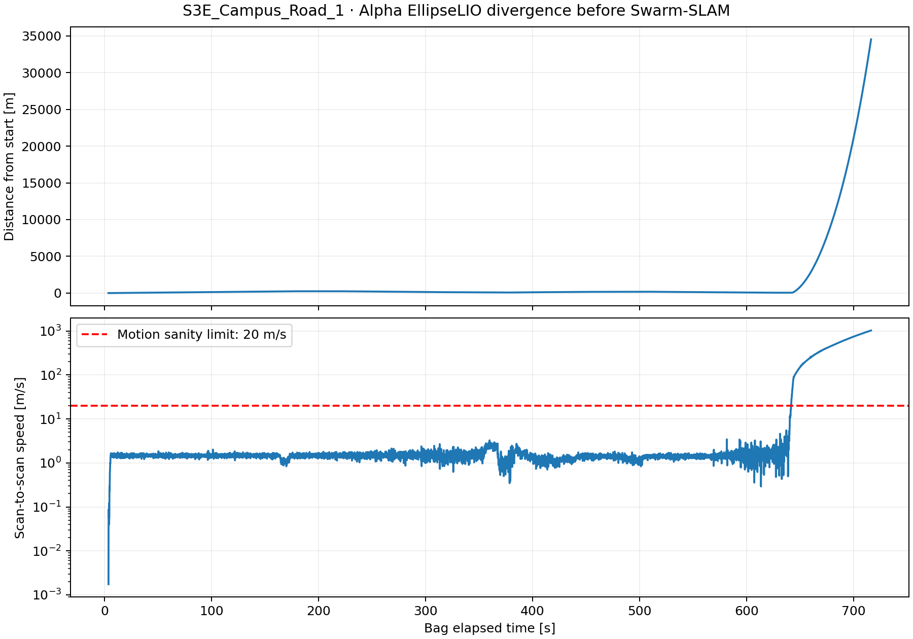

# S3E_Campus_Road_1: frontend failure on workstation 148

**Swarm-SLAM was not run on this sequence.** Alpha EllipseLIO diverged before loop closure, with implausible motion exceeding 1000 m/s; Bob was stopped and Carol was not started.

Original capture exit statuses are retained alongside separate motion-quality checks. Incomplete captures: Bob. Not started: Carol. Interrupted captures and missing robots are excluded from complete-sequence ATE.

| Completed capture | Raw position ATE [m] | GT matches | Maximum scan step [m] | Maximum speed [m/s] |
|---|---:|---:|---:|---:|
| Alpha | 56.0982 | 466 | 102.705 | 1027.619 |

ATE is computed entirely with evo 1.36.5, 50 ms timestamp association, one rigid alignment per complete robot capture, and no scale fitting. No failing tail was trimmed to improve the score. Ground truth covers only part of the capture; unlabelled later divergence is not included in ATE. Supplied GT orientations are unused.

The original IMU stream around 620–660 seconds contains **4000 messages**, a maximum timestamp gap of **14.848 ms**, **0 gaps over 50 ms**, and **0 non-increasing intervals**. This does not support a missing-IMU gap in the bag at the onset. It does not by itself prove the runtime delivery or identify the estimator’s internal failure mechanism.

Alpha motion onsets (bag seconds): above 5 m/s at 637.10 s, above 20 m/s at 641.60 s, above 100 m/s at 645.20 s.

The input guard now rejects finite but implausible ground-robot motion above 20 m/s before starting Swarm-SLAM. The guard does not use GT or modify the estimator.

[Machine-readable report](report.json), [evo evidence](raw-odometry-evo/README.md).

[IMU onset audit](provenance/alpha-imu-onset-audit.json).

The replay entry point was also tested directly: it rejected these inputs before starting any native Swarm worker or publishing any scan. [Guard evidence](provenance/input-guard-check/README.md). Independent evo CLI evaluation reproduced **56.098225 m** Alpha ATE. [CLI results](raw-odometry-evo/cli-reproduction.zip).

Generated sensor MCAPs retired: **3.460 GiB**. Reports and available recordings remain; original S3E bags are intact. [Verified cleanup record](cleanup.json).
