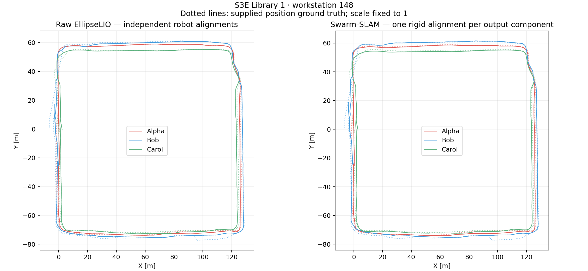

# S3E_Library_1: Swarm-SLAM on workstation 148

Three native Swarm-SLAM LiDAR workers consume fresh EllipseLIO odometry and complete deskewed scans. Scan Context, FPFH/TEASER++/ICP, native candidate allocation, and elected-robot GNC are retained.

Native run: **complete**. Exact selected-input audit: **True**. Full optimized coverage: **True**.

ATE uses evo 1.36.5, 50 ms nearest-timestamp association, translation error, and no scale fitting. Swarm uses one shared SE(3) alignment per native output component; robot errors use that same fit. Raw odometry uses independent robot alignments because its coordinate frames are unrelated. GT orientations are unused; antenna lever arm is uncorrected.

| Method | Combined ATE [m] | Alpha | Bob | Carol |
|---|---:|---:|---:|---:|
| Raw EllipseLIO | — | 1.0277 | 1.7256 | 1.3094 |
| Swarm-SLAM | 1.5827 | 1.1024 | 1.9344 | 1.6179 |

Trajectory measurement and replay-comparison validity are reported separately. No missing optimized robot is replaced with raw odometry. If only some robots have full optimized coverage, only those robots are evaluated and the combined result remains unavailable. Dense trajectories interpolate the native keyframe correction field over the saved odometry.

- Keyframes: [904, 934, 889]; descriptors: [904, 934, 889].
- Scans published / processed: [4403, 4454, 4515] / [4403, 4454, 4515].
- Verification attempts: 190; accepted registrations: 120, including 83 inter-robot.
- GT-checkable accepted loops: 56; endpoint-distance discrepancies over 2 m: 7. This is a position-only diagnostic, not a full 6-DoF outlier test.
- Native output components: {'Alpha': 'Alpha', 'Bob': 'Alpha', 'Carol': 'Alpha'}. GNC weights are not exported; native origin IDs do not prove which factors survived GNC.
- Native optimizer errors: 0.
- Native wall time including paced replay and settling: 841.5 s; backpressure: 589.9 s.
- Observed coordination CDR payload: 88.08 MiB; excludes DDS overhead and broadcast fanout.

The replay uses reliable input QoS and exact per-scan acknowledgements, at most two outstanding scans per robot, and a bounded 120 s drain. The native registration direction fix and GTSAM 4.3 compatibility adaptations are recorded in the retained source patches. The original Python Scan Context implementation and upstream graco LiDAR thresholds remain unchanged.

Remote workspace: `/data3/mikexyl/swarm_s3e_ws/src`. ROS Humble runs in an isolated existing Docker image; the host ROS installation is unchanged. All loop and optimization decisions exclude ground truth. No fresh paired MapClosures result is claimed for this run.

[Machine-readable report](report.json), [evo evidence](swarm/evo/README.md), [native replay summary](swarm/summary.json), [input audit](swarm/keyframe-input-audit.json).

Additional checks: evo CLI reproduced **1.582680 m** combined ATE; all **2,727** private optimized poses exactly match one final native graph. [Graph consistency](swarm/final-graph-consistency.json), [CLI evidence](swarm/evo/cli-reproduction.zip), [verified Rerun recording](trajectories.rrd).

Generated sensor MCAPs retired: **3.932 GiB**. Reports and available recordings remain; original S3E bags are intact. [Verified cleanup record](cleanup.json).
