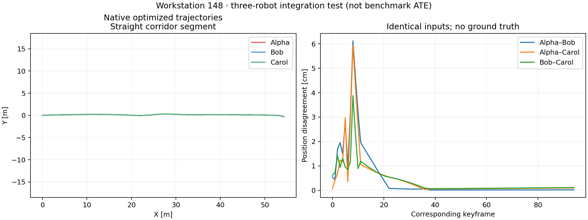

# Swarm-SLAM integration test on workstation 148

The isolated ROS Humble build passed 29 tests. The three native robot workers then received the same 45-second Alpha segment from an EllipseLIO Library 1 export.

- Scans: **1,341 / 1,341** processed, with exact per-stamp acknowledgements.
- Keyframes/descriptors: **285 / 285** observed and optimized.
- Independent selected-input audit: **zero timestamp or pose differences**.
- Native optimizer errors: **0**; all three outputs use one origin.
- Maximum corresponding-position disagreement: **0.06119 m**, RMS **0.00924 m**.
- Native test wall time: **135.7 s**, including **93.1 s** of paced input/backpressure and 30 s of settling.

This is an integration fixture, not a sequence ATE result. The LiDAR loop path runs on the CPU; CUDA/MPS is not used.

[Input and geometry audit](native/integration-check.json), [native summary](native/summary.json), [test results](setup/tests.xml), [resolved native libraries](setup/pgo-ldd.txt).

Remote workspace: `/data3/mikexyl/swarm_s3e_ws/src`. The existing datasets are mounted read-only; the host ROS installation and unrelated services were preserved.

[Compact Rerun recording](smoke.rrd), verified with Rerun 0.37.1.

Generated sensor MCAPs retired: **0.148 GiB**. Reports and available recordings remain; original S3E bags are intact. [Verified cleanup record](cleanup.json).

Final adapter tests, including the frontend validity guard: **32 passed**. [Final test results](setup/tests-final.xml).
