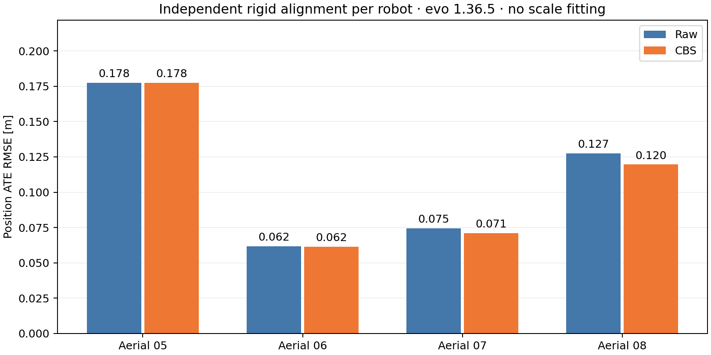

**Updated EllipseLIO + accumulated-area MapClosures / PCM / CBS — GRACO aerial 05–08, 21 September 2026**

Four fresh full-flight captures ran concurrently at 1× on workstation 148, without CPU, memory or GPU quotas. Updated upstream EllipseLIO uses its persistent map for odometry; accumulated-area snapshots supply MapClosures and registration evidence.

All four connected: **False**. Retained loops: **23**, rejected by PCM: **1**. Backend wall time: **226.00 s**. Total capture/preparation/backend/evaluation/audit time: **754.39 s**, excluding gallery generation.

| Flight | Raw ATE (m) | CBS, individual alignment (m) | CBS, component alignment (m) | Component | Matched poses |
|---|---:|---:|---:|---|---:|
| Aerial 05 | 0.1775 | 0.1775 | 0.1775 | aerial05 | 2753 |
| Aerial 06 | 0.0618 | 0.0615 | 0.0780 | aerial06 | 3107 |
| Aerial 07 | 0.0745 | 0.0711 | 0.0826 | aerial06 | 3713 |
| Aerial 08 | 0.1275 | 0.1196 | 0.1443 | aerial06 | 2623 |

For context, the earlier four-robot temporal-submap run had raw ATEs of 0.8601 / 3.5598 / 0.2034 / 0.1668 m for aerial 05 / 06 / 07 / 08. Both the upstream odometry version and backend map construction changed, so these runs do not isolate the effect of submapping.

Raw and individual CBS ATE each use one independent rigid SE(3) alignment per robot. Component ATE uses one rigid alignment shared by all robots in that component. Evaluation uses evo 1.36.5, 50 ms timestamp association, no scale fitting, and supplied GRACO RTK/INS IMU-frame positions. Ground truth is accessed only after backend completion.

Component `aerial05` (aerial05): **0.1775 m** shared position ATE.
Component `aerial06` (aerial06, aerial07, aerial08): **0.1023 m** shared position ATE.

| Retained loop pair | Count |
|---|---:|
| aerial06 ↔ aerial07 | 15 |
| aerial07 ↔ aerial08 | 8 |

Geometric verification outcomes: `{"accepted": 24, "initial_low_overlap": 14, "low_overlap": 14, "not_converged": 2}`.
Backend completion means the configured 100 local settling iterations finished after peer input completion; it does not establish mathematical convergence. A disconnected flight keeps its own coordinate frame.

| Flight | Stable | Native poses | Failed corrections after initialization | Max update gap (s) | Max speed (m/s) | Mean / p95 processing (ms) | Peak mapper RSS (MiB) | Area snapshots |
|---|---|---:|---:|---:|---:|---:|---:|---:|
| Aerial 05 | True | 2753 | 0 | 0.192 | 5.284 | 11.34 / 24.06 | 1099.2 | 34 |
| Aerial 06 | True | 3107 | 0 | 0.168 | 3.075 | 11.98 / 25.66 | 1005.2 | 33 |
| Aerial 07 | True | 3713 | 0 | 0.152 | 3.122 | 12.02 / 25.81 | 1162.8 | 40 |
| Aerial 08 | True | 2623 | 0 | 0.136 | 4.540 | 12.42 / 25.45 | 1045.1 | 29 |

Native undistortion, LiDAR update, map insertion and area snapshot/export; excludes input synchronization and ROS publication. Update gaps use sensor timestamps and are distinct from processing time. Stability requires full completion, finite chronological poses, maximum speed ≤20 m/s and update gaps <1 s. Any failed update-gap gate is retained even if the complete finite capture enters the backend diagnostically.

The selected area is an 80 m horizontal disk around the corrected IMU pose in the estimated gravity plane, with no height or point-age cutoff. Snapshots occur after 20 m horizontal displacement or 10 seconds, plus the final nonduplicate snapshot; these triggers do not define scan membership. Odometry has no submap handovers or area query crop. Export uses native processed map representatives and native fitted ellipsoids, not full-resolution raw scans.

Gravity-horizontal ellipsoid BEVs, geometric verification and CBS registration factors all use the same immutable area snapshot and anchor frame. Retrieval uses availability timestamps; graph poses retain anchor timestamps. Same-robot candidates retain the 30 s exclusion and reject shared persistent point IDs. Existing retrieval, verification, PCM and CBS thresholds are unchanged. Four-thread launchers, reliable input, GRACO calibration and supplied IMU noise are retained.

Upstream revision is `6506f46f1947b4ef86cfba402f11f10a6ef520ee`, with the already-tested persistent-map export integration and octree/CUDA capacity fixes from the S3E experiment. Those binaries and source hashes were reused unchanged. This is a single current-configuration trial, not a controlled submapping-only comparison or a parameter sweep.

IMU acc/gyr noise is 0.018744963 / 0.00054259815, with acc/gyr bias terms 0.0006480891 / 1.0949571e-05. MapClosures retains 0.5 m density pixels, threshold 0.05, Hamming threshold 50, five inliers and twenty hypotheses. Verification retains 0.4 m preprocessing, at least 100 points, overlap 0.3, RMSE 0.35 m and 1.5 m correspondence distance. PCM retains probability 0.99, minimum clique size 2 and 60 s timeout.

The final audit verified **136 descriptor/evidence memberships**, **544 causal retrieval events**, graph anchor timestamps, frozen source hashes, unchanged sensor bags, four live recordings and the derived recording. Correspondence age is unmeasured and stored as null. All bulk geometry remains on 148.

[Trajectories and maps](report/trajectories-maps.png) · [Frontend diagnostics](diagnostics/frontend-performance.png) · [BEV gallery](bev-gallery/index.html) · [Rerun](report/result.rrd) · [Numeric report](report/report.json) · [Artifact audit](retention-audit.json)

Full output root on 148: `/data3/mikexyl/swarm_s3e_ws/src/.ros2/upstream-area-graco-aerial148-20260921/full`. Previous experiments and the paused CU-Multi download are preserved.
